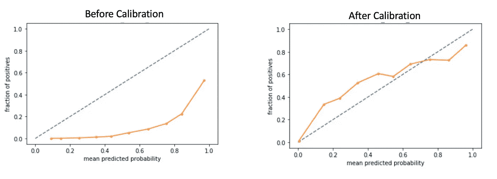
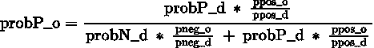
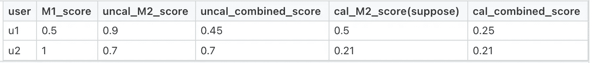

# 校准预测分数:它有什么帮助？

> 原文：<https://medium.com/walmartglobaltech/calibration-of-the-prediction-scores-how-does-it-help-f9ec79807e9?source=collection_archive---------4----------------------->

Photo by [CHUTTERSNAP](https://unsplash.com/@chuttersnap?utm_source=medium&utm_medium=referral) on [Unsplash](https://unsplash.com?utm_source=medium&utm_medium=referral)

校准是转换模型发出的概率分数的过程，以使其分布与训练集中观察到的分布匹配(通常未知)。

本文从一个需要校准的场景开始，并包括一些关于 Adtech(广告技术)领域目标定位的真实环境。这一部分之后是一个机制，以衡量校准的程度，然后是一种方法，以校准分数和现实世界的应用。这篇文章以尾注结尾。

# 问题陈述

如果训练数据是**平衡的**，机器学习(ML)模型学习得很好，这意味着，假设如果我们要训练一个模型来将输入图像分类为猫的或狗的图像，那么，在其他情况下，如果在训练期间，数据具有这两个类(猫和狗)的几乎相等的比例，则该模型将更好地执行该任务。因此，如果训练数据中存在巨大的类不平衡，则在训练模型之前对类进行下采样。这些模型通常会得到中间的实值分数(比如概率[image is cat]=0.9)，称为**预测分数**，并使用这些分数最终进行离散预测(cat/dog)。下采样改变训练数据中的先验分布，并因此影响这些后验类概率。这些分数并不表明输入点属于预测类别的真实可能性，因此，存在校准的余地！

如果要求仅仅是离散预测或使用中间分数对输入记录排序，则即使在训练中使用下采样也不需要校准。但是，在许多情况下，需要反映真实可能性的中间分数。例如，为了创建对拍卖的出价，其中广告商竞争向客户显示广告，组合由各种模型发出的分数以得出最终预测，传达发出的预测的真实可能性以估计预测中的错误(由模型预测为 cat 的图像的多少个图像将确实是 cat 的图像！)，等等。

在广告技术领域，广告商通常需要有意义的客户群，他们可以通过广告瞄准这些客户群。这些有意义的细分可以是忠实于广告客户品牌的客户群、不忠诚的客户群(如果广告客户想要提高他们的增量销售，他们可以瞄准这些人)、正在积极搜索某类产品(比如笔记本电脑)的客户群、未来几天最有可能购买某件商品的客户群等。可用于训练模型以创建上述细分的训练数据通常具有巨大的类别不平衡。原因是在数以百万计的客户中，你会发现很少比例的客户会为给定的广告客户进行感兴趣的活动(主要是购买活动)。因此，我们采用下采样技术来训练更好的模型！

许多在概率框架(如逻辑回归)中用下采样平衡数据训练的模型发出这些可能没有校准的实数值。意思是说，如果你看的是预测得分为 0.99 的客户集，那么你不能说那些客户中的 99%会属于积极类(或者说，从品牌购买)。要得出这样的结论，首先需要校准分数，以校正下采样的影响。然后，你可能会发现，上述一组客户的平均预测分数已经降低到 0.7，现在你可以说，这些客户中有 70%可能会转化！

总之，当您需要预测分数来匹配属于给定类别的数据点的实际可能性时，就需要进行校准。但是首先，我们如何发现分数是否没有校准？下一节提供了方法！

# 分数没校准怎么弄清楚？

当实际问题的真实概率未知时，可以使用可靠性曲线可视化校准(Degroot & Fienberg，1983)。在训练 ML 模型之前，我们通常保留它的一小部分作为维持集(测试集)，并且不使用它进行训练(训练集)，相反，我们通过对测试集进行预测并将它们与已知的实际类进行比较，来估计使用训练集训练的模型的功效。在测试数据(在下采样之前采样)中，我们有来自模型的实际类和预测分数。创建几个预测得分箱(比如 0 到 1 之间的 10 个箱)，并根据预测得分收集落入每个箱的客户集。对于每个箱，计算 x =平均预测分数，y =阳性分数(感兴趣的类别，比如“某个品牌的忠实用户”)。把这些点标在图上。对于一个校准良好的场景，图应该是一条直线 y=x。

Calibration of the Prediction Scores

在这里，校准是预测的概率与阳性病例的发生一致的程度。在上图中，您可以看到，校准后，分数比校准前更多地向 y=x 对齐。当然，完美的校准是一厢情愿的想法，因为在训练好的模型中也会有误差。

# 如何校准？

Pozzolo 等人(2015 年)提出了一种在对模型的输入训练数据进行下采样时校准分数的方法。让我们通过一个例子来理解这一点:

在训练数据集中(假设建立了二进制分类:数据中只有两个类别，比如“忠诚客户”和“非忠诚客户”):

*   总记录:3 亿
*   这个原始训练集中+ves 的比例比如说 *ppos_o* : 10%(因此-ves 的比例比如说 *pneg_o* : 90%)
*   我们对+ves 和–ves 进行下采样，从两个类中各取 1M(易处理的数量！否则用 30M +ves 和 30M -ves 训练模型需要大量资源)
*   因此，在这个平衡和下采样的数据集中，+ves 的比例，比如说 *ppos_d 是* 50%(因此-ves 的比例，比如说 *pneg_d* : 50%)
*   我们在平衡数据集上训练一个 LR 模型，对于一个记录，该模型预测 0.96 是+ve 的概率，比如说 *probP_d* 。因此，属于负类的输入的未校准概率(例如， *probN_d)* 是 0.04。我们得到校准的概率，比如说 *probP_o，*如下:
*   *probP _ o*= "(0.96)÷(0.1/0.5)"/("(0.04)÷(0.9/0.5)"+"(0.96)÷(0.1/0.5)")= 0.73(**由 0.96** 缩小)
*   我们需要记录原始训练数据和向下采样的训练数据中正面和负面的比例，下面的公式有助于我们校准分数

calibration formula

*   上述表达式(其根源在于 Bayes 最小风险理论)表明，输出分数将通过在下采样阶段按反比例放大/缩小其各自类别来校准。

上面的参考文献(Pozzolo 等人)建议，如果我们选择原始训练数据中的正类别比率(此处为 10%)作为分配类别的新阈值，它将给出与我们在未校准分数和阈值=0.5(平衡数据集中的正类别比率)下获得的相同的类别预测(离散的)。因此，如果我们选择 0.5 作为阈值来将数据点分类为属于阳性类别，那么对于校准分数，阈值应该调整为 0.1。

# 现实世界的应用

在该应用中，我们展示了当两个模型的输出被组合以达到最终预测分数时校准的需要和优势。广告商通常会询问对其品牌忠诚的客户群，以及未来几天会购买的客户群。这个问题有时被分解成两个易处理的 ML 问题陈述:一个 ML 模型(比如说，M1)预测顾客对一个品牌的忠诚度，另一个模型(比如说，M2)预测顾客在接下来的几天里从一个给定的产品类型中购买一件商品的概率(比如说，“洗发水”，如果这个品牌在卖洗发水的话)。为了得出客户的最终得分，我们将两个模型的得分相结合(比如说相乘)，然后对客户进行排名以创建细分市场。现在，在合并这两个模型之前，校准它们的分数是很重要的。因为，如果你不这样做，你可能会得到一个次优的排名。以下示例显示了在校准和不校准的情况下，排名会有什么不同:

Example shows how ranking can differ after calibration

如果我们不应用校准(uncal_combined_score)，那么我们最终的排名是 u2 > u1，但是校准可能导致相反的排名((uncal_combined_score))。因此，使用校准创建的片段可能与未使用校准创建的片段有很大不同。我们在 Adtech 团队中为其中一种产品创建了细分市场，并发现**在收入方面，校准后创建的细分市场比未校准时创建的细分市场高出 17%。**

# **结尾注释**

1.  以上述方式进行的校准不会改变概率之间的相对顺序。这只是提高(或降低)分数。因此，如果你的问题只是对用户进行排名(而不像我们必须做的那样涉及几个模型的分数的任何组合)，那么你可能不需要校准。尽管如此，你还是不能用分数来衡量用户属于一个给定类的真实可能性。
2.  有时从可靠性曲线中，您也可以观察到平衡数据集的未校准分数。发生这种情况是由于一些模型的性质，这些模型不是在概率框架中训练的，例如基于树的模型，它们擅长于最终的分类任务(意味着，发出离散的预测)，但是它们生成的中间分数不是很好校准的。在这种情况下也有校准分数的方法，例如保序回归和普拉特标度。
3.  如果所有类别的未校准分数相加为 1，则上述校准公式也可以容易地适用于多类别分类设置。

## 致谢:

感谢 [Kiran Sripada](https://www.linkedin.com/in/kiran-sripada-5a35b1a5/) 进行上述实验(M1 和 M2 模特(匿名))，感谢 [Anshul Bansal](https://www.linkedin.com/in/anshul-bansal-3027461b/) 审阅文章。

# 参考

[1] DeGroot、Morris H .和 Stephen E. Fienberg。，对预测者的比较和评价。皇家统计学会杂志:D 辑(统计学家)32.1–2(1983):12–22。美国心理学协会(American Psychological Association)

[2] Pozzolo 等，不平衡分类的欠采样校准概率，2015 IEEE 计算智能研讨会系列