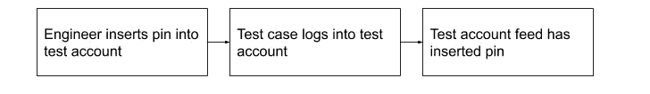
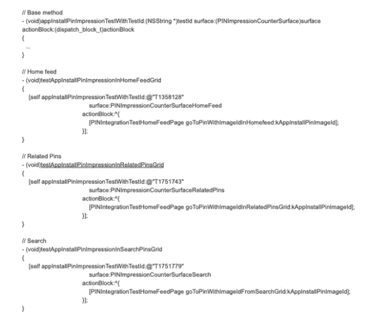
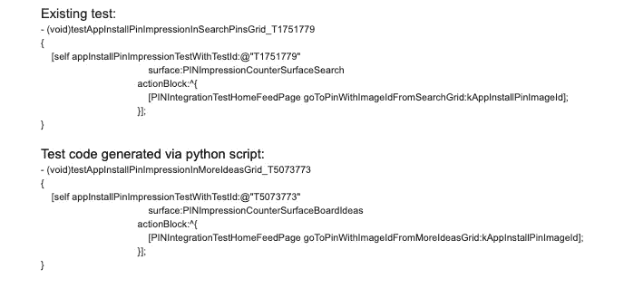

# 移动广告指标的质量和测试

> 原文：<https://medium.com/pinterest-engineering/calidad-y-pruebas-de-las-m%C3%A9tricas-publicitarias-en-dispositivos-m%C3%B3viles-47790a019179?source=collection_archive---------3----------------------->

作者:Maya Reddy | 软件工程师,广告格式

这篇文章最初发表在 英语;Read the English version [here](/pinterest-engineering/ad-metrics-quality-and-testing-on-mobile-fae9e70e7761)

在 Pinterest,我们每天都帮助我们的广告合作伙伴通过不同的广告格式吸引用户,并提供有关其广告效果的指标和分析。保持合作伙伴的信任并为他们提供价值至关重要,因此我们显示的指标(最终基于包含客户事件的日志)必须是正确的。

在 2017 年初,我们每两周进行一次移动发布,并在每次发布之前进行手动质量检查以检查注册行为。不久之后,客户团队开始投资测试框架。在这种情况下,集成测试是通过用户界面流的自动化测试,从登录应用程序到执行诸如触摸 Pins,保存 Pins 等行为。在自动化操作结束时,测试验证日志是否与用户界面操作相匹配。

# 为什么我们创建了广告注册集成测试套件

● **在发布周期之前检测并修复错误。**以前,由于我们依赖于手动质量控制,团队可能直到发布周期的最后阶段才会发现错误,并且我们经常不得不在发货截止日期之前解决 P1 错误。

● **自信地发送代码。**自动化测试使我们能够运行更多的测试用例,并进一步确保新代码不会引入错误或问题。

**重新分发手动测试。**通过将重复的质量控制任务改为集成测试,手动质量控制可以进行更多的探索性测试和新功能测试。

# 挑战

# 如何确保我们测试正确的格式

我们需要一种方法来确保特定广告出现在用户的 Feed 中,以便能够以所需的广告格式运行测试。在下面的示例中,我们需要显示应用程序安装公告。

示例测试案例:

1.滚动浏览 Feed 并查看整个应用程序安装 Pin。

2\. 确认已启用打印. 确认已提供 ID,并且它看起来像一个有效的复合 ID。

我们使用了一个有用的工具,根据 JSON 数据在 API 级别插入推广的引脚。我们有许多不同的测试帐户,每个帐户都有一个特定的 Pin 插入该帐户。通过这种方式,我们的自动化测试可以登录到测试该特定格式所需的帐户。

# 我们如何构建证据

我们的广告会出现在 Pinterest 应用程式的许多地方。它们可能出现在启动源中,当用户进行搜索时,等等。有时,一个错误只会影响一个表面,因此我们需要对所有表面进行测试。这增加了检验次数,但使逻辑划分更容易。我们有一个基本方法来执行所有用户界面操作和注册表检查,并且我们有一个在访问基本方法之前导航到该表面的每个表面的测试方法。

下面显示的是在启动源、搜索源和相关的引脚源上运行的测试。该测试包括验证打印输出在出现上下文菜单时是否正确结束。

# 复制证据

随着广告进入新的领域,我们必须确保广告的注册和行为按预期工作。例如,在用户的仪表板上,有一个名为“更多想法”的部分,现在可以显示广告,我们希望能够轻松地复制现有的测试,以便在这个新表面上运行它们。理想情况下,具有表面的设备还具有从创建到维护测试的测试子集。由于大多数测试具有一致的结构,我们创建了一个 Python 脚本,通过复制和修改现有测试来生成新表面的测试。

# 持续整合

随着我们添加更多格式及其相关的测试覆盖范围,测试集变得越来越大。我们的现场可用容量限制了我们运行完整测试套件的频率。经过一些迭代后,我们目前的流程是每晚在有更多可用容量时运行测试集。但是,我们还选择了一小部分测试进行确认,以便及早发现错误。我们始终确保在将构建提交到 App Store/Play Store 之前,通过候选版本的完整测试集。我们对我们的集成环境使用以下设置:

Buildkite:我们在 Buildkite 中设置了管道,以便在远程计算机上运行集成测试。

测试完成得更快,因为它们并行运行。

开发人员可以在测试运行时使用其他功能。

● 我们可以安排构建以便每晚运行测试,或者设置集成以便通过确认运行测试。

• Metro:用于分析测试结果和趋势的内部工具。我们可以看到成功率随着时间的推移为特定的管道,以及个别测试。

# 我们如何保留证据

编写测试代码后,该测试将被添加到 Buildkite 临时管道中。新的测试运行了几天,我们修复了出现的问题。一旦稳定,我们将其添加到 Buildkite 生产管道中。除了编写测试代码的初始成本外,还需要进行维护工作。

有时,修改一个函数会破坏集成测试。例如,后退按钮可能会变成关闭按钮。由于我们依赖可访问性标签,我们的测试将被打破。在这种情况下,我们会向相应的计算机发送错误报告以解决问题。

● 其他时候,我们写作证据的方式存在问题,这些证据随着时间的推移变得明显。在这种情况下,我们会更新测试框架或设置。

# 结论

自动化集成测试使我们能够信任我们向广告商报告的指标。我们不断开发流程,使我们的测试更容易运行和维护。

*致谢:我要感谢 Wendy Lu、Matt Mo、Joseph Smalls-Mantey、Jordan Maler、Tony Lu、Jerry Marino、Freddy Montano、Ad Formats iOS 团队、Metrics Quality &Test Tools 团队、iOS Core Platform 团队,以及所有协助这项计画的人。(T1 )*

*我们正在构建世界上第一个视觉发现引擎。全球有超过 4.75 亿人使用 Pinterest 来梦想,计划和准备他们想要做的事情。*[*加入我们的团队!(T6) (T7)*](https://careers.pinterest.com/careers)