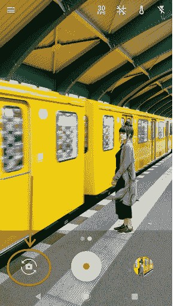

# Android 上的摄像头枚举

> 原文：<https://medium.com/androiddevelopers/camera-enumeration-on-android-9a053b910cb5?source=collection_archive---------2----------------------->

从 Android P 开始，增加了逻辑多摄像头和 USB 摄像头支持。这对 Android 开发者意味着什么？

2019–05–22 更新:这篇博文已经更新，增加了关于过滤掉不具备 RGB 输出功能但被列为相机设备的设备的指导；例如深度传感器。

# 多个摄像头

单个设备中的多个摄像头并不是什么新鲜事，但直到现在，Android 设备都被限制在最多两个摄像头:前置和后置。如果你想打开第一个摄像头，你要做的就是:

但那是更简单的时代。如今，多个摄像头意味着前面和/或后面有两个或更多摄像头。可供选择的镜头太多了！

# 照相机 2 API

出于兼容性原因，即使在旧的 Camera API 被弃用多年后，上面的代码仍然有效。但是，随着生态系统的发展，需要更先进的相机功能。于是安卓推出了安卓 5.0(棒棒糖)的 Camera2，API 等级 21 及以上。使用 Camera2 API 打开第一个现有摄像机的等效代码如下所示:

# 第一次不总是最好的

到目前为止一切顺利。如果我们需要的只是一个打开第一个现有相机的应用程序，这将在大多数 Android 手机上工作。但是考虑以下场景:

*   如果设备没有摄像头，应用程序将会崩溃。这看起来似乎不太可能，直到我们意识到 Android 运行在多种设备中，包括 Android Things、Android Wear 和 Android TV，这些设备加起来有数百万用户。
*   如果设备至少有一个后置摄像头，它将被映射到列表中的第一个摄像头。但在没有后置摄像头的设备上运行的应用程序，如 PixelBooks 和大多数其他 ChromeOS 笔记本电脑，将打开单个前置摄像头。

我们做什么呢检查摄像机列表和摄像机特性:

变量`cameraLensFacing`将是以下之一:

*   [CameraMetadata。镜头 _ 正面 _ 正面](https://developer.android.com/reference/android/hardware/camera2/CameraMetadata#LENS_FACING_FRONT)
*   [CameraMetadata。镜头 _ 正面 _ 背面](https://developer.android.com/reference/android/hardware/camera2/CameraMetadata#LENS_FACING_BACK)
*   [CameraMetadata。镜头 _ 饰面 _ 外部](https://developer.android.com/reference/android/hardware/camera2/CameraMetadata#LENS_FACING_EXTERNAL)

有关面向镜头配置的更多信息，请看文档。

变量`cameraCapabilities`将告诉我们各种能力，包括该相机是否能够产生标准帧作为输出(例如，与仅深度传感器数据相反)。我们应该寻找`CameraMetadata.REQUEST_AVAILABLE_CAPABILITIES_BACKWARD_COMPATIBLE`是否是相机列出的功能之一，它作为一个标志存储在`cameraCompatible`中。

# 合理的违约

根据应用程序的用例，我们可能希望默认打开一个特定的相机镜头配置(如果可用的话)。例如，自拍应用程序最有可能希望打开前置摄像头，而增强现实应用程序可能应该从后置摄像头开始。我们可以将此逻辑封装到一个函数中，该函数可以正确处理上述情况:

# 切换摄像机

到目前为止，我们已经讨论了如何根据应用程序想要做的事情来选择默认摄像机。许多相机应用程序还为用户提供了在相机之间切换的选项:

Switch camera button in the Google Camera app

为了实现这个功能，从[camera manager . getcameraidlist()](https://developer.android.com/reference/android/hardware/camera2/CameraManager#getCameraIdList())提供的列表中选择下一个摄像机是很诱人的，但这不是一个好主意。原因是从 Android P 开始，我们期望看到更多的设备具有多个面向同一方向的摄像头，甚至通过 USB 连接外部摄像头。如果我们想为用户提供一个 UI，让他们在不同的摄像头之间切换，建议([根据文档](https://developer.android.com/reference/android/hardware/camera2/CameraMetadata#REQUEST_AVAILABLE_CAPABILITIES_LOGICAL_MULTI_CAMERA))为每个可能的镜头配置选择第一个可用的摄像头。

虽然选择下一台摄像机没有通用的逻辑，但以下代码适用于大多数情况:

这可能看起来很复杂，但我们需要考虑一大组具有许多不同配置的设备。

# 兼容性行为

对于仍在使用已弃用的相机 API 的应用程序，由[Camera . getnumberofcameras()](https://developer.android.com/reference/android/hardware/Camera#getNumberOfCameras())公布的相机数量取决于 OEM 实现。文件指出:

> 如果系统中有一个逻辑多摄像机，为了保持应用程序的向后兼容性，该方法将只为每个逻辑摄像机和底层物理摄像机组显示一个摄像机。使用 camera2 API 查看所有摄像机。

仔细阅读文档的其余部分，了解更多详情。一般来说，类似的建议也适用:使用[camera . getcamerainfo()](https://developer.android.com/reference/android/hardware/Camera#getCameraInfo(int,%20android.hardware.Camera.CameraInfo))API 来查询所有的摄像机[方位](https://developer.android.com/reference/android/hardware/Camera.CameraInfo.html#orientation)，对于每个可用的方位，只向在摄像机之间切换的用户展示一个摄像机。

# 最佳实践

Android 可以在许多不同的设备上运行。您不应该假设您的应用程序将总是运行在带有一个或两个摄像头的传统手持设备上。为应用选择最合适的摄像机。如果您不需要特定的相机，请选择具有所需镜头朝向配置的第一台相机。如果连接了外部摄像头，可以合理地假设用户更喜欢先看到这些摄像头。