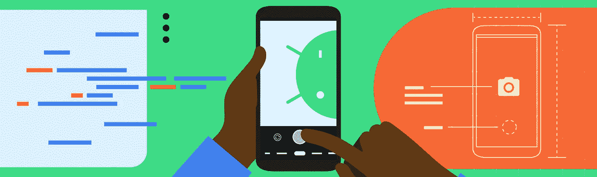
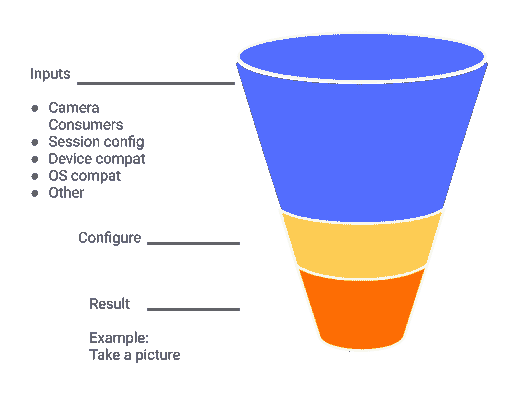
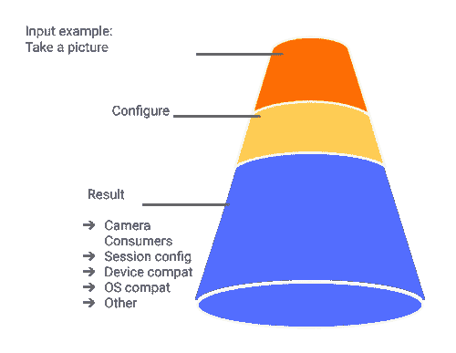
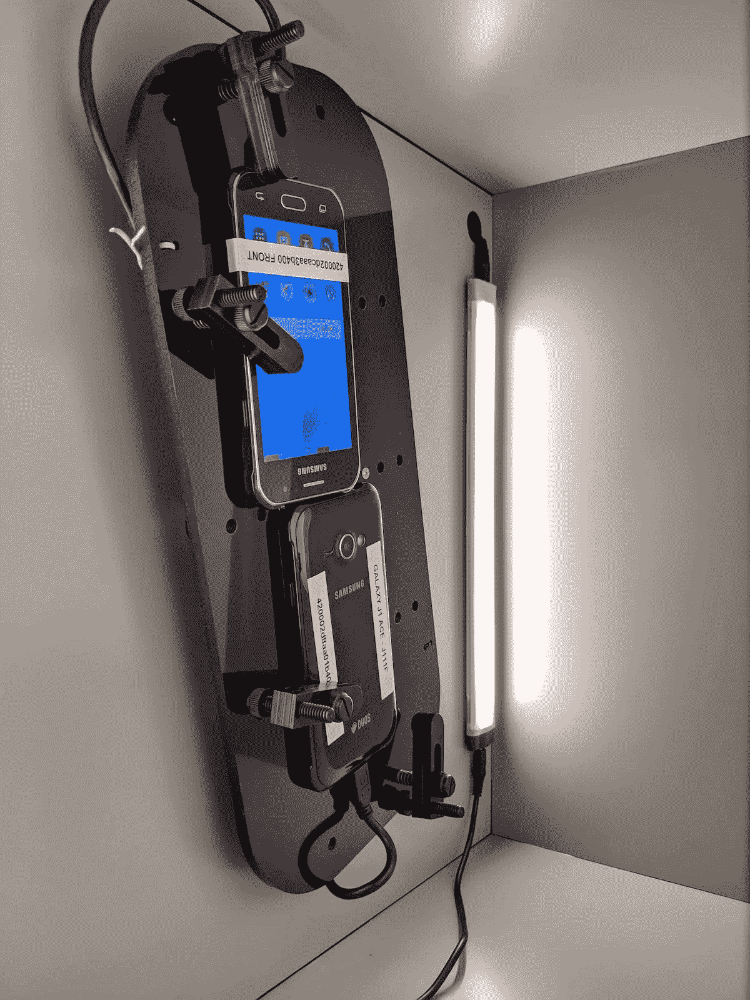
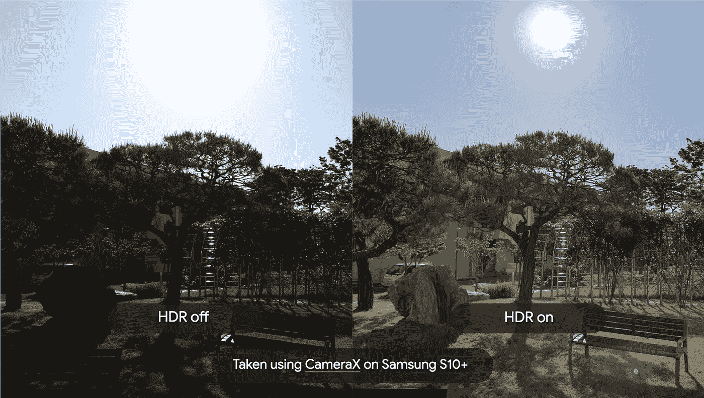

# CameraX:对过去、现在和未来的一瞥

> 原文：<https://medium.com/androiddevelopers/camerax-a-glimpse-into-the-past-present-and-future-19e22d8d2748?source=collection_archive---------0----------------------->

CameraX 是一个非捆绑的 [Android Jetpack](https://developer.android.com/jetpack) 库，可以帮助你轻松地在你的 Android 应用中添加相机功能。由于种类繁多的 Android 设备和复杂的编程模型，传统上在 Android 上构建具有相机功能的应用程序很困难。成千上万的开发人员现在正在使用 CameraX，许多人已经实现了 APK 大小的缩减、业务指标的改进，并且还精简了他们的资源，使他们的工程师能够专注于构建酷的新功能。

这篇文章讲述了 CameraX 如何颠覆现有的相机框架编程模型，它如何帮助您在 Android 上扩展您的应用程序，并介绍了自[测试版](/androiddevelopers/androids-camerax-jetpack-library-is-now-in-beta-bf4cf0cc3ea6)以来的新功能，例如将 ML Kit 等智能功能集成到您的应用程序中的简单方法。

## 逆转过去的复杂性

我们首先在网上搜索您遇到的各种问题，并对该领域的一些现有设备进行试验。我们惊讶地了解到，你们中的许多人仅仅为了让事情正常工作，就求助于跨越制造商、芯片组、甚至特定设备的大型 if-else 代码块。这种行为的一个原因是，使用 [Camera1](https://developer.android.com/reference/android/hardware/Camera) 或 [Camera2](https://developer.android.com/reference/android/hardware/camera2/package-summary) 框架 API，您从一组特定于设备和操作系统的输入开始，以获得想要的输出，比如拍照。按照设计，这要求您提前了解设备配置，以帮助您实现目标——这使得在推出新设备时很难扩展您的代码。

Camera1 / Camera2 framework programming model

我们必须从根本上重新思考编程模型。您的许多反馈启发我们翻转漏斗，从基于用例的方法开始(如下图所示)。

CameraX programming model

通过这种新方法，该团队创建了一个非捆绑库 CameraX，它与所有主要的 Android 版本无关，可以在 94%以上的 API 21 设备上工作，而不需要特定于设备的 if-else 块。在 CameraX 中，您首先通过创建一个用例来指定您的目标，例如使用 [ImageCapture](https://developer.android.com/reference/androidx/camera/core/ImageCapture) 用例“拍照”。然后，CameraX 会确定有助于您实现目标的特定于操作系统和设备的配置。今天，用例支撑着 CameraX 的体验，从[预览](https://developer.android.com/reference/androidx/camera/core/Preview)、[图像分析](https://developer.android.com/reference/androidx/camera/core/ImageAnalysis)和[图像捕捉](https://developer.android.com/reference/androidx/camera/core/ImageCapture)开始。

## 帮助开发人员扩展测试

除了现有的框架 API 实现和使用复杂性之外，许多开发人员在跨大量 Android 设备和各种相机配置大规模测试他们的应用时遇到了困难。我们了解到，即使对于最基本的相机应用程序，您的大量资源也花费在测试大型设备池上，导致了前面提到的特定于设备的解决方案。鉴于测试是整个开发的关键部分，这启发我们建立了一个专门的 CameraX 测试实验室，提供跨多个 Android 设备的测试覆盖。

Samsung Galaxy J1 Ace inside the lighting controlled CameraX test box

今天，这个实验室里有 90 多台 Android 设备。两部手机安装在一个定制的测试盒内，带有受控的照明和一个电机，以模拟相机应用程序的旋转和方向。这 90 多台设备代表了约 4.5 亿台活跃的 Android 设备，涵盖所有操作系统级别(自棉花糖以来)、价格层级(我们最低端的手机零售价低于 100 美元)、芯片组(涵盖联发科、高通和优尼科)和制造商([完整的设备列表](https://developer.android.com/training/camerax/devices))。

## 缩小差距

在过去的几年里，Android 制造商取得了巨大的进步，为移动设备带来了高动态范围(HDR)、模糊散景和夜间摄影等新功能。然而，到目前为止，这种功能只能通过手机的本机(或系统)摄像头应用程序来实现。 [CameraX 厂商扩展](https://developer.android.com/training/camerax/vendor-extensions)(又名扩展)缩小了差距，并向所有开发人员开放了五种特定于制造商的功能。这包括:

*   [HDR](https://developer.android.com/reference/androidx/camera/extensions/HdrImageCaptureExtender) :使用制造商的多帧处理能力来合并多个帧，并提供保留场景高光和低光的图像。
*   [夜晚](https://developer.android.com/reference/androidx/camera/extensions/NightImageCaptureExtender):利用厂商的低光多帧处理能力，在低光条件下提供更具吸引力的画面。
*   [自动](https://developer.android.com/reference/androidx/camera/extensions/AutoImageCaptureExtender):根据当前的环境照明条件，自动确定并提供 HDR 或夜景图像。
*   散景:提供背景模糊的图像，非常适合人们摄影。
*   [美颜](https://developer.android.com/reference/androidx/camera/extensions/BeautyImageCaptureExtender):启用图像内的脸部美颜效果。

最好的部分:当启用扩展时，你不需要特定于设备的 if-else 块——只需编写一次代码，它就可以在所有支持的设备上工作。您可以使用 [ExtensionsManager 检查特定设备上是否启用了扩展。扩展可用性](https://developer.android.com/reference/androidx/camera/extensions/ExtensionsManager.ExtensionsAvailability)。如果有可用的扩展，您可以向用户显示必要的 UI 元素(如果适用)，并配置预览和 ImageCapture 用例来使用扩展，而不是普通的图像捕获。只需几行代码，您就可以显著提高图像质量和整体用户体验。

HDR off (left) vs. HDR on (right) on Samsung S10+ taken using CameraX Extensions

这些扩展适用于三星(S10+以上的所有旗舰产品)、摩托罗拉(他们的大多数设备都是用 Android 10 升级或推出的)、Oppo (Reno Pro 2)和几款使用 Unisoc 移动处理器的入门级手机。我们很高兴能够缩小与扩展的差距，并感谢所有制造商不断扩大具有这些功能的设备的数量。

## 启用新功能

从 2019 年谷歌 I/O 大会上 [CameraX 的 Alpha 发布](https://www.youtube.com/watch?v=kuv8uK-5CLY)，2020 年 2 月 [Beta](/androiddevelopers/androids-camerax-jetpack-library-is-now-in-beta-bf4cf0cc3ea6) ，到今天。随着[最新](https://developer.android.com/jetpack/androidx/releases/camera)测试版的发布，我们很高兴地分享 CameraX 改进的兼容性，引入[预览视图](https://developer.android.com/reference/kotlin/androidx/camera/view/PreviewView)以获得无缝预览，以及新的样本和实用程序以使 CameraX 的使用更加简单。

从改善设备兼容性开始，我们已经能够解决几个设备特定的问题，如错误的设备纵横比(在 LG G3 上)，在某些情况下无法切换相机(在 Pixel 2 上)，以及通过在 CameraX 中添加修复和变通方法来修复[点击对焦(在 Samsung J7 上)](https://issuetracker.google.com/159039233)。此外，根据您在[公开错误报告](https://issuetracker.google.com/issues?q=status:open%20componentid:618491)中的意见(谢谢！)，我们在 CameraX 测试实验室中添加了额外的测试，比如 UI 小部件集成和纵横比测试。如果您发现任何特定于设备的问题，请[让我们知道](https://issuetracker.google.com/issues?q=status:open%20componentid:618491)，我们很乐意解决这些问题。

虽然 CameraX 确实提供了[预览](https://developer.android.com/reference/androidx/camera/core/Preview)用例，但你们中的许多人一直在寻求一种更简单的解决方案来获得屏幕预览。[预览视图](https://developer.android.com/reference/kotlin/androidx/camera/view/PreviewView)是向与相机交互的应用程序添加视图的最简单方式。它不需要关于相机 API 或底层硬件的深入知识，因为它由 CameraX 驱动，所以它是节能的，并为用户提供非常低的延迟。默认情况下，它通过使用[表面视图](https://developer.android.com/reference/android/view/SurfaceView)来实现这一点，如果设备与[表面视图](https://developer.android.com/reference/android/view/SurfaceView)不兼容，它将自动退回到[纹理视图](https://developer.android.com/reference/android/view/TextureView)。

[预览视图](https://developer.android.com/reference/kotlin/androidx/camera/view/PreviewView)也有助于改善用户体验。新的[getPreviewStreamState()](https://developer.android.com/reference/kotlin/androidx/camera/view/PreviewView?hl=id&authuser=2#getpreviewstreamstate)API 使您的应用程序能够在预览流或空闲时得到通知。您可以使用这个新的 API 在预览空闲时在[预览视图](https://developer.android.com/reference/kotlin/androidx/camera/view/PreviewView)的顶部显示一个占位符图像，并在预览流动时隐藏该占位符。这可以避免预览开始时出现令人不愉快的黑屏。你可以在这篇[博文](/androiddevelopers/display-a-camera-preview-with-previewview-86562433d86c)中了解更多关于如何使用[预览视图](https://developer.android.com/reference/kotlin/androidx/camera/view/PreviewView)的信息。

ML Kit + CameraX Google Translate showcase ([GitHub](https://github.com/googlesamples/mlkit/tree/master/android/translate-showcase))

最后， [ImageAnalysis](https://developer.android.com/reference/androidx/camera/core/ImageAnalysis) 通过提供每帧缓冲区访问开始。一旦我们将这个用例与 [ML Kit](https://developers.google.com/ml-kit) 的交钥匙 API 结合起来，它将开辟许多新的可能性，如文本识别、图像标记，甚至使用您自己训练的 Tensorflow Lite 模型来检测和识别对象。或者，您可以将 CameraX 直接用于 TensorFlow Lite 运行时( [GitHub](https://github.com/android/camera-samples/tree/master/CameraXTfLite) )。要深入了解最新的 CameraX 更新，请观看此视频:

目前，Play Store 上有数千个应用程序部署了 CameraX，涵盖汽车、银行、约会、聊天、电子商务、搜索、社交等多个类别。发现 CameraX 很有帮助的一些开发人员包括:

*   [Monzo Bank](https://play.google.com/store/apps/details?id=co.uk.getmondo) 使用 CameraX a)消除了 9000 行代码，包括 UI 代码，b)将识别图像捕获和自拍视频记录的退出率从 25%降低到 5%左右([案例研究](https://developer.android.com/stories/apps/monzo-camerax))。
*   [YouCam Perfect](https://play.google.com/store/apps/details?id=com.cyberlink.youperfect) 使用 CameraX(相比 camera2)可以减少 70%的代码行，并且极大地提高了新产品开发的效率。
*   [Ufoto](https://play.google.com/store/apps/details?id=best.sweet.selfie) 使用 CameraX 来简化他们的资源，使他们的工程师能够专注于构建很酷的新功能。当从 Camera1 迁移到 CameraX 时，他们也观察到了可测量的改进。例如，在某些设备中，图像捕捉速度快 10%，而在某些设备中，预览帧速率高 30%。

# 下一步是什么

我们将不断提高 Android 设备的兼容性和可靠性，同时让 CameraX 更易于使用([开发者报告的 CameraX 已修复问题列表](https://issuetracker.google.com/issues?q=status:fixed%20componentid:618491))。例如，在接下来的几个月里，我们将在 CameraX 测试实验室中添加更多设备。我们坚信，开发人员不应该担心底层的相机堆栈或特定于设备的怪癖，这样他们就可以专注于构建用户喜欢的出色应用程序。有超过 2，000 名开发人员在生产中使用 CameraX，我们建议您尝试采用和部署最新版本的 CameraX Beta。

如果你想用 CameraX 弄脏你的手，看看我们的[教程](https://codelabs.developers.google.com/codelabs/camerax-getting-started/#0)和我们的[官方样本](https://github.com/android/camera-samples/tree/master/CameraXBasic)。在您试用 CameraX 之后，我们希望听到您看到的改进类型。如果您发现最新版本有任何问题，请尽可能用错误报告[提交一个错误](https://issuetracker.google.com/issues?q=status:open%20componentid:618491)(我们每周进行一次分类)。您还可以通过电子邮件向 [Android CameraX 讨论组](https://groups.google.com/a/android.com/g/camerax-developers)发送问题，或者在 [StackOverflow](https://stackoverflow.com/) 上发布标签为“android-camerax”的帖子。

我们衷心感谢您，我们出色的开发人员、合作伙伴、制造商和 CameraX 团队成员，感谢您帮助塑造和构建 CameraX Jetpack 库。