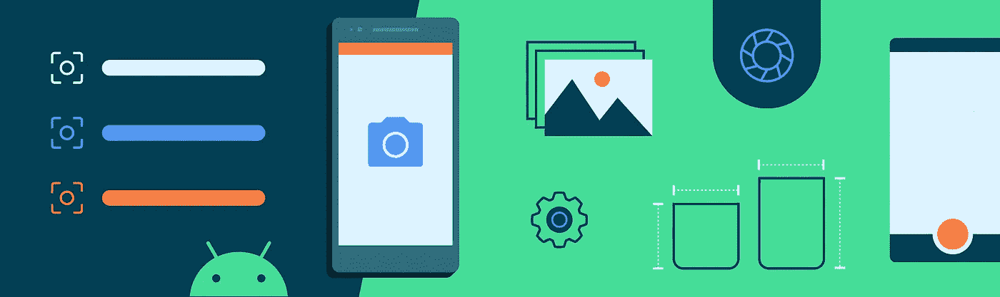

# CameraX:学习如何使用 CameraController

> 原文：<https://medium.com/androiddevelopers/camerax-learn-how-to-use-cameracontroller-e3ed10fffecf?source=collection_archive---------1----------------------->

[CameraX](https://developer.android.com/training/camerax) 目前提供了`CameraView`，一个`View`显示相机的预览，同时还提供了拍照、控制相机、查询相机信息的方法。`CameraView`显然承担了比`View`更多的责任，因为它参与了`View`层级并显示内容，同时还拥有存在于`View`层级范围和生命周期之外的摄像机资源。

`CameraView`违反了关注点分离原则，使得在所有的极限情况下都难以保证其健壮性。因此，在 CameraX 的视图工件达到测试版之前，它将被标记为不推荐使用并被删除。它被分成两部分，你应该使用:`[PreviewView](https://developer.android.com/reference/androidx/camera/view/PreviewView)`处理与视图相关的任务，而`[CameraController](https://developer.android.com/reference/androidx/camera/view/CameraController)`处理相机操作。

`PreviewView`在 CameraX 的查看神器里已经有一段时间了。然而，`CameraController`是最近在 alpha19 版本中引入的。它是一个高级的一体化 API，提供了一种轻松访问和操作核心相机功能的方法，包括显示相机预览、拍照和分析相机帧。在这样做的同时，它会将其用例的输出与取景器的预览相匹配，从而提供“所见即所得”(WYSIWYG)的体验，这是开发人员高度要求的功能，使 CameraX 的使用非常直观。它还负责初始化相机并使其输出适应设备旋转。

为了减轻启动、停止和关闭相机的负担，CameraX 还引入了`[LifecycleCameraController](https://developer.android.com/reference/androidx/camera/view/LifecycleCameraController)`，它提供了`CameraController`的所有便利，还增加了将相机的生命周期绑定到`[LifecycleOwner](https://developer.android.com/reference/androidx/lifecycle/LifecycleOwner)`的好处，通常是`Fragment`或`Activity`的生命周期。这允许生命周期的状态控制相机打开、停止和关闭的时间。

使用`PreviewView`和`CameraController`相当简单，可以按如下方式完成:

以下部分列出了从`CameraView`到`CameraController`的映射。您可以使用它们从`CameraView`迁移到`PreviewView`和`CameraController`。

# 摄像机初始化

与`CameraView`不同，`CameraController`提供了一个`[ListenableFuture](https://guava.dev/releases/23.0/api/docs/com/google/common/util/concurrent/ListenableFuture.html)`来监控其初始化。这是一个异步操作，在此期间`CameraController`初始化 CameraX 并绑定它的用例。使用这个`ListenableFuture`的好处是双重的:

*   一旦成功完成，你可以让你的用户开始与相机互动，例如拍照和放大缩小取景器。
*   万一失败，您可以优雅地处理错误，并将其传达给您的用户。

如果您不熟悉`ListenableFuture`:它包装了一个异步操作，并允许您附加一个在完成时调用的监听器。如果操作已经完成，future 会立即返回。

# 相机生命周期

与`CameraView`类似，`LifecycleCameraController`将摄像机的控制与生命周期联系起来。您必须将有效的`LifecycleOwner`绑定到控制器，控制器才能运行。

`LifecycleCameraController`提供了一个额外的`unbind()`方法，允许你在相机的生命周期结束前提前关闭相机。这在相机不是屏幕的一部分并且在整个生命周期中不需要的情况下很有用。或者，您可以定义您的自定义`LifecycleOwner`来控制何时关闭相机，但在某些情况下`unbind()`可能更方便。

# 摄像机控制

## **-变焦**

`CameraController`允许你通过`[LiveData](https://developer.android.com/topic/libraries/architecture/livedata)`实例观察相机的变焦状态。一旦相机打开，此状态就变为可用，并保存静态信息，如最大和最小缩放比率，以及动态信息，如当前缩放比率。您可以使用最大缩放比率验证缩放是否受支持，如下所示:

`CameraController`另外提供获取和设置线性缩放的方法，线性缩放可以在 0(最小缩放)和 1(最大缩放)之间变化。

最后，和`CameraView`一样，`CameraController`允许你启用或禁用缩放。启用时，`CameraController`处理与其相连的`PreviewView`上的捏手势，以放大和缩小相机。

## -闪光灯/手电筒

`CameraController`提供了与`CameraView`类似的方法来设置和查询图像捕捉的闪光模式，但与`CameraView`不同，它允许通过一个`LiveData`实例来观察相机手电筒状态的变化，该实例发出`TorchState.OFF`和`TorchState.ON`。

## -对焦/测光

当`CameraView`自动获取取景器中被点击的任何区域的焦点时，`CameraController`允许您启用或禁用点击对焦功能，从而提供更大的灵活性。启用后，`CameraController`通过将摄像机聚焦在点击区域来处理其附属`PreviewView`上的触摸事件。

# 相机选择

`CameraController`通过允许您指定一个`CameraSelector`来选择所使用的摄像机，为您提供对使用哪个摄像机的更多控制。这允许你在切换相机时在不同的相机之间旋转，而不仅仅是默认的前置和后置相机，这是`CameraView.toggleCamera()`的一个限制。不过，您仍然可以很容易地实现这一点，使用如下的`CameraController`。

# 相机使用案例

`CameraController`支持 CameraX 的所有[用例](https://developer.android.com/training/camerax/architecture#structure) : `Preview`、`ImageAnalysis`和`ImageCapture`，因此与`CameraView`相比，它是一个更健壮的相机解决方案。它还将`ImageAnalysis`和`ImageCapture`的输出与预览的显示相匹配，从而提供所见即所得的体验。

`CameraController`的默认状态启用预览、图像分析和图像捕捉。`Preview`用例**始终**启用，因此您可以根据您的相机使用需求选择启用或禁用其余用例。

## -预览

不像`CameraView`包装(从而隐藏)一个`PreviewView`实例并将方法调用转发给它，`CameraController`与`PreviewView`分离。这意味着你对取景器有更多的控制，可以直接访问和操作它。

## -图像分析

与`CameraView`不同，`CameraController`支持`ImageAnalysis`用例。您可以设置和清除其`Analyzer`，同时还可以配置其图像处理管道。

## -图像捕捉

`CameraController`提供与`CameraView`相同的方法来拍照，指定图像保存目的地，并提供图像捕获回调。

*需要注意的一点是* `*CameraController*` *镜像前置摄像头拍摄的图像，除非您通过调用* `[*Metadata.setReversedHorizontal(false)*](https://developer.android.com/reference/androidx/camera/core/ImageCapture.Metadata#setReversedHorizontal(boolean))`在 `*OutputFileOptions*` *的元数据中禁用此功能。*

# 结论

总而言之:

*   因为`CameraView`在 MVC 的意义上同时处理视图和控制器的职责，CameraX 放弃了它，把它分成了`PreviewView`和新引入的`CameraController`。
*   `CameraController`处理摄像机初始化，以及其用例的创建和配置。
*   `CameraController`通过将其用例的输出与`PreviewView`的显示相匹配来提供所见即所得的体验。
*   `CameraController`监听设备的运动传感器，以正确旋转其用例的输出。
*   `CameraController`增加了对`ImageAnalysis`用例的支持，使其成为更强大的相机解决方案，可以轻松访问 CameraX 的所有用例。
*   `CameraController`支持`CameraView`的所有功能以及更多功能，例如启用和禁用轻触对焦、获取和设置线性变焦，以及观察动态相机信息，如变焦和手电筒状态。
*   `LifecycleCameraController`是一个`CameraController`，它将相机的生命周期与`LifecycleOwner`绑定在一起，通常是 UI 的生命周期。

想要更多相机的好处？检查:

*   [官方 CameraX 文档](https://developer.android.com/training/camerax)
*   [Guided CameraX 简介 codelab](https://codelabs.developers.google.com/codelabs/camerax-getting-started)
*   [CameraX 开发者社区](https://groups.google.com/a/android.com/g/camerax-developers)
*   [CameraX 官方样片 app](https://github.com/android/camera-samples/tree/master/CameraXBasic)