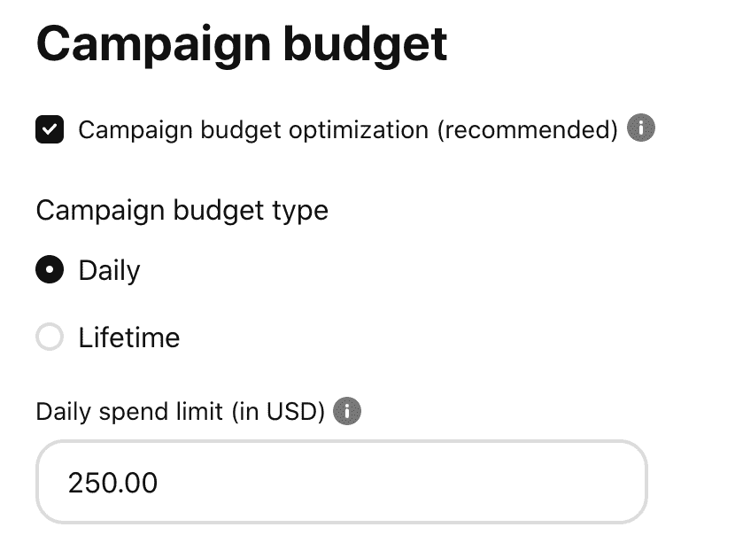
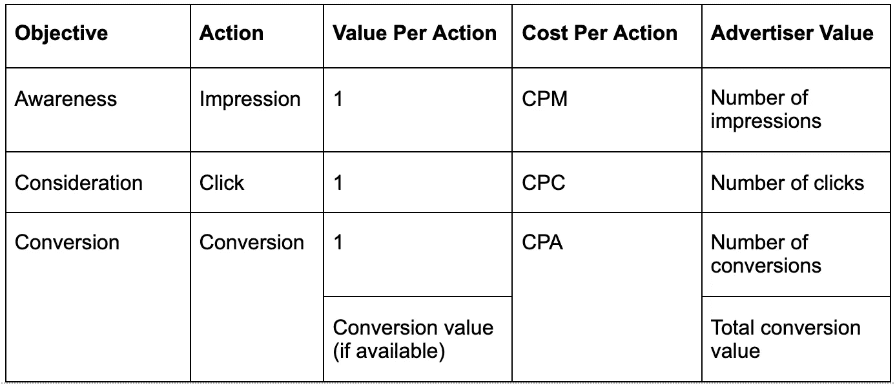
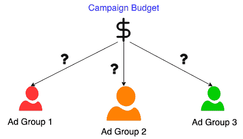
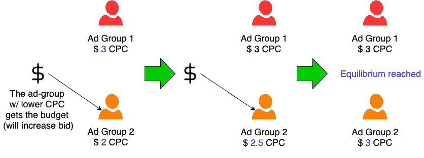
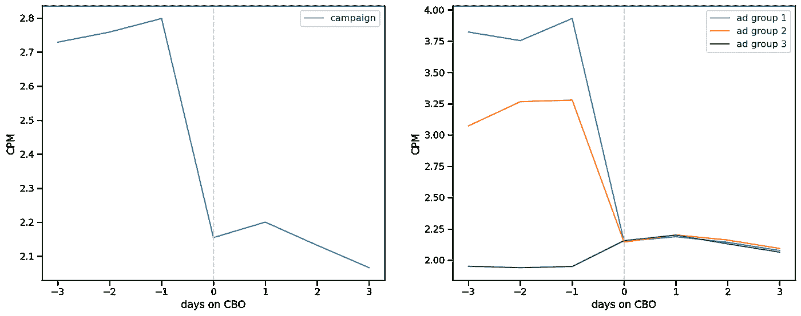
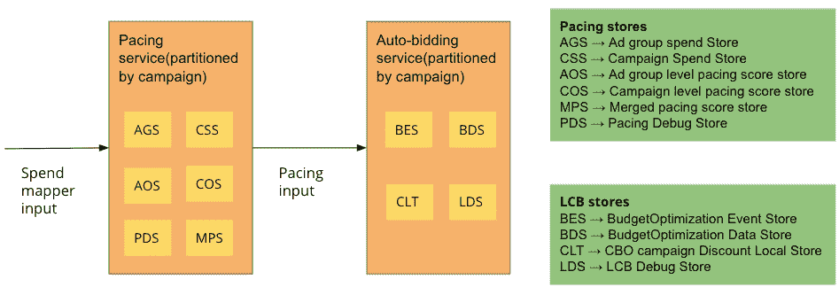
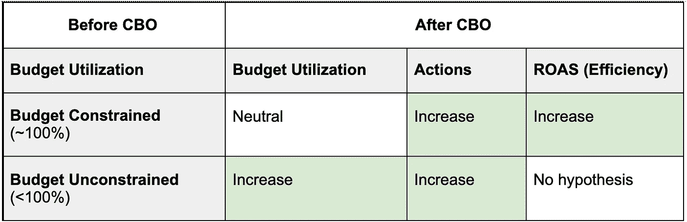
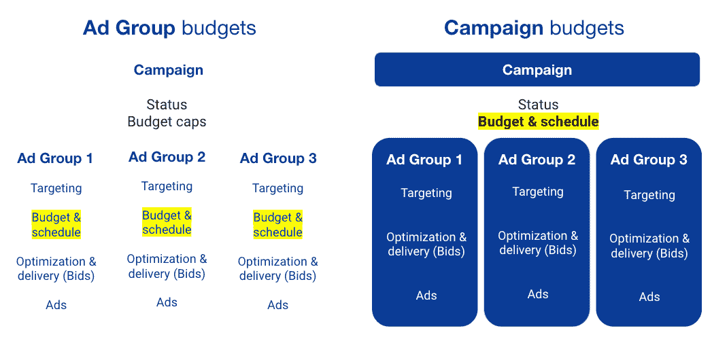
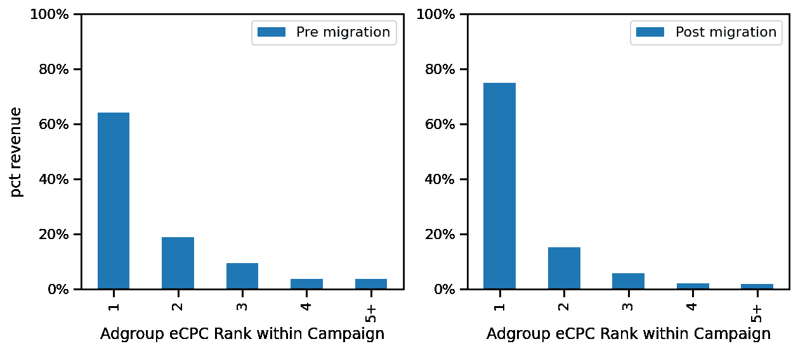

# Pinterest 的活动预算

> 原文：<https://medium.com/pinterest-engineering/campaign-budgets-at-pinterest-be94f15a4527?source=collection_archive---------2----------------------->

Kelvin Jiang |软件工程师；Keshava Subramanya |工程经理；施| Ads Intelligence 软件工程师

# 介绍

Pinterest 是一个视觉发现引擎，帮助 Pinners 找到灵感。广告商使用 Pinterest 与 Pinners 在这些灵感之旅中建立联系，并寻求有效地推广产品或服务。

Pinterest 的广告智能团队开发产品，帮助广告商从广告活动中获得最大价值。作为该计划的一部分，我们最近推出了针对 Pinterest 广告的活动预算优化产品。

活动预算优化，或 CBO，是一个自动化的广告产品，通过以自动化的方式在基础广告组之间分配每个活动的广告预算，使广告商受益。营销活动预算优化的目标是:

*   **最大化广告价值**，例如，根据活动推动点击或转化
*   **通过允许广告团队共享预算，提高广告活动的预算利用率**
*   **简化广告客户体验**并消除手动调整预算的需要

# 问题陈述和动机

广告商创建包含多个广告组的活动，并为每个广告组分别设置预算金额。预算分配是一项重要的任务，因为广告客户通常对每个广告组的规模和表现没有什么预先了解，并且调整广告组预算可能是一个手动和重复的过程。CBO 试图通过将预算转移到活动层面，并将预算实时自动分配给广告组来解决这一问题。

CBO 提出的问题可以被公式化为一个约束优化问题:在使用固定的总预算的同时，通过最优地将预算分配给广告组来最大化广告客户价值。广告价值是一个随活动目标而变化的概念。显然，并不是所有的行为都是相同的(例如，结帐行为比添加到购物车行为更有价值)，解决方案应该提供一种方式来表现这些差异。

营销活动的目标各不相同，可能侧重于提高知名度、鼓励 pinner 考虑购买或鼓励 pinner 完成购买(或其他形式的转化)。创造购买意识或购买考虑被视为“上”漏斗，而激发实际购买被视为“下”漏斗。这些中的每一个对广告商来说都有不同的价值。

对于漏斗上端的认知度或考虑目标，CBO 寻求最大化结果行为的数量，如总印象数或点击数。对于漏斗下端转化目标，CBO 还可能考虑与每个转化行为相关联的转化价值(如果可用并由广告商提供)，并寻求最大化活动的整体转化价值。

# 我们的方法

CBO 背后的总体思路是将整体广告预算的每一美元逐步分配给边际回报最高的广告组。一旦每一美元的预算被分配，我们将达到一个最优的平衡状态，每个广告组的边际回报是相等的。

自动竞价是 Pinterest 广告的一个产品，它可以自动调整每个广告组的出价，以帮助在充分利用预算的同时，以最低的成本获得结果。一般来说，增加广告组的出价增加了其花费的能力，但是降低了其效率和广告花费的回报(ROAS ),因为由于回报递减的影响，随着我们花费更多，预期的结果(例如，点击或转化)更少。这种效果背后的直觉是，每个广告的目标受众是有限的，随着花费的增加，吸引下一个客户的成本也增加。

在实践中，CBO 算法通过操纵每个广告组的出价来自动且连续地将活动预算分配给广告组，以便向前述的最佳状态移动，在该最佳状态中，每个广告组都是同等有效的，或者具有相同的成本。这可以通过下面的例子来说明，一个寻求最大化点击的考虑活动。此示例显示了使用自动竞价的两个广告组:

在 CBO 算法的第一次迭代中，活动预算的下一个增量被分配给橙色广告组(广告组 2)，因为它具有较低的每次点击成本(CPC)。这是通过提高 orange 广告组的出价来实现的，其结果是将其 CPC 提高到 2.50 美元。在第二次迭代中，活动预算的下一个增量也被分配给橙色广告组，之后达到平衡，两个广告组具有相等的成本，即 3.00 美元的每次点击费用。在这一点上，任何剩余的活动预算将通过增加同等数量的投标而在两个广告组之间平均分配。

通过调整每个广告组的出价，使所有广告组的效率和成本相等，CBO 能够优化整体活动效率，这可以从切换到 CBO 之前和之后的真实宣传活动表现中看出:

本质上，CBO 算法通过使用实时控制系统来执行实时预算分配，该实时控制系统指示每个广告组应该何时花费(定步调)以及花费多少(自动竞价)。

# 基础设施

下图描述了 CBO 基础设施的主要组件，该基础设施由许多使用 Apache Kafka 的流处理服务组成:

为了控制每个活动的广告组之间的出价，创建了新的活动级状态存储来存储活动级速度和出价值。为了以可扩展的方式将系统产品化，将定速和自动投标服务按活动重新划分，以便同一活动的广告组将由同一台机器处理。

# 实验

我们针对每个目标构建并测试了 CBO 产品，进行了几个月的受控 A/B 实验(Alpha 阶段),随后是几个月的公开 Beta 阶段，广告主可以选择加入 CBO。

进入 Alpha 和 Beta 实验阶段，我们制定了许多假设，并使用实验结果进行验证。一般来说，这些假设可以分为两类——一类是预算受限的活动，其中预算在采用 CBO 之前(几乎)被完全利用；另一类是预算不受限制的活动。

我们制定了以下假设，并能够使用实验阶段的结果验证每个目标的假设:

# 产品首次展示

在每个目标的测试阶段之后，我们将所有尚未采用活动预算的活动迁移到 CBO。这项工作包括根据广告组设置推断活动的新预算值、开始日期和结束日期，以便在使用活动预算之前非常接近广告商的意图。

对于迁移流程，我们还通过比较迁移前后的营销活动绩效，对影响进行了深入分析。我们观察到活动绩效的变化，平均而言，与实验阶段验证的假设矩阵一致。

例如，在考虑目标迁移后，我们观察到每个活动中广告组之间的收入分配向具有更高效率或更低成本(CPC)的广告组转移:

各种活动目标的迁移对 Pinterest 销售团队和广告商来说都是巨大的胜利，因为现在需要管理、维护和调整的预算明显减少(大约一半)，这些团队的重点可以转移到跨活动或其他目标的预算分配上。

# 未来的工作

CBO 产品的推出只是在预算优化领域提高广告客户价值的第一步。在未来，我们计划继续改进 CBO 算法，探索使用交换比率来有区别地控制每个广告组的出价，并在广告组之间有区别地应用节奏策略来控制支出，以及其他进一步提高整体活动效率的方法。

如果你对这类工作感兴趣，给我们写封短信，看看我们的一个招聘信息，是关于机器学习工程师的。

*要在 Pinterest 了解更多关于工程的知识，请查看我们的* [*工程博客*](https://medium.com/pinterest-engineering) *，并访问我们的*[*Pinterest Labs*](https://www.pinterestlabs.com?utm_source=medium&utm_medium=blog-article-link&utm_campaign=jiang-et-al-november-18-2021)*网站。要查看和申请空缺职位，请访问我们的* [*职业*](https://www.pinterestcareers.com?utm_source=medium&utm_medium=blog-article-link&utm_campaign=jiang-et-al-november-18-2021) *页面。*

# 承认

我们要感谢以下跨职能团队(非详尽列表)的贡献-

史天元、崔天元、强瑞新、Kelvin Jiang、Flavio Bossolan、Keshava Subramanya、Sungro Yoon、俞浩

、Brittany Herr、Grace Si、Randy Perez、Manuel Lara、Frannie Huang、Allan Rezende、Ravi Dharawat、Jayanth Mettu、Kate Liu、Dani Gnibus

罗曼·陈·尼凯特·阿罗拉

sreshta Vijayaraghavan Shawn Nguyen an iket ket kar

王泽宇

Sameer Bhide，Edward Zhou，何浩宇，，Alonso Garcia

亚历克斯·穆恩，马拉夫·沙阿

西蒙·杨

周惠清

丹尼尔·卡尔沃斯基·阿西姆·达塔

彼得·艾伦，杰伊·祖尼加，贾纳尼·维贾伊库马尔

朱莉·皮斯金

Hazem Younes，Rita Kamil，Dovik Nissim

凯蒂·凯特格斯，帕特里克·狄龙·休斯

菲德尔·卡尔德龙，艾米·康波，凯特琳·安东内尔，格雷格·林德利

凯利·安肯

吉米·奥卡拉汉

马克·奥图泰耶·佩里·奥贡沃尔

罗洛夫·范·兹沃尔·叶茂

谢旦，亚历克斯·李，安德烈·库雷里，，杰夫·吴