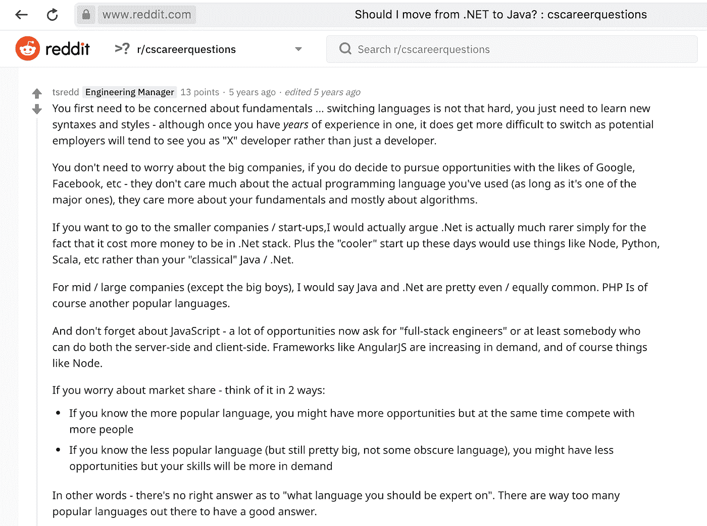
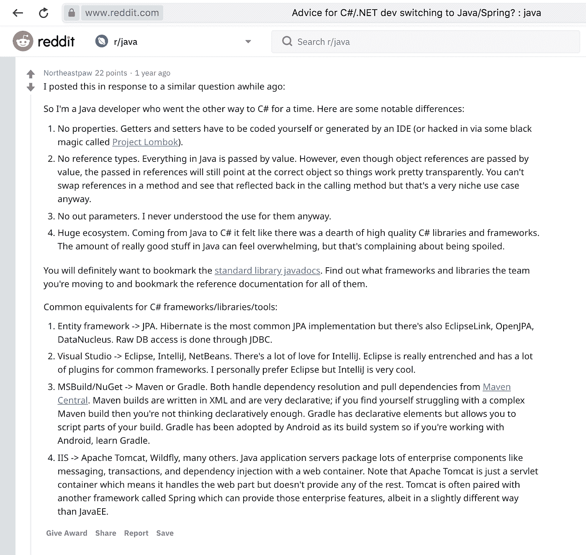
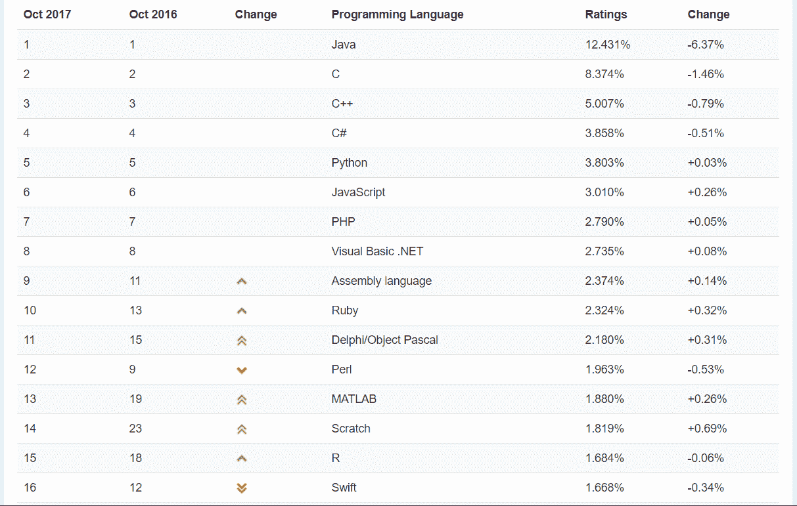
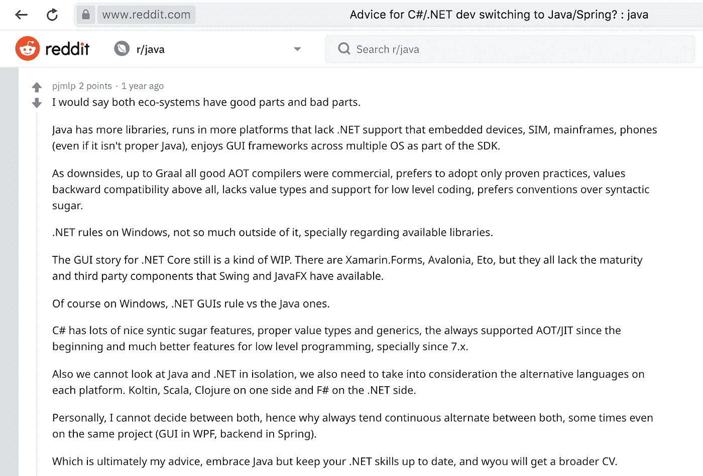
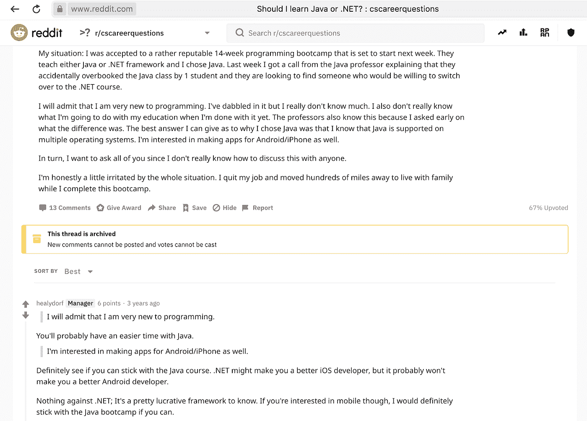

# 一个. NET 开发者可以不用重新开始就转 Java 吗？

> 原文：<https://medium.com/quick-code/can-a-net-developer-switch-to-java-without-starting-over-53a175fd3a5?source=collection_archive---------1----------------------->

Java 是一种面向对象的编程语言。NET 是一个以 C#为编程语言的框架。Java 和。NET 适合为企业界开发解决方案。

由于这两种语言在各自的类别中都很受欢迎，因此选择最适合您的开发需求的语言来开发直观的应用程序通常很有挑战性。

# 你应该做出改变吗？

[Source](https://www.reddit.com/r/cscareerquestions/comments/2j0sfh/should_i_move_from_net_to_java/)

# Java 和。网

[Source](https://www.reddit.com/r/java/comments/8sjzp1/advice_for_cnet_dev_switching_to_javaspring/)

Java 是一种编程语言，可以在任何操作系统上工作。Java 还提供了一个 Java 虚拟机(JVM ),允许代码在任何设备和任何操作系统上运行。因此，它被认为是一种可移植的语言。

鉴于，。NET 通常被视为一个框架，并且主要是面向 Windows 的。。NET 还支持 C#、C++、VB.NET 等语言。

因为。NET 应用，有一个标准的 IDE——visual studio；这是一个神奇的工具，可以帮助创建不同的应用程序。另一方面，市场上有两种面向 Java 开发人员的主流 ide——IntelliJ Idea 和 Eclipse。

# 你应该从 C#转换到 Java 的 5 个理由

# 1.更好的工作机会

的确，在撰写本文的时候，说有 29694 个工作岗位给 Java 开发人员，16085 个工作岗位给。全美国的. NET 开发者。

Java 也是 [TIOBE](https://www.tiobe.com/tiobe-index/) 指数的领导者，在那些想进入编程世界的人中需求量很大，这使得 Java 成为新手专业人士的绝佳选择，因为这是一项需求量很大的技能([30 亿台设备运行 Java！](https://www.zdnet.com/article/three-billion-devices-run-java-yeah-but-do-they-like-it/))，意味着更多的工作机会。

根据现有数据，90%的财富 500 强公司使用 Java 创建应用程序和内部系统。当 Java 开发人员的平均年薪为 102，514 美元时，这是一个经济上可行的职业选择。

# 2.比其他基于 JVM 的语言更容易使用

Java 的一个本质特征是它在不同的平台上有一个共同的语言。然而，用它编写的程序在各种类型的操作系统中相互独立地工作。JVM 支持 Python、Ruby、Groovy、Scala 和 Kotlin 等语言。

因此，我们可以说 Java 基于单一的编程语言，这对于支持多种编程语言是有用的。

# 3.Java 的可移植性和兼容性

Java 的一个主要优点是可移植性，所以你可以很容易地根据你的规格选择操作系统，创建一个应用程序或网站。即 Java 应用程序与其他平台更加兼容。

# 4.更雄心勃勃的项目

迁移到 Java 将通过补充您的开发技能而有益于您的职业生涯。学习 Java 最显著的优势是能够为 Android 开发应用。

Android 是我们这个时代最占主导地位的智能手机操作系统。因此，能够[为 Android](https://www.thecrazyprogrammer.com/2013/07/the-top-4-websites-to-create-android.html) 开发应用的 Android 程序员有相当大的需求。

[Source](https://www.reddit.com/r/java/comments/8sjzp1/advice_for_cnet_dev_switching_to_javaspring/)

# 作为. NET 开发人员如何快速学习 Java

既然我已经说服你开始学习 Java，你可能想知道学习如何使用 Java 的最好和最成功的方法是什么。

在学习 Java 时，你要做的第一件事就是在互联网上找到一些免费的资源。让我们看看最好的报价。

# 极客论坛——最广泛的门户网站

另一个很好的资源是[极客论坛](https://www.geeksforgeeks.org/tag/java-puzzle/)。这里有很多不同的课程，不仅仅是 Java。在这里你可以找到很多理解算法和解谜的编码任务。

Java 课程是专门为那些想把技能集中在 Java 上的 [Java](https://www.geeksforgeeks.org/java/) 学生设计的。因此，如果你希望有一天成为一名 Java 高级程序员，或者只是尝试一下这种特殊的编程语言，那么这是你开始学习的正确课程。它涵盖了所有 Java 主题，从基础到更复杂的主题，如 Set 接口、Map 接口等。

# code gym——通过游戏化和实践使学习变得简单

[CodeGym](https://codegym.cc/) 在线 Java 核心课程，1200 个编码任务(从最基础的到最复杂的)。它也有讲座&一个内置的验证器。

CodeGym 教程使用特殊的技术使学习更加舒适和愉快:讲故事，游戏，以及其他有趣的活动。

这门 Java 课程由 40 个级别组成。只有当前级别中的大部分任务都已完成，才能进入下一级别。因此，您可能会获得超过 500 小时的 Java 编程实践。

# CodeWars——应对学习挑战的重要方法

Codewars 是学习 Java(以及许多其他语言)的极好资源。

一旦你对 Java 有了基本的了解，就该开始用它来解决问题了，或者说是代码战争中的“武打”。你从八个 kyu 开始，即“排名 8”，排名最低，然后通过解决任务你获得更高的排名。

# 代码学院——理论与实践的良好平衡

[CodeAcademy](https://www.codecademy.com/) 是在线学习世界的“大男孩”之一；因此，它出现在我的名单上并不奇怪。

这是一个令人兴奋的方式，将理论和实践练习结合在一页上，尽管理论部分有点缺乏。

# 主要挑战和克服挑战的方法

如果您开始在您的个人项目中使用 Java，您可以让切换变得更加容易。

无论是玩还是学习软件开发的一个新方面(例如，算法)，使用一些新的东西——使用 Java。这意味着当您进入 Java 平台市场时，您已经感觉相对舒适了。

主要的问题是什么？

有许多库/框架可以做同样的事情，并且有一组 Java APIs 试图解决这些问题。当从。NET 宇宙，这在这方面更容易(也就是说，对于许多事情，有一个突出的工具选择)。

第二个是操作系统。我怀疑一个一生都在使用视窗系统的人会轻易转向开发 Linux 软件。

这里的小技巧是——了解一些事情，如果你在工作中使用 Windows，在家里使用 Linux，即使归结为上网和看在线视频，你也会学到很多。

[Source](https://www.reddit.com/r/cscareerquestions/comments/506qti/should_i_learn_java_or_net/)

# 总而言之

Java 技术提供了更多的选择，更多的开源软件供使用和支持，以及一个伟大的社区。至于。NET，我承认 C#是一种很好的语言，Visual Studio 是一种很好的 IDE。

然而，目前，Java 开发人员的工作更受欢迎，报酬也更高。

考虑到这一点，这两个应用程序的经验看起来都令人印象深刻，如果您在。NET，学习 Java 将不是问题。如果您还可以选择从。NET 到 Java，不要犹豫，现在就做。

在家里的空闲时间，从小型家庭项目和在线课程开始。在一两个月内，你将有足够的经验开始编码一些相当严肃的东西，或者甚至一些商业的东西。