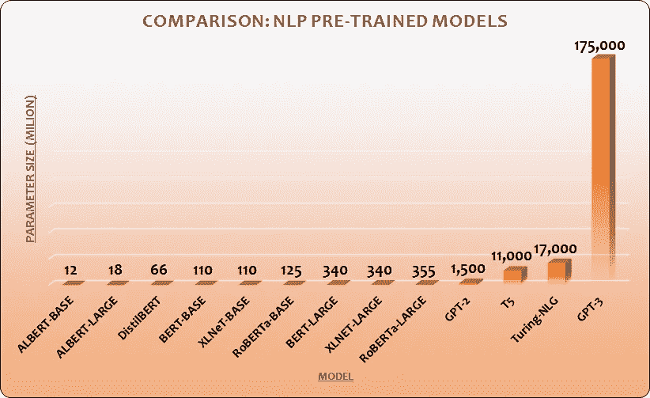

# AI 可以写你的 React 代码吗？

> 原文：<https://medium.com/globant/can-ai-write-you-react-code-c36c9f16b1f5?source=collection_archive---------0----------------------->

总之: ***是的*** ！但它能做的远不止这些。这种颠覆性的语言模式正在互联网上掀起风暴——它被称为 ***GPT-3*** *(生成式预训练变形金刚 3)。* *是一种利用深度学习产生类人文本的自回归语言模型*。它是由[OpenAI](https://openai.com/) 打造的 *GPT-n* 系列中的第三代语言预测模型。OpenAI 是一家人工智能研发公司，由我们这个时代的技术创新者之一埃隆·马斯克(以及*格雷格·布罗克曼(CTO)、萨姆·奥特曼(CEO)和 3 位*其他先生)于 2015 年底创立。

Natural Language Processing ([Source](https://i1.wp.com/aliz.ai/wp-content/uploads/2019/05/Natural-Language-Processing-03-1.png?fit=3042%2C1521&ssl=1))

# 为什么它是有史以来最强大的语言模型？

TL；它体积庞大—***1750 亿*** 参数博士。进行预测时，模型需要参数，这些参数决定了模型解决问题的能力。

以下是一些流行的预训练模型的比较:

Pre-trained models

> 换个角度来看，人类的大脑有一个相当于 ***一万亿个*** 的参数🤯。

自然语言处理(NLP)中使用的一种架构是基于深度学习模型的神经网络，该模型于 2017 年首次推出——[Transformer](https://en.wikipedia.org/wiki/Transformer_(machine_learning_model))。GPT-n 模型基于这种基于变压器的深度学习神经网络架构。

在过去的两年里，GPT-3 一直在世界上最大的超级计算机上进行训练。GPT-2 是去年(2019 年)刚刚发布的，你可以清楚地看到 GPT-3 在如此短的时间内超越了它的前任。GPT 3 号搜集了互联网上所有的信息。文章，研究，历史，文学，每一行公开的代码。它使用互联网上的所有信息进行训练。

> 一些坏消息随之而来。“权力越大，责任越大”。像 GPT-3 这样强大的工具不可能发给每个人，对吗？你可以在这里加入等待列表[，成为 API 的 beta 测试者，或者将它用于学术研究目的。](https://forms.office.com/Pages/ResponsePage.aspx?id=VsqMpNrmTkioFJyEllK8s0v5E5gdyQhOuZCXNuMR8i1UQjFWVTVUVEpGNkg3U1FNRDVVRFg3U0w4Vi4u)

好消息是，一些提前接触到它的幸运儿有很多东西要展示。让我们看一看…

# 它能做什么？

这种强大的语言模型的特点是可能性是无限的。当与人类的创造力相结合时，这种人工智能可以实现以下目标:

*   写小说，诗歌，幽默( [*变形金刚 AI 诗歌:被人工智能*](https://www.gwern.net/GPT-3#william-shakespeare) 重新想象和改写的诗歌经典)。
*   为一个大学生制作一篇假博文，这篇博文最近在黑客新闻上排名第一([博文](https://adolos.substack.com/p/feeling-unproductive-maybe-you-should))。
*   写商业备忘录([如何招募董事会成员的 3 步流程](https://twitter.com/zebulgar/status/1283927560435326976?s=20))。
*   与自己进行深刻的对话或被聊天机器人使用。
*   写**代码！！** 🧑‍💻

# 编写 React 代码

Sharif Shameem 是少数幸运者之一，他通过开发这个平台[https://debuild.co/](https://debuild.co/)试验了 GPT-3 的编码能力。同样，如果没有使用它的明确权限，它是不可访问的。所以，让我们通过这个家伙的 [twitter 句柄](https://twitter.com/sharifshameem?ref_src=twsrc%5Egoogle%7Ctwcamp%5Eserp%7Ctwgr%5Eauthor)来看几个演示。

## 待办事项列表:

## 执行数学运算的组件:

## **谷歌主页:**

归结起来就是:输入你希望你的应用程序做什么的详细而清晰的描述，然后点击一个按钮。好了🔥。它会在几秒钟内为你吐出一些代码。

# 告别 Web 开发人员的工作(？)😉

没这么快😂。这似乎就像伟大的，全能的奥创吞噬了贾维斯，并打算统治我们所有人。

Jarvis/ Ultron showdown

但幸运的是，事实并非如此。GPT-3 是一个高效的自然语言处理模型。它可以理解口语和书面语，从句子中提取上下文。虽然它不是什么，但它是一个有知觉的人工智能。这并不像听起来那么聪明。它不能有新的发现，不能发明新的东西。

作为开发人员，您可以使用它来生成样板代码，同时完成繁重的工作。当你可以将创建 UI 组件、应用简单逻辑等任务委派给人工智能时，你不需要关注开发的小方面。你可以专注于更大的画面，架构的东西，也许指导和教导人工智能根据你的经验和实践产生更好的代码。也许，你想用一个基于文本的指令获取框架来代替日常的单元测试框架。你只是被自己的想象力限制了，真的。

最终，像这样的人工智能可以帮助加速开发过程，并作为您的个人 Jarvis，以便您可以开发更好的应用程序，甚至更快。

> 在一个更现实的世界里，OpenAI 首席执行官 Sam Altman 在 7 月 20 日的 Twitter 上发表了同样的观点:“GPT 3 号的炒作太过分了…人工智能将改变世界，但 GPT 3 号只是非常早期的一瞥。”

## 更新时间:2020 年 9 月 4 日

OpenAI 已经宣布了 API 的预计定价计划，该计划允许用户访问 GPT-3。从 10 月 1 日起，测试版用户将需要从 4 种定价方案中进行选择:

1.  *探索*:免费等级:100K 代币或三个月试用期，以你先用完的为准。
2.  *创建:*每月 100 美元的 2M 代币，每增加 1k 代币加 8 美分。
3.  构建:1000 万代币每月 400 美元，每增加 1k 代币加 6 美分。
4.  *规模*:联系 OpenAI 定价。

2M 代币相当于近 3000 页的文字。你可以查看研究员 Gwern Branwen 的 Reddit 帖子了解更多细节。

## 学分:

*   聪明的程序员开发的这个令人敬畏的流——用这个疯狂的新人工智能工具(GPT-3)编码快 10 倍
*   [谢里夫](https://twitter.com/sharifshameem)
*   [OpenAI](https://openai.com/about/)
*   [维基百科](https://en.wikipedia.org/wiki/GPT-3)
*   福布斯（美国出版及媒体集团）
*   格温·布兰文(Reddit)