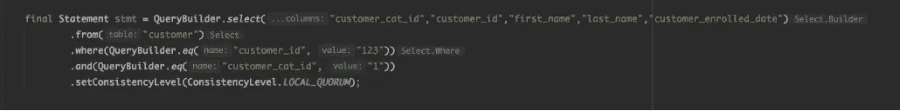

# Spark 应用程序可以与 NoSQL 数据库共存吗？

> 原文：<https://medium.com/capital-one-tech/can-spark-applications-coexist-with-nosql-databases-9f63edca9400?source=collection_archive---------0----------------------->

## NoSQL 后端 Spark 应用的四个技巧

*阿帕奇火花
阿帕奇卡珊德拉
MongoDB*

这些在科技行业都不是不知名的名字。他们每个人都在分布式计算领域赢得了值得称赞的空间——Apache Spark 作为统一分析并行处理框架，Apache Cassandra 和 MongoDB 作为 NoSQL 数据库的领导者。虽然它们中的每一个都提供了很大的好处——比如内存中的大规模并行处理、更快的读取响应和灵活的模式设计——但当涉及到[在线事务处理(OLTP)](https://en.wikipedia.org/wiki/Online_transaction_processing) 时，在应用程序中一起使用它们需要一些战术策略。

这篇博客将关注在 NoSQL (Apache Cassandra 和 MongoDB)后端运行 Apache Spark 应用程序的技巧。这些技巧基于我的团队在构建一个[云原生](https://www.capitalone.com/tech/cloud/what-is-cloud-native/)平台来处理客户信用卡交易时遇到的问题。在云原生环境中构建和管理分布式应用也带来了挑战。任何对分布式系统感兴趣的人都会同意 TCP/IP 是分布式系统的生命线，所以让我们参观一个我喜欢称之为 *TCP/IP sPark 的虚构的地方。我希望你在 TCP/IP sPARK 的经历能帮助你克服这些挑战……*

# 欢迎使用 TCP/IP sPark

谁不喜欢去主题公园？它们很有趣，令人难忘，所以在这篇博客中，我们要去 TCP/IP sPark，在它著名的 CassandraLand 和 MongoLand 部分有很多有趣的游乐设施。如果你像我一样——喜欢主题公园和构建/管理分布式应用程序的人——那就跟着做吧。

我们将从去卡珊德拉兰开始我们的旅程，并学习一些在 TCP/IP sPark 中更好地乘车的经验/技巧。那我们就去蒙哥兰再捡几个。我希望你会发现这次旅行有趣又快乐！

为了更好地享受你的旅行，带更多的回忆回家，Apache Spark、Mongo 和 Cassandra 上的一些刷新程序可能会有所帮助。

# Cassandra land——使用 Cassandra 和 Spark 的两个技巧

卡珊德拉兰的标志性游乐设施是象征环摩天轮。骑手们一圈又一圈，每次轮子落地，他们的参赛作品都会在卡珊德拉注册，就像这样:

# 卡珊德拉第 1 课—卡珊德拉关键序列至关重要

哦！季票持有者 DOE 在乘坐象征环摩天轮后失踪，公园保安正试图在 CassandraLand 找到他的下落。

当像上面一样查询 DOE 的详细信息时，我们的 Spark 应用程序变得不高兴，并开始转动自己的轮子。摩天轮>载入图标。

为什么会这样？这里的教训是 **Cassandra 键序列在查询时很重要。**根据 Cassandra 在磁盘中对数据进行分区的固有特性，如果不遵循 key sequence，它将无法从其分区中快速获取数据。相反，它将对每个查询进行表扫描，使 Cassandra 数据库集群不堪重负。

但是不用担心！FooBar 发现了这个问题，并按如下方式修复了它:

好像 DOE 去礼品店买 TCP/IP sPark 纪念品去了。买纪念品来记住你的公园之旅总是很重要的，就像记住你的卡珊德拉按键序列一样重要。

# Cassandra 第 2 课—使用基于案例的数据建模

另一个受欢迎的卡珊德拉乐园是分区过山车。如果你选择了正确的座位(分区键)，你将在令人兴奋的毫秒内回到基站。当顾客在享受他们的过山车之旅时，他们的信息会像下面这样被保存下来，这样游乐设施运营商就可以跟踪每天乘坐过它的人:

这一点很重要，因为像大多数过山车一样，Partitioner 过山车提供了储物柜，当你在乘坐时可以存放你的东西。但是一些顾客可能喜欢把他们的东西放在身边，或者急着上车而忘记使用储物柜。如果你是这些人中的一员，你的东西很容易从口袋里掉出来，或者因为太兴奋而忘记了你的东西。

因此，每当过山车操作员在过山车下或其中一个座位上发现什么东西时，就需要找到那天所有被处理的乘客。

虽然可以在客户模式中找到信息，但这不是最佳的方法。在 Cassandra 中，这被认为是某种反模式。Cassandra 数据是分区的，其用例定义了模式。

这里的教训是**首先基于用例**设计你的模式，如果需要，数据生产者必须随着使用的发展复制数据。

# MongoLand——使用 MongoDB 和 Spark 的两个技巧

在从卡珊德拉兰收集了一些经验和建议后，我们的公园游客正前往期待已久的蒙哥兰。

当客户在无模式传送带上一圈又一圈时，他们的信息被保存在后端，如下所示:

# Mongo 第 1 课—正确管理 MongoDB 连接

从我们对卡珊德拉兰的访问中，我们知道 DOE 是 TCP/IP sPark 的季票持有者。他们已经被提升到更高的会员级别，我们需要在系统中更新这一点。但是为了处理这个信息更新，旋转木马不得不停止，并且其他乘客对他们的乘坐被减慢和中断感到不高兴。

这里的教训是 Mongo 连接应该在 JVM 或分区级别处理，如下所示:

如果没有在分区或 JVM 级别处理连接，应用程序可能会打开许多不需要的连接，这取决于您在哪里处理连接。这有可能使您的应用程序和数据库集群停机，也会让其他 carousel 骑手不高兴。

# Mongo 第 2 课—索引非常有用

从无模式旋转木马的失败中恢复过来后，我们仍然没有处理 DOE 的会员更新。

当我们试图这样做的时候，我们又一次看到了旋转的摩天轮，或者在这个例子中，旋转木马。就像我们去卡珊德拉兰一样。

这里的教训是，Mongo 索引非常重要，在您需要查找和更新信息(如 DOE 的新公园会员状态)的情况下非常有用。

# 希望您对 TCP/IP sPark 的访问愉快！

希望您的 TCP/IP SPark、CassandraLand 和 MongoLand 之旅是有益和难忘的。请记住，在使用 Cassandra 和 Spark 时，您应该确保您的键序列是正确的，并且模式是根据您的用例规划的。不要忘记，使用 MongoDB 和 Spark，您应该正确地管理您的连接，尤其是索引，以防特定的更新。

在 TCP/IP sPark 的神奇土地上再见！

*披露声明:2021 资本一。观点是作者个人的观点。除非本帖中另有说明，否则 Capital One 不隶属于所提及的任何公司，也不被这些公司认可。使用或展示的所有商标和其他知识产权是其各自所有者的财产。*