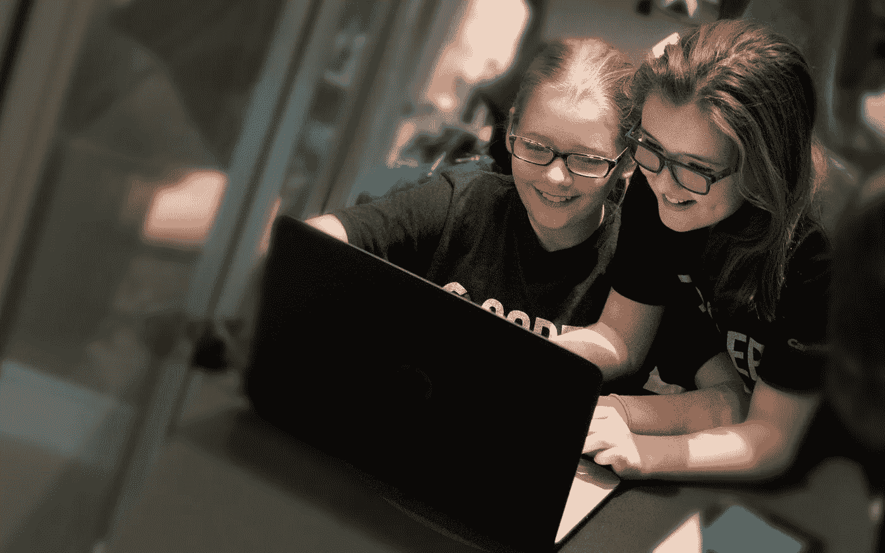
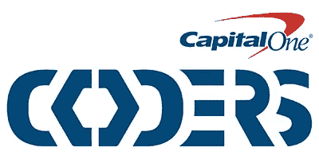
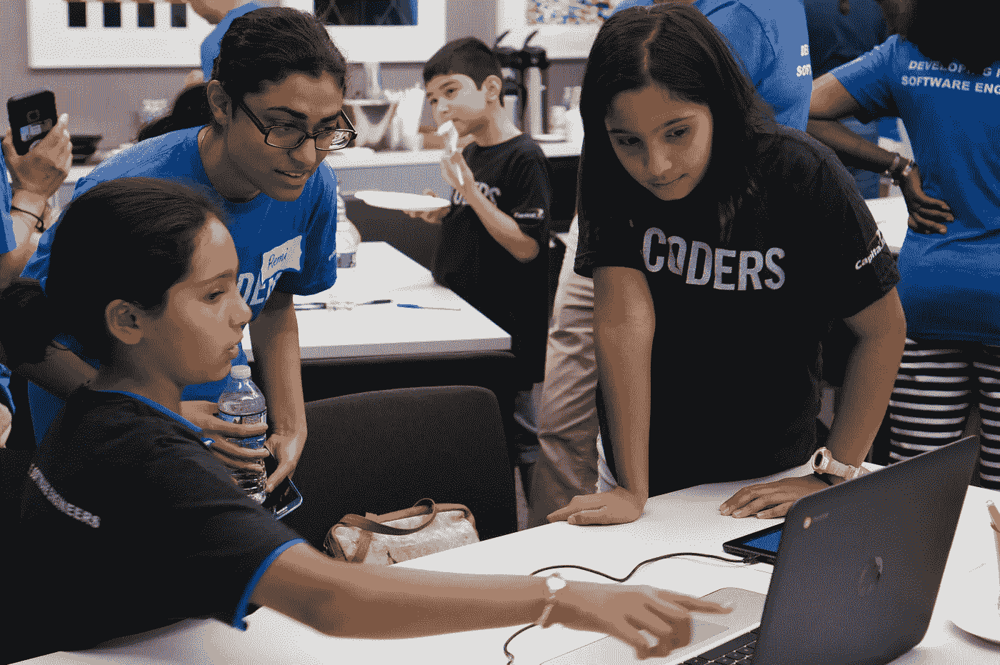

# Capital One Coders 帮助学生塑造未来

> 原文：<https://medium.com/capital-one-tech/capital-one-coders-helps-students-shape-their-future-1ca36a6ec5ec?source=collection_archive---------8----------------------->

*Jennifer Manry，企业技术 MVP，Capital One*

我早年受到科技的启发。不是每个九岁的女孩都想长大成为一名工程师，但我做到了，我有支持和机会去追寻我的激情。我很幸运，我现在在我的生活中——以及在 Capital One 的工作中——可以分享我的热情，并希望激励其他人以大致相同的方式追求他们的激情。最重要的是，我想通过激励下一代来回报他们。

技术无处不在，它几乎改变了一切，从我们工作和管理日常活动的方式到我们相互沟通的方式。它的潜力是无限的。Capital One 的[未来优势](http://www.capitaloneinvestingforgood.com/skills/future-edge-get-ready/)计划——我们为期五年、耗资 1.5 亿美元的努力，旨在为我们社区的人们提供在数字经济中取得成功所需的技能——专注于解决这一需求。鉴于 Capital One 丰富的技术人才以及我们与数十所学校和社区组织的关系，我们认识到这是一个鼓励年轻人从事 STEM 职业并开拓新的可能性的巨大机会。通过 Capital One Coders 计划，我们让成千上万的中学生接触技术，培养他们对软件工程的关注，为他们更光明的未来做准备。

自该计划于 2014 年底启动以来，已有 1000 多名 Capital One 员工自愿担任程序员导师和讲师。他们与学生一对一互动，分享他们对技术的热情，并在教育的关键时刻让孩子们对 STEM 感到兴奋。有了软件开发的基本原则和麻省理工学院的帮助

App Inventor 学习平台，在为期 10 周的课程结束时，学生甚至有机会设计和构建自己的移动应用程序。

看着六年级、七年级和八年级的学生将他们新获得的数字技能和创造力应用到应用程序中，是一种令人惊叹的景象。学生们总是全身心地投入到这一过程中，这需要新的思维、团队合作、解决问题的能力，通常还需要足够的耐心。在整个项目过程中，超过 2，500 名学生合作开发了 500 个不同的移动应用程序，每个应用程序都有自己独特的功能，从信息和教育到纯粹的娱乐。

Students working with a Capital One volunteer at the NYC Hackfest.

无论他们是在开发 Nutri-Tron，一款识别包装食品中食物过敏原的应用程序，还是一款名为 Impulse Racer 的竞技赛车游戏，这种动手体验都可以帮助学生利用技术的力量创造出完全属于他们自己的东西。一次又一次，我们看到学生离开这个项目时不仅仅是获得了新的技术技能。他们从 Capital One Coders 毕业后，感觉自己很有成就，也更自信了——你几乎可以看到灯泡在他们头上打开。

10 月，我们创建了一个名为 [Coders Experience](https://www.regonline.com/builder/site/Default.aspx?EventID=1997184&) 的新扩展项目:为期 10 天的活动，为期两个周末，500 名 Capital One 志愿者正在教 950 多名中学女生编程。参赛团队受邀参加 11 月 15 日的 [WIT Experience](https://www.regonline.com/builder/site/Default.aspx?EventID=1997832) ，这是一项面向科技行业女性的免费活动，以技能培养、研讨会、网络和鼓舞人心的演讲者为特色。

现在比以往任何时候，接触计算机科学和数字包容性是找到和保持有价值的职业生涯的关键。虽然目前只有大约四分之一的 K-12 学校提供包括编程在内的计算机科学课程，但 STEM 中 71%的新工作都是在计算领域，这从早年就造成了数字鸿沟。Capital One Coders 以及类似的面向年轻人的项目可以对学生产生深远的影响，激发他们以前不知道存在的兴趣，并为我们不断变化的经济中的长期成功打开大门。

幸运的是，随着技术的不断发展，我们的程序也在发展。在接下来的几个月里，我们将扩展我们课程的重点，包括网页设计和机器人技术，为中学生提供新的探索领域。

在过去的三年里，我非常自豪地看到 Capital One Coders 的规模和覆盖范围不断扩大，它所受到的热情也让我深受鼓舞，这些热情来自我们的助理志愿者、我们合作的学校和社区团体，以及我们有机会遇到的学生。这些中学生不仅可以一瞥科技行业的职业前景，还开始明白如何参与塑造和建设他们周围的世界。

*以上观点为作者个人观点。除非本帖中另有说明，否则 Capital One 不属于所提及的任何公司，也不被其认可。使用或展示的所有商标和其他知识产权都是其各自所有者的所有权。本文为 2017 首都一。*