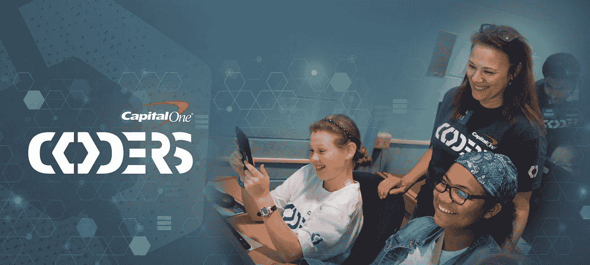
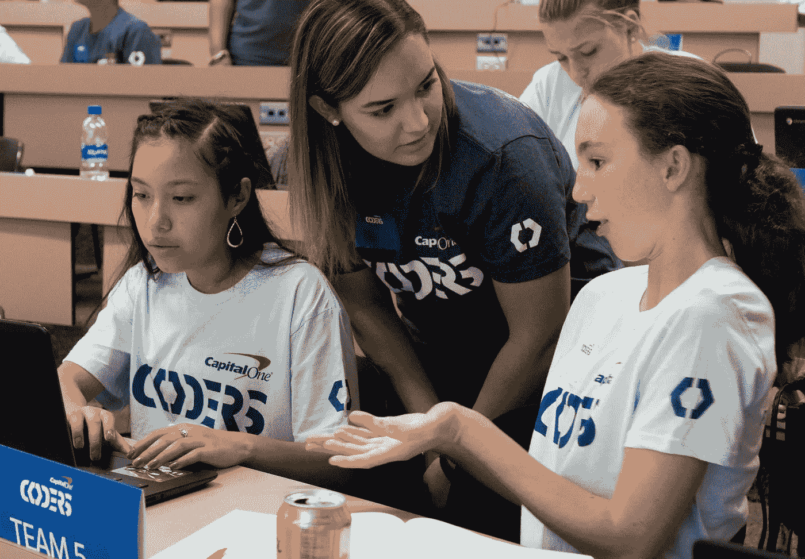

# Capital One Coders 培养新一代工程师

> 原文：<https://medium.com/capital-one-tech/capital-one-coders-prepares-a-new-generation-of-engineers-92dd298e8f97?source=collection_archive---------5----------------------->

*Capital One 技术副总裁 Jay Sanne*

任何与技术打交道的人都明白，唯一不变的是变化。

但我们也知道，变化带来机遇。如果我们花一点时间，我们可以帮助推动变革，为准备利用技术提供的几乎无限潜力的年轻人打开大门。

25 年前，一家公司给了我一次机会，改变了我的人生轨迹。一家华盛顿的科技公司从本科毕业就直接雇佣了我。我是英语专业的，有一些轻编码的经验，但是公司有眼光，看到了我的潜力。他们把我放入一个新兵训练营，让我和敏锐的导师配对，他们帮助我把技能提升到一个新的水平。其余的，正如他们所说，都是历史了。

那次经历释放了我从来不知道存在的潜力，让我踏上了我所能想象的最好的职业旅程之一。我对“向前支付”充满热情，这就是 Capital One Coders 计划的全部内容。当我被要求领导这个旗舰项目时，我感到很谦卑。

吸引我和其他许多人来到 Capital One 的原因之一是，我们都承诺要回馈社会，并对我们的社区产生积极影响。

推动 Capital One 的创新精神、公司内丰富的技术人才以及我们与全国数十所学校和社区组织的关系，为鼓励年轻人追求科学、技术、工程和数学(STEM)职业并开拓新的可能性提供了巨大的机会。

> 通过我们的未来优势计划，我们将在五年内投资 1.5 亿美元，以使我们的社区更加强大。Capital One Coders 是通向未来优势的一扇窗户:它通过教中学生如何开发软件(这是当今和未来工作的一项关键技能)概括了这一使命。

通过我们的未来优势计划，我们将在五年内投资 1.5 亿美元，以使我们的社区更加强大。Capital One Coders 是通向未来优势的一扇窗户:它通过教中学生如何开发软件(这是当今和未来工作的一项关键技能)概括了这一使命。

Capital One 的员工和程序员志愿者道格拉斯·利斯克(Douglas Lisk)表示，兴奋是激励学生学习的关键。

“有两种方法可以让孩子们对编码感兴趣，”他说。“要兴奋，要开心。如果你想开发一个新的应用程序，他们会马上发现并投入其中。当学生们完成一个项目或对一个新想法感到兴奋时，看着他们脸上的光芒，让我想起了我当初为什么想成为一名工程师。"

导师兼 Capital One 合伙人劳伦·维滕贝格(Lauren Wittenberg)感谢有机会帮助年轻女孩在潜在的编码职业生涯中获得帮助。根据 2015 年美国大学妇女协会的一份报告，在美国，STEM 相关领域的学生中只有约 26%是女性，这揭示了维滕贝格和其他 Capital One Coder 导师正在努力克服的性别赋权差距。

“志愿做程序员让我想到，我会多么希望孩子们能从事和我类似的职业，”她说，这种想法是由导师凯瑟琳·桑布拉(Catherine Sambula)提出的。

“鼓励年轻女性学习 STEM 对我来说非常重要，”萨姆布拉说。“我认为我们可以做更多的事情来推动这件事，我认为这是一个尽自己一份力量的机会。”

自该计划于 2014 年底启动以来，近 2，500 名 Capital One 员工作为程序员导师和讲师花费了超过 54，000 小时的志愿者时间。他们与学生一对一互动，分享他们对技术的热情，并在教育的关键时刻让孩子们对 STEM 感到兴奋。在软件开发的基本原则和麻省理工学院应用程序发明者学习平台的帮助下，学生们甚至有机会在为期 10 周的课程结束时设计和构建自己的移动应用程序。今年，Capital One 将捐赠 17 万美元的 Coders 延续工具包，其中 1 万美元用于帮助学校在 Coders 结束后提供技术和 STEM 教育。

虽然统计数据令人印象深刻，但没有什么比看到编码人员在工作更好的了。几周前，我参观了弗吉尼亚州里士满的宾福特中学。看到我们的同事和学生们并肩工作真是难以置信。当孩子们展示他们新发现的技能和演示工作代码时，教室里的能量和兴奋是显而易见的。对一些人来说，这种经历可能会改变他们的教育或职业生涯。

里士满的 10 年级学生乔丹·哈里斯是 2014 年毕业的第一批程序员之一。

“心中有一个目标很好，”他说，“完成它，展示我的最终项目。”

Capital One Coders 是乔丹和同学 Desja Bonner 和 Chayse Tucker 决定参加 CodeRVA 的部分原因，coder va 是一所旨在帮助学生为计算机科学职业生涯做准备的高中。通过 Coders，九年级的 Bonner 获得了继续自学所需的工具。她现在正在自学 HTML。

“完成这个项目感觉很棒，”邦纳说。“我喜欢能够设计东西。”

塔克在程序员的经历后受到启发，成为了一名网站设计师，并喜欢创作手机游戏。

“我应该能在 12 年级后开始工作，”他说，“因为我将完成实习并获得大专文凭。”

到目前为止，已有 75 所学校的学生参加了 Coders 计划——仅 2017 年就有约 4000 人。在每个项目结束时，学生们会惊讶地得到一台他们自己的笔记本电脑，可以带回家继续应对新的编码挑战。

现在，获得数字教育和数字包容比以往任何时候都更是寻找和保持有价值职业的关键。虽然目前只有大约四分之一的 K-12 学校提供包括编程在内的计算机科学课程，但 STEM 中 71%的新工作都是在计算领域，这从早年就造成了数字鸿沟。

有了 Coders，我们正在让成千上万的中学生为更光明的未来做准备。成为对这些学生有深远影响的事情的一部分是令人兴奋的——激发他们以前不知道存在的兴趣，并打开新机会的大门。

这些是作者的观点。除非本帖中另有说明，否则 Capital One 不属于所提及的任何公司，也不被其认可。使用或展示的所有商标和其他知识产权都是其各自所有者的所有权。本文为 2018 首都一。