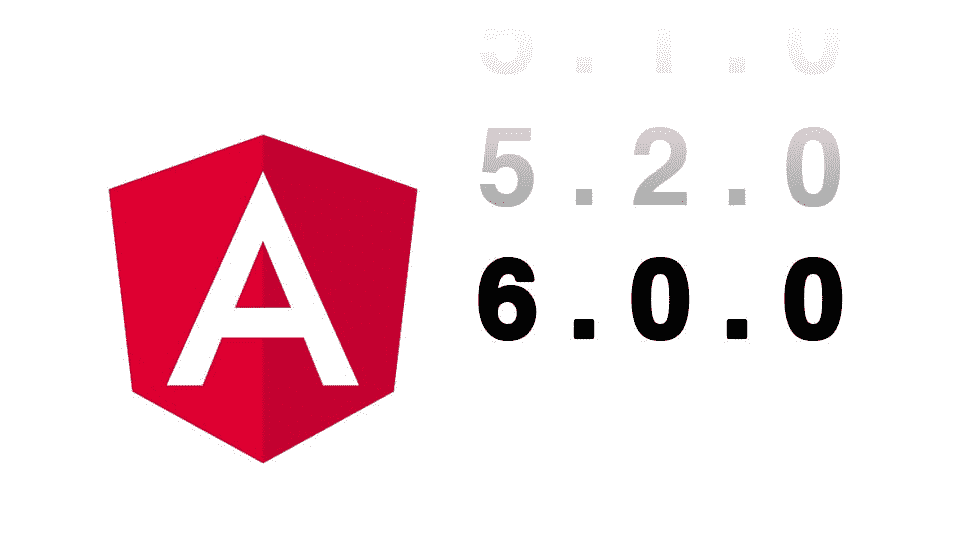
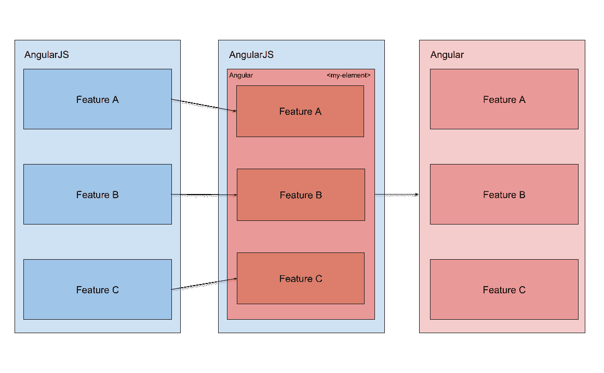
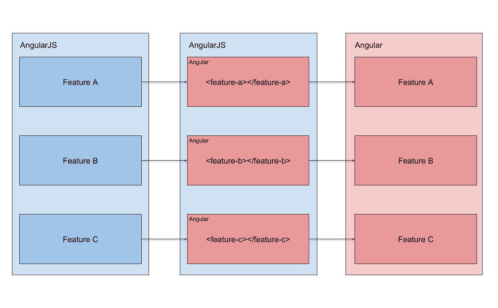
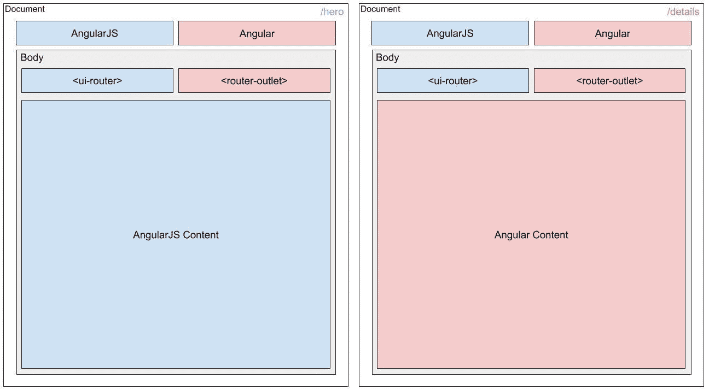

# Capital One 如何使用角度元素从 AngularJS 升级

> 原文：<https://medium.com/capital-one-tech/capital-one-is-using-angular-elements-to-upgrade-from-angularjs-to-angular-42f38ef7f5fd?source=collection_archive---------0----------------------->


在 Capital One，我们的主要服务平台的很大一部分是用 AngularJS 构建的，我们每天都在不断地向我们的平台添加新功能。2018 年 7 月，AngularJS 的积极功能开发进入尾声，并进入长期支持(LTS)。由于这种转变，我们将从 AngularJS 迁移到 Angular 的计划变得更加紧迫。为了成功完成这一迁移，我们正在开发一个流程，以模块化的方式升级和构建新功能，同时不妨碍我们平台的持续开发。为了实现这一点，我们使用角元素作为偏移工具。

***在我们潜进去之前，本文假设你已经对***[***AngularJS***](https://angularjs.org/)*[***Angular***](https://angular.io/)***，以及*** [***各种升级策略***](https://github.com/angular/ngMigration-Forum/wiki/Migration-Paths-Overview) ***。****

*有些人可能会问，*“等等，为什么是角元素？你为什么不用 ngUpgrade 方法来代替呢？！？!"。这些都是完全正确的问题。**

# *`NgUpgrade`太脆*

*[UpgradeModule](https://angular.io/api/upgrade/static/UpgradeModule) 库不允许多个开发团队在同时升级的同时对同一个库做出贡献。更具体地说，从 ngUpgrade 方法的技术角度来看，在页面上同时升级两个 AngularJS 组件是不可能的。这将会妨碍我们的开发工作在有许多贡献者的大平台上的可伸缩性和独立性。*

*UpgradeModule 使用 AngularJS `$injector`记录角度分量。这允许两个框架在升级/降级过程中相互通信。然而，*因为*我们有多个团队升级他们自己的特性——用复杂的依赖图——这就产生了风险。团队需要在`$injector`中竞争名称空间，协调升级时间表几乎是不可能的。*

*此外，UpgradeModule 将两个框架紧密耦合在一起，当调用任一框架的生命周期挂钩时，都会导致性能影响。例如，如果 AngularJS `$digest`周期由`ng-click`事件触发，Angular 将经历一个完整的变化检测周期。同样，如果角度变化检测周期由`(click)`事件触发，AngularJS 将经历一个完整的`$digest`周期。*

*出于这些原因，我们认为 ngUpgrade 对于我们的用例来说不是一个可行的升级策略。相反，我们需要一些灵活、可靠、与现有应用程序分离的东西，这样它们就不会影响我们的其他开发团队。*

*但那可能是什么呢？*

# *输入:角度元素*

**

*早在 Angular v6 发布的时候， [Rob Wormald](https://medium.com/u/d265c7f819df?source=post_page-----42f38ef7f5fd--------------------------------) 在 NgConf 2018 上发表了一个[激动人心的演讲](https://www.youtube.com/watch?v=Z1gLFPLVJjY)，谈到了 web 组件(一组包含自定义元素的 DOM APIs)的进步，并列举了 Angular 如何让开发人员能够创建高度可移植的、与 web 框架无关的小部件的许多原因。这种方法的优点是:*

*   ***随处使用—** 角度元素可以在浏览器中的任何地方使用，与框架无关。*
*   ***通过依赖注入使用状态管理—** 我们可以利用 Angular 提供的依赖注入系统将页面上的任何元素链接到您选择的任何状态管理存储。这是通过在倾斜启动时暴露窗口对象上的注入器来实现的。(我们稍后将对此进行更深入的讨论。)*
*   ***内容投影管用—** 只要第一次用页面渲染内容投影，一切都管用。另外，`ContentChild`和`QueryList`(及其复数形式)是为静态消费设计的；这些功能还不能适应动态的世界。Angular 团队计划在不久的将来解决这个问题。*
*   ***样式的作用域是元素—** `ViewEncapsulation`本质上是使用阴影 DOM。元素应该使用`Native`模式，这样样式就不会漏过整个页面。*(注意*:我们选择在实现中使用`None`，因为我们有意重用我们为元素和遗留代码设计的样式。)*
*   ***支持大多数主流浏览器—** 支持 Angular 的地方都支持 Elements。确保包含通常所需的相同聚合填充。它甚至可以在 IE9 之前的 IE 浏览器中运行。*
*   ***所有的东西都在沙盒里—** 元素完全独立运作。这意味着在`$digest`周期和`ngZone`之间没有紧密耦合来检测变化。这直接转化为零性能影响！*

*凭借元素的多功能性、依赖注入系统的可用性和自治性，元素解决了 ngUpgrade 可能会引入的许多问题。现在我们有了一种方法，可以让多个开发团队在迁移特性时按照他们自己的步调独立工作。*

# *这很好，但接下来呢？*

*既然我们已经有了将功能转换为元素的方法，我们需要为开发人员找到一种将元素转换为纯角度页面的方法。一些开发人员强调了两种转换特征的常用方法:垂直转换(例如通过路线)或水平转换(例如通过特征)。有了元素，我们就有了同时使用这两种方法的机会，这种机会将我们带到了完全迁移的三个基本阶段:*

1.  *从现有 AngularJS 应用程序中选择一个简单特征。*
2.  *将整个页面的功能转换为元素。*
3.  *将所有新元素转换为有角度的路线，使它们成为纯有角度的。*

*阶段 2 是最灵活的，因为它可以同时垂直和水平实施。以下是这一阶段的两种通用方法:*

1.  *指定承载转换后的要素的单个元素。一旦所有东西都在元素中，就可以将其转换为角度路线:*

**

*2.指定一个单独的元素来承载每个功能:*

**

*尽管这三个阶段倾向于更垂直的迁移模式，但这并不是必须的。*

*避免在另一个元素中消耗一个元素，以及在根角度应用程序中消耗一个元素，这一点很重要。虽然这种形式的元素消耗是可能的，但它引入了将元素束加载到应用程序的额外技术复杂性。构建过程必须适应嵌套元素以及它们对最终构建包的引用。这种单一的复杂性会迅速增加认知负荷，导致糟糕的开发体验。将一个元素嵌入到另一个元素中的另一种方法可能很简单，只需构建彼此交互的规则角度特征组件，然后将所有这些组件包装到上面第一种方法中所示的单个元素中。*

*在迁移时，有许多方法可以使用元素。我们发现这两种方法最直接，也最适合我们的情况。一定要选择最简单的适合你的选择。*

*在我们超越自我之前，有几个设计决策是为了促进这种方法。*

# *应用程序结构*

*为了将元素转换成纯角度的路线，我们需要做一些建筑管道来让事情移动:*

*   ***两个框架，两个陌生人—** 两个框架共存于页面上，但彼此不认识。*
*   ***Angular 首先引导—** 我们首先在页面顶部引导一个独立的根 Angular 应用程序，然后引导我们现有的 AngularJS 应用程序。这要尽快完成，以便在初始化任何元素之前，公开 Angular 的注入器来连接任何必要的状态管理工具。*
*   ***在同一个地方呈现 UI—**Angular js`<ui-view>`和 Angular `<router-outlet>`标签在主内容区域中作为兄弟存在。这将 AngularJS 页眉和页脚强制作为包装器；随后，这些将是最后迁移的功能。*
*   ***保持关注点分离—** 在 AngularJS 处理的路线上，`<ui-view>`负责渲染任何可能包含元素特征的模板，而 Angular route 什么也不渲染。相反，当角度路线被激活时，AngularJS 不显示任何内容，并且`<router-outlet>`接管渲染内容。*

*在顶层，我们让 AngularJS 和 Angular frameworks 并行运行。每个框架都有各自相邻的路由器标签。当我们将特征转换为元素，然后将元素转换为角度路线时，我们需要确保 AngularJS 不会为角度路线渲染任何内容，反之亦然。*

**

*在左边,`/hero`路径由 AngularJS 处理，并呈现所有的蓝色内容区域。在浏览器的这种状态下，角度侧没有为其定义的管线，因此它默认使用空白模板渲染零部件:*

```
*/app.module.ts
--------------------------------------------------------------------@Component({
   template: ‘’
})
export class EmptyComponent {}. . .RouterModule.forRoot([
  {
     path: 'details',
     component: HeroDetailsComponent
  },
  {
     path: ‘**’,
     component: EmptyComponent
  }
])*
```

*当 route 在`/details`时，Angular router 接管并渲染红色内容区域的所有内容。同时，AngularJS 没有为`/details`定义路线，所以它将默认不渲染任何东西:*

```
*/app.js
--------------------------------------------------------------------const heroState = {
   name: 'hero',
   url: '/hero',
   templateUrl: './hero.html'
};const emptyState = {
   name: ‘empty-state’,
   url: ‘/*path’,
   template: ‘’
};$stateProvider.state(heroState);
$stateProvider.state(emptyState);*
```

# *创建角度元素*

*现在，我们已经建立了将特征转换为角度的过程，让我们来谈谈如何实际创建一个元素。如果您曾经经历过创建自己的元素的过程，这个过程可能会是一个巨大的痛点，尤其是当您需要创建多个元素时。创建和使用元素的一般过程如下:*

1.  *创建一个新的`NgModule`，它将作为[定制元素](https://developers.google.com/web/fundamentals/web-components/customelements)的宿主。*
2.  *在新的`NgModule`主机中定义一个组件作为`entryComponent`。*
3.  *在注入器上连接任何状态管理。*
4.  *获取组件的一个引用，并将其定义为一个`customElement`。*
5.  *使用 CLI 和/或自定义生成器生成元素。*
6.  *将新的包包含到根应用程序的`index.html`中。*
7.  *在任何地方使用新的定制元素。*

*这是我们的用例*的一般过程。但是，根据具体情况，可能会添加或删除一些步骤。经历这一过程可能非常耗时且容易出错。因此，让我们使用一个更新的功能来帮助自动化这个过程，以消除尽可能多的人为错误！**

# *救援的角度示意图*

*随着 Angular v6 的发布，还引入了[原理图](https://blog.angular.io/schematics-an-introduction-dc1dfbc2a2b2),使开发人员能够利用为 Angular CLI 提供动力的“秘方”,但用于他们自己的个人用例。Angular schematics 本质上是一组 API，使开发人员能够创建用于操作文件系统的指令集。*

*由于创建自定义元素非常复杂，我们求助于 schematics 作为搭建新元素的完美解决方案，然后一旦我们准备好将工作转换为角度路线，就“解开”它们。该解决方案将上面列出的七个步骤简化为一个命令！这不仅简化了过程，而且创建了开发人员可以遵循的标准的、可重复的过程。现在，他们可以专注于构建新的角度代码，而不是错综复杂地连接新元素。*

*Schematics 非常灵活，可以适应我们已经确定的各种用例。编写我们自己的定制原理图有助于消除迁移过程中创建和展开元素的手动过程中的棘手问题。*

*但是现在你可能想知道，"*如果我想迁移的特性依赖于 AngularJS 资源(例如工厂、服务、提供者、常量等等)怎么办？)那还没换算呢？”很高兴你问了！**

# *输入:$injector*

*为了在 Angular 上下文中重用 AngularJS 资源，我们需要获取对该资源的引用。前面提到过，UpgradeModule 利用`$injector`来挂钩 AngularJS，因此我们可以做同样的事情:*

```
*const $injector = (window as   any).angular.element(document.body).injector();*
```

*获取对`$injector`的引用使我们能够访问 APIs 更具体地说，让我们可以访问`get()`和`has()`方法。通过这些方法，我们可以创建一个顶级的 Angular service，它获取对 AngularJS 资源的引用，并将其注入到我们的任何元素中。*

```
*/angularJSResource.service.ts
--------------------------------------------------------------------@Injectable({
 ...
})
export class AngularJSResourceService {const $injector = (window as any).angular.element(document.body).injector();getResource(name: string): any | null {
  return this.$injector.has(name) ? this.$injector.get(name) : null;
}}/my-element.component.ts
--------------------------------------------------------------------@Component({
  ...
})
export class MyElementComponent {// Grab reference to an AngularJS service
const weatherProvider = this.ngService.getResource(‘weatherService’);constructor(private ngService: AngularJSResourceService) {}}*
```

*在 AngularJS 中，我们将依赖项注册为字符串，因此我们可以按照我们定义它们的方式来引用它们。现在我们可以自由使用`factories`、`service`、`providers`、`constants`等资源。而不必先将依赖关系转换为角度。*

*重要的是要注意，即使我们使用`$injector`来获取资源的引用，我们也没有挂钩到任何 AngularJS digest 循环钩子。`$injector`的这种用法对性能没有任何影响。*

# *升级的状态*

*截至 2018 年 12 月，我们已经迁移并推出了第一个迁移功能，作为生产的角度元素，并取得了巨大成功。为了衡量我们实施的影响，我们正在通过 A/B 测试评估可用性，这将有助于进一步确定我们的成功水平，确认与客户的零功能差异，并规避任何不可预见的风险。万一我们发现由该元素引起的生产问题，我们可以安全地关闭测试，继续使用已经存在的生产代码。*

*Capital One 的服务平台将在未来几个月进行重大变革。我们预计将会有许多成功和经验教训。当我们继续以创新的方式学习、成长和利用 Angular 元素时，请务必跟随我们的旅程。*

***我想对**[**Peter Shao**](https://medium.com/u/1f82434592fb?source=post_page-----42f38ef7f5fd--------------------------------)**帮忙整理这篇博文表示感谢。***

## *相关:*

*   *[您在迁移过程中会遇到的 4 个用户](/capital-one-tech/the-people-aspect-of-decommissioning-an-app-395c1ec3b722)*
*   *[A/B 测试，大变化不是大爆炸](/capital-one-tech/a-b-testing-big-change-not-big-bang-c20e547400c)*

**披露声明:这些观点是作者的观点。除非本帖中另有说明，否则 Capital One 不属于所提及的任何公司，也不被其认可。使用或展示的所有商标和其他知识产权均为其各自所有者所有。本文为 2018 首都一。**