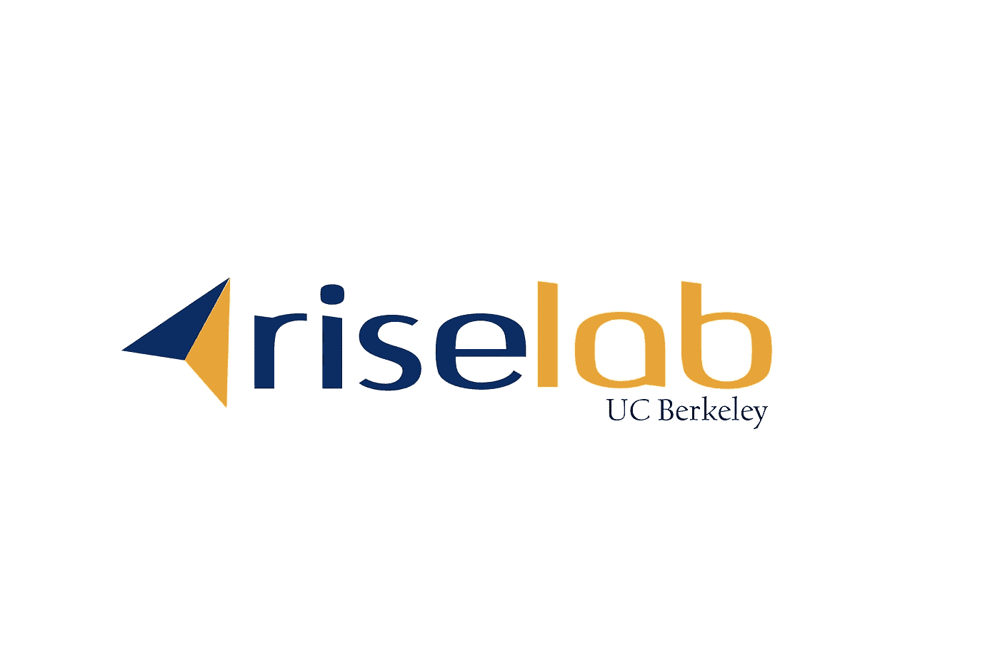

# Capital One 加入加州大学伯克利分校 RISELab 的创始赞助商

> 原文：<https://medium.com/capital-one-tech/capital-one-joins-founding-sponsors-of-riselab-at-uc-berkeley-32816ab59723?source=collection_archive---------4----------------------->

> RISELab 的使命是使机器能够根据实时数据和周围环境快速采取智能行动。

作者[斯蒂芬·罗曼诺夫](https://www.linkedin.com/in/stephen-romanoff-b648733/)

作为一家从根本上以数据为驱动力的公司，Capital One 几十年来一直利用从数据中获得的洞察力为我们的客户提供满足其不同需求的金融产品。现在，我们正在进入一个以大数据技术和云规模为基础的数据和计算新时代，其特征是大/快速数据、自动化智能决策和整体安全性。

这些技术的融合可以释放无数新的机会，实时利用数据和环境来帮助我们的客户改善他们的金融生活。这一点至关重要，因为我们正日益走向一个未来，银行业将更加实时、数字化，并能够更好地预测客户需求。

正是这种专注促使 Capital One 加入了加州大学伯克利分校电气工程和计算机科学系一项新计划的发起者，即 [RISELab](https://rise.cs.berkeley.edu/) 。在未来五年，RISELab 将专注于开发一个安全的实时决策平台，包括工具和算法，以实现对实时数据的快速自动化决策。RISELab 建立在伯克利非常成功的 [AMPLab](https://amplab.cs.berkeley.edu/) 的模型上，该模型开发了基本的开源大数据功能，包括 [Apache Spark](http://spark.apache.org/) 、 [Apache Mesos](http://mesos.apache.org/) 和 [Alluxio](http://www.alluxio.org/) 。

RISELab 的使命——通过高度自动化实现更好、更安全的实时决策——及其对元数据和上下文数据的关注，这是实现其他组件的基础；支持速度和规模的高级计算框架；基于实时数据的机器学习的重大进展:和强大的端到端安全性—可以带来跨行业的突破性客户体验。

1 月 11 日至 13 日，我们与加州大学伯克利分校 RISELab 的师生以及其他创始赞助商谷歌、亚马逊网络服务、微软、通用电气、英特尔、IBM、爱立信、VMWare、华为和蚂蚁金服一起启动了 RISELab 计划。

在演示和讨论中，我们了解了实验室的战略、目标和技术细节。以下是该实验室将开展的激动人心的项目的几个亮点:

[Ground](https://rise.cs.berkeley.edu/projects/ground/) 是一个数据上下文服务，它能够以一种集中的、不可知的方式管理关于数据的所有数据。该项目的观点是将时间和行为背景添加到传统元数据中，这提供了一个机会，可以更好地利用这些背景数据，以补充人们使用数据的方式。作为一家数据驱动的公司，Ground 对 Capital One 尤为重要，我们已经开始与 RISELab 在这一项目上进行合作。我们团队的高级数据工程师詹姆斯·道尔顿(James Dalton)正在与加州大学伯克利分校的研究人员合作开发 Ground，这是安全实时决策堆栈的基础组件。

[Clipper](https://rise.cs.berkeley.edu/projects/clipper/) 是一个模块化框架，用于优化和部署来自用户应用程序的跨机器学习框架的模型。随着 Capital One 在各种应用中对机器学习的使用越来越多，像 Clipper 这样的框架将使我们能够简化模型部署，并提高我们的性能和准确性。

Capital One 正在利用图形结构来更好地识别和发现不同数据元素之间的新关系，并帮助用例更好地预测客户需求。[随着图形的发展，Tegra](https://rise.cs.berkeley.edu/projects/tegra/) 能够高效地分析图形结构的数据。这种时间上下文提供了查询底层图中的变化的能力，并允许我们不仅探索某个时间点的关系，还探索它们是什么以及它们是如何演变的。这种回顾关系演变的能力是强大的。

随着 Capital One 继续采用云技术，我们一直在寻找新的方法来帮助我们的团队和用户选择最适合其特定工作负载的虚拟机。Paris 是一个建模框架，用于评估跨虚拟机甚至跨云提供商的工作负载性能。这种能力可以让我们更高效、更经济地迁移到云。

> 除了 RISELab 有前途的技术研发之外，Capital One 的赞助还进一步推动了我们对开源软件开发和湾区技术社区的承诺。通过与学术和行业合作伙伴合作，我们的目标是共同解决紧迫的技术挑战，从而在我们的行业和其他领域带来突破性的客户体验。

RISELab 的工作才刚刚开始。我鼓励你去看看实验室的项目和人员，并回来看看这个博客的更新。

要了解更多关于 Capital One 的 API、开源、社区活动和开发人员文化的信息，请访问我们的一站式开发人员门户网站 DevExchange。