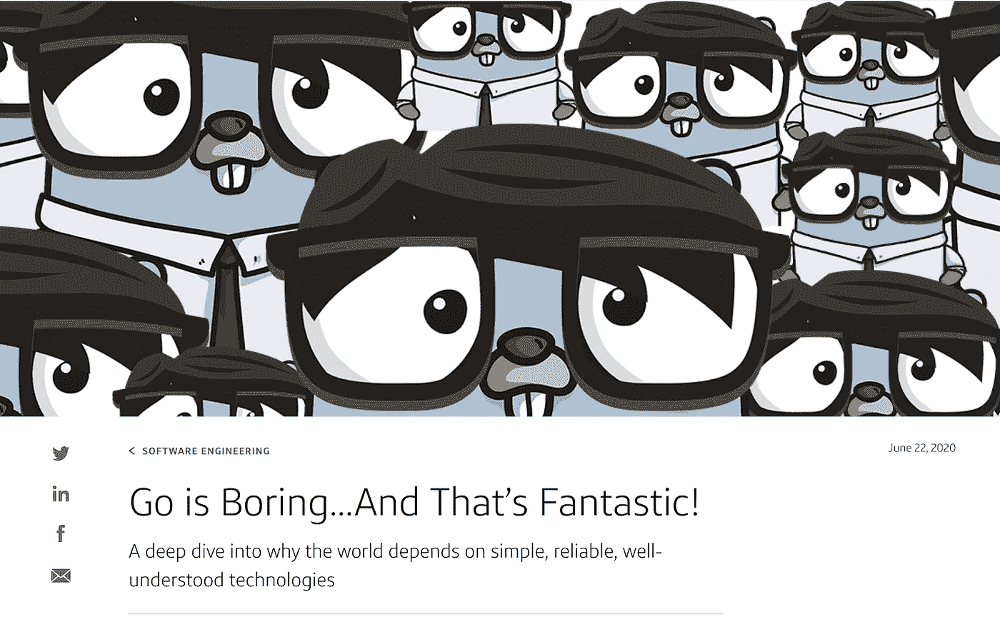
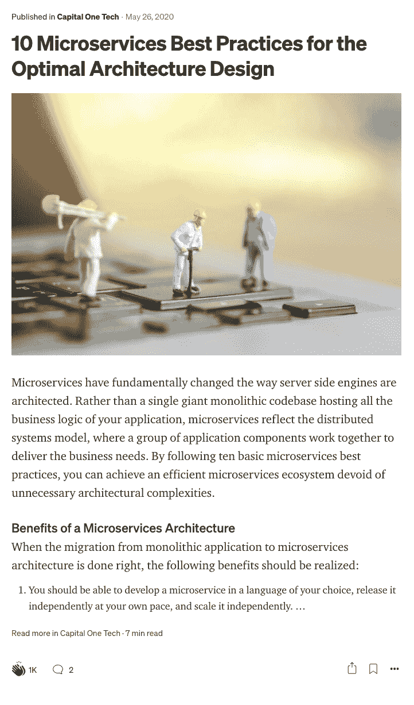
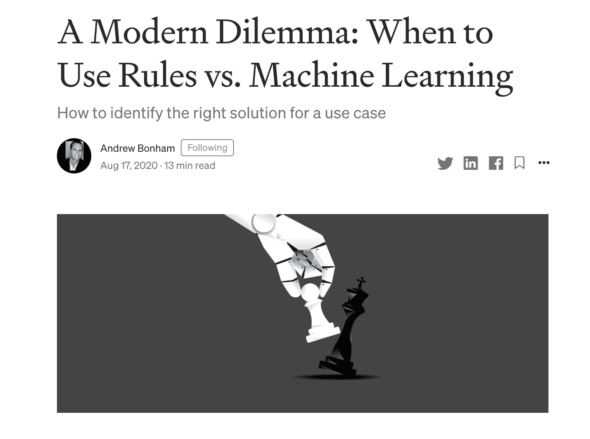
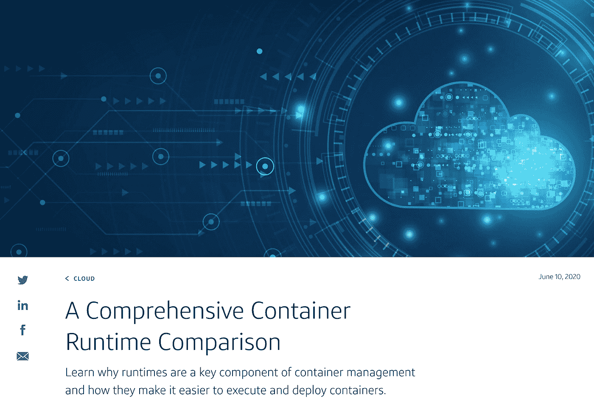
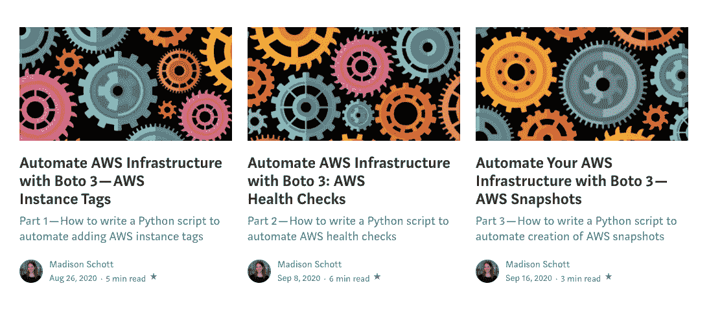

# 首都一号科技 2020 精英中的精英

> 原文：<https://medium.com/capital-one-tech/capital-one-tech-2020-best-of-the-best-30aa4615673a?source=collection_archive---------1----------------------->

## 2020 年顶级 Capital One 科技博客帖子的权威排名

2020 年我们发布了很多惊人的内容！当我们回头看时，我们知道事情很容易在混乱中丢失。因此，我们创建了一个小抄，记录了 2020 年以来我们最好的作品和最聪明的作家。尽情享受吧！

# 大多数视图

## 乔恩·博德纳的《围棋是无聊的，但却是奇妙的》

就像乔恩·博德纳说的，在围棋的例子中，思考这种编程语言的最好方法是思考它*没有的所有东西。毕竟，有时候少即是多。…除非你在计算文章浏览量。因为这个帖子在 2020 年火了。*

“冲啊”乔恩！

# 最推荐

## [最佳架构设计的 10 种微服务最佳实践](/capital-one-tech/10-microservices-best-practices-for-the-optimal-architecture-design-capital-one-de16abf2a232)

这种对微服务最佳实践的深入研究可以帮助您构建松散耦合、分布式和优化的微服务。10/10 推荐！

# 在社交网站上分享最多

## [现代困境:何时使用规则与机器学习](https://www.capitalone.com/tech/machine-learning/rules-vs-machine-learning/)作者[安迪·邦汉](https://pulse.kdc.capitalone.com/people/FPT216)

我们喜欢我们的作品与读者产生共鸣，他们点击我们内容上的社交分享按钮。我们分享最多的文章是 Andy Bonham 的[现代困境:何时使用规则与机器学习](https://www.capitalone.com/tech/machine-learning/rules-vs-machine-learning/)。

规则工程 vs .机器学习→有时候，不是关于一个 vs .另一个，而是它们如何一起使用。

# 来自谷歌搜索的大多数视图

## [综合容器运行时比较](https://www.capitalone.com/tech/cloud/container-runtime/)作者[埃文·贝克](https://pulse.kdc.capitalone.com/people/PQZ967)

据我们所知，没有谷歌找不到答案的工程问题…如果没有，试试 AskJeeves。

到 2020 年，你们中的很多人都会对容器运行时有疑问:它们是什么，它们如何使部署容器变得更容易，等等。埃文·贝克的文章拯救了这一天！

# 一个系列中的大多数文章

## 麦迪逊.肖特势如破竹。

她在最新的 Boto 3 系列中写了不是 1 篇，不是 2 篇，而是 3 篇文章——这是 2020 年创建的最大的文章系列！

*   [利用 Boto 3 — AWS 快照自动化您的 AWS 基础架构](https://www.capitalone.com/tech/cloud/python-boto3-automate-aws-health-checks/)
*   [使用 Boto 3 自动化 AWS 基础设施:AWS 运行状况检查](https://www.capitalone.com/tech/cloud/python-boto3-automate-aws-snapshots/)
*   [使用 Boto 3 自动化 AWS 基础设施— AWS 实例标签](https://www.capitalone.com/tech/cloud/python-boto3-automate-aws-instance-tags/)

# 按主题分类的最成功作品

要查看我们每个内容支柱中最受关注的部分——从人工智能和人工智能到云再到开源——请查看下面的链接。

*   **AI/ML**——[用虚拟卡号打击欺诈](https://www.capitalone.com/tech/machine-learning/fighting-fraud-with-vcns-and-financial-transaction-embedding/)——维多利亚·马丁斯
*   **云** — [刚刚通过](/p/eaaaabaf8c1c?source=post_stats_page-------------------------------------)的人对参加 AWS 解决方案架构师助理考试的建议，作者 Quinn Vissak
*   **文化**——[Scrum Master vs 敏捷交付领导——名字有什么意义？克里斯蒂娜·默托](https://www.capitalone.com/tech/culture/reimagining-agile-delivery-lead-vs-scrum-master-role-at-capital-one-tech/)
*   **开源** — [如何保持合规性—以 Kubernetes](https://www.capitalone.com/tech/open-source/compliance-at-the-speed-of-kubernetes/) 的速度，作者 Darien Ford
*   软件工程是无聊的……这是乔恩·博德纳的精彩作品
*   **数据** — [AWS Glue:潜力巨大的 ETL 解决方案](/capital-one-tech/aws-glue-an-etl-solution-with-huge-potential-91a04a2a0712)Ariel Diamond
*   **DevOps** — [最佳架构设计的 10 项微服务最佳实践](/p/de16abf2a232?source=post_stats_page-------------------------------------)作者 Sandeep Jandhyala
*   **移动** — [颤动:使用深板阻挡](/p/733a73edc4da?source=post_stats_page-------------------------------------)更好的导航
*   Web 工程—[Ege er can 的 React](/p/27f8fe409934?source=post_stats_page-------------------------------------) 数据可视化库比较

再次祝贺我们所有的 2020 作家，特别大声喊出来，感谢你们所有人，我们忠实的读者。我们迫不及待地想向你展示我们在 2021 年写的东西，敬请关注 Capital One Tech 的更多内容！

*披露声明:2021 首创一号。观点是作者个人的观点。除非本帖中另有说明，否则 Capital One 不隶属于所提及的任何公司，也不被这些公司认可。使用或展示的所有商标和其他知识产权是其各自所有者的财产。*