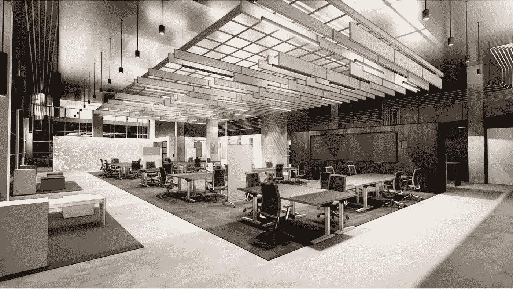

# Capital One 在马里兰大学推出了新的技术孵化器，以促进人工智能和机器学习

> 原文：<https://medium.com/capital-one-tech/capital-one-unveils-new-technology-incubator-at-the-university-of-maryland-to-foster-ai-and-machine-72daa86aad2b?source=collection_archive---------1----------------------->

我热爱在马里兰大学(UMD)读本科的时光，在 Capital One 担任零售银行首席信息官的工作中，最大的好处之一就是我可以与母校密切合作，帮助确保我们为学校未来的领导者提供机会。

因此，今天，我非常荣幸能够在 UMD 校园为第一资本的最新科技孵化器揭幕。该科技孵化器扩展了我们与 UMD 的长期关系，是在该大学和大华盛顿地区投资机器学习和数据分析的更广泛承诺和合作伙伴关系的一部分。

在 Capital One，我们认为银行业的未来将由智能、实时的体验驱动，其中许多体验是通过机器学习实现的——不断主动地在后台代表客户工作，并关注他们的财务状况。从更有效地预测欺诈，到更容易地取消那些你忘记的定期订阅，到更自然、更无缝地与你的银行互动，机器学习有助于实现这一切，等等。

我们通过机器学习以负责任、公平、管理良好和以人为本的方式继续提供变革性客户体验的能力取决于我们雇用和培养优秀人才的能力。为了吸引优秀人才，我们致力于确保我们的公司和我们运营的社区提供一个多元化、前沿和包容的环境。还有什么地方比在我们自己的后院与世界一流大学合作更能发现、培养和支持这样的人才呢？

科技孵化器位于学校响尾蛇车库的 UMD 探索区，这是 UMD 酒店后面的一个多功能开发空间。在那里，学生实习生将把课堂学习应用到现实世界的问题和数据科学和机器学习等领域的经验中。我们还将派出一些最优秀的技术助理来指导学生，并在与 Capital One 的研究和业务用例相关的关键项目上携手合作。

我们的空间设计旨在最大限度地发挥协作和创造力，让学习变得流畅而灵活，这一设计反映了 Capital One 在我们所有办公室采用的更广泛的工作场所理念。科技孵化器的一个重点是物理设计体验墙(Physical Design Experience Wall)，它将展示漂亮的可视化效果以及数据驱动的实验和演示。它的目的是为研究人员的工作提供一个平台，突出他们令人兴奋的项目，并作为机器学习中使用的抽象概念和目睹工作的物理经验之间的媒介，以示庆祝。

科技孵化器不仅有助于推动 Capital One 的研究和创新，也有助于推动大华盛顿地区的研究和创新。过去几年，该地区的大学和附属研究实验室在研发方面投入了大量资金，因此该地区的数字技术工作者数量居全国第三位。我们希望，科技孵化器不仅能推动该领域世界级科技人才的强劲增长和成长，我们这个领域的创新者还能帮助开发尖端技术，使该地区进一步成为全球科技目的地。

位于 UMD 的科技孵化器将加入越来越多的大学实验室合作行列，包括伊利诺伊大学香槟分校的伊利诺伊州数字校园实验室，以及我们对 T2 大学伯克利分校 RISELab 的创始支持。随着企业不断寻找具有变革潜力的新领域，特别是在数据分析、人工智能、机器学习和网络安全等领域，与主要高等教育机构建立牢固的关系和合作伙伴关系可以培养企业的创新、人才和增长欲望。

我们相信，UMD 的科技孵化器将成为这些努力的沃土，并将进一步发展 Capital One 的尖端技术，使其既服务于客户，也赋予客户权能，并改善客户的财务状况。

*披露声明:以上观点均为作者观点。除非本文另有说明，否则 Capital One 并不附属于任何上述公司，亦未获其背书。所使用或展示的所有商标和其他知识产权均为其各自所有者的所有权。本文为 2018 年首创。*