# 胶囊神经网络-一组嵌套的神经层

> 原文：<https://medium.com/edureka/capsule-networks-d7acd437c9e?source=collection_archive---------0----------------------->

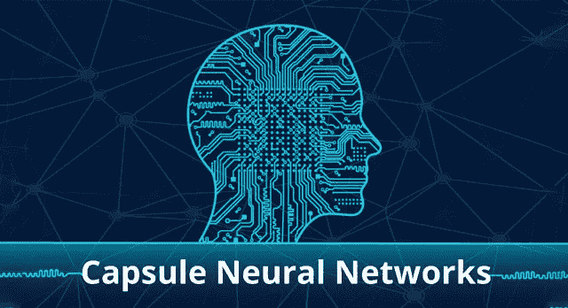

Capsule Neural Networks — Edureka

什么是胶囊网络？它基本上是一组嵌套神经层的网络。

为了更好地理解胶囊网络，我建议您在开始阅读本文之前先阅读下面的文章:

*   [*单层感知器*](/edureka/perceptron-learning-algorithm-d30e8b99b156)
*   [*神经网络教程*](/edureka/neural-network-tutorial-2a46b22394c9)
*   [*反向传播*](/edureka/backpropagation-bd2cf8fdde81)

我假设，你们知道卷积神经网络(CNN)。在这里，我将给你一个同样的小介绍，这样我可以讨论 CNN 的局限性。

卷积神经网络，基本上是各层人工神经元的堆叠，用于计算机视觉。下面，我提到了这些层:

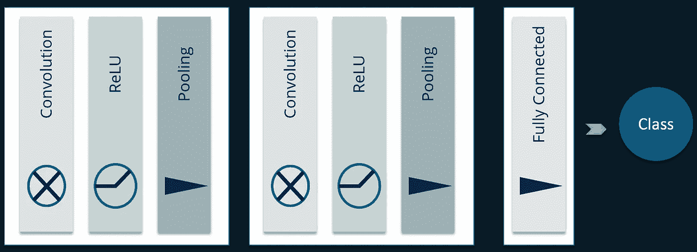

## **卷积层:**

当我们使用前馈神经网络(多层感知器)进行图像分类时，有许多挑战。最令人沮丧的挑战是，它引入了许多参数，考虑 CNN 上的视频教程。

为了克服这个挑战 ***卷积层*** 被引入。假设在空间上靠得更近的像素在形成感兴趣的特定特征时将比图像对角上的像素“合作”得多。此外，如果在定义图像的标签时发现某个特定的(较小的)特征非常重要，那么如果该特征在图像中的任何位置都存在，则该特征也同样重要，而与位置无关。

## **热卢层:**

整流线性单位(ReLU)变换函数仅在输入高于某个量时激活节点，而输入低于零时，输出为零，但当输入高于某个阈值时，它与因变量具有线性关系。

*   在这一层中，我们从过滤后的图像中移除所有负值并用零来代替
*   这样做是为了避免这些值的总和为零

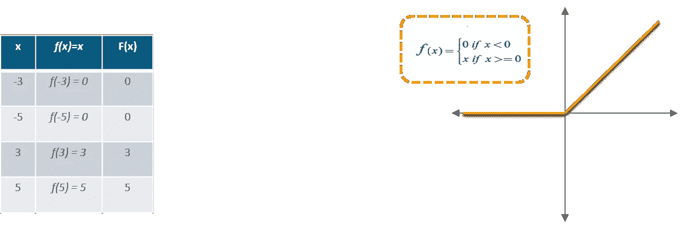

## **汇集层:**

这用于执行缩减像素采样，缩减像素采样会消耗较小且(通常)不相交的图像块，并将它们聚合为单个值。聚合有几种可能的方案——最流行的是 ***Max-Pooling*** ，其中取每个块内的最大像素值。它使网络对输入图像中的小变换、扭曲和平移不变(输入中的小扭曲不会改变池的输出，因为我们在局部邻域中取最大值/平均值)。

## **全连通层:**

这一层将计算班级分数，其中每个数字对应一个班级分数。与普通神经网络一样，顾名思义，这一层中的每个神经元都将连接到前一卷中的所有神经元。简而言之，它执行最后的分类。

> **注意:** [这个模型的训练是通过反向传播来完成的，所以可以查看这篇关于反向传播的单独文章。](/edureka/backpropagation-bd2cf8fdde81)

通过这种方式，ConvNets 将原始图像从原始像素值逐层转换为最终的类得分。

这是对卷积神经网络的一个非常简短的介绍，我仍然建议你看看我在这篇文章中嵌入的 CNN 视频。

我现在将讨论卷积神经网络的一些限制。

# 卷积神经网络的局限性

好吧，让我用一个类比来解释这个。

假设有一个人，他的眼睛可以察觉各种图像的特征。让我们以人脸为例。所以，这个不幸的家伙可以识别各种特征，比如眼睛，鼻子等等。但是，不能识别特征之间的空间关系(视角、大小、方向)。举个例子，下面这张图可能会骗过那个家伙，把它归类为一张很好的人脸素描。

这也是卷积神经网络的问题。CNN 擅长检测特征，但会错误地激活神经元进行人脸检测。这是因为它在探索要素之间的空间关系时效率较低。

简单的 CNN 模型可以正确地提取鼻子、眼睛和嘴巴的特征，但是会错误地激活用于面部检测的神经元。在没有意识到空间方向和大小的不匹配的情况下，用于面部检测的激活将会太高。

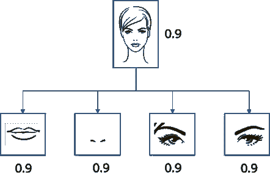

这个限制是因为最大池层。

CNN 中的最大池处理平移方差。即使一个特征被轻微移动，如果它仍然在池窗口内，它仍然可以被检测到。然而，这种方法只保留了 max 特性(最主要的),而丢弃了其他特性。

所以，上图这张脸会被归类为正常脸。池层也增加了这种类型的不变性。

这从来都不是池层的意图。汇集应该做的是引入位置，方向，比例不变。

实际上，这个池层增加了各种各样的位置不变性。正如你在上面的图表中看到的，这导致了正确检测人脸的困境。

让我们看看**杰弗里·辛顿提出的解决方案是什么。**

## 如何解决这个问题？

现在，我们假设每个神经元都包含特征的可能性和属性。例如，它输出一个包含[可能性，方向，大小]的向量。利用该空间信息，我们可以检测鼻子、眼睛和耳朵特征之间的方向和大小的不一致，并因此输出低得多的面部检测激活。

在 Geoffrey Hinton 发表的论文中，这些类型的神经元被称为胶囊。这些胶囊输出一个矢量，而不是一个单一的规模值。

让我来介绍一下什么是胶囊网络。

# 什么是胶囊网络？

囊基本上是一套嵌套的神经层。胶囊内神经元的状态捕捉图像内一个实体的各种属性，如姿势(位置、大小、方向)、变形、速度、纹理等。

胶囊被训练来捕捉特征及其变体的可能性，而不是捕捉具有特定变体的特征。因此，胶囊的目的不仅是检测特征，而且是训练模型来学习变体。

使得相同的胶囊可以检测具有不同方向(例如，顺时针旋转)的相同对象类别:

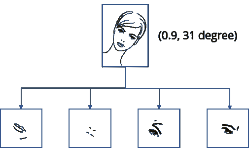

我们可以说它基于等方差而非不变性。

## **不变性:**

不变性是对特征的检测，与变体无关。例如，鼻子检测神经元检测鼻子，而不考虑方向。

## **等方差:**

等方差是对可以相互变换的对象的检测(例如，检测不同方向的人脸)。直观地，胶囊网络检测到脸部被向右旋转 31(等变)，而不是意识到脸部匹配旋转 31 的变型。通过迫使模型学习胶囊中的特征变体，我们可以用更少的训练数据更有效地推断可能的变体。此外，我们可以更有效地拒绝对手。

胶囊输出一个矢量来表示实体的存在。向量的方向代表实体的属性。

该向量被发送给神经网络中所有可能的双亲。对于每个可能的亲本，胶囊可以找到一个预测向量。预测向量是基于乘以其自身的权重和权重矩阵来计算的。无论哪一个亲本具有最大的标量预测矢量积，都会增加胶囊结合。其余的父母减少他们的债券。这被称为 ***协议路由*** 。

这无疑是比最大池更好的方法，在最大池中，路由基于在较低层中检测到的最强特征。

在这之后有一个挤压功能被添加。这样做是为了引入非线性。这个挤压函数应用于每个胶囊的矢量输出。

现在让我告诉你，胶囊网络是如何工作的。

# 胶囊网络是如何工作的？

让我们后退一步。在全连接网络中，每个神经元的输出是输入的加权和。

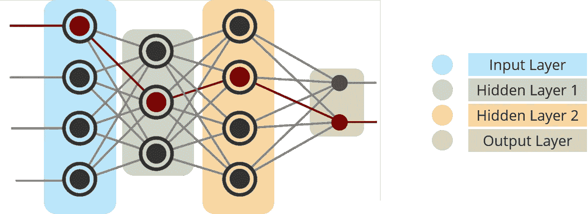

现在，让我们看看在胶囊网络中会发生什么。

# 胶囊神经网络:

让我们考虑一个胶囊神经网络，其中“ui”是下面一层中胶囊“I”的活动向量。

**步骤 1:** 将变换矩阵 Wij 应用于前一层的胶囊输出 ui。例如，对于 m×k 矩阵，我们将 k-D ui 转换为 m-D u^j|i. ((m×k) × (k×1) = m×1)。

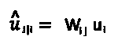

它是胶囊“I”对上述胶囊“j”输出的预测(**投票**)。‘VJ’是上一层中胶囊‘j’的活动向量

**步骤 2:** 计算具有权重 cij 的加权和 sj。cij 是耦合系数。这些系数的总和等于 1。这是我们之前讨论过的影响胶囊组关系的实际参数。

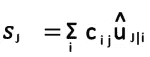

**第三步:**在卷积神经网络中，我们使用 ReLU 函数。这里，我们将应用一个挤压函数在 0 和单位长度之间缩放向量。它将小向量收缩为零，将长向量收缩为单位向量。因此，每个胶囊的可能性被限制在零和一之间。

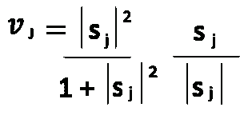

它是来自胶囊“I”对上述胶囊“j”的输出的预测(**投票**)。如果活动向量与预测向量具有密切的相似性，则我们推断胶囊‘I’与胶囊‘j’高度相关。(比如鼻囊和面囊高度相关。)使用预测和活动向量的标量积来测量这种相似性。因此，相似性同时考虑了可能性和特征属性。(而不仅仅是神经元中的可能性)。

**步骤 4:** 计算相关性分数‘bij’。它将是活动向量和预测向量的点积。耦合系数 cij 计算为 bij 的 softmax:

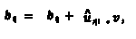

耦合系数 cij 计算为 bij 的 softmax。

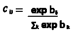

该 bij 在多次迭代中迭代更新。

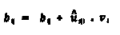

这被称为 ***协议路由*** 。

下图是一个例子:

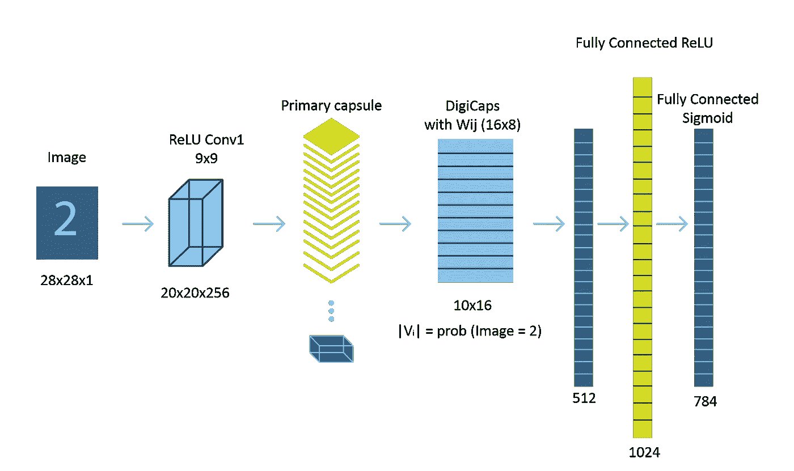

*这就把我们带到了“胶囊神经网络”这篇文章的结尾。我希望这篇文章对你有所帮助，并增加了你的知识价值。*

如果你想查看更多关于人工智能、DevOps、道德黑客等市场最热门技术的文章，那么你可以参考 [Edureka 的官方网站。](https://www.edureka.co/blog/?utm_source=medium&utm_medium=content-link&utm_campaign=capsule-networks)

请留意本系列中的其他文章，它们将解释深度学习的各个其他方面。

> 1. [TensorFlow 教程](/edureka/tensorflow-tutorial-ba142ae96bca)
> 
> 2. [PyTorch 教程](/edureka/pytorch-tutorial-9971d66f6893)
> 
> 3.[感知器学习算法](/edureka/perceptron-learning-algorithm-d30e8b99b156)
> 
> 4.[神经网络教程](/edureka/neural-network-tutorial-2a46b22394c9)
> 
> 5.[什么是反向传播？](/edureka/backpropagation-bd2cf8fdde81)
> 
> 6.[卷积神经网络](/edureka/convolutional-neural-network-3f2c5b9c4778)
> 
> 7.[tensor flow 中的物体检测](/edureka/tensorflow-object-detection-tutorial-8d6942e73adc)
> 
> 8.[递归神经网络](/edureka/recurrent-neural-networks-df945afd7441)
> 
> 9.[自动编码器教程](/edureka/autoencoders-tutorial-cfdcebdefe37)
> 
> 10.[受限玻尔兹曼机教程](/edureka/restricted-boltzmann-machine-tutorial-991ae688c154)
> 
> 11. [PyTorch vs TensorFlow](/edureka/pytorch-vs-tensorflow-252fc6675dd7)
> 
> 12.[用 Python 进行深度学习](/edureka/deep-learning-with-python-2adbf6e9437d)
> 
> 13.[人工智能教程](/edureka/artificial-intelligence-tutorial-4257c66f5bb1)
> 
> 14.[张量流图像分类](/edureka/tensorflow-image-classification-19b63b7bfd95)
> 
> 15.[人工智能应用](/edureka/artificial-intelligence-applications-7b93b91150e3)
> 
> 16.[如何成为一名人工智能工程师？](/edureka/become-artificial-intelligence-engineer-5ac2ede99907)
> 
> 17.[问学习](/edureka/q-learning-592524c3ecfc)
> 
> 18. [Apriori 算法](/edureka/apriori-algorithm-d7cc648d4f1e)
> 
> 19.[马尔可夫链与 Python](/edureka/introduction-to-markov-chains-c6cb4bcd5723)
> 
> 20.[人工智能算法](/edureka/artificial-intelligence-algorithms-fad283a0d8e2)
> 
> 21.[机器学习的最佳笔记本电脑](/edureka/best-laptop-for-machine-learning-a4a5f8ba5b)
> 
> 22.[12 大人工智能工具](/edureka/top-artificial-intelligence-tools-36418e47bf2a)
> 
> 23.[人工智能(AI)面试问题](/edureka/artificial-intelligence-interview-questions-872d85387b19)
> 
> 24. [Theano vs TensorFlow](/edureka/theano-vs-tensorflow-15f30216b3bc)
> 
> 25.[什么是神经网络？](/edureka/what-is-a-neural-network-56ae7338b92d)
> 
> 26.[模式识别](/edureka/pattern-recognition-5e2d30ab68b9)
> 
> 27.[人工智能中的阿尔法贝塔剪枝](/edureka/alpha-beta-pruning-in-ai-b47ee5500f9a)

*原载于 2017 年 12 月 14 日*[*www.edureka.co*](https://www.edureka.co/blog/capsule-networks/)*。*