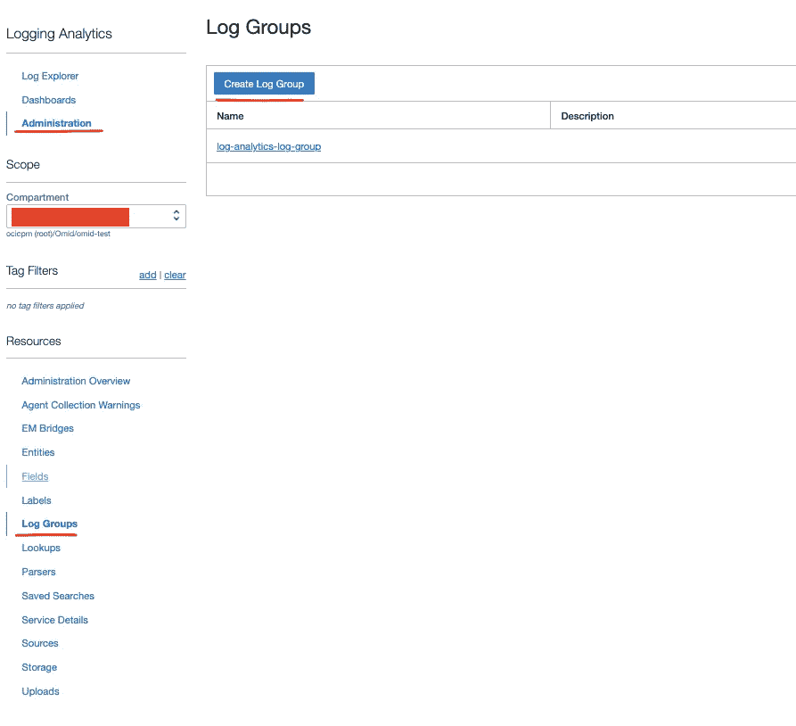

# 捕获和分析 OCI 的 WebLogic 日志

> 原文：<https://medium.com/oracledevs/capture-and-analyse-weblogic-logs-in-oci-2d1e5aeaa544?source=collection_archive---------0----------------------->

# 介绍

将 WebLogic 域迁移到 Oracle 云基础架构(在计算实例上使用 JCS、WebLogic marketplace 或自定义 WebLogic 域)后，运营团队需要访问 WebLogic 日志文件来调查正在发生的问题。

我们可以使用 OCI 日志服务集中所有托管服务器日志文件，并使用 OCI 日志分析来查找日志中的任何特定模式。

在本文中，我将解释如何为 WebLogic 域配置 OCI 日志记录，并在 OCI 日志分析中摄取日志以进行分析。

> 我只想强调，在这篇文章中，我将只涉及 OCI 境内的实例。如果您想从内部或其他云提供商的任何主机获取日志，您需要使用[管理代理](https://docs.oracle.com/en-us/iaas/management-agents/index.html)，我将在以后的文章中介绍。

# 体系结构

这是高级架构图:


在此架构中，OCI 统一监控代理收集和解析(如果需要)计算实例中的自定义日志，并将它们发送到 OCI 日志记录服务。您可以在 OCI 日志中的日志条目内进行简单的搜索，但如果您需要企业级日志分析解决方案，您应该使用 OCI 服务连接器中心将日志文件传输到 OCI 日志分析。

在下一部分，我将详细解释如何在 OCI 实现这个解决方案。

# 履行

以下是在您的 OCI 租赁中实施该解决方案需要遵循的步骤(*我假设您已经在 OCI 计算实例上配置了网络资源并安装和部署了您的 WebLogic 集群*)。

1.  **代理安装**

要将应用程序中的事件接收到自定义日志中，可以安装基于 Oracle fluentd 的代理。这个代理允许您精确地控制想要收集哪些日志、如何解析它们等等。

Oracle Cloud infra structure Logging 提供了一种简单的机制(**代理配置**)来为一组受支持的操作系统启用和管理代理。**代理配置**为您提供集中体验，轻松配置您希望在整个主机群中接收的自定义日志。

根据实例的类型(新 OCI 实例、现有 OCI 实例或从定制映像创建的实例)，您应该按照不同的步骤安装和配置监控代理(请按照[代理管理文档)](https://docs.oracle.com/en-us/iaas/Content/Logging/Concepts/agent_management.htm)。

在计算实例上安装和配置代理后，您可以使用以下命令检查实例的状态。

```
sudo systemctl status unified-monitoring-agent
```

> Y *您可以在供应新计算实例时启用监控代理。只需在 OCI 控制台的“创建计算实例”屏幕中选择“显示高级选项”，然后选择“Oracle 云代理”选项卡。然后，您可以启用“自定义日志监控”插件。*


> 此外，您可以通过导航到“实例详细信息”页面(在 OCI 控制台中)并选择“Oracle 云代理”选项卡(此插件默认为计算实例启用)，为现有计算实例启用“自定义日志监视”插件。


> 请记住，监视代理不仅仅是日志收集器代理。它用于收集性能指标、安装操作系统更新和执行其他实例管理任务。

**2。代理配置和日志服务配置**

代理安装后，我们应该创建代理配置并选择以下信息:

*   要从哪些主机收集日志。
*   确切地说，您希望从这些主机接收哪些日志。
*   日志组/日志目标。

> *日志组*是组织日志的逻辑容器。日志必须始终在日志组内。您必须创建一个日志组来启用日志。

在创建代理配置之前，您应该创建一个 OCI 动态组，其中包括您要从中收集日志所有 OCI 实例。

要创建动态组，请导航到 OCI 控制台中的“身份与安全”->“动态组”，并使用以下匹配规则创建新的动态组:

```
ANY {instance.id = 'ocid1.instance.<region>.<location>.<unique_ID>', 
instance.compartment.id = 'ocid1.compartment.<region>..<unique_ID>'}
```

您可以在匹配规则中指定所有 WebLogic 实例的实例 OCID 和隔离专区 OCID。

```
All {instance.compartment.id = 'ocid1.compartment.<region>..<unique_ID>'}
```

或者简单地指定包括所有 WebLogic 实例隔离专区 OCID(如果该隔离专区仅包括 WebLogic 实例)。


此外，您应该创建一个策略，向您之前创建的动态组授予在租用中使用日志内容的权限。

要创建策略，请在 OCI 控制台中导航到“身份与安全”->“策略”，并使用以下语句创建新策略:

```
allow dynamic-group <dynamic_group_name> to use log-content in tenancy
```


创建策略和动态组后，您应该创建日志组和自定义日志。您应该导航到 OCI 控制台内的“可观察性和管理”->“日志组”,创建新的日志组并填充日志组的隔离专区、名称和描述:


然后选择日志菜单项，创建新的自定义日志并填充隔离专区、自定义日志名称和日志组:


现在，我们可以创建代理配置。您应该导航到 OCI 控制台中的观察性和管理->代理配置，在特定隔离专区中创建新的代理配置，并填充您在上一步中创建的代理名称、描述、隔离专区、动态组和 WebLogic 日志位置(可以在路径中使用通配符):


> 默认情况下，WebLogic server 日志写入{ Domain _ Home }/servers/{ Server _ Name }/logs/{ Server _ Name }内部。日志文件。但是您可以在 WebLogic 控制台中更改此路径。我想我们在这篇文章中使用默认文件路径。

最后，您应该登录到所有 WebLogic 计算实例，并使用以下命令重新启动代理:

```
sudo systemctl stop unified-monitoring-agent
sudo systemctl start unified-monitoring-agent
```

几分钟后，打开您在上述步骤中创建的自定义日志，您可以在浏览日志屏幕中看到 WebLogic 日志。


**3。配置连接器集线器**

Service Connector Hub 协调 Oracle 云基础架构中服务之间的数据移动。

使用服务连接器移动数据。服务连接器指定包含要移动的数据、可选任务的源服务，以及任务完成时用于传递数据的目标服务。可选任务可以是处理源中数据的函数任务，也可以是过滤源中日志数据的日志过滤器任务。


在这一步中，我们将创建一个服务连接器，将数据从 OCI 测井服务发送到 OCI 测井分析。

要创建服务连接器，请在 OCI 控制台中导航到观察性和管理->日志记录->服务连接器，创建新的服务连接器并填充名称、描述、隔离专区、源和目标(在我们的场景中，源是日志记录服务，目标是日志记录分析)

此外，您应该为日志服务提供日志组和自定义日志，并为日志分析提供日志组(我们应该首先创建这个日志组，我将在下一节中解释如何完成)。

我们还可以添加日志过滤任务(从源中过滤日志文件)和配置功能任务，以便在发送到目标之前处理数据(在我们的场景中，我将忽略这些配置)。


**4。配置日志分析**

Oracle 云基础设施(OCI)日志分析服务是一个高度可扩展、可靠的实时日志分析解决方案。日志分析可自动从任何内部或云资源收集历史和实时日志。

在最后一部分中，我们将配置日志分析，并在日志浏览器中创建简单的 WebLogic 日志报告。

首先，您应该在您所在的地区启用日志分析服务。导航到可观察性和管理->日志分析，并选择“开始使用日志分析”。


如果您不是 OCI 管理员，您需要一些权限来使用日志分析服务(请参考日志分析文档)。

现在，您可以导航到日志浏览器页面。首先，我们需要为日志分析服务创建日志组。选择“管理”菜单，然后在“管理”页面中选择“日志组”，并为特定隔离专区中的日志分析创建新的日志组(在步骤 3 中创建 service connector 时，您需要使用此日志组)。



最后，导航到日志浏览器，在字段的选项卡中选择日志源，然后选择“OCI 统一模式日志”。


在可视化选项卡中，选择“记录”可视化。此外，您可以添加和删除显示字段。


现在，您可以在日志浏览器页面中看到 WebLogic 日志。


您可以在日志内容中搜索或创建聚类可视化(聚类使用机器学习来识别日志记录的模式，然后对具有相似模式的日志进行分组)来删除相似的日志条目。


For example search for “Start” word in all log contents


Create Cluster Visualisation


In Cluster mode, will display result in groups of similar records

OCI 日志分析是一个全面的产品，它超出了本文的范围(您可以参考产品文档以获得更多信息)。

我希望这篇文章能帮助你在中央管理控制台下管理你的应用程序日志。

# 参考

*   [OCI 测井服务](https://docs.oracle.com/en-us/iaas/Content/Logging/Concepts/loggingoverview.htm)
*   [OCI 测井分析](https://docs.oracle.com/en-us/iaas/logging-analytics/index.html)
*   [OCI 服务连接器集线器](https://docs.oracle.com/en-us/iaas/Content/service-connector-hub/overview.htm)