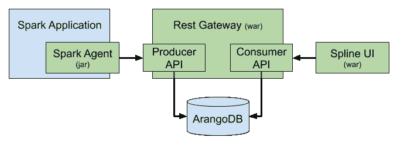
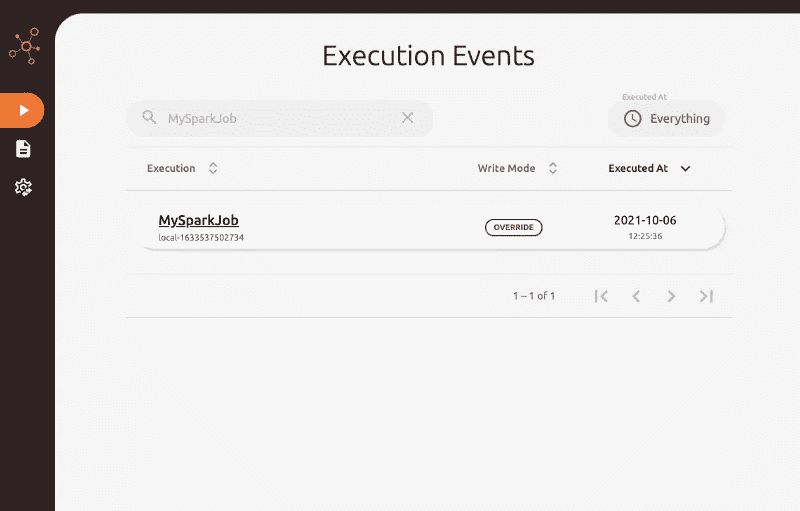
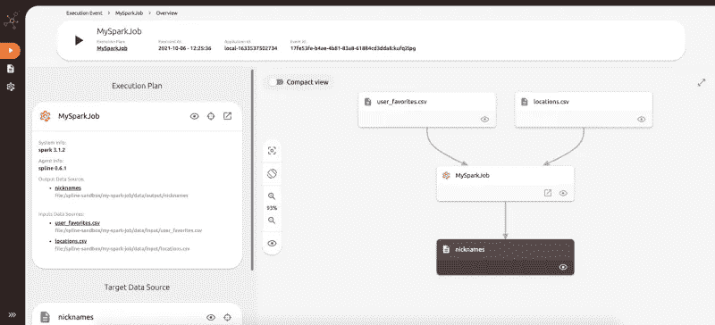
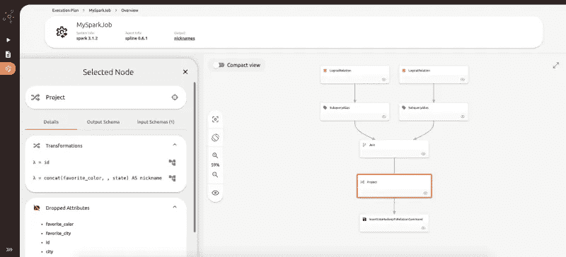

# 用样条捕捉和显示数据转换

> 原文：<https://medium.com/capital-one-tech/capturing-displaying-data-transformations-with-spline-f1b714960682?source=collection_archive---------5----------------------->

## 这个开源工具如何帮助自动跟踪和显示来自 Apache Spark 应用程序的数据血统


作为一名数据工程师，我经常看到新的团队或团队成员被要求支持现有的数据模型，其中缺少关于输入、输出和所用数据移动的文档。这些输入、输出和移动共同构成了**数据谱系**，它是一组数据的历史，包括其来源、转换和随时间的移动。

尽管可以手动定义数据沿袭，但手动捕获数据沿袭(尤其是当应用程序的逻辑随时间变化时)可能非常耗时，并且容易出现人为错误。作为一名数据工程师，能够将数据谱系作为应用程序流的正常部分来捕获，并能够以易于理解的格式显示数据谱系以用于文档目的，这将是非常有益的。幸运的是，我在 Capital One 的一个团队中工作，该团队的主要职能是支持跨多个组织的现有数据模型，并与企业标准保持同步。我们在 Spline 中为我们的用例找到了一个很好的解决方案，Spline 是一个开源工具，用于自动跟踪和显示来自 Apache Spark 应用程序的数据谱系。Spline 由 ABSA OSS 维护，你可以在 https://github.com/AbsaOSS 的[阅读更多内容。](https://github.com/AbsaOSS)

在这篇博客中，我将讲述:

*   定义、捕获和显示数据沿袭的好处
*   使用 PySpark 生成数据
*   用样条捕捉数据血统
*   用样条线显示数据沿袭

# 定义、捕获和显示数据沿袭的好处

对生成和分析数据感兴趣的组织通常会**将**数据血统定义为应用程序和管道开发周期的一部分，即使是非正式的。然而，下面解释的**捕获**和**显示**数据谱系的额外步骤也有好处。

## 定义数据血统

定义数据沿袭可以在开发应用程序或管道之前完成。这通过以下方式使组织受益:

*   支持根据输入包含的数据及其质量选择输入的能力
*   识别所有必须发生的转换并确认它们的有效性
*   设定对输出格式的期望以及如何在下游使用数据

在设计时做这项工作可以使组织在开发过程中避免麻烦，并且由于期望的明确定义，将促进与上游和下游合作伙伴的协作。

## 捕获数据沿袭

捕获数据沿袭对于确保在上一步中定义的转换和应用程序或管道实际执行的转换之间没有发生偏差非常重要。运行时捕获的数据沿袭还可以提供比设计时捕获的数据沿袭更多的信息，如记录计数和特定于分区的元数据。

## 显示数据沿袭

通过以可视格式显示信息，显示数据沿袭有助于理解数据的来源和移动。这些信息可以作为应用程序或管道的业务逻辑的文档。

最重要的是，对于高度管制行业中的组织，可能需要数据沿袭来满足法规要求

# 使用 Spline 捕获和显示数据沿袭

首先，让我们从基础开始，包括关键的 Spline 组件和设置您的 Spline 服务器。然后我们将运行一个示例 Spark 作业，并展示 Spline UI 是如何工作的。

## 样条元件简介



Diagram from Spline documentation at [https://absaoss.github.io/spline](https://absaoss.github.io/spline)

在上图中，取自样条曲线文档，绿框是样条曲线组件。让我们来看看它们是如何工作的。

*   **Spline Spark Agent**—Spline Spark Agent 作为 Spark 应用程序的依赖项导入。它将分析 Spark 作业的执行计划，以捕获数据沿袭。
*   **Spline Rest 网关**—Spline Rest 网关从 Spline Spark 代理接收数据沿袭，并将该信息保存在 ArangoDB 中。
*   **Spline UI**—Spline UI 可用于可视化所有存储的数据沿袭信息。

## 设置样条线服务器

我们将在[https://github.com/AbsaOSS/spline-getting-started](https://github.com/AbsaOSS/spline-getting-started)使用 ABSA OSS 提供的 Docker 镜像来创建我们的 Spline 服务器。

首先，你应该[安装 Docker](https://docs.docker.com/get-docker/) 。然后，创建并导航到一个沙盒目录来保存本教程的文件。

```
mkdir spline-sandbox
cd spline-sandbox
```

接下来，运行下面的来创建上图中的所有组件:

```
curl -O https://raw.githubusercontent.com/AbsaOSS/spline-getting-started/main/docker/docker-compose.yml

curl -O https://raw.githubusercontent.com/AbsaOSS/spline-getting-started/main/docker/.env

docker-compose up
```

现在，如果您导航到 [http://localhost:9090/](http://localhost:9090/) ，您将看到一些数据血统已经存在于您的数据库中。这是因为 docker-compose.yml 包含一个 spline-spark-agent 映像，它为您运行一些示例。

让我们使用 PySpark 创建并运行一个新的 Spark 作业。

## 用 PySpark 和 Spline 生成和捕获数据谱系

[PySpark](http://spark.apache.org/docs/latest/api/python/) 是一个允许开发者使用 Python 运行 Apache Spark 作业的工具。

通过运行以下命令设置 PySpark 环境:

```
# Install Python
brew install pythonpip install 'pyspark==3.1.2'# Create and navigate to a new directory
mkdir my-spark-job
cd my-spark-job# Create input and output directories, and files
mkdir -p data/input
mkdir -p data/output
touch my_spark_job.py
touch data/input/user_favorites.csv
touch data/input/locations.csv
```

接下来，创建一个模拟数据集，表示一些匿名用户最喜欢的颜色和最喜欢的城市。将这些内容添加到 user_favorites.csv:

```
id,favorite_color,favorite_city
1,blue,anchorage
2,red,denver
3,orange,mesa
4,yellow,bakersfield
5,purple,portland
```

然后，创建另一个包含位置的模拟数据集。将这些内容添加到 locations.csv:

```
id,city,state
1,bakersfield,california
2,portland,oregon
3,anchorage,alaska
4,mesa,arizona
5,denver,colorado
```

现在，让我们创建一个名为 MySparkJob 的 Spark 作业。在 MySparkJob 中，我们将使用上面的模拟数据集创建一个新的数据集，其中包含为匿名用户生成的昵称。将以下内容添加到 my_spark_job.py 中:

```
from pyspark.sql import SparkSession# Create SparkSession
spark = SparkSession.builder.appName("MySparkJob").getOrCreate()# Read user_favorites to DataFrame and create a temporary view
user_favorites = (
    spark.read.option("header", "true")
    .option("inferschema", "true")
    .csv("data/input/user_favorites.csv")
)
user_favorites.createOrReplaceTempView("user_favorites")# Read locations to DataFrame and create a temporary view
locations = (
    spark.read.option("header", "true")
    .option("inferschema", "true")
    .csv("data/input/locations.csv")
)
locations.createOrReplaceTempView("locations")# Join user_favorites and locations, and generate the nicknames
nicknames = spark.sql("""
SELECT
  user_favorites.id,
  CONCAT(
    favorite_color,
    ' ',
    state
  ) AS nickname
FROM user_favorites
JOIN locations
ON user_favorites.favorite_city = locations.city
""")# Write output and print final DataFrame to console
nicknames.write.mode("overwrite").csv("data/output/nicknames")
nicknames.show(20, False)
```

我在代码中提供了解释每个步骤的注释。请注意，Spline 只捕获写操作的数据沿袭。你可以在这里阅读更多关于这种行为的信息[。](https://github.com/AbsaOSS/spline-spark-agent#spark-features-coverage)

现在，让我们运行 Spark 作业，并将 Spline Spark 代理作为依赖项包括在内:

```
spark-submit \
  --packages za.co.absa.spline.agent.spark:spark-3.1-spline-agent-bundle_2.12:0.6.1 \
  --conf spark.sql.queryExecutionListeners=za.co.absa.spline.harvester.listener.SplineQueryExecutionListener \
  --conf spark.spline.producer.url=[http://localhost:8080/producer](http://localhost:8080/producer) \
  my_spark_job.py
```

如果查看该命令的输出，您会看到我们最终的数据帧如下所示:

```
+---+-----------------+
|id |nickname         |
+---+-----------------+
|1  |blue alaska      |
|2  |red colorado     |
|3  |orange arizona   |
|4  |yellow california|
|5  |purple oregon    |
+---+-----------------+
```

现在，让我们回到 [http://localhost:9090/](http://localhost:9090/) ，回顾 Spline 生成的数据谱系图。

## 用样条线显示数据沿袭



Home Page

在 Spline UI 的主页上，您将看到一个执行事件列表。搜索您刚刚运行的 Spark 作业，我们称之为 MySparkJob，并单击它。



Overview Page

您将到达一个概述页面，其中显示了输入、Spark 作业和输出。单击 MySparkJob 节点角上带箭头的框。



Details Page

您将到达 Spark 作业的详细信息页面。在这里，如果您单击一个节点，您将看到该特定操作的详细信息。例如，如果您单击底部的项目节点，您将会看到作为所执行的选择操作的结果而发生的转换。

如果您返回到主页，可以查看在构建 Spline 服务器的步骤中执行的其他示例 Spark 作业的详细信息。

# 资源

*   样条博客:【https://absaoss.github.io/spline 
*   https://github.com/AbsaOSS OSS GitHub 组织:[ABSA](https://github.com/AbsaOSS)
*   样条—入门:[https://github.com/AbsaOSS/spline-getting-started](https://github.com/AbsaOSS/spline-getting-started)

# 结论

既然您已经看到了 Spline 的实际应用，那么您应该能够避免支持现有数据模型的缺陷，因为现有数据模型缺少关于模型中使用的数据的输入、输出和移动的文档。

您现在还应该知道如何:

*   使用 PySpark 生成数据
*   用样条捕捉数据沿袭
*   用样条线显示数据沿袭

与所有开源项目一样，我鼓励您考虑为 Spline 做贡献。Spline 库位于 https://github.com/AbsaOSS[的 ABSA OSS GitHub 组织中，在那里你也可以阅读他们深入的文档。](https://github.com/AbsaOSS)

*披露声明:2021 首创一号。观点是作者个人的观点。除非本帖中另有说明，否则 Capital One 不隶属于所提及的任何公司，也不被这些公司认可。使用或展示的所有商标和其他知识产权是其各自所有者的财产。*

【https://www.capitalone.com】最初发表于[](https://www.capitalone.com/tech/software-engineering/spline-spark-data-lineage/)**。**