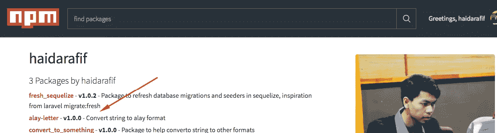

# Cara Buat Package Node js Sendiri

> 原文：<https://medium.easyread.co/cara-buat-package-node-js-sendiri-6c8b91f5c2cf?source=collection_archive---------0----------------------->


Photo by [Jared Sluyter](https://unsplash.com/photos/znw9Xs5I9ro?utm_source=unsplash&utm_medium=referral&utm_content=creditCopyText) on [Unsplash](https://unsplash.com/search/photos/creating?utm_source=unsplash&utm_medium=referral&utm_content=creditCopyText)

Selama proses *development* dengan *nodejs* , kita pasti tidak akan terlepas dari penggunaan **npm.**

**NPM** atau ***node package manager*** merupakan sebuah *tools* yang membantu kita untuk menggunakan *package-package* yang sudah dibuat oleh *developer* lain. Tujuannya ialah untuk mempermudah proses *development* aplikasi yang kita buat.
Tapi pernahkan kamu penasaran bagaimana mereka, para *developer* , bisa membuat *package-package* yang dapat membantu hidup kita sebagai *developer* ? Kalau penasaran, yuk kita buat *package* buatan tangan kita sendiri.

Selain coba-coba, tentunya dengan membuat *tools* yang dapat digunakan apalagi sampai membantu *developer* lain itu rasanya akan memberikan kepuasan diri kita sendiri. Seperti yang sudah saya singgung pada [artikel ini](https://medium.com/@haidarafifmaulana/seminggu-di-coding-bootcamp-ini-yang-saya-dapat-f73909b95533) . Bahwa salah satu cara kita sebagai *developer* mengontrol stress adalah dengan berkontribusi!

*Nah* , tahap pertama tentunya kita harus mempunyai akun di npm, [https://www.npmjs.com/](https://www.npmjs.com/) . Disini adalah tempat kita mem *publish* *package* yang kita buat.

[](https://www.npmjs.com/) [## npm

### npm is the package manager for javascript

www.npmjs.com](https://www.npmjs.com/) 

Setelah itu, pastikan komputer kita sudah terinstall *nodejs* dan *npm.* Jika belum, kamu bisa mengikuti proses install [disini](https://nodejs.org/en/download/) .

Untuk contoh package yang akan dibuat yaitu ***alay-letter* .** Yaitu mengubah deretan kata string, menjadi deretan kata dengan format alay. Misalnya, **“Saya Seorang Programmer”** , kita ubah menjadi **“54Y4 530R4NG PR06R4MM3R”** .

Oke. Langsung mulai aja.

Pertama, buat direktori baru, disini saya namakan **alay-letter** .

Buka terminal, pindah ke direktori alay-letter tersebut. Lalu jalankan `**npm init**`

```
**$ npm init**
```

Kita akan diberikan pertanyaan mengenai nama *package,* versi berapa, *author-* nya, *license* -nya, dsb. Jawablah pertanyaan dengan baik.

Setelah itu, buat sebuah file **index.js** yang akan menjadi tempat menyimpan function *alay-converter-* nya. Untuk memudahkan silahkan *copy* kode di bawah ini atau silahkan kalian buat sendiri.

Kodingan selesai, sebelum *publish* kita cek dulu apakah *package* kita berjalan sesuai harapan.

Jika sudah sesuai harapan, maka kita buat file README.md , untuk menulis kan deskripsi mengenai package yang kita buat. Bisa juga tambahkan **“How To Use”** nya.

Setelah semua langkah di atas selesai. Maka saat nya mem *publish package* kita agar bisa di pakai oleh semua orang dengan cara

```
$ **npm publish**
```


npm publish

Jika sudah muncul seperti di atas, artinya package kita berhasil di *publish* .

Untuk mengeceknya buka profile [npm kita](https://www.npmjs.com/~haidarafif) .



Npm Profile


npm install alay-letter

Selesai, sekarang package kita bisa dipakai oleh orang lain dengan cara `npm install alay-letter` .

*Nah,* sekarang untuk kamu, silahkan berkreasi sesuai imajinasimu. Jangan ragu untuk membagikan apa yang kita buat kepada orang lain. Siapa tahu apa yang kita buat bisa bermanfaat buat orang lain.

Happy Contribute~

*Jika anda merasa artikel ini menarik dan bermanfaat, silahkan* ***berikan claps*** *👏 👏 sebanyak-sebanyaknya dan* ***bagikan*** *ke lingkaran pertemanan anda, agar mereka dapat membaca artikel ini. Dan jangan lupa* [***follow saya di medium***](https://medium.com/@haidarafifmaulana) *untuk terus dapatkan tulisan seperti ini setiap minggunya.*