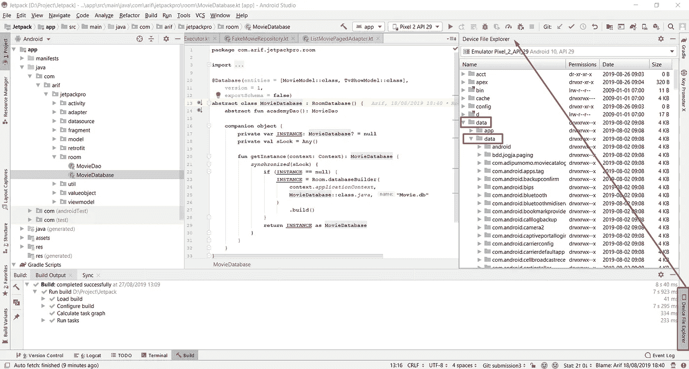
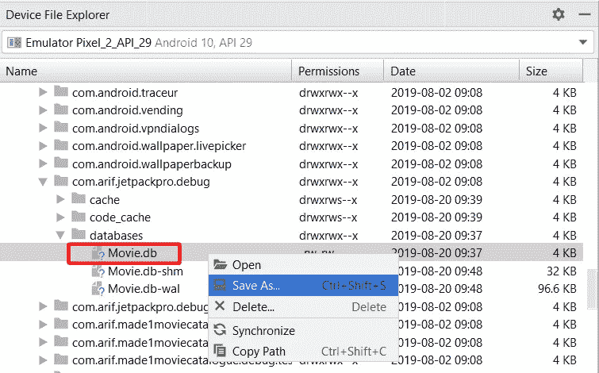
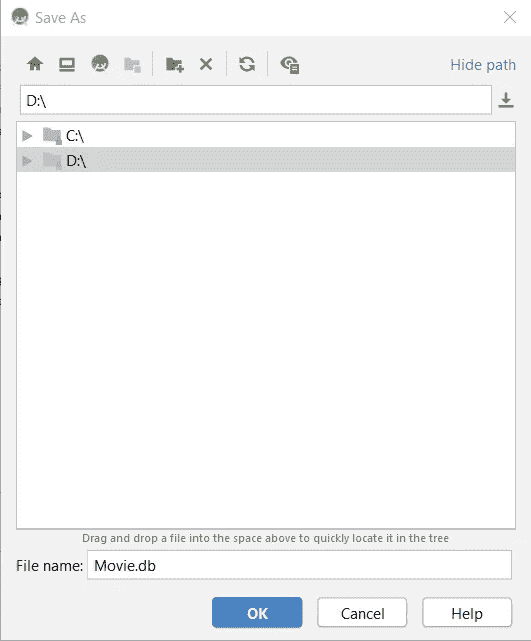
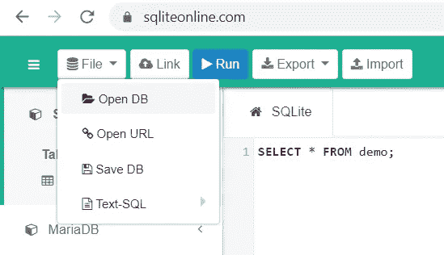
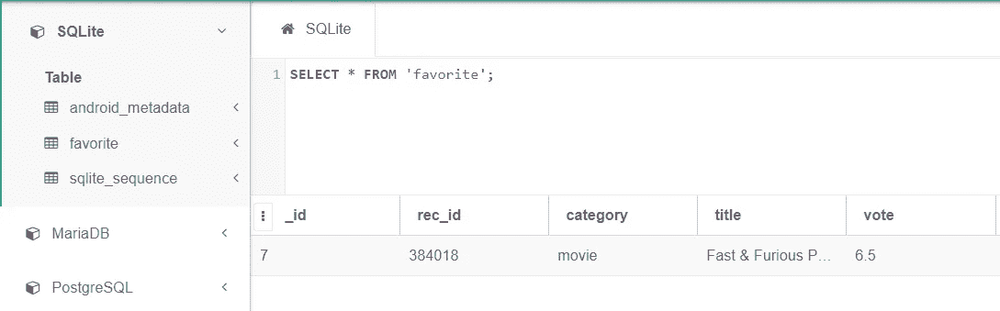

# Mengecek Database Sqlite/Room

> 原文：<https://medium.easyread.co/cara-cek-database-sqlite-room-sudah-masuk-atau-belum-9d1e42c35d2b?source=collection_archive---------1----------------------->

## Apakah database kita sudah terbentuk? Apakah data kita sudah masuk?

Pic from [Pexels](https://www.pexels.com/photo/three-white-ceramic-pots-with-green-leaf-plants-near-open-notebook-with-click-pen-on-top-796602/)

Halo *gaess* .. *Nah* , kebetulan ada cukup banyak yang bertanya kepada saya mengenai topik ini, jadi sekalian *tak* buat tutorialnya aja nih, yaitu Bagaimana mengecek apakah database kita sudah terbentuk atau apakah data kita sudah masuk ke sqlite/room?

Jadi misalnya kita bermain database di mobile khususnya Android. Kita sudah membuat user interfacenya, databasenya juga sudah, lalu kita lanjut mengatur CRUD nya, dan ketika dites, kita mulai *deg deg ser.* . Kira-kira berhasil *ndak* yaa. Syukur *Alhamdulillah,* kalau datanya langsung muncul, *nah* bagamaina kalau error atau salah masuk, salah field, atau *ndak* muncul.. ini yang seringkali membuat bingung..

Lalu bagaimana mengecek *database* yang kita buat sudah jadi atau belum dan datanya sudah masuk? Chekitout…

Sebenarnya ada 2 cara untuk cek database ini :

1.  Yang pertama yaitu kita bisa cek database dengan menggunakan **Stetho** , Keunggulannya yaitu kita bisa cek secara live tapi kita perlu menambahkan library dan kode baru di dalam project kita. Untuk tutorialnya sudah saya buat disini :

 [## Melihat Live Database SQLite Android dengan Stetho

### Tambahkan Library di build.gradle (Module : app)

medium.com](https://medium.com/@ahmadariffaizin/melihat-live-database-sqlite-android-dengan-stetho-78d8796c489d) 

2\. Yang kedua yaitu secara **manual** , cara ini lebih simpel karena tidak memerlukan library tambahan, namun kita perlu melakukan langkah-langkah berikut secara manual setiap kalau mau mengecek data :

*   Klik panel **Device File Explorer,** biasanya ada di pojok kanan bawah, atau bisa juga melalui menu View > Tool Window > Device File Explorer

*   Pilih folder **data** , kemudian di dalamnya ada folder **data,** cari dan pilih **nama package** aplikasi kita
*   Pilih folder database dan cari **nama database** yang kita buat, misa disini yaitu Movie.db. kemudian klik kanan dan **Save As**

*   Kemudian pilih tempat menyimpan yang gampang dicari, misal ini di Local Disk D:

*   Selanjutnya anda bisa membuka file dengan format db ini menggunakan [https://sqliteonline.com](https://sqliteonline.com/) . Yaitu dengan pilih File > Open DB > dan pilih file Movie.db yang sudah kita simpan tadi

*   Kemudian tinggal kita pilih tabel yang ingin kita lihat dan taraaa..

database yang udah kita simpan tampil disini. Kereeen kan

Note : Selain secara online kita juga bisa offline dengan menggunakan SQLite Browser yang bisa di download di [https://sqlitebrowser.org](https://sqlitebrowser.org/)

> “Ask to Allah for everything, even just ask for slippers”