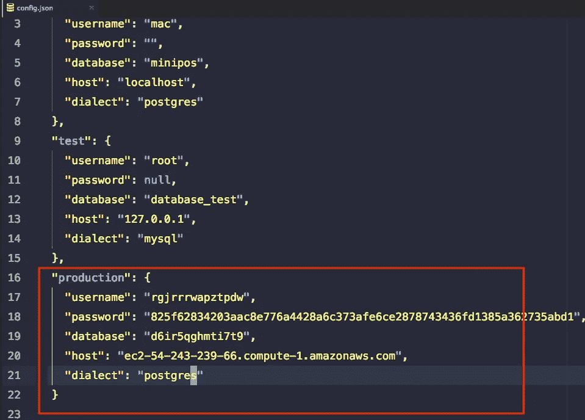

# Cara Deploy Express dan Postrgres ke Heroku

> 原文：<https://medium.easyread.co/cara-deploy-express-dan-postrgres-ke-heroku-4b08e6bc1d64?source=collection_archive---------0----------------------->


Photo by [Andrey Larin](https://unsplash.com/photos/Kodkas71tT8?utm_source=unsplash&utm_medium=referral&utm_content=creditCopyText) on [Unsplash](https://unsplash.com/search/photos/plane-paper?utm_source=unsplash&utm_medium=referral&utm_content=creditCopyText)

Setelah aplikasi kita selesai dibuat. Maka ini saat nya untuk menunjukkan apa yang kita buat kepada dunia.

Maka saatnya deploy!

Apa itu deploy?

Saat development, kita melakukan koding di komputer kita sendiri, test dan running aplikasinya di komputer sendiri.

Ketika aplikasi sudah selesai, tentu aplikasi yang kita buat biasanya tidak hanya dibuat untuk pemakaian sendiri. Tapi untuk dipakai oleh orang lain.

Itu tidak akan bisa tercapai kalau apps nya hanya run di komputer sendiri. Maka kita perlu tempat untuk menyimpan dan menjalankan app kita agar bisa di pakai oleh banyak orang.

Nah proses pemindahan dari local ke server online itu namanya deploy.

Singkatnya, proses “peng-onlinenan” aplikasi.

Untuk artikel ini saya akan berikan tutorial untuk melakukan deploy aplikasi express (nodejs) dan postgre sebagai db nya ke heroku.

Kenapa pakai heroku ?

1.  Gratis. kita bisa naro apps kita di heroku dengan gratis, tentunya dengan syarat tertentu. bisa baca langsung di herokunya. Tapi intinya tetep gratis hehe.
2.  Mudah. Proses deploy akan sangat mudah di lakukan, sama saja seperti push di github.
3.  Ssh. di heroku, kita bisa akses ssh ke virtual server yang dibuat, sehingga bisa di otak-atik sesuai kebutuhan apps kita.
4.  Terminal. Semuanya bisa dilakukan hanya via terminal saja.

Sebelum melakukan deploy, tentunya aplikasi nya sudah harus ada dan harus sudah siap deploy.

Jika kalian belum ada apps yang dibuat dengan express dan sequelize postgre. Silahkan pakai apps yang sudah saya buat.

[**Dowload App Express-Crud nya disini!**](http://eepurl.com/dmMZvX)

Oke, lalu pastikan apps kita sudah siap dengan cara berikut.

**Pastikan sudah ada scripts start di package.json**

seperti berikut:


**Pastikan port nya menggunakan env.**

Karena apps kita akan menyesuaikan dengan port yang disediakan oleh heroku.


app.js

**Pastikan sudah ada procfile** yang berisi sama dengan scripts start


Procfile

Apa fungsinya procfile? yaitu untuk memberitahu heroku, command apa yang harus dijalankan pertama kali agar website kita berjalan.

**Pastikan apps sudah menggunakan git.**

Karena untuk deploy nya kita menggunakan git.

Siip. sekarang apps kita sudah siap untuk di deploy

Sekarang proses pendeployan nya:

Buat akun dulu di heroku.

[](https://www.heroku.com) [## Cloud Application Platform | Heroku

### Heroku is a platform as a service (PaaS) that enables developers to build, run, and operate applications entirely in…

www.heroku.com](https://www.heroku.com) 

**Install heroku-cli**

Untuk osx :

[https://devcenter.heroku.com/toolbelt-downloads/osx](https://devcenter.heroku.com/toolbelt-downloads/osx)

Untuk ubuntu:

[https://devcenter.heroku.com/toolbelt-downloads/debian](https://devcenter.heroku.com/toolbelt-downloads/debian)

Untuk windows 32bit:

[https://devcenter.heroku.com/toolbelt-downloads/windows32](https://devcenter.heroku.com/toolbelt-downloads/windows32)

Untuk windows 64bit:

[https://devcenter.heroku.com/toolbelt-downloads/windows64](https://devcenter.heroku.com/toolbelt-downloads/windows64)

setelah proses install selesai.

Login ke heroku lewat heroku-clinya , buka terminal. Jalankan command `heroku login`


Lalu jalankan :

```
$ heroku create
```


heroku create

Untuk membuat apps di heroku. Secara otomatis heroku akan memberikan random name apps nya, membuatkan repository git untuk menyimpan source code yang di deploy nanti, membuat git remote herokunya.

Sekarang tinggal pencet tombol deploy dengan command :

```
$ git push heroku master
```


git push heroku master

Yang terjadi ketika melakukan command di atas adalah kita mem-push source code kita dari branch master di local ke branch master git heroku.

Lalu heroku mendeteksi ini source code apa, jika ternyata node js.

Maka heroku secara otomatis menjalan command `npm install` untuk menginstall semua depedency yang digunakan dan menjalankan apps nya dengan command `node app.js`

Berikut adalah tanda bahwa app sukses di deploy.


Success Deploy

Tapi sukses di deploy belum tentu sukses dijalankan.

Sekarang kita lihat dulu app nya berjalan dengan command :

```
$ heroku open
```

Maka akan terbuka browser dengan langsung menuju ke alamat appnya di domain heroku.


Application Error Heroku

Opps, ternyata masih error.

Kata heroku, untuk mengecek kenapa bisa error, kita harus cek logs nya.

jalankan command berikut untuk melihat logsnya :

```
$ heroku logs -t
```


Error Mysql

Katanya di suruh install package mysql2, padahalkan kita gak pakai mysql , tapi pakai postgre.

Oke berarti cek file config.json kita yang mengatur koneksi database.


config.json

Ternyata config db production nya masih default. Ketika app nya di deploy ke heroku. maka sequelize akan menggunakan config production. Maka kita harus setting config production nya.

Tapi harus di isi dengan apa ya, kayaknya kita belum punya db postgre di heroku nya.

Kalau gitu kita buat dulu db postgre nya.

Masuk ke dashboard heroku di website nya heroku.

Klik nama app yang baru kita buat.


Heroku Dashboard

Klik bagian Resources.

Cari postgre di kolom Add-ons


Akan muncul pop up, pilih yang free. lalu klik Provision.


Lalu klik Heroku Postgres Database nya .


Akan muncul halaman Heroku Data. Klik Settings, lalu klik View Credentials.


Akan muncul credential yang harus digunakan untuk postgre nya. Copy semua data yang tertera seperti host, database, username, password ke config.json


Postgre Credentials



Production Config.json

Jangan lupa untuk git add dan commit. karena akan kita deploy perubahannya.

Untuk deploy lagi jalankan :

```
$ git push heroku master
```

Sekarang coba buka lagi app nya dengan:

```
$ heroku open
```

Tapi pasti nya akan masih error, karena table kita belum di migration. Untuk melakukan command migration sequelize berarti kita harus masuk ke heroku nya lewat ssh.

Maka jalankan command berikut untuk masuk ke virtual server herokunya:

```
$ heroku run bash
```


Jangan lupa install sequelize-cli nya disana.

```
$ npm install -g sequelize-cli
```


Jalankan command berikut untuk migration table dan seeder nya

```
$ sequelize db:migrate
$ sequelize db:seed:all
```

Untuk keluar dari ssh nya, jalankan command:

```
$ exit
```

Sekarang buka lagi dengan `heroku open` dan tadaaa~


Express — Postgres in Heroku

App kita sekarang sudah online dan bisa di akses oleh semua orang!

**Ringkasan alur deploy ke heroku** :

Setiap kali ada perubahan code, selalu di add lalu di commit.

Setelah selesai ngoding dan mau dideploy, jangan lupa untuk selalu merge atau commit kode nya ke master.

Lalu jalankan `git push heroku master` untuk deploy.

Selesai.

[Demo Live di heroku.](https://immense-hollows-96501.herokuapp.com/)

*Jika anda merasa artikel ini menarik dan bermanfaat, silahkan* ***berikan claps*** *👏 👏 sebanyak-sebanyaknya dan* ***bagikan*** *ke lingkaran pertemanan anda, agar mereka dapat membaca artikel ini. Dan jangan lupa* [***follow saya di medium***](https://medium.com/@haidarafifmaulana) *untuk terus dapatkan tulisan seperti ini setiap minggunya.*