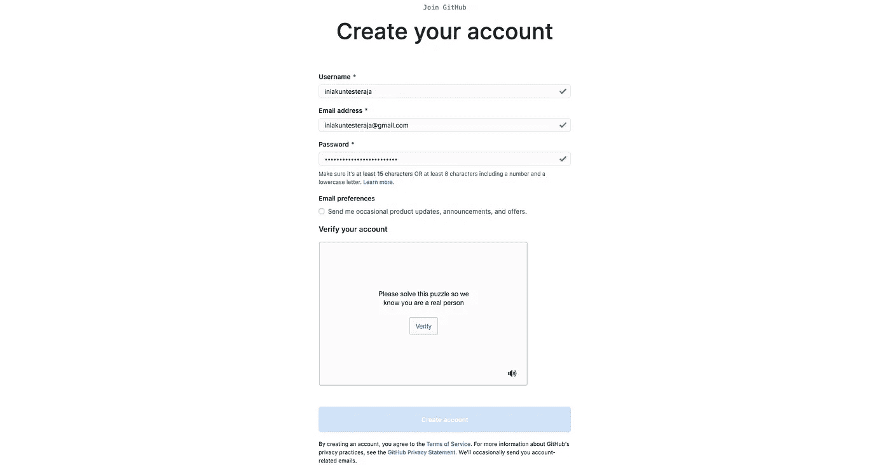
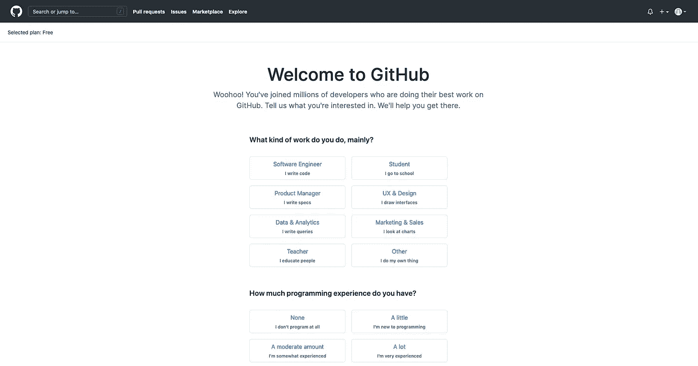
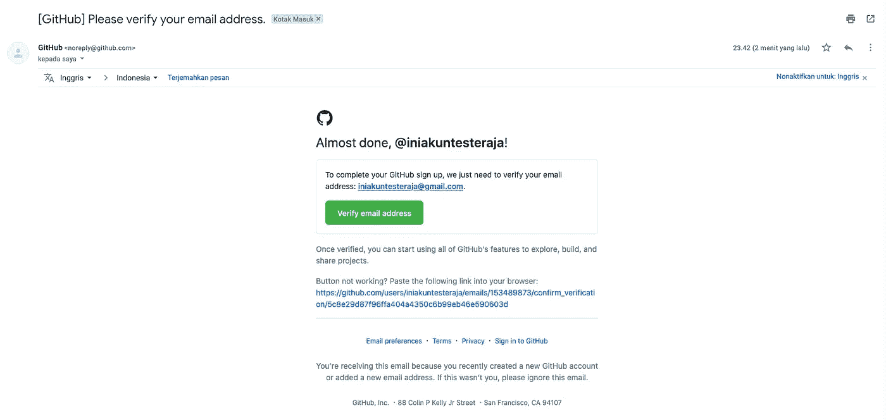
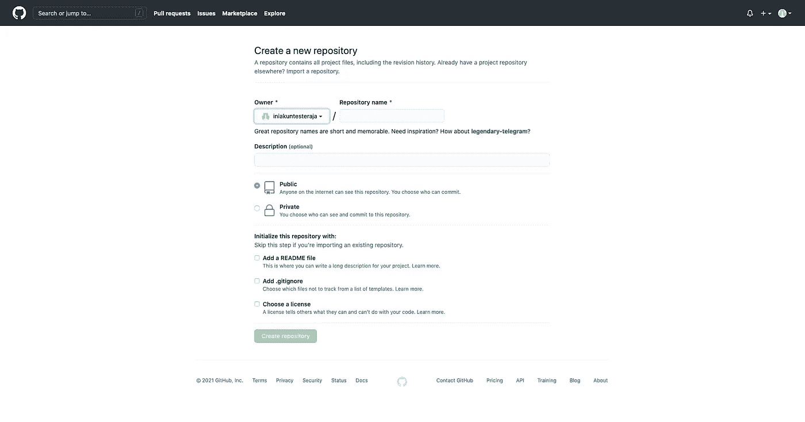
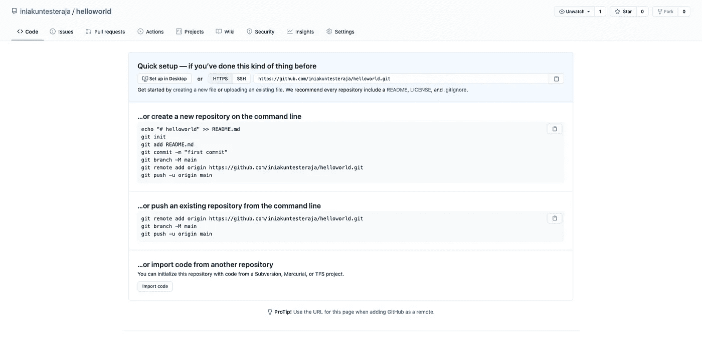

# Cara Mendaftar Akun GitHub dan Membuat Repository Pertama — Part 3

> 原文：<https://medium.easyread.co/cara-mendaftar-akun-github-dan-membuat-repository-pertama-part-3-926c2e3724a6?source=collection_archive---------0----------------------->

Photo by [Caleb White](https://unsplash.com/@caleb_white?utm_source=medium&utm_medium=referral) on [Unsplash](https://unsplash.com?utm_source=medium&utm_medium=referral)

Halo teman-teman, kali ini kamu berada di blog saya untuk membahasa mengenai **Cara Mendaftar Akun GitHub dan Membuat Repository** .

# Mendaftar Akun GitHub

*   Step 1 — Akses GitHub

*   Step 2 — Klik Sign Up dan Isi Form Registrasinya

Isi datanya dan lakukan verifikasi puzzle tersebut. Lalu klik tombol “Create Account”.

Kamu sudah berhasil daftar akun GitHub.

*   Step 3 — Verifikasi Alamat Email

Sekarang buka akun email kamu, dan silahkan verifikasi akun email kamu.

Email kamu telah berhasil di verifikasi.

# **Membuat Repository**

Setelah kamu berhasil membuat akun atau akun kamu sudah tersedia dan ingin membuat repository, berikut langkah yang harus dilakukan.

*   Step 1 — Pergi ke Halaman New Project

Keterangan :

**Repository name** : Itu merupakan nama repository kamu, sebisa mungkin spesifik nama repository sesuai project yang ingin kamu buat.

**Description** : Itu merupakan penjelasan dari repository tersebut.

**Public/Private** : Itu merupakan tipe repository kamu, kalau pilih public, berarti repository kamu bisa dicari oleh orang lain, sedangkan sebaliknya jika kamu memilih private. Untuk saat ini kita pilih public aja karena hanya untuk belajar saja.

## Pilihan Checklist :

**Add a README file** : Biasanya digunakan untuk menjelaskan detail dari project kamu, bagaimana set upnya, dan sebagainya.

**Add .gitignore :** Kalau ini biasanya digunakan untuk menghindari file yang tidak ingin dibawa ke cloud repositorynya, biasanya karena confidential atau package-package lain yang bisa di install dari sumbernya langsung.

**Choose a license :** Menetapkan license pada project kamu.

Jika berhasil dibuat, maka tampilan akhirnya akan menjadi seperti gambar diatas.

# Konklusi

Yaps, kamu telah mempunyai akun GitHub dan telah berhasil membuat repository pertama kamu. Selamat mencoba dan semoga bermanfaat.

[Call Friends]

Halo teman teman, untuk mendukung agar saya tetap bisa membuat tulisan-tulisan menarik lainnya. Kamu bisa support saya dengan membeli produk-produk asli produksi sendiri, homemade, dan yang pastinya brand lokal hanya di [@beneteen](https://www.instagram.com/beneteen/) atau ke [beneteen.com](https://beneteen.com/)