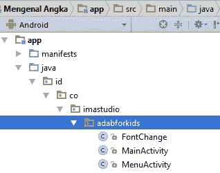

# Cara Mengganti Nama Package di Android Studio

> 原文：<https://medium.easyread.co/cara-mengganti-nama-package-di-android-studio-dd7ae1f9fe8d?source=collection_archive---------0----------------------->

Cara Simpel mengubah nama package aplikasi

Terkadang kita ingin sekali meng- *clone* project yang sudah jadi atau project orang lain *eh 🙈. Terus project tersebut mau dipakai untuk project yang lain. Tetapi kita seringkali kebingungan bagaimana caranya agar nama *package* project tersebut bisa diubah. *Nah* , sekarang tidak perlu bingung lagi. Kamu tinggal mengikuti jalan yang lurus, maksudnya *tips* dan *trick* di bawah ini. Check it out. *.*

## Langkah Pertama

*Copy* isi folder projectnya dan *paste* di folder lain dengan nama project yang baru.

## Langkah Kedua

Import Projectnya di Android Studio dengan File > New >Import Project. Pilih lokasi project. Klik icon gear dan klik “Compact Empty Middle Packages” untuk menghilangkan tanda centang

maka folder akan menjadi seperti ini.

## Langkah Ketiga

Kemudian rename folder package yang mau diganti dengan klik kanan > redactor > rename

pilih “Rename Package”

ganti namanya > refactor.

lalu akan muncul peringatan di bawah. Pilih “Do refactor”, maka dia akan otomatis mengubah semua yang terhubung ke package itu.

Silahkan lakukan hal yang sama jika anda ingin mengganti sub package yang lain.

## Langkah Terakhir

Jika sudah, jangan lupa mengganti juga *application id* di build.gradle (app)

Done. Selesai.. Gampang kan? Tapi kalau gak ada yang kasitau emang susah 🙈 🙊

> Memang susah ketika melakukan PERUBAHAN, tapi akan Lebih Susah jika TIDAK SEGERA BERUBAH~