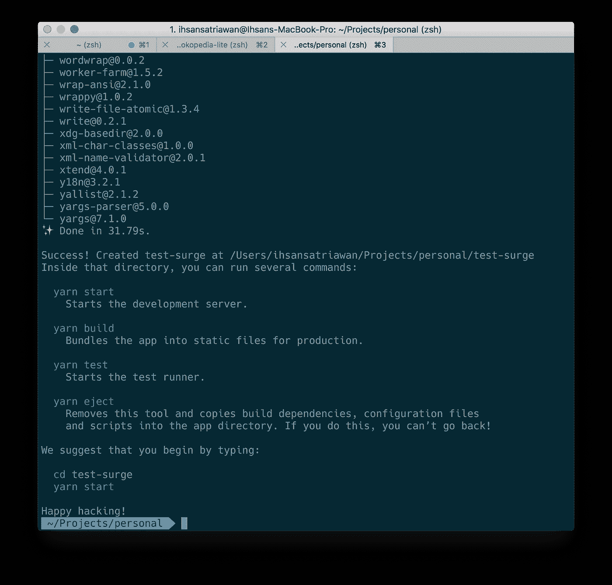
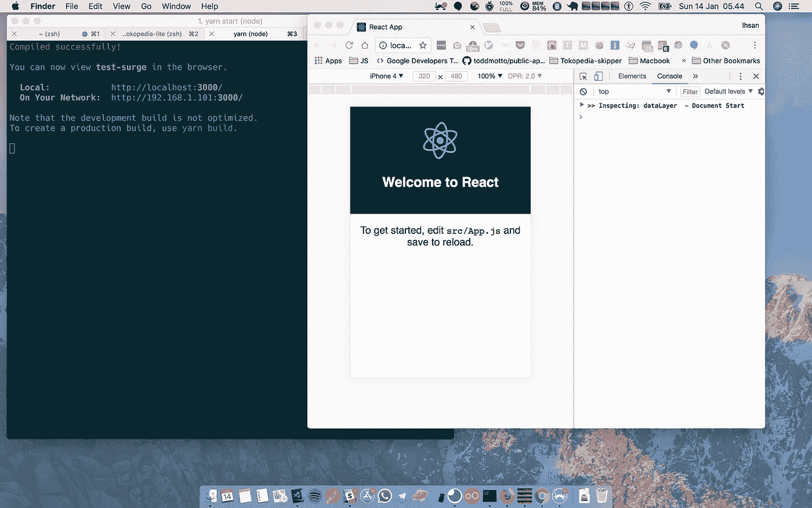
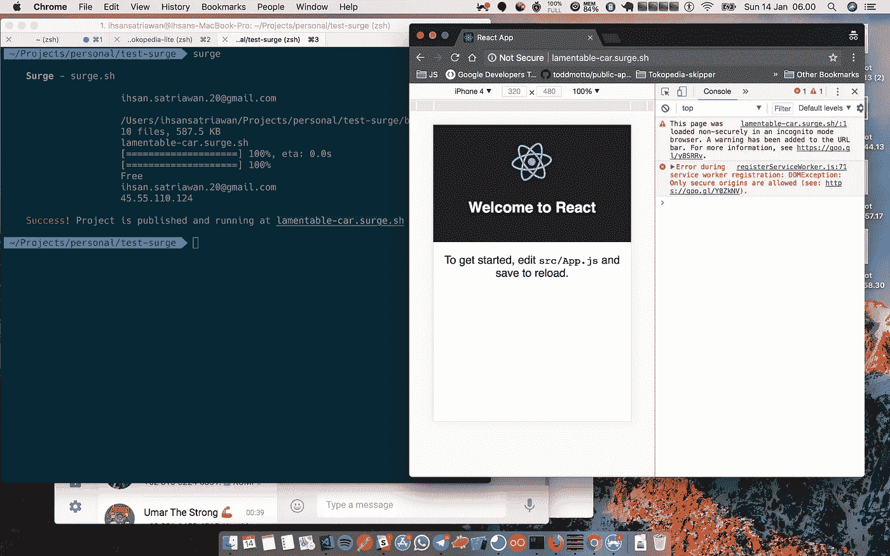
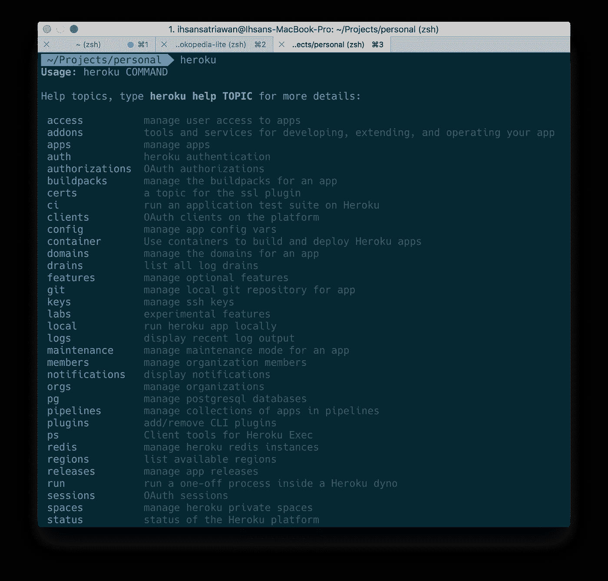
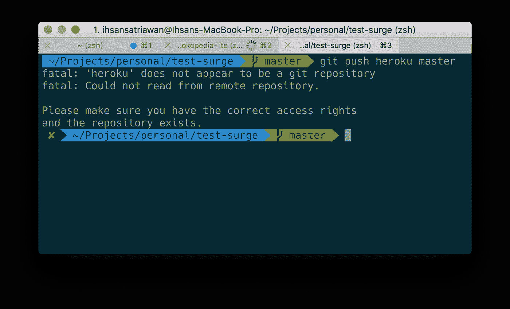
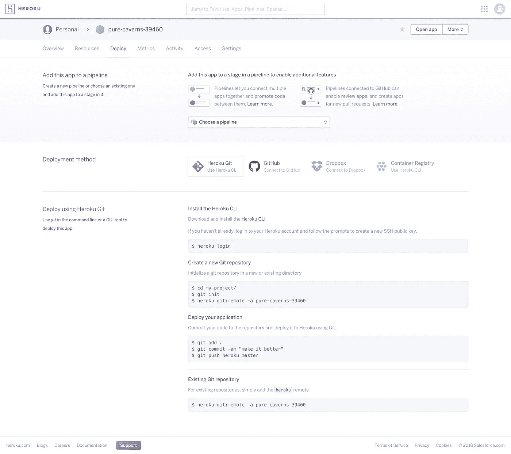
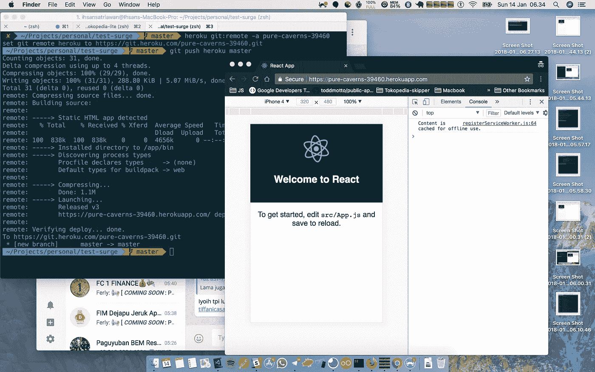

# Cara Mudah Deploy Create-React-App

> 原文：<https://medium.easyread.co/cara-mudah-deploy-create-react-app-448372743357?source=collection_archive---------0----------------------->


Create-React-

Halo semuanya, kali ini kita akan belajar mengenai bagaimana men-deploy React app yang telah kita buat ke server sehingga teman-teman kita dapat mengakses melalui browser masing-masing. Sebenarnya banyak cara dan layanan yang dapat kita gunakan, namun pada artikel kali ini akan menggunakan:

1.  [Create React App](https://github.com/facebookincubator/create-react-app) (CRA)
2.  [Surge.sh](https://surge.sh/)
3.  [Heroku](http://heroku.com/)

# Create React App (CRA)

Keluhan yang pernah saya dengar ketika orang lain mencoba react adalah begitu banyak hal yang perlu di setup, mulai dari `babel` `webpack` dll. Facebook akhirnya mengeluarkan semacam boilerplate untuk react dengan slogan `no build configuration` . untuk menggunaan menggunakan CRA cara nya sangat lah mudah, kalian hanya perlu mengetikkan perintah berikut di dalam command line kalian

```
npm install -g create-react-appcreate-react-app <your project name>cd <your project name>
```



Jika sukses membuat React App menggunakan CRA

Dengan menggunakan CRA ini kita tinggal fokus dalam membangun feature dari app yang ingin kita buat. Kita bisa menggunakan `yarn start` saat melakukan development di local dan menggunakan `yarn build` untuk melakukan deployment. CRA pun dapat kita custom configuration-nya sesuai keinginan kita, dengan cara melalukan `yarn eject` , perlu diperhatikan sekali kita menggunakannya perintah ini, kita tidak dapat mengembalikannya (pada artikel selanjutnya akan saya jelaskan lebih detail mengenai config react app menggunakan `yarn eject` )



Tampilan Default dari CRA

# Surge.sh

Jika sebelumnya kita telah berhasil membuat React app menggunakan CRA, kali ini kita akan mencoba melakukan deployment menggunakan surge.sh. Surge.sh merupakan

> Static web publishing for Front-End Developers

Langkah pertama kita perlu meng-install package surge.sh secara global

```
npm install -g surge
```

langkah selanjutnya, kita perlu melakukan persiapan dari React app yang telah kita, yakni dengan `yarn build` . Dengan perintah tersebut, kita membuat React app kita dalam bentuk static sehingga dapat diserve oleh server surge



Sukses deploy menggunakan surge.sh

Yang perlu diperhatikan adalah, ketika diminta memasukkan path dari project kita adalah, kita perlu mengarahkan kepada folder `build` dari React app yang kita buat.

# Heroku

Heroku merupakan salah satu perusahaan penyedia layanan *Platform as a Service (PaaS).* Untuk dapat menggunakan layanan heroku, kita perlu melakukan:

*   [Sign Up](https://signup.heroku.com/)
*   Install [command-lint tools (CLI)](https://devcenter.heroku.com/articles/heroku-cli) Heroku



Tampilan ketika kita sukses install Heroku CLI

Selanjutnya kita dapat menggunakan React app yang telah kita buat sebelumnya untuk dideploy ke Heroku dengan cara sebagai berikut:

```
git init# Membuat Heroku app, membutuhkan akun gratis di Heroku.com
heroku create -b [https://github.com/heroku/heroku-buildpack-static.git](https://github.com/heroku/heroku-buildpack-static.git)# Mengarahkan root dari directory kita ke folder build
echo '{ "root": "build/" }' > static.json# Menghapus folder build dari .gitignore
sed '/build/d' .gitignore > .gitignore.new && mv .gitignore.new .gitignore# Build, commit, deploy!
yarn build
git add .
git commit -m "Deploy to Heroku!"
git push heroku master
```



Gagal deploy

Jika ada yang mengalami gagal seperti yang diatas, kita perlu masuk ke dalam halaman Dashboard akun Heroku. Masuk kedalam nama apps yang kita buat dan ada di tab Deploy



Dashboard Heroku tab Deploy



Sukses Deploy ke Heroku!