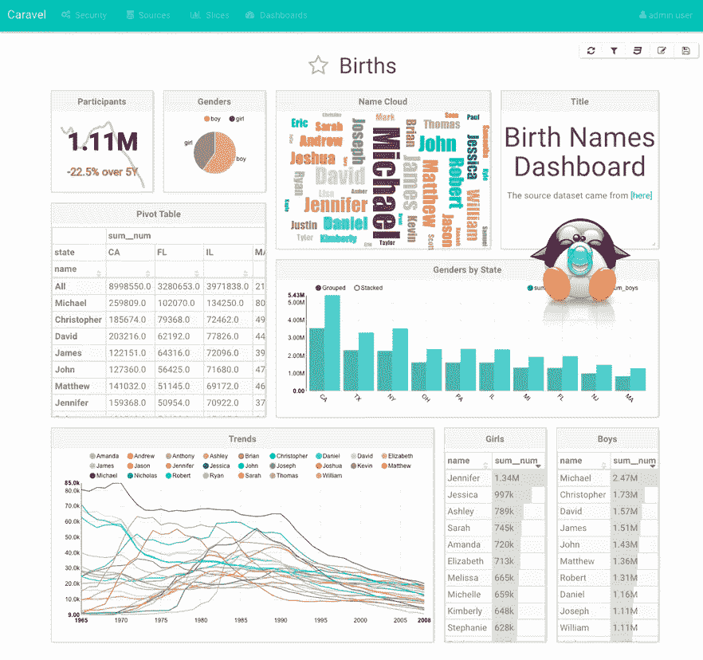
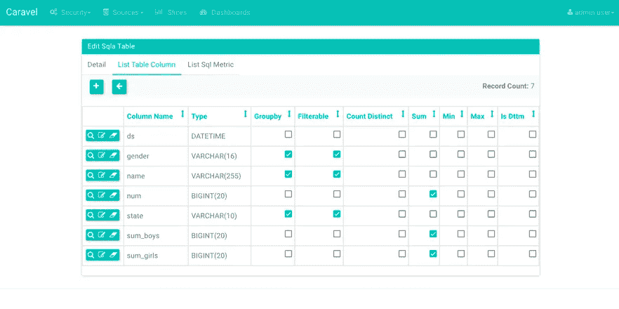
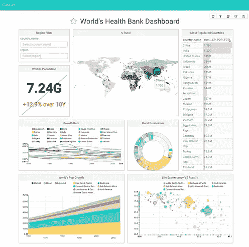
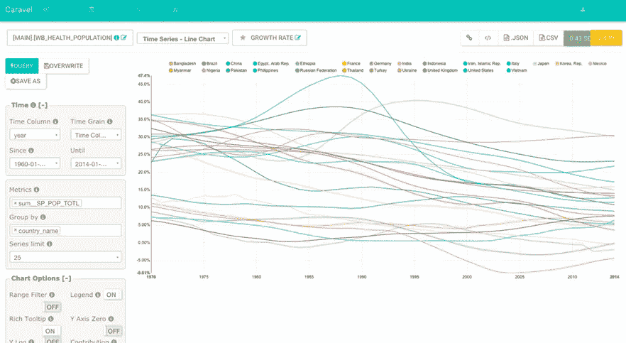
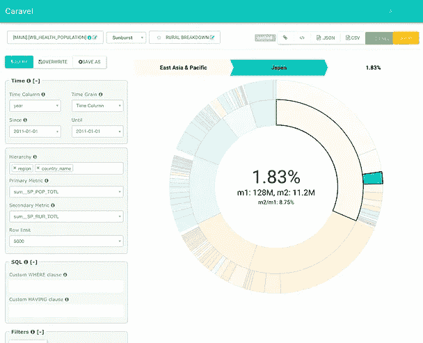
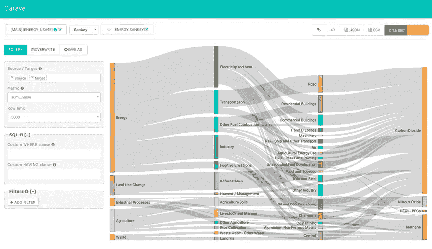
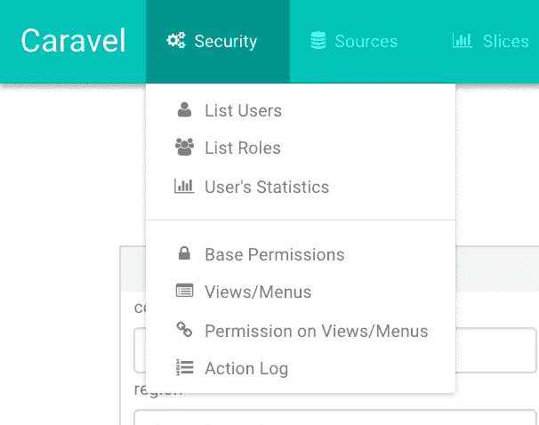

# 超集:Airbnb 的数据探索平台

> 原文：<https://medium.com/airbnb-engineering/caravel-airbnb-s-data-exploration-platform-15a72aa610e5?source=collection_archive---------2----------------------->

马克西姆·博彻明

在 Airbnb，我们热爱数据，我们喜欢认为分析属于任何地方。为了让我们成为数据驱动的，我们需要数据是流动的、快速流动的和清晰的。

作为数据探索、发现和协作分析的载体，我们已经建立并正在**开源、**数据探索和**仪表板**平台，命名为**超集**。超集允许通过丰富的可视化进行数据探索，同时对几乎任何数据集执行快速而直观的**“切片和切块”**。

数据浏览器可以在创建和共享“切片”的同时轻松浏览多维数据集，并在**交互式仪表盘**中组装它们。

# **以思维的速度探索数据**

> *“数据可视化是有效的，因为它改变了感知和认知之间的平衡，以更充分地利用大脑的能力。”斯蒂芬·诺什*

只需要很少的时间，也许 10 到 30 秒的延迟，就能打破一个人的认知流程。超集通过提供一个流畅的查询接口来保持您的思维循环，并加快查询速度。切片、切块、向下钻取和可视化旋转允许用户有效地探索多维数据空间。

数据导航的无代码方法允许每个人都参与进来，使数据访问民主化。一方面，不太懂技术的用户会找到一个简单的界面来查询数据。另一方面，高级用户享受着速度的提高和分享他们创作的内容的便利。

数据科学家、工程师和其他数据奇才仍然可以使用 Tableau、R、Jupyter、 [Airpal](/airbnb-engineering/airpal-a-web-based-query-execution-tool-for-data-analysis-33c43265ed1f#.ou72pwi34) 、Excel 和其他方式与数据进行交互，但 Superset 作为一种无摩擦、直观的数据和想法共享工具，正在获得内部的认可。

# **特色**

*   一套丰富且可扩展的可视化工具，包括基本图表以及旭日图、平行坐标图、热图、力导向布局图、世界地图、数据透视表、文字云、桑基图等等！
*   创建并共享**交互式** **仪表盘**作为可视化集合
*   灵活的**认证**和**授权**，支持 LDAP、OpenID、OAuth、远程用户等等。粒度权限和角色管理允许管理员非常明确地定义谁可以访问哪个功能和/或哪个数据集
*   一个薄薄的**语义层**，它定义了数据集应该如何公开，并允许通过添加 SQL 表达式和指标来丰富内容
*   **连接**大多数使用 SQL 的数据库，并支持查询 [Druid.io](http://druid.io/) 进行快速实时分析
*   一条**平滑的学习曲线**:用户可以在几分钟内接受培训，并立即获得价值
*   灵活的**数据缓存**，通过报表、表格和数据库级联超时参数，让您的数据库从繁重的负载中解脱出来，让重要的仪表板快速加载
*   **可定制**和**可定制**！您可以使用自己的引导主题来创建品牌和皮肤超集，为您的仪表板创建 CSS 模板，并为特定的可视化修改控件

# **连通性**

超集在您的环境中应该和在我们的环境中一样好。查询层是使用 [SQLAlchemy](http://www.sqlalchemy.org/) 编写的，这是一个 SQL 工具包，允许编写可以翻译成大多数 SQL 方言的查询。

在 SQL 世界之外，超集被设计成利用 [Druid.io](http://druid.io/) 的力量。Druid 是一个开源、快速、面向列、实时、分布式的数据存储。将两者结合起来，可以消除等式中的延迟，从而加快分析周期。

# **一个薄薄的语义层**

超集允许您管理一个薄层来丰富数据集的元数据。这个简单的图层定义了如何向用户显示数据集，它由以下部分组成:

*   在浏览数据集时提供上下文的维度和指标的描述、定义和详细名称
*   计算字段和指标。例如，比率、非重复计数以及任何可以通过 SQL 表达的东西
*   定义如何在用户界面中显示字段的简单参数

# **试驾**

我们让测试驾驶 Superset 变得非常容易。在简单的安装过程之后，您将获得装载了一组漂亮的仪表板、图表和数据集的超集，您可以浏览并与之交互。下一个合乎逻辑的步骤是连接到您的本地数据库并开始可视化它们。

# 截屏

# **美好的未来**

不到一年前，Superset 作为一个黑客马拉松项目开始。虽然这个项目已经很稳固了，但它仍然很年轻，而且势头越来越猛。期待仪表板中更多的交互性，对越来越多的可视化的支持，一组[培训视频](http://airbnb.io/superset/user_guide.html)，更多的社交功能，如标签、评论、使用信息、图表注释等等！

我们计划在超集中发布数据可视化和控件，作为可重用的[反应](https://facebook.github.io/react/)组件。这种模块化方法将使应用程序开发人员可以使用这些构件。在 Airbnb，作为内部应用程序的一部分，我们有许多丰富的交互式可视化用例；例如，我们的 A/B 测试框架、异常检测框架和用户会话浏览器。在所有这些应用程序之间共享相同的组件将会很棒。

加入社区，在 [Superset 的 Github 库](https://github.com/airbnb/caravel)上找到指向资源的指针！

*注:Superset 最初发布时的名称是 Caravel。*

## 在 [airbnb.io](http://airbnb.io) 查看我们所有的开源项目，并在 Twitter 上关注我们:[@ Airbnb eng](https://twitter.com/AirbnbEng)+[@ Airbnb data](https://twitter.com/AirbnbData)