# 数字营销职业:你需要知道的一切

> 原文：<https://medium.com/edureka/career-in-digital-marketing-fc38e7689b3c?source=collection_archive---------0----------------------->

预计到 2021 年初，仅在英国就有 200 万个工作岗位，互联网的使用越来越多，现在是开始构建数字营销职业生涯的最佳时机。工作范围、薪水以及对数字营销的需求都在不断增长。所以，为了让你了解职业方面的最新情况，我写了这篇关于数字营销职业的文章。

这个关于数字营销职业的博客将带你了解以下主题:

*   什么是数字营销？
*   你应该掌握的顶级技能
*   工作角色和范围
*   印度和美国的工资级别
*   数字营销的未来

我们开始吧！

# 什么是数字营销？

*数字营销*是一种媒介，通过它你可以在网上推广你的产品和服务。它也指通过数字渠道(如搜索引擎、网站、社交媒体、电子邮件和移动应用程序)发布的广告。

互联网已经覆盖了全球 43.9 亿人，拥有一个企业网站是必不可少的。*数字营销*让你和你的企业更容易获得更多流量和忠诚客户。

数字营销需要渠道，通过这些渠道你可以描绘你的企业代表什么。还有 SEO(搜索引擎优化)，PPC(点击付费)等等。掌握如何与渠道合作，你就能成为一名数字营销人员。

接下来，让我们来看看，要成为一名成功的数字营销人员，你必须掌握哪些技能。

# 你应该掌握的顶级技能

这里有一些技巧是你谈论数字营销时必须掌握的。

*   熟悉任何数字营销渠道，如搜索引擎优化，点击付费，内容，电子邮件和社交媒体。
*   *数据分析*
*   应该能够分析努力的有效性。
*   了解 Excel 的基本操作。
*   WordPress 的基础知识。
*   了解谷歌分析的工作。
*   基本的设计技能。
*   销售技巧。
*   客观思考。
*   创造性思维。
*   精通技术。
*   适应任何环境的能力。

这是一些值得注意的技巧，你必须掌握，才能成为一名出色的数字营销人员。

# 工作角色和范围

当你想在一个特定的领域追求职业生涯时，工作扮演着重要的角色。数字营销就是这样一个领域，在这里你可以找到常青树的工作角色。那么这个领域的工作范围到底是什么呢？找工作容易还是需要特别的东西？让我们来看看！

## 角色和职责

*   创建自己的营销活动，并获得良好的线索。
*   协助制定战略，以便与消费者建立持久的数字联系。
*   计划和监控社交媒体平台的进展。
*   始终积极参与搜索引擎优化。
*   创建对客户和企业都有帮助的好内容。
*   使用 Google Analytics 分析你网站的洞察力。
*   帮助维护与客户的良好关系。
*   能够更有创造力并跟上最新的技术趋势。

现在，该域的工作角色是:

数字营销是为有创造力和热情的人准备的。数字营销工作领域是高度结果驱动的，提高你的知识和创造性技能。有许多数字营销工作角色，但我已经记下了其中的几个，它们肯定会帮助你。

*   **数字营销主管**

作为一名数字营销主管，你有责任研究企业的在线营销策略。你应该计划和执行营销活动，维护和提供网站内容。

*   **数字营销经理**

数字营销经理的主要角色是在数字空间中推广你的产品。你要开发、实施和管理推广公司产品和服务的营销活动。

*   **SEO 主管**

搜索引擎优化专家/主管的主要作用是在搜索引擎结果页面上对网站页面进行排名，并增加网站的流量。搜索引擎优化行业日益繁荣，搜索引擎优化主管的职位将永远供不应求。

*   **社交媒体营销专家**

社交媒体营销专家负责将营销和社交媒体管理结合起来，以增强公司的社交媒体存在、与目标受众的互动、推广品牌的吸引人的内容以及扩大增加收入的机会。

*   **转换率优化器**

转换率优化器(CRO)负责公司的转换率策略和销售线索生成。作为 CRO 高管，你将负责管理、测试和实施数字营销漏斗中的转换点。

*   **扫描电镜专家**

有一个专门的搜索引擎营销(SEM)专家，他主要负责从给定的营销预算中确定线索和点击的数量，管理投标，广告文案，关键词研究，分析和测试广告活动。

*   **内容营销经理**

内容营销经理负责创建有价值的内容，并具备营销这些内容的技能。内容营销经理负责管理博客、视频营销、营销活动、电子书出版物、客座博客、电子邮件通信、销售页面文案等等。

这些是数字营销中几个值得注意的工作角色。

# 印度和美国的工资级别

数字营销的薪酬根据工作概况、经验和才能而有所不同。如果你具备这三个条件，你肯定能抓住这个机会。

## 数字营销经理

根据*PayScale.com 的说法，*这是描绘美国和印度数字营销经理平均工资的图表。

在美国，数字营销经理的平均工资是**65488 美元**

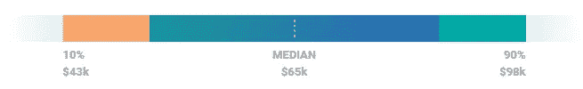

印度数字营销经理的平均工资是**515，124 卢比**

下图显示了**美国**和**印度**的数字营销经理的**经验水平薪酬。**

**数字营销经理薪资(美国)—经验水平**

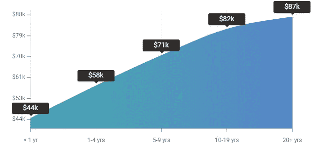

**数字营销经理薪资(中)—经验水平**

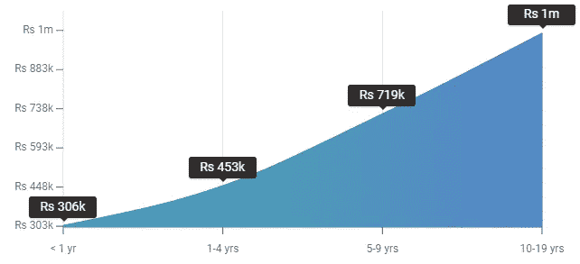

# 搜索引擎优化经理

根据 PayScale.com 的说法，这是描绘印度和美国 SEO 经理平均工资的图表。

在美国，搜索引擎优化经理的平均工资是 67475 美元。

在印度，搜索引擎优化经理的平均工资是卢比。**509090。**

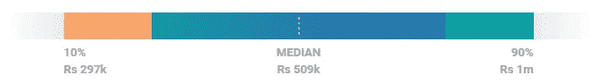

请参考下图，该图描绘了美国和印度 SEO 经理的**经验水平薪酬**。

**SEO 经理工资(美国)-经验水平**

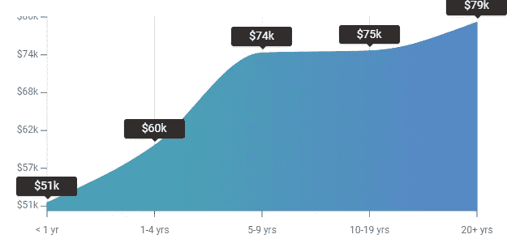

**SEO 经理工资(中)-经验水平**

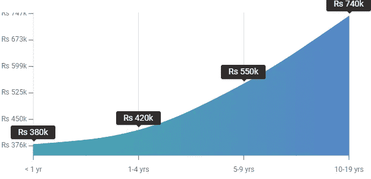

# 社交媒体经理

据 PayScale.com 报道，以下图表描绘了印度和美国社交媒体经理的平均工资。

在美国，社交媒体经理的平均工资是 49881 美元。

印度社交媒体经理的平均工资是 366，271 卢比

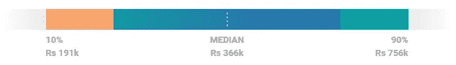

这张图表描绘了美国和英国社交媒体经理的**经验水平**薪酬。

**社交媒体经理工资(美国)—经验水平**

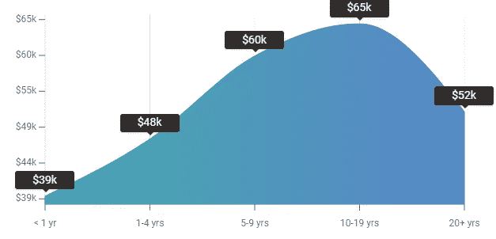

**社交媒体经理工资(中)—经验水平**

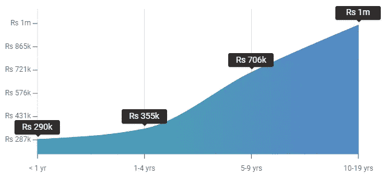

# 内容管理器

根据 PayScale.com 的说法，以下图表描述了印度和美国社交媒体经理的平均工资。

内容经理的平均工资是**57734 美元。**

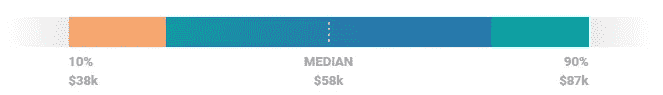

内容经理的平均工资是 572，510 卢比

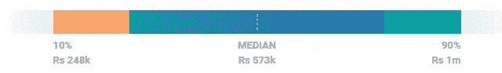

下图显示了美国和英国内容经理的**按经验水平付费**。

**内容经理薪资(美国)—经验水平**

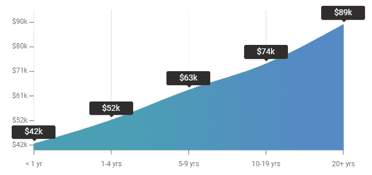

**内容经理薪资(中)—经验等级**

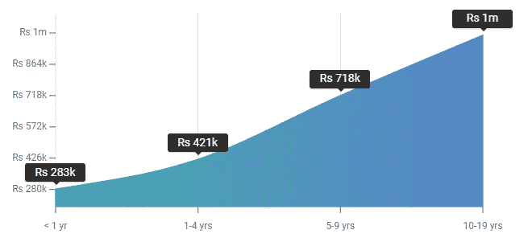

# SEM 专家

根据 PayScale.com 的说法，以下图表描述了印度和美国社交媒体经理的平均工资。

一名 SEM 专家的平均工资是 47186 美元。

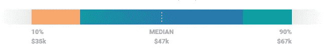

SEM 专家的平均工资为 366，634 卢比

下图显示了美国和英国的 SEM 专家按经验水平支付的薪酬。

**SEM 专员薪资(美国)—经验水平**

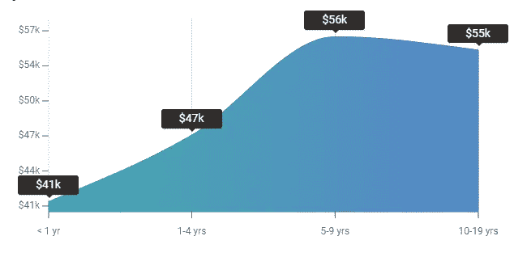

**SEM 专员工资(IN) —经验水平**

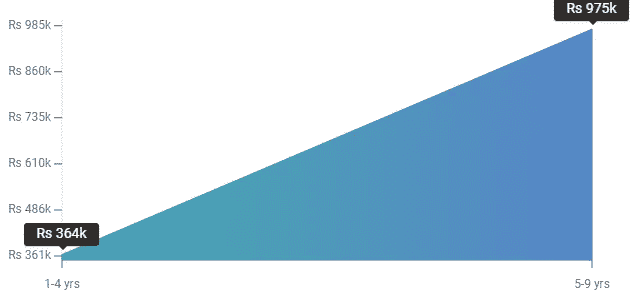

数字营销正在为激动人心的职业创造一个进化的空间，让你既充实又有丰厚的报酬。所以，抓住今天的机会，成为一名数字营销专家。

# 数字营销的未来

如今，数字营销确实有很多优势。但是，你如何预测这个领域的未来？我深入研究了数字营销的未来，并指出为什么数字营销会有一个美好的未来，数字营销职业会有需求。

*   据估计，2019 年将有 460 亿美元用于程序化广告，预计到 2020 年底，86%的数字显示广告将通过自动化呈现。这种向人工智能自动化的转变为付费媒体提供了一种更加无缝、高效和准确的方法，同时大大降低了客户获取成本。
*   这一领域的营销角色不断演变。数字化转型不再局限于首席信息官。
*   它有很高的啮合比。所以，转化率也是蛮高的。
*   到 2020 年，50%的全球 2000 强企业将看到他们的大部分业务依赖于他们创造数字化增强的产品、服务和体验的能力。

就此，我们来结束这篇关于数字营销生涯的文章。如果你对这个话题有任何疑问，请在下面留下评论，我们会尽快回复你。

如果你想查看更多关于人工智能、DevOps、道德黑客等市场最热门技术的文章，你可以参考 Edureka 的官方网站。

请留意本系列中的其他文章，它们将解释数字营销的各个方面

> *1。* [*什么是数字营销？*](/edureka/what-is-digital-marketing-5c6bf3340751)
> 
> 2.[75 大数字营销面试问答](/edureka/digital-marketing-interview-questions-e56561d42ad8)

*原载于 2019 年 11 月 22 日*[*https://www.edureka.co*](https://www.edureka.co/blog/career-in-digital-marketing/)*。*