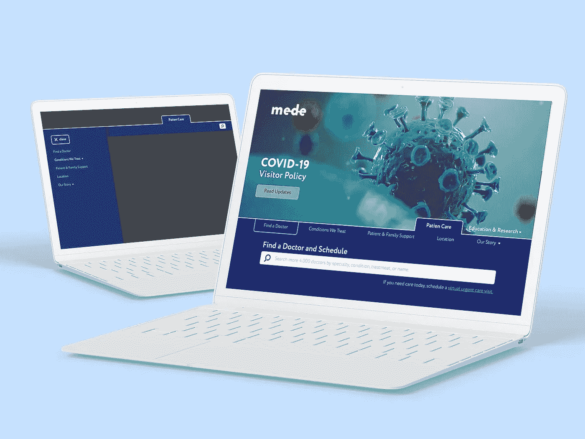

# 医疗保健网络应用:实践案例

> 原文：<https://medium.com/quick-code/case-from-practice-web-app-for-healthcare-d8cd231de083?source=collection_archive---------0----------------------->

由于医疗保健话题现在非常流行，我决定与您分享我们为患者开发 web 应用程序的激动人心的经验。这是一个大型而艰巨的项目，IntexSoft 的团队(我所在的公司)已经为此工作了数年。

由于某些原因，我不得不省略所有名称和一些细节:文章中的截图也仅用于演示目的——真实的应用程序看起来有点不同，但我希望您仍然会喜欢这篇文章。

# 背景

客户迫切需要扩展团队来开发应用程序。由于我们已经有了积极的合作经验，他们转向了我们。

该产品本身是一个大规模、多功能的 web 应用程序，允许您快速找到任何专业的医生，进行预约或接受在线咨询。

我们的团队只开发了一部分功能，尤其是我们将在本文中讨论的这些特性。

# 关键任务和解决方案

下面我将描述我们团队的主要任务以及我们解决这些任务的方法。

## 1.为内容管理者简化发布视频内容的流程

该应用程序有一个包含大量视频文件的合作伙伴信息部分。为了完成这项任务，我们使用了 Brightcove 服务，它允许我们将视频文件压缩到必要的参数，并为每个视频分配一个特定的 ID。这种**加快了视频内容的加载速度，并使放置文件的过程更加容易**。

## 2.按位置定制对所需专家的搜索

该应用程序有一个单独的单元，允许快速找到您需要的**医生**:用户可以进入页面，选择一个特定的州/区，并在地图上看到合作医生的位置以及所有必要的附加信息，**预约**，或**联系专家**进行在线咨询。为了实现这一功能，我们使用了谷歌地图。

我们还开发了一个特殊的 React 组件，它允许我们**过滤位置**并只显示那些有合作医生的地区

## 3.开发一个新冠肺炎信息块

客户要求创建一个部分，其中包含所有与病毒和流行病学情况最相关的**信息。通过点击弹出横幅中的链接，患者可以**预约**，或者请求**在线咨询**。**

## 4.让残障人士也能使用该应用程序

该项目最重要的任务之一是**将该应用程序调整为适用于有视觉障碍的人**。对于这个任务，在所有页面上，我们使用了 HTML 可访问性，它允许用户收听和浏览应用程序的内容。发声是通过屏幕阅读器进行的——苹果操作系统和苹果操作系统的画外音，安卓的反馈，视窗的 NV 访问。

顺便说一下，如果你对可及性这个话题感兴趣，那么你可能也喜欢[对我们的可及性测试专家的采访](https://www.intexsoft.com/blog/post/accessibility-testing.html)。

## 5.简化管理员的内容管理

应用程序包含在医疗中心研究和治疗的疾病的**部分。本节包含有关疾病和真实病例的详细信息。**

在创建这个部分时，我们使用了 CKEditor 来促进内容管理器的工作。对于特定对象的**详细显示**——有引用的块、画廊、有相关故事的块等。—我们开发了额外的插件。创建对象时，内容管理器可以为某个块选择一个现成的模板，然后插入文本，所有内容将以所需的格式显示在屏幕上。

对于疾病块，我们还开发了一个插件，允许内容管理器**将其他服务的视频**添加到 CKEditor。

## 6.设置本地化

为了配置本地化，我们在 React 上开发了一个独立的组件，允许用户在不同的语言 (10 种语言)之间**切换。**

## 7.加快页面加载时间

该应用程序有一个复杂的菜单，这可能会减慢页面的加载速度。根据客户的要求，我们创建了带有菜单项标题和必要数据的 HTML 文档，然后将这些文档添加到项目中。当您第一次进入网站时，**菜单被加载并缓存**，这加快了应用程序的工作。

该应用程序还包含许多其他静态元素。为了不使服务器过载，这里使用了**不同级别的缓存**。第一级通过 **Symfony** 进行，它作为前端和 Drupal 的链接，当页面完全形成时，所有内容都通过**清漆**缓存。

## 8.让应用程序具有响应性

我们团队面临的任务是使应用程序界面适应现代设备的主要类型——电脑、平板电脑和智能手机。在这方面，客户的设计者为每种类型的设备创建了一个单独的设计。为了实现这一点，我们使用了**网格布局系统**。因此，根据设备屏幕参数，应用程序界面以相应的大小显示。

由于这个应用程序有很多图片内容，所以 T2 也不得不进行调整，这样上传的原始图片就不会减慢移动设备的页面加载速度。为此，我们的专家为 **Drupal** 开发了一个特殊模块。现在，在添加内容时，只需上传一张原始大小的图片，模块会为某些设备创建 3 个不同质量的副本，并加载所需的内容。

# 应用程序的最终功能

**对于用户:**

*   按地区/能力搜索医生；
*   预约或在线咨询；
*   多语制(10 种语言)；
*   视力障碍者的无障碍环境；
*   为病人和医生提供有用信息的区块；
*   适用于主要类型的现代设备。
*   某些类型内容的现成模板；
*   简化的文本、图形和视频内容管理。

**对于管理员:**

*   某些类型内容的现成模板；
*   简化的文本、图形和视频内容管理。

# **使用的技术**

**前端:** HTML5，scss，React，Lodash，jQuery，Babel

**后端:** PHP，Symfony，Nginx

CMS:Drupal

数据库: MySQL

VCS: 詹金斯

**其他:**清漆、油漆、亮光漆

# 总结

结果，客户收到了一个多功能 web 应用程序，它极大地简化了为最终用户寻找必要的医疗专家的过程，也简化了网站管理员的内容管理过程。

P.S .如果你对这类文章感兴趣，就在下面的评论里写或者直接鼓掌。我会尽量多分享这样来自实践的真实案例。

*原载于 2020 年 6 月 29 日 https://intexsoft.com***。**