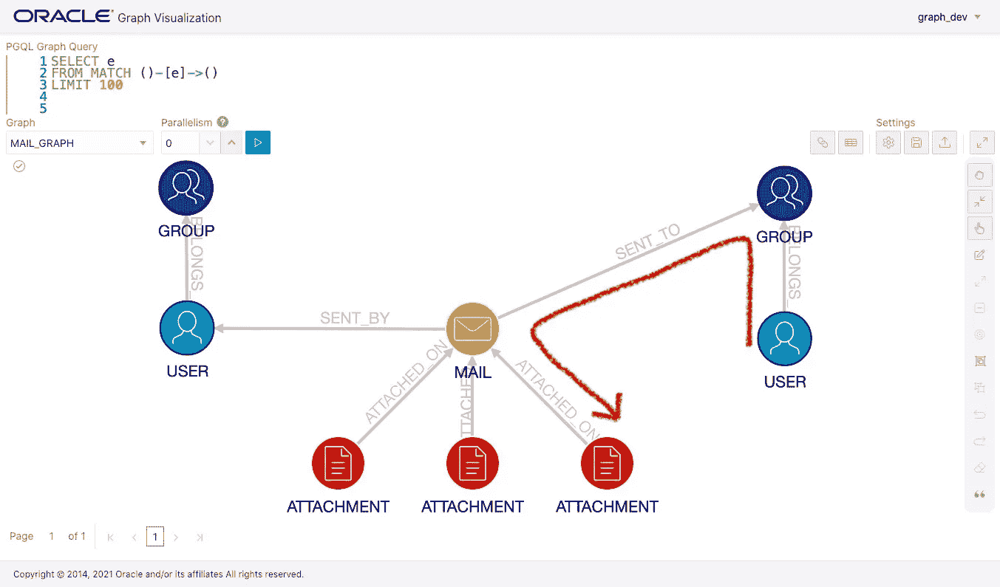
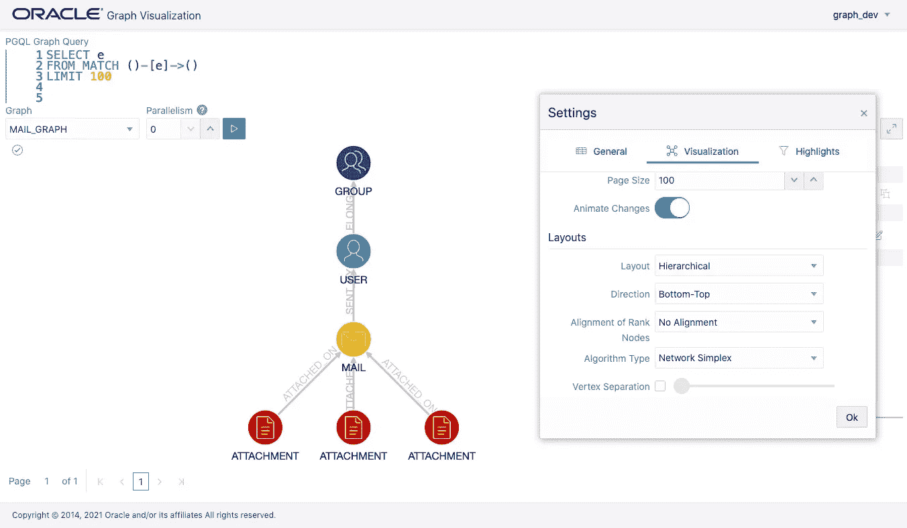
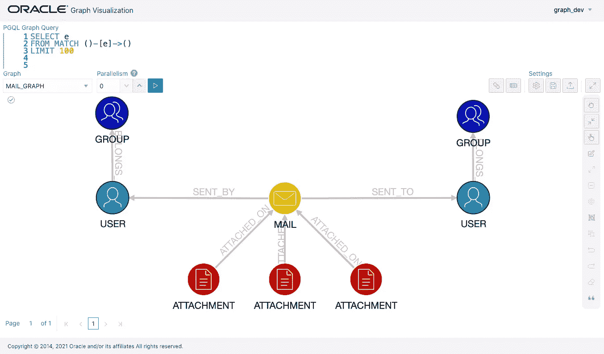
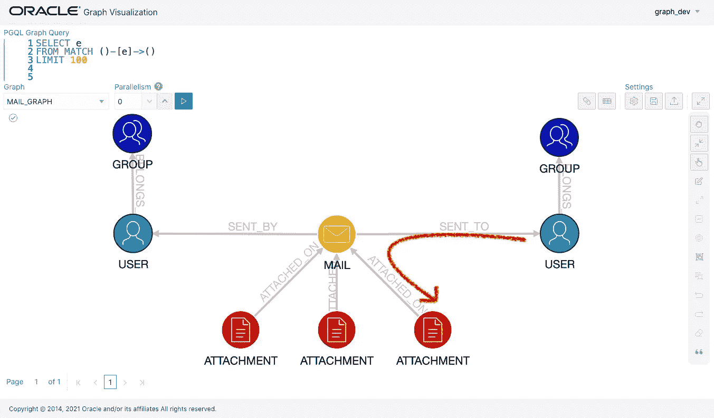

# 案例研究:使用图表管理用户权限

> 原文：<https://medium.com/oracledevs/case-study-manage-user-privileges-using-a-graph-672d0d9dfe5c?source=collection_archive---------2----------------------->



[**图形数据库**](https://www.oracle.com/big-data/what-is-graph-database/) 作为一种在应用程序中提供灵活的访问控制和安全性的方式，正引起人们的关注。即使在多级定义和嵌套授权用户组时，也可以使用图表轻松跟踪和检查上述层次结构中的所有授权用户组，并找到某个用户的权限。

例如，AMENIDY 的 [**Cybele 安全邮件**](https://cybele.cloud/) 服务是一种解决方案，它使用先进的加密技术和管理数据传输信息的数据库自动加密电子邮件附件。Oracle 数据库的 [**属性图**](https://www.oracle.com/database/graph/) 特性被引入到该系统中，这是因为对基于图形的声明性查询、十亿边规模图的稳定性和可伸缩性等图形数据库能力的需求，以及已建立的数据库安全性。

在这篇博文中，我将解释使用图形数据库管理电子邮件发件人和收件人之间关系的基本方法。请注意:此内容基于我对客户的采访；因此，**实际的系统行为、数据模型和查询可能与这里显示的不同**。直观数据模型和查询的优势在现实系统中可能更为显著，因为需要考虑更多的关系和条件。

**图形构成**

在此处的示例图中，用户、用户所属的组、用户发送的电子邮件以及电子邮件所附的文件分别被视为节点。


此外，一封电子邮件有一个发件人和多个收件人(=用户或组)的边来表示电子邮件传输的信息。


**给图添加节点和边**

首先，让我们考虑当一封电子邮件被发送时会发生什么。可以假设，当用户发送一封带有三个附件的电子邮件时，将发出以下两个 PGQL 查询。PGQL 查询语法见[https://pgql-lang.org/](https://pgql-lang.org/)。

第一个 PGQL 查询添加了一个邮件节点和一条将它连接到用户`user_01`的边。这个节点被标记为`mail`,表示它是一个邮件节点，并且具有 name 属性，该属性的值为`mail_01`。边缘标记为`sent_by`。

```
INSERT VERTEX v LABELS (mail) PROPERTIES (v.name = 'mail_01'),
       EDGE e BETWEEN v AND u LABELS (sent_by)
FROM MATCH (u:user)
WHERE u.email = 'user_01@example.com'
```

下面的 PGQL 查询向上面刚刚创建的邮件节点添加了三个附件节点。

```
INSERT VERTEX v1 LABELS (attachment)
         PROPERTIES (v1.name = 'attachment_01'),
       VERTEX v2 LABELS (attachment)
         PROPERTIES (v2.name = 'attachment_02'),
       VERTEX v3 LABELS (attachment)
         PROPERTIES (v3.name = 'attachment_03'),
       EDGE e1 BETWEEN v1 AND m LABELS (attached_on),
       EDGE e2 BETWEEN v2 AND m LABELS (attached_on),
       EDGE e3 BETWEEN v3 AND m LABELS (attached_on)
FROM MATCH (m:mail)
WHERE m.name = 'mail_01';
```

此时创建的图形可以如下所示。



此外，它还存储该电子邮件发送给了哪些用户。如果目标用户尚未在此数据库中创建，您需要首先添加它。以下两个 PGQL 查询在现有组下添加一个目标用户节点，并为该用户添加一个边。

创建一个目的用户节点，并用一条`belongs_to`边将其连接到组节点。

```
INSERT VERTEX v LABELS (user)
         PROPERTIES (v.name = 'user_02@example.com'),
       EDGE e BETWEEN v AND g LABELS (belongs_to)
FROM MATCH (g:group)
WHERE g.email = 'group_01@example.com'
```

添加一条从 email 节点到新创建的用户节点的`sent_to`边。

```
INSERT EDGE e BETWEEN m AND u LABELS (sent_to)
FROM MATCH (m:mail), MATCH (u:user)
WHERE m.name = 'mail_01' AND u.email = 'user_02@example.com'
```



**检查图中的可达性**

电子邮件的收件人需要在打开附件时从服务器获取密钥。通过这样做，该系统的用户可以通过不同的途径安全地获得加密的数据及其密钥。

此时，服务器运行以下查询来检查此电子邮件是否已发送给该特定用户。

```
SELECT m.name
FROM MATCH (a)-[:attached_on]->(m)-[:sent_to]->(u) 
WHERE a.name = 'attachment_01'
  AND u.email = 'user_02@example.com'
```

JShell 中的输出如下。返回一条记录，这意味着路径存在。

```
+ --------- +
| NAME      |
+ --------- +
| mail_01   |
+ --------- +
```



如果电子邮件被发送到组而不是用户，那么通过跟踪组节点，他们应该仍然是可到达的。让我们改变这封邮件的目的地。

首先，删除`sent_to`边缘。

```
DELETE e
FROM MATCH (m:mail)-[e:sent_to]->(u:user)
WHERE m.name = 'mail_01' AND u.email = 'user_02@example.com'
```

为组节点创建新的 sent_to 边。

```
INSERT EDGE e BETWEEN m AND g LABELS (sent_to)
FROM MATCH (m:mail), MATCH (g:group)
WHERE m.name = 'mail_01' AND g.email = 'group_02@example.com'
```

将组节点添加到`MATCH`子句并搜索路径。

```
SELECT m.name
FROM MATCH
  (a)-[:attached_on]->(m)-[:sent_to]->(g)<-[:belongs_to]-(u)
WHERE a.name = 'attachment_01'
  AND u.email = 'user_02@example.com'
```

记录被返回，因此路径存在。

```
+ --------- +
| NAME      |
+ --------- +
| mail_01   |
+ --------- +
```


即使组节点包括未指定数量的层次结构，您也可以找到可达性。例如，下面的查询上升到 5 个级别，并检查这些组节点是否连接到邮件节点。

```
SELECT m.name
FROM MATCH
  (a)-[:attached_on]->(m)-[:sent_to]->(g)<-/:belongs_to{1,5}/-(u)
WHERE a.name = 'attachment_01'
  AND u.email = 'user_02@example.com'
```

**总结**

这篇博客文章提供了一个使用 Oracle 数据库的属性图特性来管理发送和接收电子邮件的用户活动的例子。通过向图中添加更多的关系和条件，可以管理除电子邮件之外的用户之间的各种活动，并扩展系统的功能。例如，附件的截止日期可以存储在节点或边的属性中。这种数据库功能使我们能够快速有效地向各种服务引入灵活的细粒度访问控制。

**链接**

*   AMENIDY Cybele 安全邮件:[https://cybele.cloud/](https://cybele.cloud/)
    ame nidy 是一家安全解决方案提供商，总部位于日本，是 Oracle 云用户。
*   Oracle 数据库的属性图特性:[https://www.oracle.com/database/graph/](https://www.oracle.com/database/graph/)
*   图形数据库和图形分析的 17 个用例:
    [https://www . Oracle . com/cloud/solutions/Use-Cases-for-Graph-Databases-and-Graph-Analytics-ebook/](https://www.oracle.com/cloud/solutions/use-cases-for-graph-databases-and-graph-analytics-ebook/)

如果您想分享您的反馈或向社区提问，请点击[此处](https://join.slack.com/t/andouc/shared_invite/zt-mfbk0un9-E7mgQweUfBnJ6BfRgcTeMQ)加入 AnDOUC(分析和数据 Oracle 用户社区)Slack workspace，并在 [#graph](https://andouc.slack.com/archives/C01BMHU02JX) 频道发表您的评论。