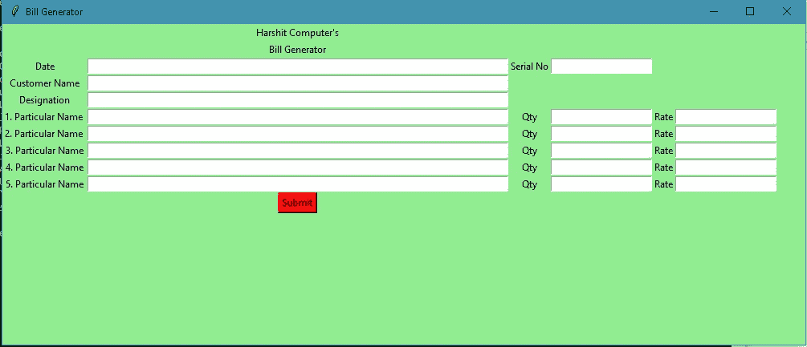
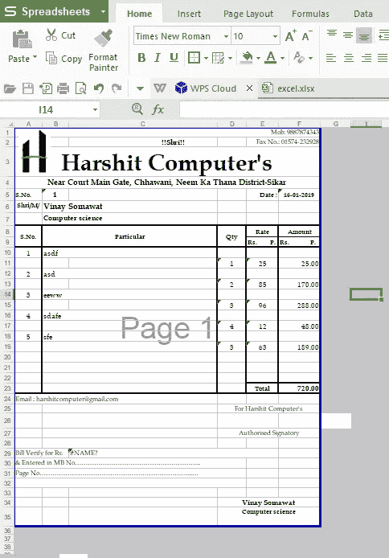

# 我如何为当地商店建立现金备忘录和账单生成器

> 原文：<https://medium.com/quick-code/cash-memo-bills-generator-for-local-shops-25e56fa0cc3c?source=collection_archive---------3----------------------->


如今，每当顾客买东西时，索要账单或现金备忘录，以便进一步询问与产品相关的问题。

对于当地商店来说，创建 excel 表格和制作现金备忘录/账单需要花费大量时间。所以我们想出了一个解决方案，店主只需要输入数据，账单就会通过脚本自动生成。

在本教程中，我们将学习如何开发这种 GUI 来生成账单。
*如下图:*



## 在我们开始之前…

确保您的系统中安装了 python。
如果没有，请从这里的[下载。](https://www.python.org/)

## 让我们开始吧:

*创建一个文件夹:* `>mkdir BillGenerator
>cd BillGenerator`

*创建一个 python 文件:* `BillGenerator>type nul > registration.py`

**源代码:** `BillGenerator/registration.py`

```
from openpyxl import *
from tkinter import *#make sure the file already exists in folder.
wb = load_workbook('F:\\Codes\\BillGenerator\\excel.xlsx')sheet = wb.activedef excel():
 sheet.cell(row=1, column=1).value = "Mob: 98xxxxxxx3"def focus1(event): 
 date.focus_set()def focus2(event): 
 serial_no.focus_set()def focus3(event): 
 customer_name.focus_set()def focus4(event): 
 designation.focus_set()def focus5(event): 
 particular1_name.focus_set()def focus6(event):
 particular1_qty.focus_set()def focus7(event):
 particular1_rate.focus_set()def focus8(event): 
 particular2_name.focus_set()def focus9(event):
 particular2_qty.focus_set()def focus10(event):
 particular2_rate.focus_set()def focus11(event): 
 particular3_name.focus_set()def focus12(event):
 particular3_qty.focus_set()def focus13(event):
 particular3_rate.focus_set()def focus14(event): 
 particular4_name.focus_set()def focus15(event):
 particular4_qty.focus_set()def focus16(event):
 particular4_rate.focus_set()def focus17(event): 
 particular5_name.focus_set()def focus18(event):
 particular5_qty.focus_set()def focus19(event):
 particular5_rate.focus_set()def clear(): 

 date.delete(0, END) 
 serial_no.delete(0, END) 
 customer_name.delete(0, END) 
 designation.delete(0, END) 
 particular1_name.delete(0, END) 
 particular1_qty.delete(0, END) 
 particular1_rate.delete(0, END) 
 particular2_name.delete(0, END) 
 particular2_qty.delete(0, END) 
 particular2_rate.delete(0, END)  
 particular3_name.delete(0, END) 
 particular3_qty.delete(0, END) 
 particular3_rate.delete(0, END)  
 particular4_name.delete(0, END) 
 particular4_qty.delete(0, END) 
 particular4_rate.delete(0, END)  
 particular5_name.delete(0, END) 
 particular5_qty.delete(0, END) 
 particular5_rate.delete(0, END)def insert(): 
 if (date.get() == "" and
  serial_no.get() == "" and
  customer_name.get() == "" and
  designation.get() == "" and
  particular1_name.get() == "" and
  particular1_qty.get() == "" and
  particular1_rate.get() == "" and
  particular2_name.get() == "" and
  particular2_qty.get() == "" and
  particular2_rate.get() == "" and
  particular3_name.get() == "" and
  particular3_qty.get() == "" and
  particular3_rate.get() == "" and
  particular4_name.get() == "" and
  particular4_qty.get() == "" and
  particular4_rate.get() == "" and
  particular5_name.get() == "" and
  particular5_qty.get() == "" and
  particular5_rate.get() == ""): 

  print("empty input")else: 
  current_row = sheet.max_row 
  current_column = sheet.max_columnsheet.cell(row=5, column=6).value = date.get() 
  sheet.cell(row=5, column=2).value = serial_no.get() 
  sheet.cell(row=6, column=2).value = customer_name.get() 
  sheet.cell(row=7, column=2).value = designation.get() 
  sheet.cell(row=10, column=2).value = particular1_name.get() 
  sheet.cell(row=11, column=4).value = particular1_qty.get() 
  sheet.cell(row=11, column=5).value = particular1_rate.get()
  sheet.cell(row=12, column=2).value = particular2_name.get() 
  sheet.cell(row=13, column=4).value = particular2_qty.get() 
  sheet.cell(row=13, column=5).value = particular2_rate.get() 
  sheet.cell(row=14, column=2).value = particular3_name.get() 
  sheet.cell(row=15, column=4).value = particular3_qty.get() 
  sheet.cell(row=15, column=5).value = particular3_rate.get() 
  sheet.cell(row=16, column=2).value = particular4_name.get() 
  sheet.cell(row=17, column=4).value = particular4_qty.get() 
  sheet.cell(row=17, column=5).value = particular4_rate.get()
  sheet.cell(row=18, column=2).value = particular5_name.get() 
  sheet.cell(row=19, column=4).value = particular5_qty.get() 
  sheet.cell(row=19, column=5).value = particular5_rate.get()# save the file 
  wb.save('F:\\Codes\\BillGenerator\\excel.xlsx')date.focus_set()clear()# Driver code 
if __name__ == "__main__": 

 root = Tk()root.configure(background='light green')root.title("Bill Generator")root.geometry("1000x400")excel()heading = Label(root, text="Harshit Computer's", bg="light green")heading2= Label(root, text="Bill Generator", bg="light green")date = Label(root, text="Date", bg="light green")serial_no = Label(root, text="Serial No", bg="light green")customer_name = Label(root, text="Customer Name", bg="light green")designation = Label(root, text="Designation", bg="light green")particular1_name = Label(root, text="1\. Particular Name ", bg="light green")particular1_qty = Label(root, text="Qty", bg="light green")particular1_rate = Label(root, text="Rate", bg="light green")particular2_name = Label(root, text="2\. Particular Name ", bg="light green")particular2_qty = Label(root, text="Qty", bg="light green")particular2_rate = Label(root, text="Rate", bg="light green")particular3_name = Label(root, text="3\. Particular Name", bg="light green")particular3_qty = Label(root, text="Qty", bg="light green")particular3_rate = Label(root, text="Rate", bg="light green")particular4_name = Label(root, text="4\. Particular Name", bg="light green")particular4_qty = Label(root, text="Qty", bg="light green")particular4_rate = Label(root, text="Rate", bg="light green")particular5_name = Label(root, text="5\. Particular Name", bg="light green")particular5_qty = Label(root, text="Qty", bg="light green")particular5_rate = Label(root, text="Rate", bg="light green")heading.grid(row=10,column=19)
 heading2.grid(row=11, column=19)
 date.grid(row=12, column=18) 
 serial_no.grid(row=12, column=21) 
 customer_name.grid(row=13, column=18) 
 designation.grid(row=14, column=18) 
 particular1_name.grid(row=15, column=18) 
 particular1_qty.grid(row=15, column=21) 
 particular1_rate.grid(row=15, column=23)
 particular2_name.grid(row=16, column=18) 
 particular2_qty.grid(row=16, column=21) 
 particular2_rate.grid(row=16, column=23) 
 particular3_name.grid(row=17, column=18) 
 particular3_qty.grid(row=17, column=21) 
 particular3_rate.grid(row=17, column=23) 
 particular4_name.grid(row=18, column=18) 
 particular4_qty.grid(row=18, column=21) 
 particular4_rate.grid(row=18, column=23) 
 particular5_name.grid(row=19, column=18) 
 particular5_qty.grid(row=19, column=21) 
 particular5_rate.grid(row=19, column=23)date = Entry(root) 
 serial_no = Entry(root) 
 customer_name = Entry(root) 
 designation = Entry(root) 
 particular1_name = Entry(root) 
 particular1_qty = Entry(root) 
 particular1_rate = Entry(root) 
 particular2_name = Entry(root) 
 particular2_qty = Entry(root) 
 particular2_rate = Entry(root) 
 particular3_name = Entry(root) 
 particular3_qty = Entry(root) 
 particular3_rate = Entry(root) 
 particular4_name = Entry(root) 
 particular4_qty = Entry(root) 
 particular4_rate = Entry(root) 
 particular5_name = Entry(root) 
 particular5_qty = Entry(root) 
 particular5_rate = Entry(root)date.bind("<Return>", focus1)serial_no.bind("<Return>", focus2)customer_name.bind("<Return>", focus3)designation.bind("<Return>", focus4)particular1_name.bind("<Return>", focus5)particular1_qty.bind("<Return>", focus6)particular1_rate.bind("<Return>", focus7)particular2_name.bind("<Return>", focus8)particular2_qty.bind("<Return>", focus9)particular2_rate.bind("<Return>", focus10)particular3_name.bind("<Return>", focus11)particular3_qty.bind("<Return>", focus12)particular3_rate.bind("<Return>", focus13)particular4_name.bind("<Return>", focus14)particular4_qty.bind("<Return>", focus15)particular4_rate.bind("<Return>", focus16)particular5_name.bind("<Return>", focus17)particular5_qty.bind("<Return>", focus18)particular5_rate.bind("<Return>", focus19)date.grid(row=12, column=19, ipadx="200") 
 serial_no.grid(row=12, column=22, ipadx="1") 
 customer_name.grid(row=13, column=19, ipadx="200") 
 designation.grid(row=14, column=19, ipadx="200") 
 particular1_name.grid(row=15, column=19, ipadx="200") 
 particular1_qty.grid(row=15, column=22, ipadx="1") 
 particular1_rate.grid(row=15, column=24, ipadx="1")
 particular2_name.grid(row=16, column=19, ipadx="200") 
 particular2_qty.grid(row=16, column=22, ipadx="1") 
 particular2_rate.grid(row=16, column=24, ipadx="1")
 particular3_name.grid(row=17, column=19, ipadx="200") 
 particular3_qty.grid(row=17, column=22, ipadx="1") 
 particular3_rate.grid(row=17, column=24, ipadx="1")
 particular4_name.grid(row=18, column=19, ipadx="200") 
 particular4_qty.grid(row=18, column=22, ipadx="1") 
 particular4_rate.grid(row=18, column=24, ipadx="1")
 particular5_name.grid(row=19, column=19, ipadx="200") 
 particular5_qty.grid(row=19, column=22, ipadx="1") 
 particular5_rate.grid(row=19, column=24, ipadx="1") 

 excel()submit = Button(root, text="Submit", fg="Black", 
       bg="Red", command=insert) 
 submit.grid(row=30, column=19)# start the GUI 
 root.mainloop()
```

*现在运行这个 python 文件:*

```
/BillGenerator>python registration.py#A GUI will pop up as below picture.
```


输入所有实体，然后按提交。

*并查看文件夹中的 excel.xlsx 工作表。*



打印出来并分发给顾客。

如果您没有账单模板，请点击此处下载 excel 模板[。](https://github.com/vinaysomawat/Bill-Generator/blob/master/excel.xlsx)

> 通常店主没有编程知识，不知道如何运行 python 文件，对他们来说，一遍又一遍地运行文件会更麻烦。

*所以，创建一个. bat 文件:*

`Bill Generator/myScript.bat`

```
ECHO ON
REM A batch script to execute a Python script
SET PATH=%PATH%;F:\Codes\Bill Generator
python registration.py
PAUSE
```

**注意:**在上面的代码中输入你的文件位置。双击 myScript.bat 文件运行该文件。它将运行`registration.py`文件。

> 我做错了什么吗？请在评论中提及。我很想进步。如果你学到了哪怕是一两件事，就鼓掌吧👏尽可能多的次数来表示你的支持！你好，世界，我是 Vinay Somawat。一个有创造力的开发者和一个有逻辑的设计师。你可以在 Linkedin 上找到我，或者在 GitHub 上跟踪我，或者在 Twitter 上关注我？如果这对你来说太社交化了，如果你想和我讨论技术，就给 vinaysomawat40@gmail.com 发封邮件。
> 
> 祝您愉快！