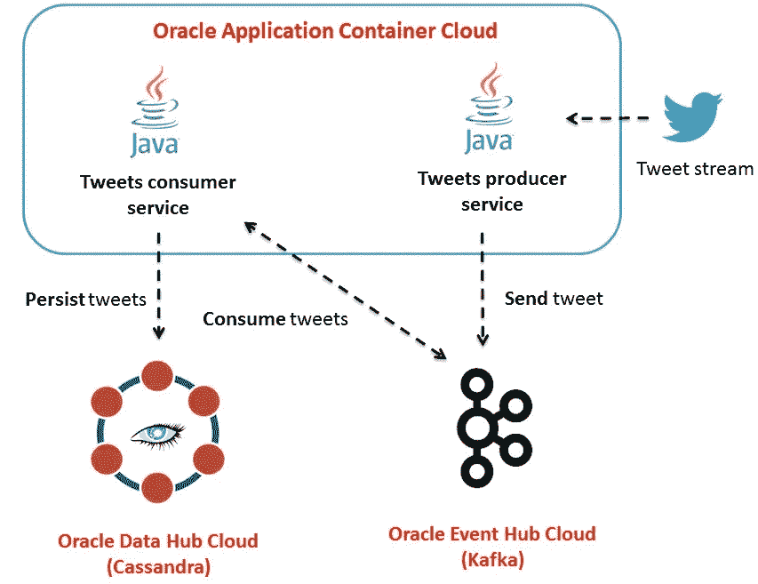
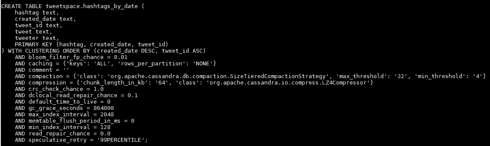
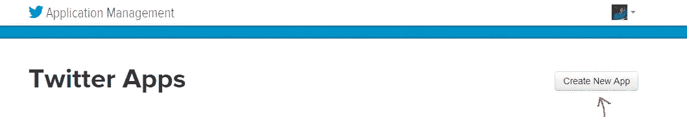
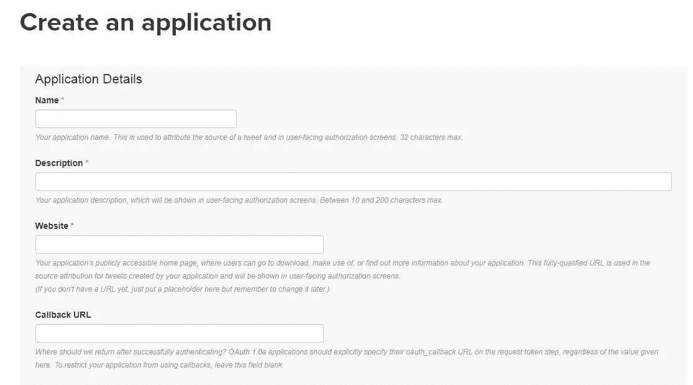
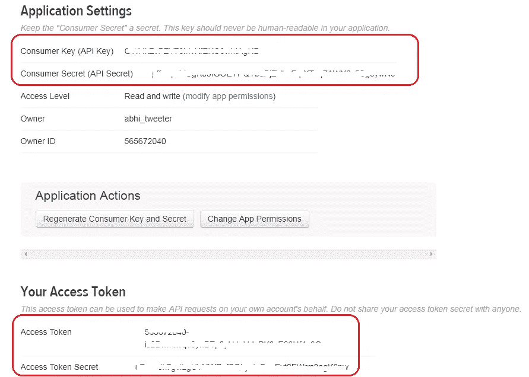
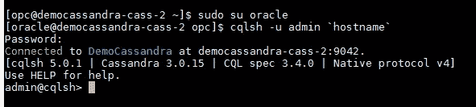
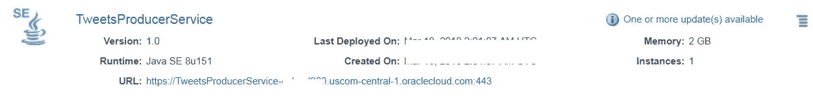
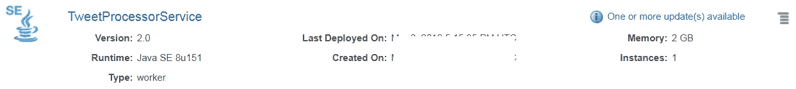
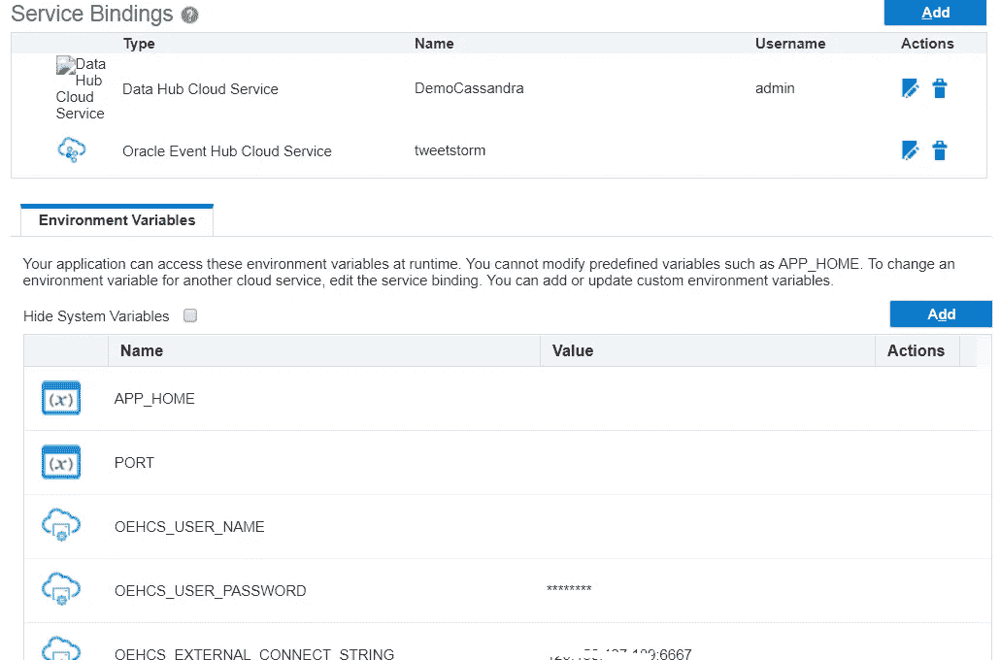

# 基于应用容器云的卡珊德拉和卡夫卡推文分析应用

> 原文：<https://medium.com/oracledevs/cassandra-kafka-based-tweet-analysis-app-on-application-container-cloud-19febe0edeee?source=collection_archive---------1----------------------->

之前的一篇博客展示了一个使用 Apache Cassandra 和其他组件的简单推文分析应用，其中

*   消费者服务接收连续的推文流，并以时间序列格式将它们推送到 Cassandra 集群(在 Oracle 数据中心云上)
*   这些 tweets 然后通过 REST API 以可查询的格式公开

> 上面的解决方案有一个变体，其中 tweet 查询服务是用 Go 编写的

[](/oracledevs/build-a-go-lang-based-rest-api-on-top-of-cassandra-3ac5d9316852) [## 构建一个基于 Go 的 REST API 来查询 Cassandra 中的时间序列 tweet 数据

medium.com](/oracledevs/build-a-go-lang-based-rest-api-on-top-of-cassandra-3ac5d9316852) 

这篇博文是上述用例的另一个变体

*   **推文是如何持久化的？**从 Twitter 流 API 消费的推文现在被推送到 Kafka 中的一个主题(而不是直接将它们保存到 Cassandra)
*   **推文是如何消费的？**我们有了一种新的消费者服务(一个 **worker** app ),它处理来自 Kafka 的推文，添加特定的处理逻辑，最后将它们持久化到 Cassandra
*   **如何查询？**Cassandra 表数据模型已经过调整，允许不同风格的查询(与以前的实现相比)

# 体系结构



high level architecture

# 解决办法

> Github 上有源代码

[](https://github.com/abhirockzz/accs-kafka-cassandra-tweet-analysis-sample) [## abhirockzz/accs-卡夫卡-卡珊德拉-推特-分析-样本

### 带有 kafka 和 cassandra 的 accs-Kafka-Cassandra-Tweet-analysis-sample-Tweet 分析应用程序

github.com](https://github.com/abhirockzz/accs-kafka-cassandra-tweet-analysis-sample) 

## 推特制作应用

*   这是一个 Java 应用程序，使用`[**twitter4j**](http://twitter4j.org/en/)`库来消费 tweet 流
*   应用用户定义的过滤标准/术语从流中过滤相关推文
*   一个基于[杰克森](https://github.com/FasterXML/jackson) `ObjectMapper` 的自定义序列化程序(`org.apache.kafka.common.serialization.Serializer`)并将其推送到一个卡夫卡主题
*   它提供了一个 REST API 来按需启动/停止应用程序，例如`/tweets/producer`

## Tweet 处理器服务

*   基本上是一个 Kafka 消费应用程序，消费 Kafka 主题的推文
*   它被建模为 Oracle 应用容器云中的一个**工人**服务——下面将详细介绍
*   反序列化(自定义`org.apache.kafka.common.serialization.Deserializer`)将 tweet 数据从 topic 转换成 POJO，最后
*   将这个内存中的 Java 对象持久化到一个 Cassandra 表中(`hashtags_by_date`)

## 工人应用程序

工作应用程序不同于传统的 ACCS 应用程序

*   它们不能通过公共 URL 访问
*   它们并不要求需要[绑定到$PORT 环境变量](https://docs.oracle.com/en/cloud/paas/app-container-cloud/dvcjv/design-considerations.html)

他们将继续享受 ACCS 平台的所有其他功能，如[服务绑定](https://docs.oracle.com/en/cloud/paas/app-container-cloud/csjse/exploring-application-deployments-page.html#GUID-BCD4C8AA-0E1C-490D-92E8-6BAE003F5F5C)等。(更多信息见[文档](https://www.oracle.com/pls/topic/lookup?ctx=en/cloud/paas/app-container-cloud/jsewn&id=DVCJV-GUID-3052AEC3-E29F-4341-AB0C-B3D0D415FECA))

> 这是一篇展示 worker 应用程序(使用 Redis)的博客文章

[](/oracledevs/worker-applications-on-oracle-application-container-cloud-f449eaa77c39) [## Oracle 应用容器云上的工作人员应用

medium.com](/oracledevs/worker-applications-on-oracle-application-container-cloud-f449eaa77c39) 

## 数据模型

以下是数据模型的总结…



**hashtags_by_date** in Cassandra

`hashtag` 用作**分区**键

*   tweet 持久化到哪个节点取决于`hashtag`，例如，所有带有`java` 标签的 tweet 都将在同一个节点上
*   必须在`**WHERE**` 子句中使用它，即主要查询模式将基于`hashtag` (在**试驾**部分中有关于查询的更多详细信息)

`created_date` 用作第一个**聚类列**，具有明确的`DESC` 排序

*   最新的推文将首先显示
*   可以使用该属性进行**范围查询**，即根据 tweet 日期深入查看标签

`tweet_id` 是第二个**聚类列**，其唯一目标是提供唯一的主键

*   对于特定推文的日期，每个标签都有一个唯一的行，即如果一条推文有多个标签，每个标签都将存储在单独的行中，并可以进行相应的查询
*   `tweet_id` 由 twitter 生成，不支持查询，所以我们不会在`WHERE` 子句中使用它

> **扩展处理器服务**
> 
> 在 light 中扩展 tweet 处理器服务就像添加更多实例一样简单(水平扩展)—扩展的限制由 Kafka 主题的分区数量决定，其中 tweet 最初由生产者服务存放，例如，如果主题有 50 个分区，您可以将处理器应用程序扩展到 50 个实例，每个实例将使用一个分区(一对一映射)

## Oracle 应用容器云中的服务绑定

应用容器云为数据中枢云提供现成的服务绑定。这为你的应用程序提供了一个安全的通信渠道，而无需你做任何明确的事情

> 在数据库基础设施级别不需要与端口相关的配置

[这是这个功能的文档](https://www.oracle.com/pls/topic/lookup?ctx=en/cloud/paas/app-container-cloud/jsewn&id=GUID-BCD4C8AA-0E1C-490D-92E8-6BAE003F5F5C)

# 基础设施设置

## **提供 Kafka 集群**

在这种情况下使用的 Kafka 集群拓扑相对简单，即单个代理与 Zookeeper 位于同一位置。您可以选择特定于您需求的拓扑结构，例如具有 5 个节点 Kafka 集群和 3 个 Zookeeper 节点的 HA 部署

> 请参考[文档](http://docs.oracle.com/en/cloud/paas/event-hub-cloud/ehcug/creating-cluster.html)了解更多关于拓扑和详细安装过程的详细信息

## **创建主题**

遵循[文档](http://docs.oracle.com/en/cloud/paas/event-hub-cloud/ehcug/creating-topic.html)创建主题——请确保在后续章节中使用正确的主题名称

## **提供卡珊德拉集群**

从引导一个新集群开始—这里有详细的[文档](https://docs.oracle.com/en/cloud/paas/data-hub-cloud/user/creating-cluster.html)(也可以使用 CLI 来完成这个

> **Cassandra 对象**—keyspace(`tweetspace`)和 table ( `hashtags_by_date`)由 producer 应用程序在启动时创建

## 创建您的 Twitter 应用程序

您需要在 Twitter 中设置一个应用程序，以便访问您将在 **Tweet Producer service** 中使用的安全令牌/密钥

首先访问[https://apps.twitter.com/](https://apps.twitter.com/)和**创建新应用**



Create a new Twitter app



Fill in the required details

完成后，请检查**密钥和访问令牌**部分以获得所需的信息——您将在应用程序部署期间使用它



Twitter Keys and Access Tokens

# 构建、配置和部署

## **构建**

## **推文制作 app**

*   `cd accs-kafka-tweets-producer`
*   `mvn clean install`

构建过程将在`target` 目录中创建`accs-kafka-tweets-producer-dist.zip`

## Tweets 处理器服务

*   `cd accs-cassandra-tweets-processor`
*   `mvn clean install`

构建过程将在`target` 目录中创建`accs-cassandra-tweets-processor-dist.zip`

## 部署也称为向云推进

借助 Oracle Application Container Cloud，您在部署应用程序方面有多种选择。本博客将利用 **PSM CLI** ，这是一个用于管理 Oracle 云服务的强大命令行界面

> 其他部署选项包括 [REST API](https://docs.oracle.com/en/cloud/paas/app-container-cloud/apcsr/index.html) 、 [Oracle 开发人员云](https://docs.oracle.com/en/cloud/paas/developer-cloud/csdcs/deploying-application-oracle-developer-cloud-service.html#GUID-6FE6D850-65DC-471D-A249-F7CCA9CAB56F)，当然还有[控制台/UI](https://docs.oracle.com/en/cloud/paas/app-container-cloud/csjse/creating-application.html)

您可以在您的机器上下载并设置 PSM CLI(使用`psm setup` ) — [详情请点击](https://docs.oracle.com/en/cloud/paas/java-cloud/pscli/using-command-line-interface-1.html)

部署这两个应用程序

**部署推特制作人**

使用您的 Twitter 访问令牌、Oracle Event Hub Cloud 实例详细信息(使用您之前创建的 Event Hub Kafka 主题的名称)以及您希望使用 Twitter 关注/跟踪的术语/主题(`TWITTER_TRACKED_TERMS`)更新`deployment.json`

deployment.json for tweet producer app

把拉链放进云里！

`psm accs push -n **TweetsProducerService** -r java -s hourly -m manifest.json -d deployment.json -p target/accs-kafka-tweets-producer-dist.zip`

确认是否已创建所需的 Cassandra 对象

**SSH 进入 Cassandra 节点**

> 详细文档[可在此处获得](https://docs.oracle.com/en/cloud/paas/data-hub-cloud/user/connecting-cluster-node-secure-shell-ssh.html#GUID-16765BDA-5713-43C7-82D4-5EE62E31C481)

***火起来 cqlsh***

`sudo su oracle` —此处的相关[信息](https://docs.oracle.com/en/cloud/paas/data-hub-cloud/user/linux-user-accounts.html)

`cqlsh -u admin `hostname``



**cqlsh** on Data Hub

***健全性检查***

```
//get keyspace details
desc tweetspace//switch to the correct keyspace
USE tweetspace//query the table
select * from hashtags_by_table;
```

**部署 Tweet 处理器服务**

更新此服务的`deployment.json`—包括数据中心云服务实例和事件中心云主题的详细信息

deployment.json for tweet processor service

..并部署这个应用程序

`psm accs push -n **TweetProcessorService** -r java -s hourly -m manifest.json -d deployment.json -p target/accs-cassandra-tweets-processor-dist.zip`

> 一旦执行，异步进程就会启动，CLI 会返回其作业 ID，以便您跟踪应用程序的创建

部署应用程序后，导航到 Oracle 应用程序容器云应用程序页面进行确认



Tweet **Producer** service



Tweet **Processor** service

这里是作为结果创建的**服务绑定**(前面解释过)和环境变量(还有几个没有包括在这里)的快照



**Service Bindings** to Oracle PaaS services

# 试车

一切都准备好了——是时候看看实际情况了

## **启动推文制作 app**

`curl -X GET <tweet_producer_app_url>/tweets/producer`例如`curl -X GET [https://**TweetsProducer**-ocloud200.uscom-central-1.oraclecloud.com](https://tweetsproducer-ocloud200.uscom-central-1.oraclecloud.com/)/tweets/producer`

> 等待一段时间(大约一分钟左右)，让制作人进入角色

如果您[检查应用程序容器云中的日志](https://docs.oracle.com/en/cloud/paas/app-container-cloud/csjse/exploring-application-administration-page.html#GUID-3AEE3584-5DBA-463A-A274-07DF90F8A0E7)，您应该会看到类似的内容，表明 tweet 流处理已经启动

`INFO: started producer thread
Establishing connection.
Connection established.
Receiving status stream.`

您可以随时通过发出`HTTP DELETE`即`curl -X DELETE <tweet_producer_app_url>/tweets/producer`例如`curl -X DELETE [https://**TweetsProducer**-ocloud200.uscom-central-1.oraclecloud.com](https://tweetsproducer-ocloud200.uscom-central-1.oraclecloud.com/)/tweets/producer`来停止 tweet producer

> Tweets 处理器服务
> 
> 没有办法显式地启动 Tweets 处理器服务(毕竟它是一个**工人**应用程序，不通过公共 URL 公开)——作为一个(Kafka)消费者，它在事件中心云中与主题挂钩，并不断搅动

您现在可以检查结果…

## **SSH 进入数据中枢云虚拟机**

> 详细文档[可在此处获得](https://docs.oracle.com/en/cloud/paas/data-hub-cloud/user/connecting-cluster-node-secure-shell-ssh.html#GUID-16765BDA-5713-43C7-82D4-5EE62E31C481)

登录`cqlsh` 执行这些查询

```
sudo su oraclecqlsh -u admin `hostname`//switch to the correct keyspace
USE tweetspace
```

## 执行以下查询

这些是

*   基本查询—提取与特定标签和日期相关的信息
*   范围查询—允许一个或多个 hashtags 的日期范围查询
*   聚合查询—在从基本查询和范围查询中获得的信息的基础上添加计数功能(本身就是一种聚合)

请根据以下情况调整这些查询

*   你开始提取推文的日期
*   您过滤的关键字(使用 tweet producer service 中的`TWITTER_TRACKED_TERMS` 环境变量)

# 摘要

这个博客到此为止。我们覆盖了

*   我们基于 Kafka 和 Cassandra 的 tweets 处理应用程序的架构，以及数据模型和相关细节
*   设置和部署，最后，
*   测试了我们的服务

# 不要忘记…

*   查看 Oracle Application Container Cloud 教程—每个运行时都有适合的内容！

 [## Oracle 应用容器云服务—创建您的第一批应用

### Oracle 应用容器云服务教程。学习创建你的第一个应用程序。

docs.oracle.com](https://docs.oracle.com/en/cloud/paas/app-container-cloud/create-first-applications.html) 

*   关于应用程序容器云的其他博客

干杯！

> 本文表达的观点是我个人的观点，不一定代表甲骨文的观点。