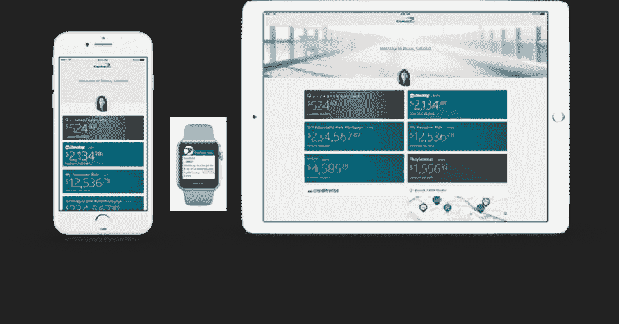
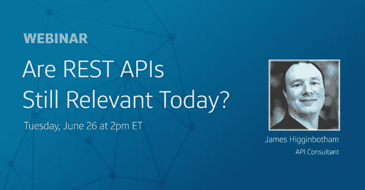
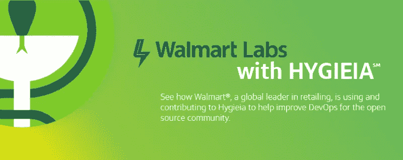

# 了解 REST APIs、移动开发和开源 DevOps 仪表板工具 Hygieia

> 原文：<https://medium.com/capital-one-tech/catch-up-on-rest-apis-mobile-development-and-the-open-source-devops-dashboard-tool-hygieia-12c570eb5466?source=collection_archive---------9----------------------->

夏天正式来到了，首都一台 DevExchange 认为我们应该分享一些我们在这个假期里读到和听到的东西。

# **改为**

[**基于插件的架构和缩放 Capital One 的 iOS 开发**](/capital-one-developers/plugin-based-architecture-and-scaling-ios-development-at-capital-one-fb67561c7df6)**——一个庞大的移动组织如何能够每隔一周发布一次他们旗舰应用的新版本而不牺牲质量？Capital One iOS 工程师 Korhan Bircan 解释了我们如何在 Capital One iOS 应用程序背后构建基于插件的架构。**

**[**更好的应用程序监控指南**](https://medium.com/capital-one-developers/guide-to-application-monitoring/home) — *“如果一切都以指标为中心，我们如何确定关注哪些指标？”*请务必关注 Peter Fraedrich 关于应用程序监控艺术的三部分“mon-ifesto”。**

****[**【Android 上的 Kotlin 协同程序:我希望一开始就知道的事情**](/capital-one-developers/kotlin-coroutines-on-android-things-i-wish-i-knew-at-the-beginning-c2f0b1f16cff)**——kot Lin 协同程序有许多细微之处和技巧，你可以随着时间的推移学习，或者你可以让 Capital One mobile dev Nick Capurso 在一篇博文中带你学习一个月的课程。******

******[**聚焦 DevOps 流水线**](/capital-one-developers/focusing-on-the-devops-pipeline-topo-pal-833d15edf0bd) — DevOps 专家、布道者 Topo Pal 概述了 3 种有问题的 DevOps 流水线，以及如何改进。******

****[**微服务世界中极快的数据查找**](/capital-one-developers/blazing-fast-data-lookup-in-a-microservices-world-dd3ae548ca45)**——“作为计算机科学家和数据科学家，我们需要不止一种工具来解决我们的问题。”软件工程师 Chris Fauerbach 研究了两种为现代微服务架构提供高速数据流的方法。******

# ********听着********

************

******在后 REST 时代，API 设计的未来会怎样？API 执行顾问 James Higginbotham 在本次独家 Capital One DevExchange 网络研讨会上讨论了推动下一代 API 的用例。如果你错过了它最初的播放，[我们已经录制了一段录音](https://capital.one/2ljqspx)供你欣赏。******

*******注意——虽然录音是免费的，但你需要在网站上注册才能观看。*******

# ********学********

************

******沃尔玛是如何将开源 DevOps 仪表板工具 Hygieia 扩展到 5000 多个仪表板的？[本案例研究](/capital-one-developers/how-walmart-scaled-hygieia-the-open-source-devops-dashboard-tool-4fd65f0f589)分析了这家全球最大的零售商如何使用 Hygieia 来监控和改善他们的 CI/CD 渠道。******

******要了解更多关于 Hygieia 3 的信息以及如何为这个流行的开源项目的路线图做出贡献，请查看我们的[站点](https://developer.capitalone.com/opensource-projects/hygieia/)或在 [GitHub](https://github.com/capitalone/hygieia) 上找到 Hygieia。******

*********披露声明:以上观点为作者个人观点。除非本帖中另有说明，否则 Capital One 不属于所提及的任何公司，也不被其认可。使用或展示的所有商标和其他知识产权都是其各自所有者的所有权。本文为 2018 首都一。*********