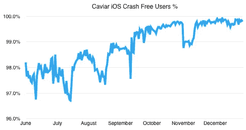

# Caviar iOS:从 AdvancedCollectionView 迁移到 PJFDataSource

> 原文：<https://medium.com/square-corner-blog/caviar-ios-migrating-from-advancedcollectionview-to-pjfdatasource-81f8c2e4fcdf?source=collection_archive---------1----------------------->

## 幕后看看 PJFDataSource 在我们的 Caviar iOS 应用程序中的演变。

*由* [撰写*迈克尔索尔*](https://medium.com/u/8ce6b756010b?source=post_page-----81f8c2e4fcdf--------------------------------) *。*

> 注意，我们已经行动了！如果您想继续了解 Square 的最新技术内容，请访问我们的新家[https://developer.squareup.com/blog](https://developer.squareup.com/blog)

2014 年 12 月，我们发布了我们的 iOS 应用程序的第一个版本，用于我们的高品质餐厅外卖服务 [Caviar](https://www.trycaviar.com/) 。该应用的视图控制器架构在很大程度上基于苹果 2014 年 WWDC 演讲中提出的框架:[带有集合视图的高级用户界面](https://developer.apple.com/videos/play/wwdc2014/232/)和附带的样本代码。对于我们的应用程序来说，这是一个很好的起点，但我们最终对它感到失望，原因我将在下面详述。

在考虑了多种方法后，我们决定构建一个小型库，重新实现我们最重视的 AdvancedCollectionView 的功能，同时省去我们不需要的任何复杂性。为了推动我们构建一个与 Caviar 应用程序联系不太紧密的通用库，我们从一开始就将它构建为一个外部库。我们已经成功地使用了 6 个多月，并决定将它作为 PJFDataSource 向公众开放源代码。

在本帖中，我们将看看 PJFDataSource 的创建过程:作为我们早期应用程序架构中 AdvancedCollectionView 示例代码的替代。如果你想一头扎进去，请前往我们的 [GitHub 页面](https://github.com/square/PJFDataSource)。

# 一个好的起点

Caviar 的 iOS 应用架构基于苹果的 AdvancedCollectionView 样本代码是一个很好的起点，尽管我们最终会遇到一些问题。它提供了一种在整个应用程序中加载数据和显示内容的一致方法，并推动我们走向许多最佳实践。

最重要的是，AdvancedCollectionView 帮助我们避免了创建[大规模视图控制器](https://www.youtube.com/watch?v=dgOdsh1Bq10)，这是一个常见的 iOS 应用程序架构陷阱(为此[那里](https://www.objc.io/issues/1-view-controllers/lighter-view-controllers/) [是](https://www.objc.io/issues/13-architecture/mvvm/) [许多](https://corner.squareup.com/2015/12/ziggurat-ios-app-architecture.html) [好的](/ios-os-x-development/ios-architecture-patterns-ecba4c38de52#.vl27g5oi3) [解决方案](http://khanlou.com/2014/09/8-patterns-to-help-you-destroy-massive-view-controller/))。它主要是通过要求每一部分内容都有一个数据源对象，与视图控制器本身分开。这些数据源对象是您的内容视图的模型。在这个实现中，这些对象还负责加载它们的内容——这是另一项职责，可能会以不太规范的方式在视图控制器中结束。

这些数据源甚至可以像构建块一样组合成一个“聚合数据源”，鼓励创建更小的组件数据源。这允许在应用程序的不同部分重复使用相同组件的代码。例如，您添加到购物车中的食品列表和历史收据上的食品列表可以共享这些组件数据源中的一个，因为它们只是在不同的上下文中表示相同的内容。

AdvancedCollectionView 还提供了显示加载、无内容和错误状态的一致方法。它通过将数据源对象与显示内容的 UICollectionView 紧密耦合来实现，并在适当的时候添加补充的占位符视图。虽然起初并不明显，但这成为了我们最喜欢的 AdvancedCollectionView 的“特性”之一，并在 PJFDataSource 的形成中发挥了很大的作用。

# 问题…和解决方案

随着我们走过 Caviar for iOS 的最初版本，并开始进入一个定期的功能构建和错误修复发布周期，我们开始认识到大量使用 AdvancedCollectionView 的一些缺点。这些都是相互关联的，但是我将围绕灵活性、稳定性和社区这三个主题来讨论它们。

# 灵活性

正如您可能已经从名称中猜到的那样，AdvancedCollectionView 需要使用 UICollectionView。你可能听说过这句谚语“如果你只有一把锤子，那么所有的东西看起来都像钉子”。对我们来说，UICollectionView 就是我们的锤子，尽管它并不总是最适合这项工作的工具。这种缺乏灵活性在几个方面打击了我们。

一个简单、具体的例子来自主屏幕，这里 Caviar 列出了所有你可以订购的餐馆。在我们更大的市场中，可能有数百家餐厅，每个餐厅都有一个高度可变的单元格，具体取决于相关的元数据。传统上，集合视图和表格视图需要确定每个单元格的大小，以便计算它自己的内容大小。对于大量内容，这可能会很慢，并对用户体验产生负面影响。对于 UITableViews，苹果公司增加了 table view:estimatedheightforrowatdinexpath:，这是针对这个问题的一个优雅的解决方案。当时在我们的集合视图布局中没有类似的东西，我们被迫实现我们自己的快速视图调整和缓存——这是我们希望避免的复杂性。

更一般地说，在 Caviar 应用程序中几乎处处使用 UICollectionViews 简直是矫枉过正。几乎所有的屏幕都可以使用 UITableView 更简单地实现。有些甚至可以用基于 UIStackView 的布局来实现(为了与 iOS 8 兼容，用 [OAStackView](https://github.com/oarrabi/OAStackView) )，甚至可以用基于 UIView 的手动布局来实现。

这种体验是我们决定 PJFDataSource 应该是视图不可知的，让应用程序提供自己的内容视图的主要原因。PJFDataSource 没有与集合视图紧密耦合，而是提供了一个“内容包装器视图”，它将显示您提供的内容视图，或者用于处理加载、无内容和错误状态的各种占位符之一。

在今天的 Caviar 应用程序中，我们尝试使用最适合的工具。主屏幕现在是一个 UITableView 视图，利用自动单元格大小和使用估计的高度来提高速度。菜单视图使用了 UICollectionVIew，在这里我们以[瀑布布局](https://github.com/chiahsien/CHTCollectionViewWaterfallLayout)展示了令人垂涎的餐馆所有食物的照片。Account 视图的内容有限，它使用的是 ui stack view——这是我目前最喜欢的工具之一。

# 稳定性

一旦 Caviar 应用程序公开发布，使用它的用户数量比我们内部测试组的用户数量多了几个数量级，我们发现一些神秘的“一次性”崩溃根本不是“一次性”的。相反，它们是我们数据源堆栈中某处崩溃错误的早期警告信号。

一旦我们意识到这一点，我们就深入挖掘，找到并解决潜在的问题。根据 Crashlytics 的测量，我们设定的目标是 **99.9%** [无崩溃用户](https://docs.fabric.io/ios/answers/answers-metrics.html#crash-free-users)。我们增加了 [Crashlytics 日志](https://docs.fabric.io/ios/crashlytics/enhanced-reports.html#custom-logs)来支持野外撞车后更好的法医调查。我们编写自动化测试来对有问题的领域进行压力测试。我们学到了很多关于 UICollectionView 的常见[bug](http://stackoverflow.com/questions/13904049/assertion-failure-in-uicollectionviewdata-indexpathforitematglobalindex)和/或[误用](http://stackoverflow.com/questions/12611292/uicollectionview-assertion-failure?lq=1)的知识。我们修复了几个问题，降低了我们的崩溃率。但是我们不能解决所有的问题，我们也不能把事故率降到我们的目标。

这些神秘的不速之客是我们最终决定放弃 AdvancedCollectionView 并创建 PJFDataSource 的主要驱动力。我们将达到崩溃率目标作为迁移的首要目标。我们逐步进行工程设计和推广，优先考虑受这些崩溃影响最大的应用程序。

让我们来看看 2015 年下半年的一些真实数据:

如您所见，我们开始时的无崩溃用户率约为 97.5%。这意味着使用我们的应用程序的客户在任何一天都有大约 2.5%的机会看到崩溃。*哎哟。*

在最初的几个月里，我们做了一些渐进的改进(和回归)。在我们 9 月中旬的更新中，我们发布了第一个部分推出的 PJFDataSource 版本。我们马上看到了巨大的改进，然后随着我们更新应用程序的更多部分以及我们的客户升级到最新版本，我们会继续改进。在今年的最后 6 周，我们终于实现了 99.9%的无事故目标，并一直保持到今天。

我强烈建议为你的崩盘率设定一个积极的目标，并迅速修正任何导致你跌破的回归。这确保了在你的崩溃报告中有很强的信噪比，使得回归很容易被发现和修复。它还可以帮助您更快地注意到崩溃，而最近更改的代码仍然记忆犹新。

# 社区

回顾过去，AdvancedCollectionView 的一个我们最初低估的问题是缺乏社区对它的支持。在 GitHub 上没有一个规范的主页可以让你和作者或者其他用户互动。没有人计划修复臭虫。当新版本的 iOS 或 Xcode 发布时，没有人进行兼容性修复。当我们撞到墙上时，没有任何专家可以依靠。

所有这些从一开始就很清楚，并且是从 WWDC 获得一个 6000 线样本项目并在此基础上发展所固有的——我们只是低估了长期成本。这一经历让我更欣赏 iOS 生态系统中存在的许多充满活力的社区。

# 递增量

值得重申的是，这种变化是如何渐进的，因为我认为这是一个很好的例子，说明了如何在一个运输应用程序中考虑和执行主要的架构变化:

**1。识别问题**

*   对我们来说，两个主要问题是不速之客和在任何地方使用 UICollectionViews 的不灵活性/复杂性。
*   还有人担心 AdvancedCollectionView 的长期所有权，但我们可以咬紧牙关，自己真正“拥有”它，从而解决这个问题。
*   我们还确定了我们真正喜欢的作品，并希望结转到任何潜在的替代品中。

**2 .寻找更小的改动来解决**

*   我们花了相当长的时间试图找到一两个解决重大事故的良方。只有在发现了多个问题、进行了修复并且只看到了增量改进之后，我们才决定这可能值得进行更大的体系结构更改。

**3 .拿出计划和目标**

*   很早的时候，我们就确立了 99.9%无崩溃用户的目标。
*   更宽松地说，我们也知道我们希望在选择内容视图时有更大的灵活性，尤其是随着 iOS 的发展和新工具的添加(例如 UIStackView)。

**4 .增量设计和推广**

*   我们*本可以*在一段时间内专注于此，重写应用程序中的所有视图控制器，并在一次大爆炸中发货。也许它会奏效，但更有可能的是，我们错过了一些东西，并在此过程中导致了一些重大倒退。
*   相反，我们在逐个屏幕的基础上有条不紊地向 PJFDataSource 迁移(按预期影响排序)。我们定期向客户发货，发现小问题，并不断改进。因为这是一个“慢烧”类型的项目，我们能够继续在新特性上取得进展，同时修复其他领域的小错误。

**5。评估**

*   增加稳定性，增加灵活性，降低复杂性。成功！

# 结论

希望这篇关于 PJFDataSource 的创建和发展的背景故事在您下次评估潜在的依赖或考虑重大重构时会对您有所帮助。

如果它看起来像是你自己可能想要使用的东西，请前往我们的 [GitHub 页面](https://github.com/square/PJFDataSource)。

*Square 的 iOS 工程团队邀请你参加我们的闪电对话之夜，并在 WWDC 期间与你的 iOS 工程师同事一起享用食物和饮料。6 月 14 日星期二，欢迎加入我们的 SF 包厢——下午 5:30 开门。RSVP* [*此处*](https://squareioseng.splashthat.com/) *保留您的位置！*

 [## 迈克尔·索尔-简介

### 工程经理@广场。前.我喜欢建造重要的产品。

medium.com](/@mthole)