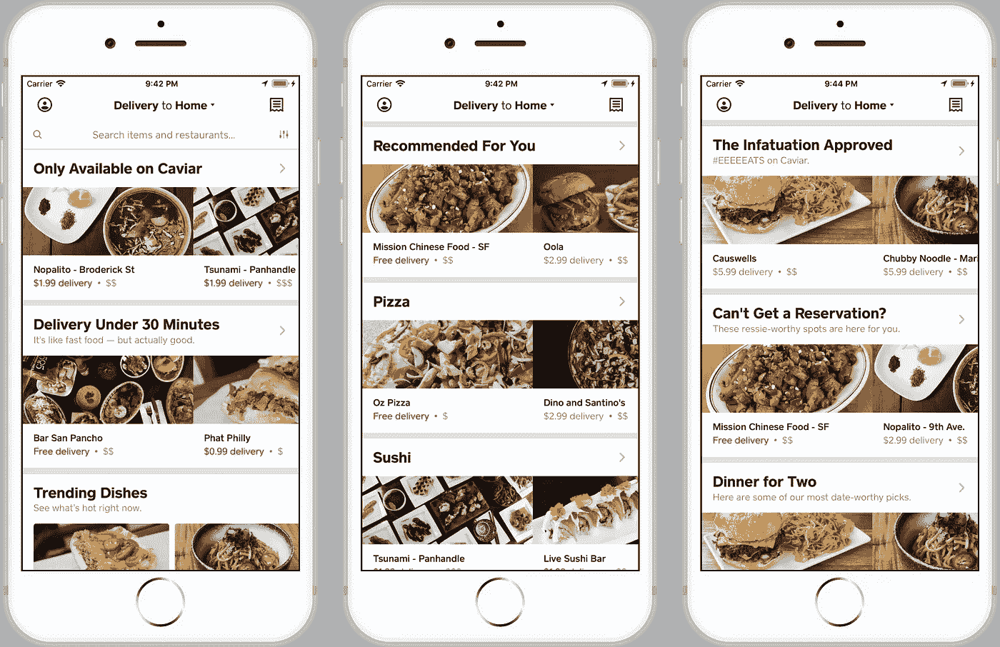
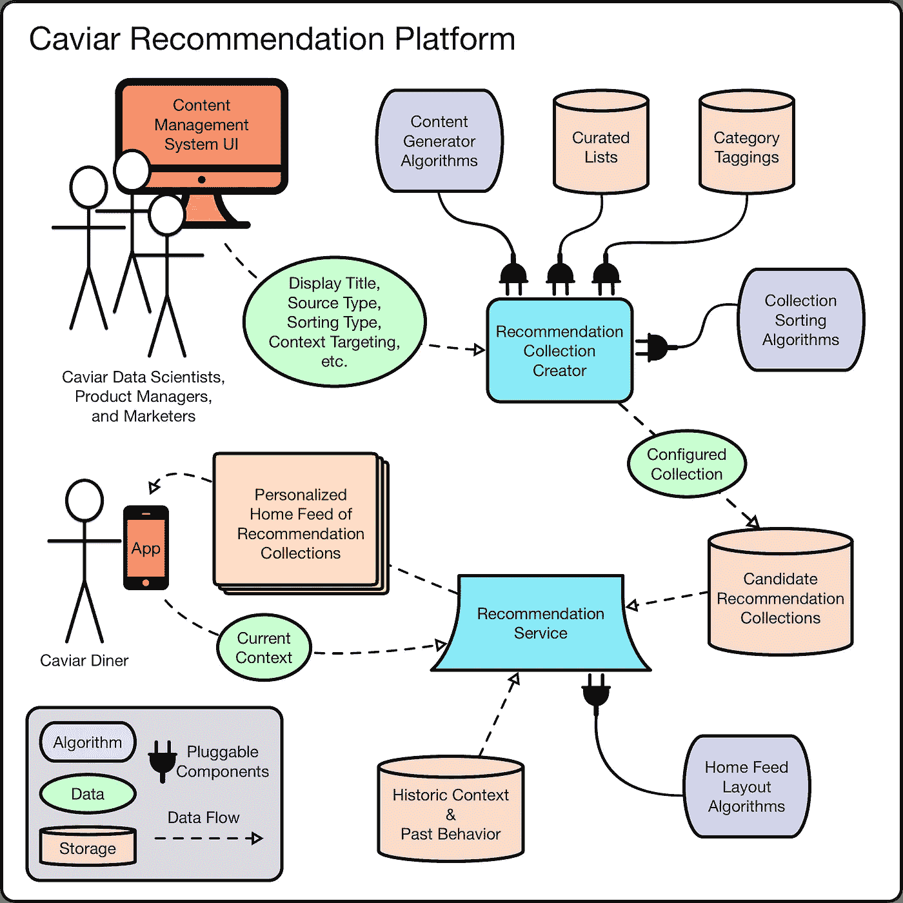
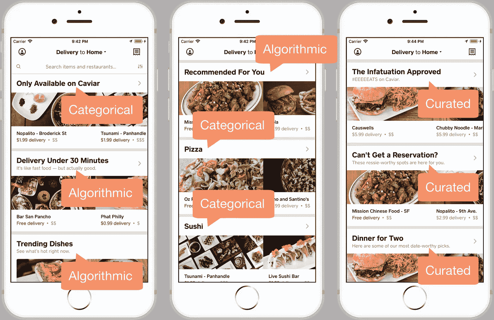
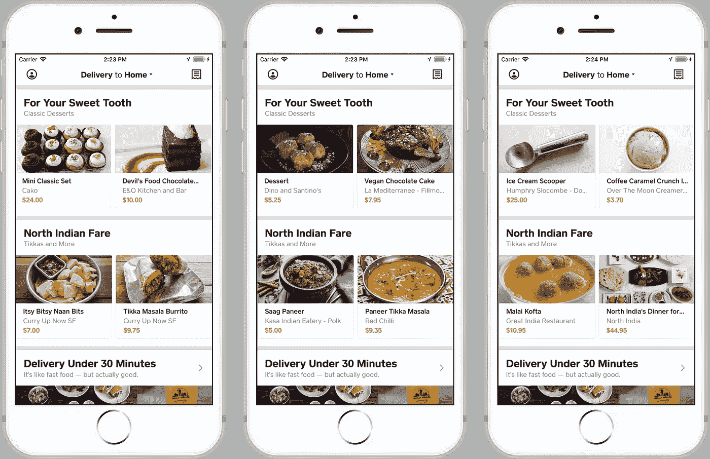
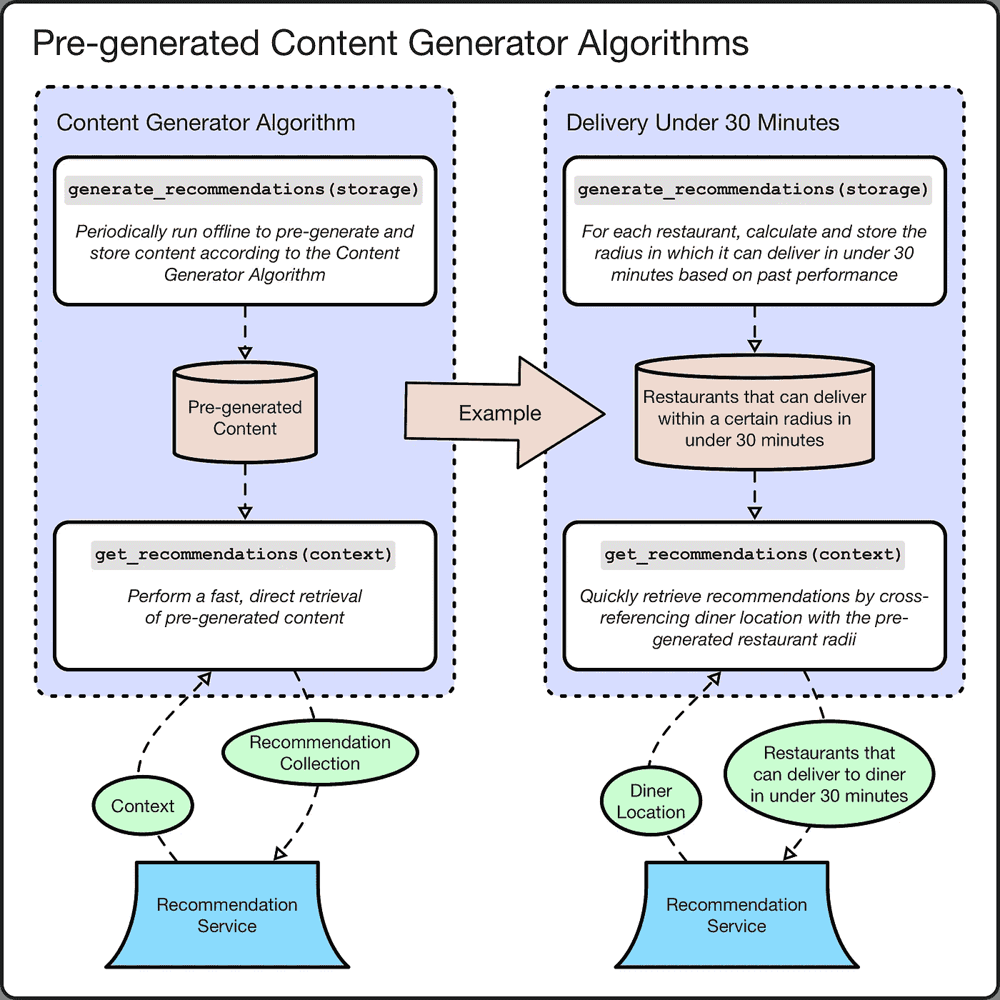
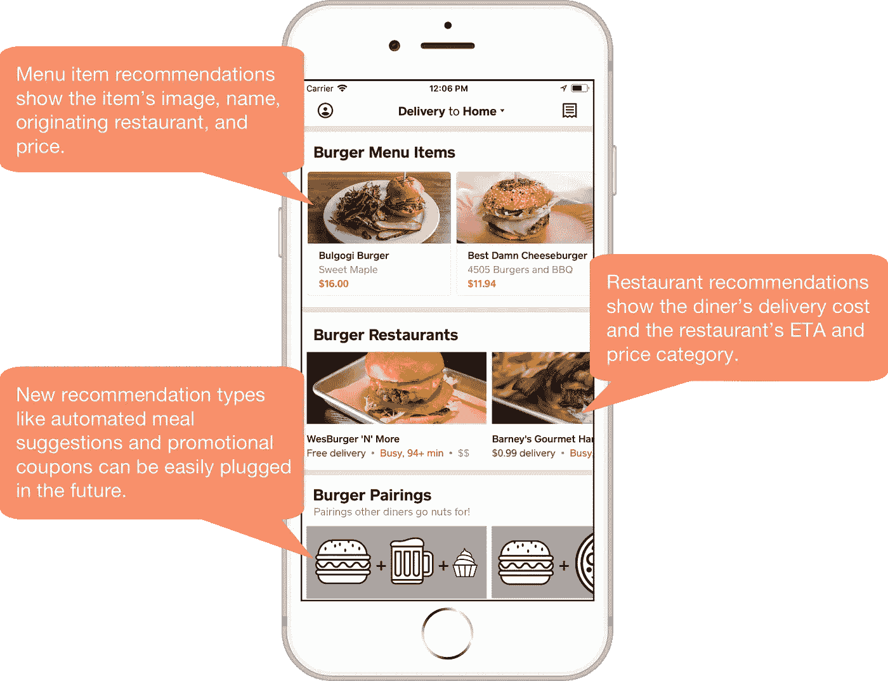
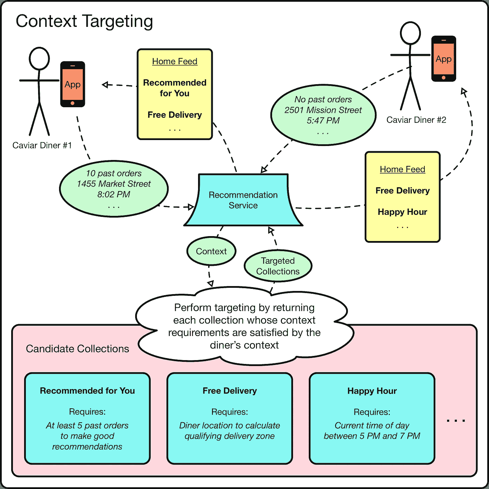
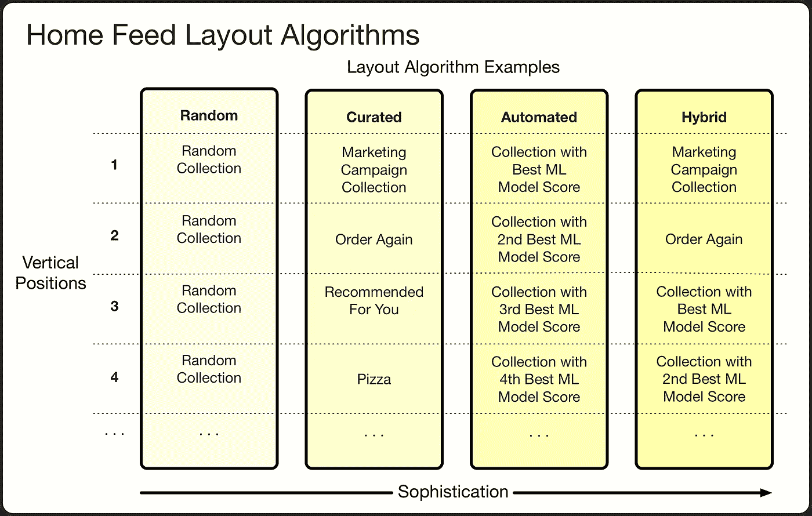
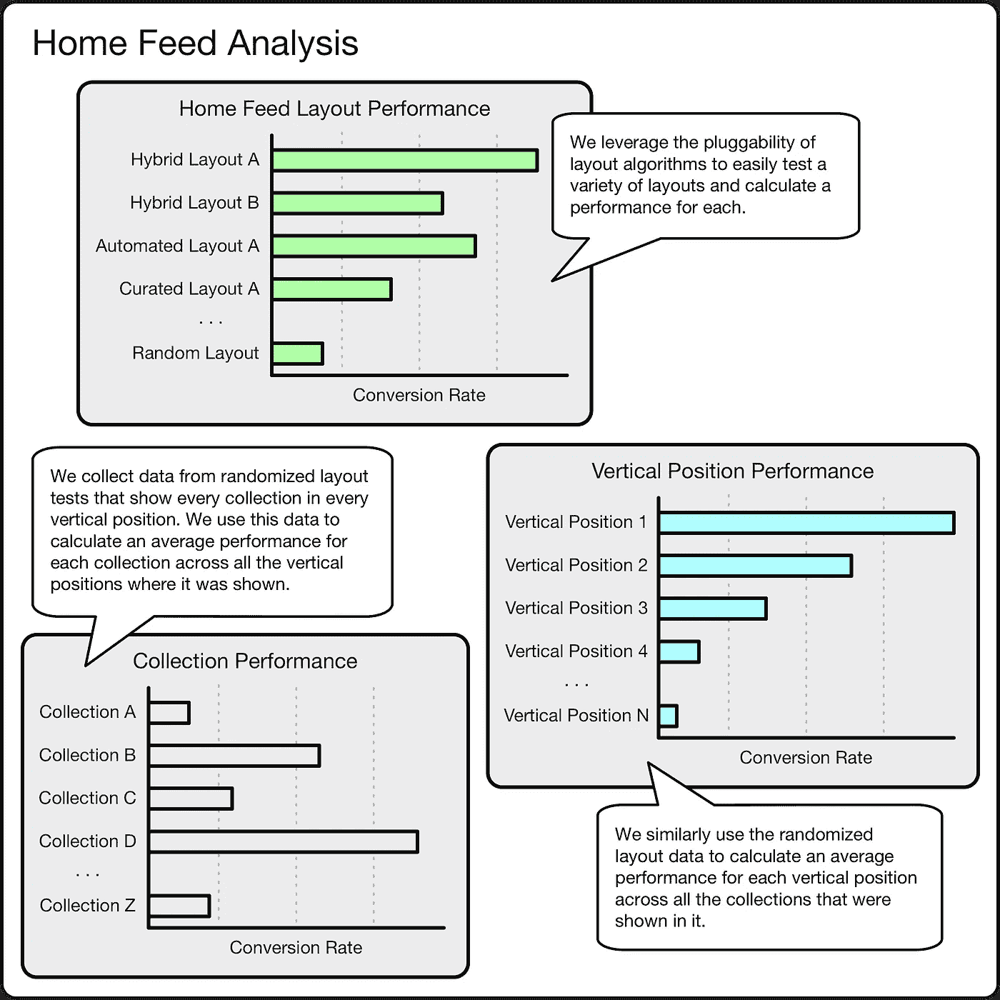

# 鱼子酱的美食推荐平台

> 原文：<https://medium.com/square-corner-blog/caviars-food-recommendation-platform-8f1751e82db7?source=collection_archive---------2----------------------->

## 克里斯托弗·斯基尔斯

> 注意，我们已经行动了！如果您想继续了解 Square 的最新技术内容，请访问我们的新家[https://developer.squareup.com/blog](https://developer.squareup.com/blog)

# **简介**

在鱼子酱，[广场](https://squareup.com/)的[订餐应用](https://itunes.apple.com/us/app/caviar-food-delivery/id931355786?mt=8)，我们将食客与美食联系起来的一种方式是我们的家庭推荐。我们有各种各样的建议，我们希望不断地测试和评估它们。为了支持这一点，我们利用我们对美食和当地市场的了解，创建了一个灵活、强大的推荐平台。我们希望像网飞和 Spotify 这样的公司为电影和音乐所做的那样，为食物做贡献。在这篇文章中，我对设计进行了分解，并强调了该平台最有趣的特性。

*Caviar’s home feed of recommendations.*

# **推荐收藏**

我们平台设计的基础是推荐集合的概念。我们没有呈现一个压倒性的推荐流，而是将它们分成不同的集合，每个集合都有一个共同的主题，并以不同的方式提供动力。虽然“推荐”一词经常被其他人用作“机器学习生成的推荐”的简写，但我们采取了一种更自由的观点，将推荐视为我们向用餐者提出的任何建议，而不考虑人力或机器来源。

我们发现没有一种推荐方式对所有用餐者都同样有效。例如，虽然我们更先进的基于机器学习的“推荐给你”集合表现很好，但更简单的“再次订购”集合也很好，它只显示你以前订购过的餐馆。类似地，基于过去餐厅业绩分析的“30 分钟内送达”收集在迎合想要快速选择的食客方面做得最好。对于口味经典的食客来说，像“披萨”和“中餐”这样简单的分类集合很受欢迎。最后，像“迷恋批准”这样由人策划的收藏品在食客中表现良好，因为它们包含了尚未自动化的专家审美趣味和品牌。

正如这些例子所示，推荐集合有许多方式，包括机器学习、定制算法、类别标记和管理列表。收藏的附加特征在于它们是否推荐餐馆或菜单项、它们的推荐如何排序以供显示、它们被显示给哪些用餐者、以及每个收藏在主页提要中出现的顺序。该平台通过可插拔(类似于 Google Chrome 浏览器扩展和 Adobe Photoshop 图像过滤器等插件系统)和可配置(类似于 Drupal 和 Wordpress 等内容管理系统)来支持这种程度的变化和功能。下图突出显示了重要的可插拔和可配置组件:

*Overview of configurable and pluggable platform components.*

# **采集源类型**

该平台允许通过使用可插入的集合源类型来推荐以不同方式供电的集合。这从 home feed 处理管道中抽象出了集合内容的底层来源。只要集合实现了预期的接口，就可以在 home feed 中使用它，以很少的额外开发成本利用平台的所有特性和服务。我们目前支持三种收集源类型(管理的、分类的和算法的),但是由于这种可插入的方法，可以很容易地扩展到更多。

*Collection source type examples.*

策划收集通过允许鱼子酱工作人员手工创建主题推荐列表，利用我们对食品和当地市场的了解。一般来说，这些不像分类和算法收集那样可扩展，但这没关系，因为我们主要将它们用于难以自动化或仅在有限时间段内运行的利基收集，例如，“本周末的弹出窗口”、“情人节在家约会之夜”和“奥克兰餐馆周”。通过手动选择所需的餐馆和菜单项，使用平台的内容管理系统 UI(稍后我们将详细讨论)创建一个精选集合。

分类集合是一种简单而强大的方法，可以通过类别(如菜肴类型、菜单项类型和饮食限制)来划分内容。示例收藏包括“中国”、“玉米卷”和“素食”。内容可以通过手动和自动方式标记相关类别。参见 [Caviar 的 Word2Vec 标签获取菜单项建议](/square-corner-blog/caviars-word2vec-tagging-for-menu-item-recommendations-13f63d7f09d8)获取机器学习自动化的示例。通过从列表中选择类别，经由内容管理系统 UI 创建分类集合。

*Automated categorical collection examples from related post “Caviar’s Word2Vec Tagging For Menu Item Recommendations”.*

算法集合是我们最高级的类型。有了这些，我们能想出的任何生成推荐内容的算法都可以打包成一个推荐集合。算法集合允许我们将推荐扩展到所有市场，而不仅仅是那些容易获得监管的市场。通过将算法集合与内容生成器算法相关联，用内容管理系统 UI 创建算法集合。

# **用于算法集合的内容生成器算法**

算法集合使用可插入的内容生成器算法来提供它们的推荐。通过实现一个简单的`**get_recommendations(context)**`接口，以平台期望的格式返回推荐结果，内容生成器算法变得可插拔。算法如何生成这些结果被封装在运行时的处理管道之外。以下示例显示了这种可插拔方法允许的多样性:

*   “推荐给你”算法使用基于内容和基于用户的混合相似性推荐系统来推荐餐馆。
*   “30 分钟内送达”算法选择能够满足给定用餐者的送达承诺的餐厅。
*   “15 美元以下的外卖”算法选择价格限制内有许多主菜的受欢迎的餐馆。
*   “热门菜肴”算法突出显示了过去一周的热门菜单项。
*   “免费送货”算法检查一组复杂的业务规则，以确定所有将向给定就餐者免费送货的餐馆。

内容生成器算法可以是两个子类型之一:预生成或实时。预生成算法通过定期后台作业离线执行其内容生成。这个子类型实现了一个额外的`**generate_recommendations(storage)**`接口，该接口知道如何生成和存储它的建议，而它的`**get_recommendations(context)**`实现则变成了一个快速、直接的从存储中检索的方法。该平台通过提供`**generate_recommendations(storage)**`一个简单的类似键值存储的接口来使用`**storage**`参数，从算法中抽象出具体的存储技术。这让我们可以灵活地使用 Postgres 这样相对便宜/慢的选项，或者 DynamoDB 这样昂贵/快的选项。预生成的算法是优选的，因为几乎任何感兴趣的算法都太慢而不能实时运行，并且即使对于实时足够快的算法，从预生成的结果中提取通常会更快。

*Pre-generated content generator algorithm examples.*

实时算法实时动态地执行它们的内容生成，并且只实现`**get_recommendations(context)**`接口。对于由于需要即时上下文(如用户位置)或实现预生成算法的成本太高而无法预生成的算法，这些算法可以作为后备。通常，实时生成的算法用于包装已经实时运行的现有遗留和第三方推荐源。最终，只要有可能，我们会将它们迁移到预生成的算法中。

*Real-time content generator algorithm examples.*

# **推荐内容类型**

我们的平台目前推荐两类内容:餐厅和菜单项。我们希望将来也能轻松添加新的内容类型。该平台通过从集合处理中抽象出底层内容类型来支持这种变化。处理流水线在没有显式引用集合的内容类型的情况下对集合进行选择、过滤和排序。内容类型只在下游使用，因此不同类型的集合可以在视觉上有不同的风格。

*Recommendation content type examples.*

# **就餐者背景和目标**

我们通过为平台提供用餐者环境来个性化主页订阅，即，我们向平台提供我们所知道的关于用餐者的一切，这将有助于为他们选择最佳推荐。该环境包括实时和历史信息的组合。实时环境包括位置、当前时间和设备类型等信息。历史背景包括注册日期、以前订单的数量以及从 most 订购的菜肴类别等信息。

我们配置集合的一个关键方法是通过与用餐者环境相关的目标选项。当选择要在用餐者的主页提要中显示的候选集合集时，使用这种定位。例如，开胃菜的“欢乐时光”集合的目标是只向用餐者显示他们当前的时间是周一到周五，下午 4 点到 7 点。类似地，我们可能将“受欢迎”的系列定位于新顾客，而将“推荐给你”的系列定位于老顾客，我们有很多他们的点餐历史。

对于通过了定位步骤的集合，使用上下文的第二种方式是填充单个集合的内容。例如，从受监督的机器学习模型获取其内容的集合使用用餐者的上下文作为该模型执行的输入信号。类似地，“免费送货”集合使用用餐者的位置来确定用餐者有资格享受免费送货的餐馆。

还存在所有集合必须基于上下文采取的动作，例如根据用餐者的设备或屏幕大小限制要生成的内容项的数量。例如，我们向使用移动应用程序的食客展示每个系列最多 20 个推荐，但向使用大屏幕网络应用程序的食客展示最多 50 个推荐。

*Using personalized targeting to populate a diner’s home feed.*

# **主进给布局算法**

该平台能够通过使用可插入布局算法迭代新的主页馈送布局，可插入布局算法即确定显示什么集合以及以什么顺序显示它们在主页馈送中相对于彼此的可插入算法。所有布局算法都遵循相同的基本步骤:

1.  使用 diner 上下文和配置的集合定位来选择初始的候选集合集(如前一节所述)。
2.  从候选集合中挑选并排序(相对于彼此)满足算法目标的集合子集。

由于候选集合通常比我们希望在主提要中显示的集合的最大数量大得多，布局算法在如何执行步骤 2 以及执行得如何方面与众不同。例如，随机算法可能会从候选集合中随机选取一个集合子集，然后随机对这些集合进行排序。这种算法当然不会是我们最好的表现，但它提供了一个很好的比较基准。全自动算法可以根据机器学习模型或启发式算法对候选集合进行排序，然后挑选前 *N* 个集合作为其排序子集。虽然这将表现得更好，但它会阻止我们管理家庭饲料，并直接利用我们的食品和市场专家。第三种类型的算法是混合的，用预设的集合来管理某些垂直位置，同时使用基于模型的排序来动态填充其余的垂直位置。这可以有竞争力地执行，同时仍然允许我们使用我们的人类专业知识的空间。

*Home feed layout algorithm examples.*

虽然混合算法听起来似乎合理，但关于什么算法是最好的，这实际上是一个经验问题。就算一个混合算法是最好的，哪个混合呢？在你回到臭名昭著的表现不佳的“明智的直觉”方法之前，你能管理多少个垂直位置？有了可插拔算法支持的评估，回答这些问题就简单了。

与此相关，前面提到的“基线”算法可能是我们回答这些基本性能问题的最佳工具。首先，通过偶尔向一部分用餐者展示一个无偏的随机布局，我们可以建立一个常规算法必须达到的最低性能。第二，由于每个集合在布局中的所有垂直位置都有相同的出现机会，我们可以计算一个全球性能排名，确定我们最好的集合、第二好的集合等等。这有助于挑选我们进一步投资维护的藏品。第三，因为每个垂直位置将同等地显示所有集合，所以我们可以计算每个垂直位置的相对值，这样我们就可以知道一个集合在第一个垂直位置相对于第二个垂直位置获得了多大的提升，以此类推。这有助于为表现较低的策划促销活动编制垂直位置预算，也可以在我们看到收益递减之前建议在布局中显示多少总收藏。最后，当训练机器学习模型时，可以使用基线数据来代替常规算法数据，以避免“越富越富”效应，其中在布局顶部显示的集合获得更多点击，这导致模型中更高的权重，这又导致更多的点击。

*Home feed analysis enabled by pluggable layout algorithms.*

# **集合排序算法**

该平台通过使用可插拔集合排序算法(不要与上一节中 home feed 布局算法执行的跨集合排序相混淆)，将集合内容的生成与该内容的排序分离开来。类似于内容生成器算法，排序算法通过实现一个返回排序推荐列表的`**sort(context)**`接口而变得可插拔。可插拔排序算法有很多好处。首先，它们通过将集合内容的生成与内容的排序分离开来，提供了灵活性和可组合性。例如，我们可以通过根据机器学习模型分数对精选集合进行排序来对其进行个性化，或者，我们可以使用机器学习模型(如协作过滤器)来生成集合的内容，但通过更简单的上下文度量(如预计交付时间)对其进行排序。第二，类似于上一节中的跨集合基线，可插拔排序算法使得在单个集合中基线性能变得简单。例如，我们可以将内容的“随机”排序基线与更好的排序进行比较，如“按 ETA”、“按受欢迎程度”或“按机器学习模型分数”。第三，可插入性允许我们的人类专家通过内容管理系统 UI 进行特别的排序更改。例如，当我们注意到一个新的基于模型的排序对距离的权重不够高时，我们很容易地重新配置集合，在调试模型的权重时使用仅距离排序。

*Sorting algorithm examples and analysis enabled by pluggability.*

# **内容管理系统**

该平台提供了一个内容管理系统来创建和配置推荐集合、内容生成器算法和排序算法。这种方法使得以多种方式迭代成为可能，而不需要新的代码或工程辅助。例如，一个集合的标题和副标题可以由品牌文案反复修改。类似地，数据科学家和产品经理可以对集合的排序算法进行迭代评估。最后，本地市场专家可以反复更新精选的内容。

创建/更新集合包括设置:

*   显示标题、副标题和视觉样式等信息。
*   目标信息，例如地理区域、用餐者特征和过去的用餐者行为。
*   集合源类型和相关参数，例如分类集合的类别或算法集合的可插入内容生成器算法。
*   推荐内容类型，如餐馆或菜单项。
*   其他行为修饰符，如可插拔排序算法。

创建/更新内容生成器算法或排序算法包括设置:

*   在集合创建器的相关下拉框中显示的友好描述。
*   实现代码包的路径。
*   可用于此算法的建议内容类型。
*   行为修饰符，例如内容生成器算法是预先生成的还是实时生成的。

*Content management system examples.*

**总结**

推荐平台的灵活性和功能主要来自几个关键特性。它的可插拔性支持快速迭代和测试。它的可配置性和内容管理系统支持工程师和关键非工程师之间更合理的分工。各种收集源类型、内容类型、内容生成器算法和排序算法可以以多种方式重新组合，以适应我们食客的不同口味和需求。通过将所有这些结合起来，推荐平台在将我们的食客与美食联系起来方面表现出色。

除了 Caviar home feed，我们还想探索该平台的其他自然应用，例如支持个性化电子邮件活动，支持我们的企业团体订购和餐饮产品。请留意未来关于这些主题的帖子。

有问题还是讨论？有兴趣在鱼子酱店工作吗？在 cskeels@squareup.com[的](mailto:cskeels@squareup.com)给我写封短信，或者在广场查看[的工作！](https://squareup.com/careers/data)