# Caviar 的 Word2Vec 标签用于菜单项推荐

> 原文：<https://medium.com/square-corner-blog/caviars-word2vec-tagging-for-menu-item-recommendations-13f63d7f09d8?source=collection_archive---------0----------------------->

## 克里斯托弗·斯基尔斯和亚什·帕特尔

> 注意，我们已经行动了！如果您想继续了解 Square 的最新技术内容，请访问我们的新家[https://developer.squareup.com/blog](https://developer.squareup.com/blog)

# **背景**

## **推荐收藏**

在 Caviar， [Square](https://squareup.com/) 的[点餐应用](https://itunes.apple.com/us/app/caviar-food-delivery/id931355786?mt=8)，我们将食客与美食联系起来的一种方式是使用[餐厅和菜单项目推荐](/square-corner-blog/caviars-food-recommendation-platform-8f1751e82db7)。我们不是呈现一个单一的压倒性的推荐流，而是将它们分成不同的推荐集合，每个集合以一个共同的主题为特征(例如，“30 分钟内送达”、“披萨”和“推荐给你”)。个人收藏有多种方式，包括类别标签，如菜肴类型和饮食限制，编辑的“最佳”列表，自定义算法和机器学习:

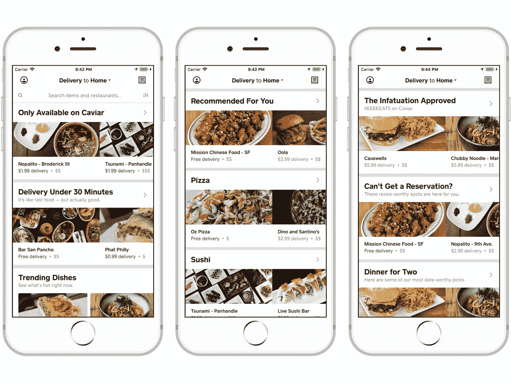

*Current restaurant-focused Caviar home feed recommendation collections.*

## **标记**

在收藏源中，类别标签(例如，“披萨”、“素食”和“家庭风格”)是一种简单而直观且功能强大的方式来划分内容以供收藏使用。首要问题是收集和维护有用的、准确的标签。我们在手动标记餐厅方面取得了成功，但随着我们的发展，我们面临着同样的挑战，因为我们与餐厅关联的菜单项目数量超过了两个数量级。随着我们继续发展，手工标记我们的餐厅也将变得不切实际。为了避免这种情况，我们正在投资自动化标记方法，首先从菜单项开始。

## 谁有时间监督？

虽然像字符串匹配和文本分类这样的自动化方法是更具可扩展性的标记的典型途径，但它们有一些不小的成本。正则表达式和文字字符串匹配通常是脆弱的，规则必须手工制作，并随着时间的推移随着异常的发现而发展。监督文本分类不那么脆弱，但仍然需要手工制作训练集。一个显著的挑战是选择训练样本。例如，如果你想训练一个比萨饼分类器，你需要为所有不是比萨饼的菜单项提供一个反例吗？每种“不是披萨”需要几个例子？「甜品披萨」是正面例子还是反面例子？等等。

## **没那么快……**

为了避免这些成本，我们探索了无监督机器学习方法的可行性，如聚类和相似性搜索。到目前为止，我们发现单独使用[聚类](https://arxiv.org/pdf/1205.1117.pdf)和[主题建模](https://cacm.acm.org/magazines/2012/4/147361-probabilistic-topic-models/pdf)是不够的。一个问题是，聚类算法只产生一组聚类，我们必须手动决定给每个聚类分配什么标签。另一个问题是，我们必须为算法提供主观数量的预期聚类。虽然我们可能能够估计可能的菜肴类型或饮食限制的数量上限，并将其提供给算法，但我们不能保证输出聚类将符合我们想要标记菜单项的直观分组类型。相比之下，我们发现相似性搜索更有前景。

## **寻找免费的午餐**

最简单的是，[相似性搜索](https://en.wikipedia.org/wiki/Similarity_search)使用适当的度量将查询项目与一组候选项目进行比较，以确定哪些候选项目与该查询最相似。如果我们可以将感兴趣的菜单项和标签视为可比较的项目，那么我们可以使用相似性搜索来自动将菜单项与最相似的标签进行分类。理想情况下，我们可以将标签和菜单项基于文本的表示转换为固定长度的数字向量，这些向量可以使用余弦相似度这样的简单度量进行有意义的比较(例如，标签“三明治”的向量与菜单项“鲁宾”和“烤奶酪”的向量是余弦相似的)，使用的方法有 [Word2Vec](https://arxiv.org/pdf/1301.3781.pdf) 、 [GloVe](https://nlp.stanford.edu/pubs/glove.pdf) 或 [TF-IDF](https://en.wikipedia.org/wiki/Tf%E2%80%93idf) 。请注意，这里使用的精选标签与推荐系统中相似性搜索的典型使用有微妙而有趣的不同，在推荐系统中，项目只是相互比较。下面，我们将介绍我们最近使用基于 Word2Vec 的相似性搜索来对推荐集合中使用的菜单项进行分类的工作。

# **演练**

## **接近**

如上所述，我们的方法是将典型的分类问题转化为相似性搜索问题。遵循的基本步骤是:

1.  使用 Caviar 的餐厅菜单作为语料库训练一个 Word2Vec 模型。
2.  使用 Word2Vec 模型将每个菜单项转换为一个向量。
3.  挑选一组候选标签，并对每组标签执行剩余的步骤。
4.  使用 Word2Vec 模型将每个候选标签转换成一个向量。
5.  对于每个菜单项向量，与每个候选标签向量进行比较，并将菜单项分类为最相似的候选标签。
6.  可选地，过滤掉其最相似的候选标签低于最小阈值的菜单项。
7.  通过聚类可视化验证分类结果。
8.  为给定标签选择菜单项，并在 Caviar 应用程序中显示为推荐集合。

## **步骤 1 & 2: Word2Vec 模型+矢量平均**

[Word2Vec](https://arxiv.org/pdf/1301.3781.pdf) 是神经网络单词嵌入技术，它从文本语料库中学习向量空间模型，使得相关单词在空间上比非相关单词更接近。这允许对概念进行有趣的操作，如相似性比较和向量代数。出于我们的目的，我们希望看到一个类似如下的向量空间模型:

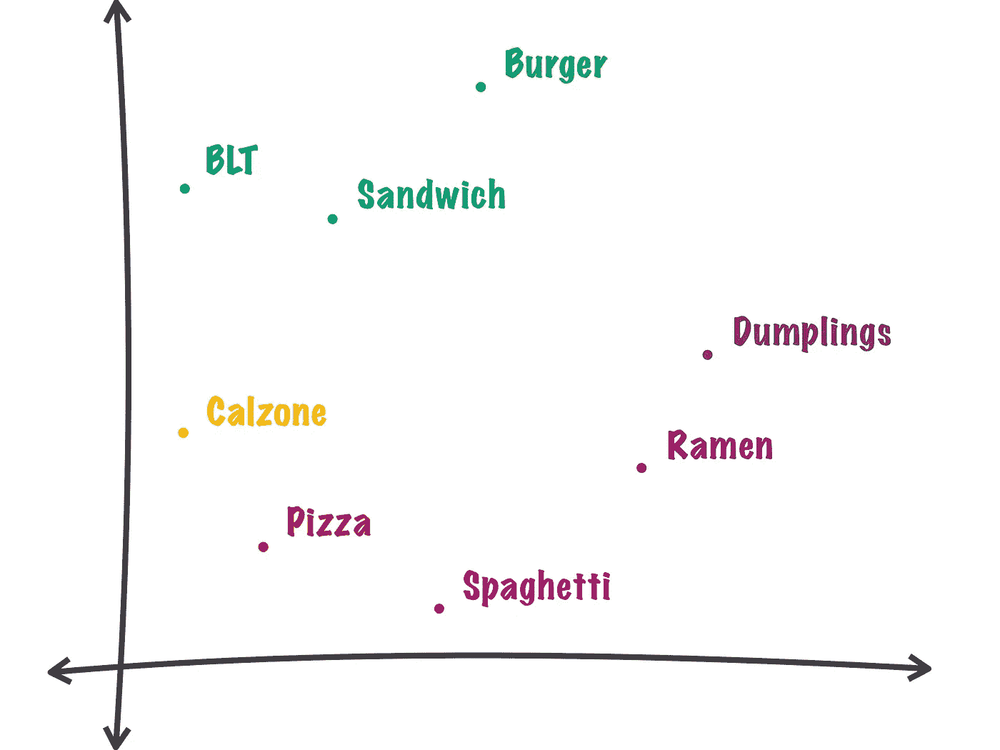

*Example Word2Vec vector space trained with menu data where similar foods are closer to each other.*

我们使用 [Gensim](https://radimrehurek.com/gensim/) 包在鱼子酱餐馆菜单语料库上训练 Word2Vec 模型。虽然有许多基于大型语料库的良好预训练 Word2Vec 模型，如我们首先尝试的[维基百科](https://github.com/idio/wiki2vec/)和[谷歌新闻](https://github.com/mmihaltz/word2vec-GoogleNews-vectors)，但我们发现它们的表现不如我们单独在 Caviar 餐厅菜单上训练的定制模型。菜单中的食物语言似乎与一般来源如百科全书和新闻中的食物语言有质的不同。这是我们计划在未来探索更多的东西。

出于我们的目的，Word2Vec 的一个限制是它只处理单个单词。为了使我们的公式能够工作，我们需要能够为我们拥有的许多多词标签和菜单项创建固定长度的向量(例如，标签“印度咖喱”和菜单项“Big Bob's Chili Sombrero Burger”)。有一些先进的技术可以做到这一点，比如 [Doc2Vec](https://arxiv.org/pdf/1405.4053v2.pdf) ，但是我们发现简单地平均短语中每个单词的向量在实践中效果很好。

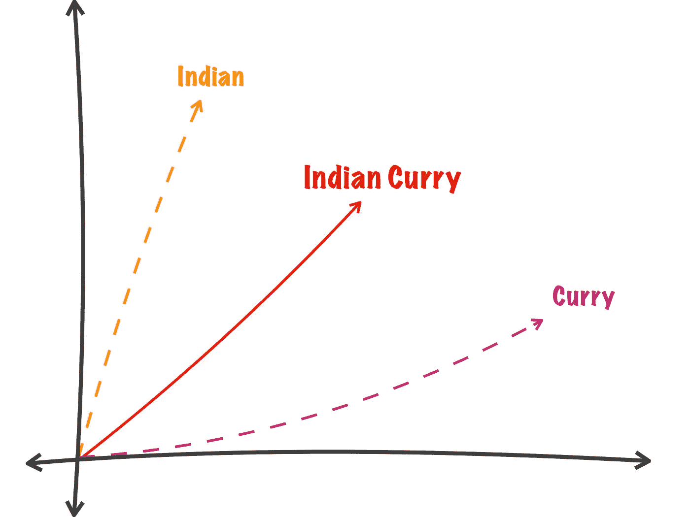

*Example vector averaging of “Indian Curry”.*

## **步骤 3 & 4:候选标签选择**

我们方法的一个关键步骤是选择候选标签。我们的主要方法是编制相关标签集，例如烹饪类型(例如，“披萨”、“汉堡”和“泰式咖喱”)和饮食限制(例如，“素食”、“纯素食”和“无麸质”)，我们希望大多数菜单项仅通过标签集中的一个标签进行最佳分类。我们使用聚类可视化来演示这种烹饪类型的方法。另一种有希望的方法是制作单个多词标签，这些标签捕捉更广泛的概念(例如，“蛋糕饼干馅饼”)并匹配标签中列出的菜单项之外的菜单项(例如，“蛋糕饼干馅饼”匹配纸杯蛋糕和甜甜圈项)。制作这些类型的标签更像是一个迭代过程，类似于提出一个好的搜索引擎查询。我们用几个应用内收藏探索了这种方法，如后面的部分所示。

## **展望第 7 步:通过集群可视化进行验证**

正如在引言中提到的，我们希望避免监督方法的成本，特别是为训练和验证创建一个基础真值集。然而，我们仍然需要一种方法来验证我们的标签，因此作为一种折衷，我们利用交互式集群可视化来进行专门的手动验证。为此，我们改装了 [Tensorflow 嵌入式投影仪](https://github.com/tensorflow/embedding-projector-standalone):

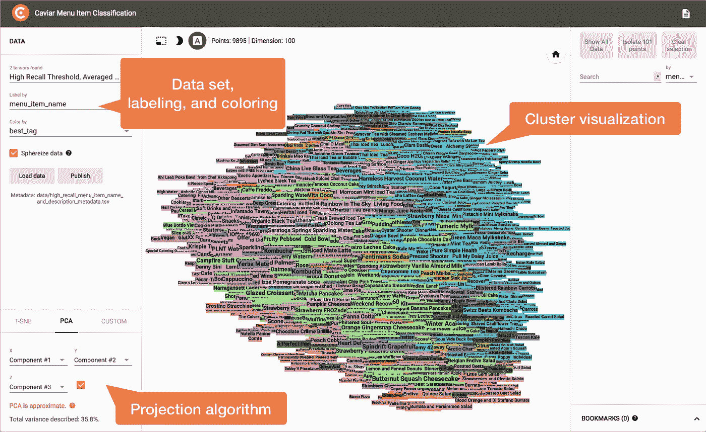

*Caviar Menu Item Classification Projector.*

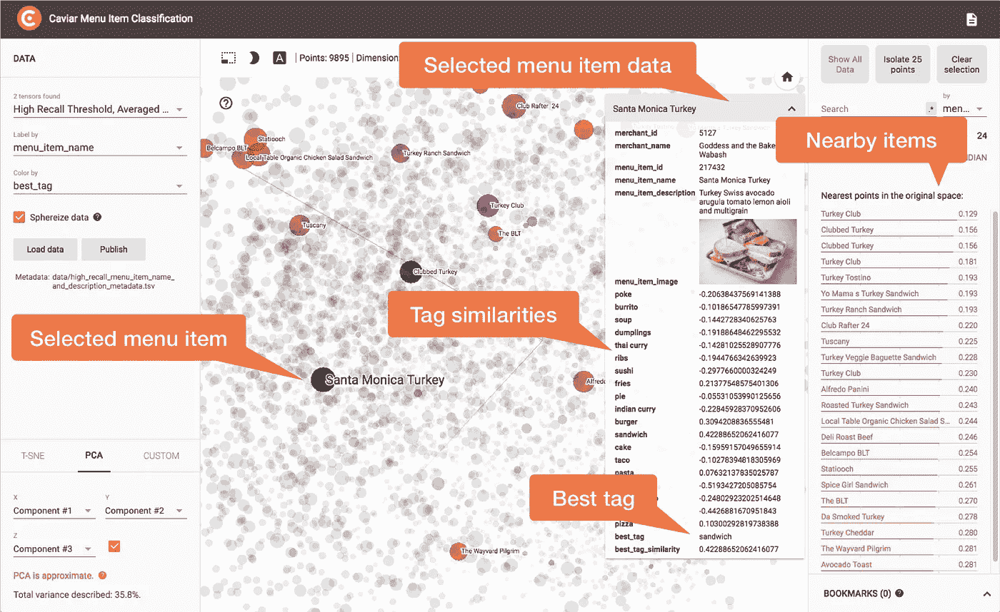

*Caviar Menu Item Classification Projector with menu item selected.*

## **步骤 5–7:菜肴类型可视化**

通过使用烹饪类型作为候选标签集对每个菜单项执行概述的步骤，我们获得了每个标签的余弦相似性得分。我们将每个菜单项归类为相似性得分最高的菜肴类型。下面的一系列图突出了我们对结果数据进行的探索和验证。

在下图中，分类由最相似的标记着色，没有设置最小相似性阈值。这是我们的“高回忆”场景。这是相当嘈杂的，我们看到了一些错误分类的菜单项。在某些情况下，这是因为菜单项很难分类。然而，在许多情况下，这是因为菜单项的真实烹饪类型不存在于我们的烹饪类型候选标签集中(例如，我们不包括“康普茶”、“芝士蛋糕”或“椰子水”的标签)，并且没有最小相似性阈值集，所以做出了不正确的简单分类。

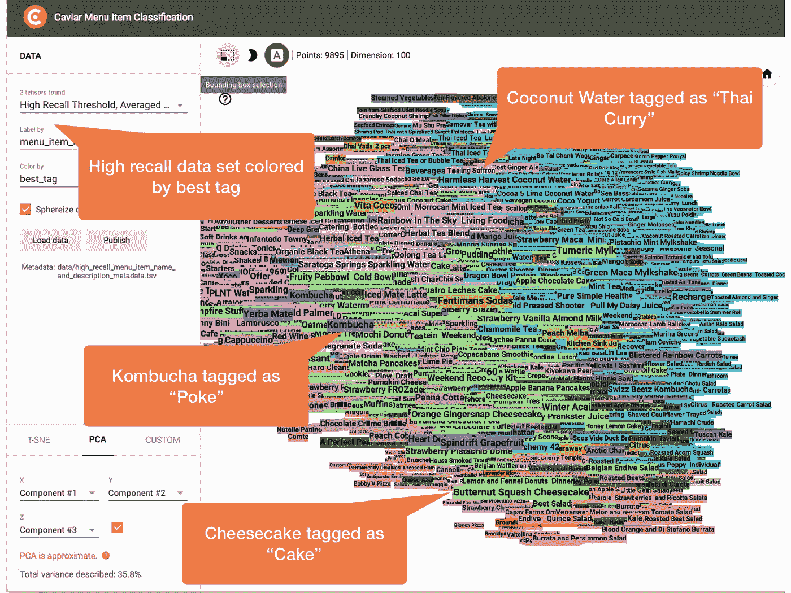

*Colored by most similar tag with no minimum similarity threshold set, our “high recall” scenario.*

下图展示了许多正确分类中的一种:

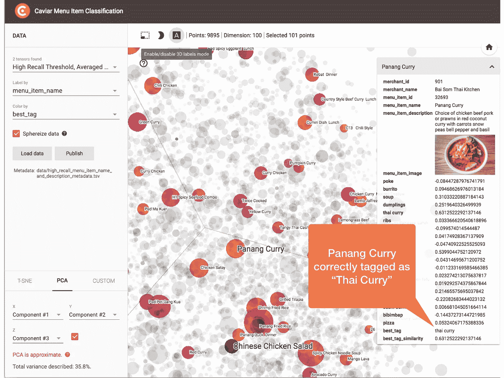

*Panang Curry correctly classified as “Thai Curry”.*

下图展示了我们的一个错误分类场景。在这种情况下，冬阴面汤被错误地归类为“泰国咖喱”。这很难正确分类，因为冬阴汤与泰国菜的关系更密切，而不是像鸡肉面和蔬菜通心粉汤这样的典型汤:

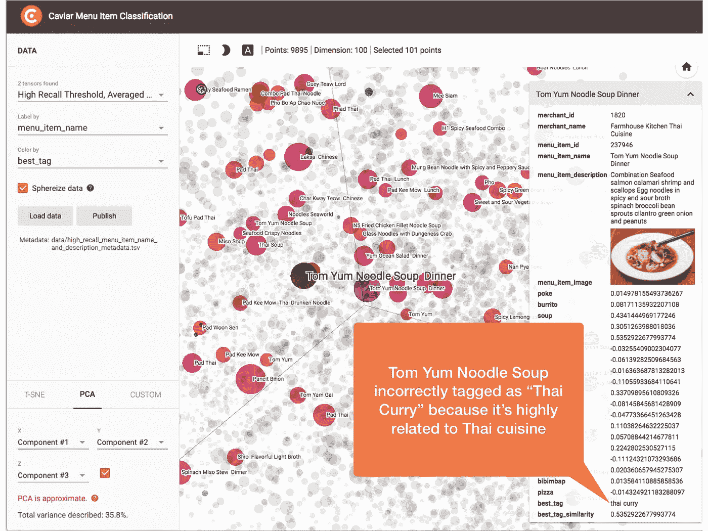

*Tom Yum Noodle Soup incorrectly classified as “Thai Curry” because of closer association with Thai cuisine than soup.*

下图展示了我们主要的错误分类场景。在这种情况下，Gyros Plate 被错误地归类为“薯条”，因为菜单项的菜肴类型(例如，“地中海”或“Gyros”)不在我们的菜肴类型候选标签集中:

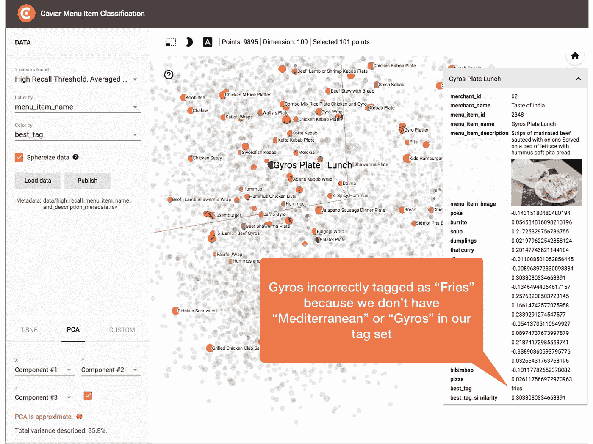

*Gyros Plate incorrectly classified as “Fries” due to missing tag.*

在下图中，聚类由具有最小相似性阈值集的最相似标签来着色(即，仅保留 0.7 余弦相似性或更大的分类)。这是我们的“高精度”场景，而且要好得多！通过检查，我们看到了良好的视觉分离，除了我们接下来讨论的模糊情况之外，我们几乎没有发现错误分类的菜单项:

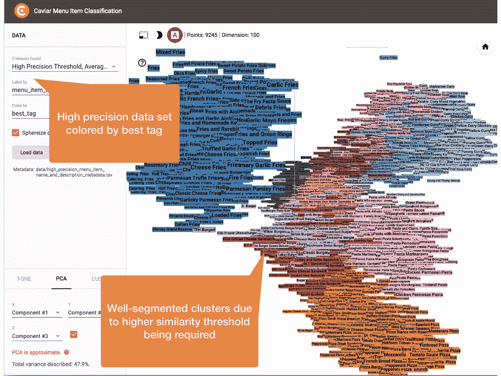

*Colored by most similar tag with a minimum similarity threshold set, our “high precision” scenario.*

在下一张图中，我们想知道，“是披萨还是薯条？”答案是“都有！”比萨饼薯条菜单项的“比萨饼”和“薯条”标签得分都很高，“比萨饼”挤掉了“薯条”。菜单项位于与两个不同的集群等距的位置，这展示了这种方法的直观优势之一。我们没有理由不能用多个最佳标签对这样的商品进行分类:

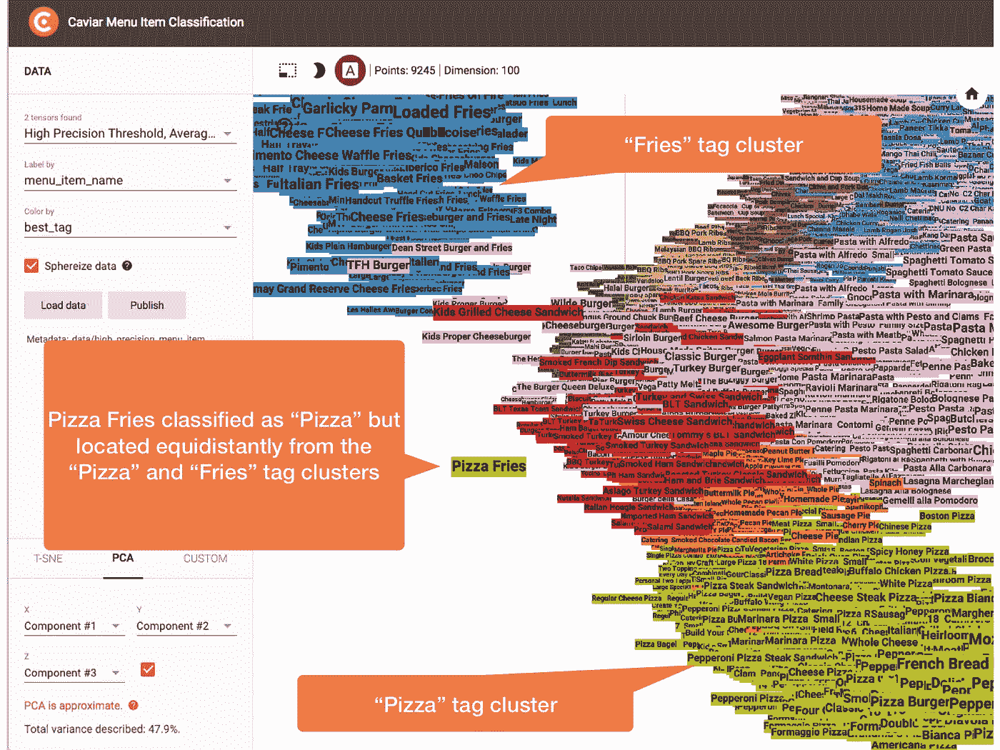

*Is it pizza or is it fries? Answer: both! The Pizza Fries menu item has high scores for both the “Pizza” and “Fries” tags, with “Pizza” edging out “Fries”.*

在接下来的两个图中，分类用分类标签而不是菜单项名称来标记。第一个图形由分类标签着色，第二个图形由与“Pizza”标签的相似性着色。在第一张图中，我们看到“意大利面”和“馅饼”比“寿司”或“饺子”更接近于“比萨饼”。在第二张图中，由于相似度梯度，我们可以很容易地看到一个从“披萨”到“不是披萨”的范围。这是空间排列和基于 Word2Vec 的相似性之间的直观映射的另一个演示，它允许我们对我们的结果执行特别验证:

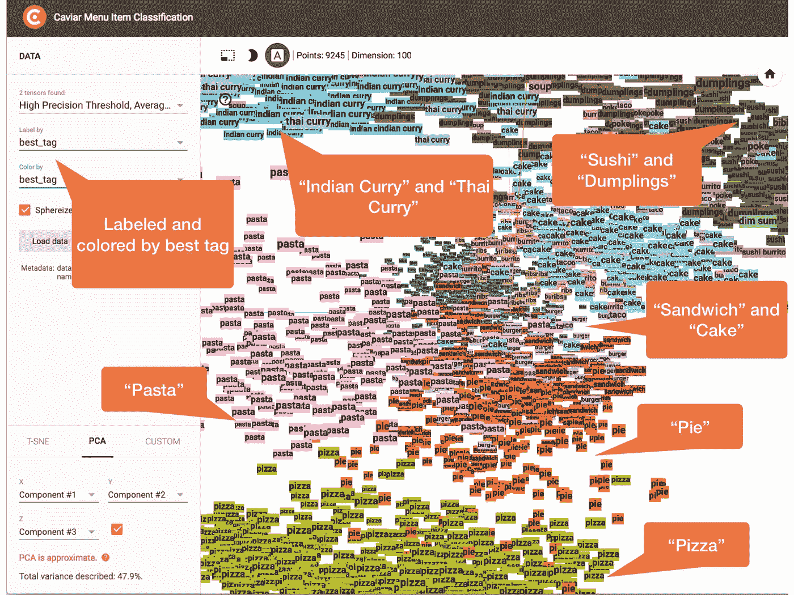

*Colored and labeled by best tag, this view demonstrates the intuitive spatial arrangements we get from Word2Vec similarities such the “Pizza” items being near the “Pasta” items.*

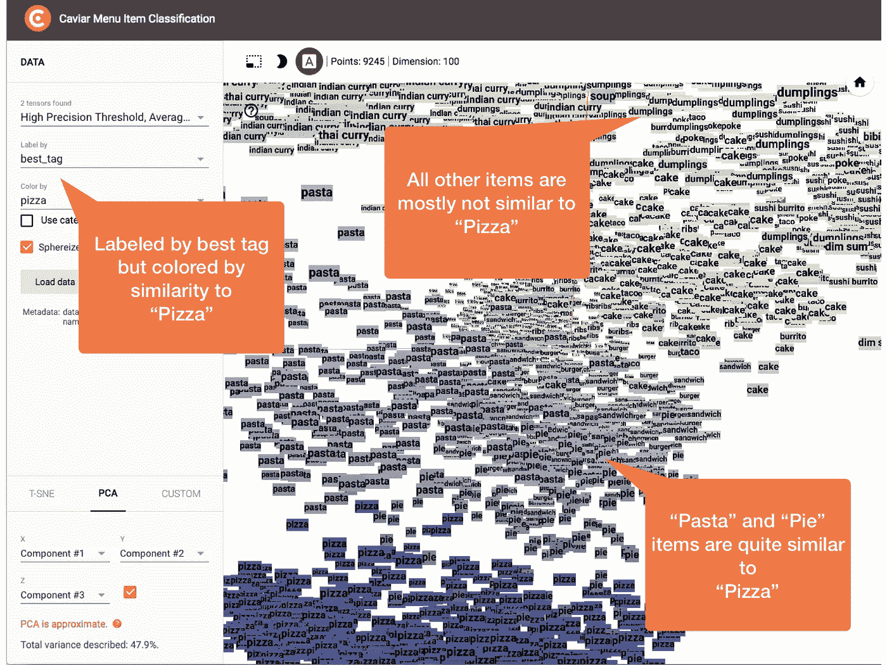

*Colored by similarity to “Pizza” tag, we see a similarity range from “Pizza” to “Not Pizza” further demonstrating the intuitive spatial arrangements we get from Word2Vec similarities.*

## **步骤 8:自动推荐收集**

我们这项工作的最终目标是从基于 Word2Vec 的标记中自动化菜单项推荐集合，我们已经实现了一些例子。下图展示了更简单的美食类型标签和更高级的多词概念标签的集合。

在下图中，我们展示了“Pizza”和“Thai Curry”标签的推荐集合。这些很有前景，展示了从标准(如奶酪披萨和 Panang 咖喱)到令人兴奋(如卡拉布里亚披萨和鸡肉南瓜咖喱)的一系列项目:

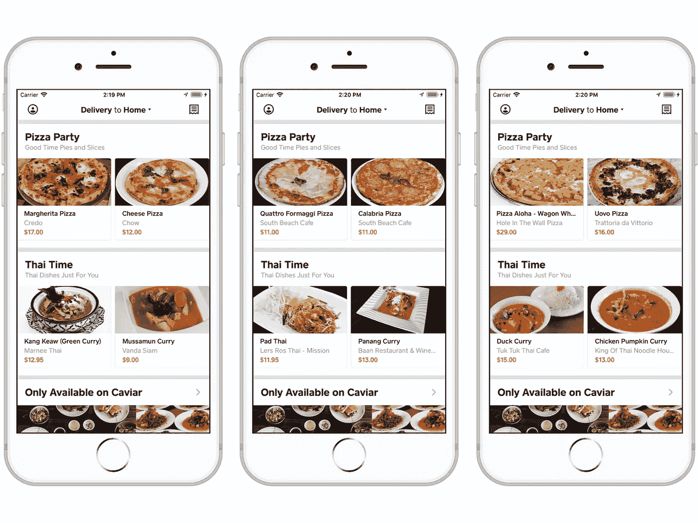

*Cuisine type menu item recommendation collections for the “Pizza” and “Thai Curry” tags.*

在下图中，我们展示了基于制作多词概念标签的有趣方法的推荐集合。我们用“蛋糕饼干馅饼”作为“为了你的甜食”概念系列的标签，用“Tikka Tandoori Biryani”作为“北印度美食”概念系列的标签。这些也很有希望。在“为了你的甜食”系列中，我们看到了“蛋糕饼干馅饼”标签之外的物品，如纸杯蛋糕、甜甜圈、冰淇淋，甚至一个冰淇淋勺。在“北印度美食”概念系列中，我们看到了“Tikka Tandoori Biryani”标签以外的产品，如 Saag Paneer 和 Itsy Bitsy Naan Bites:

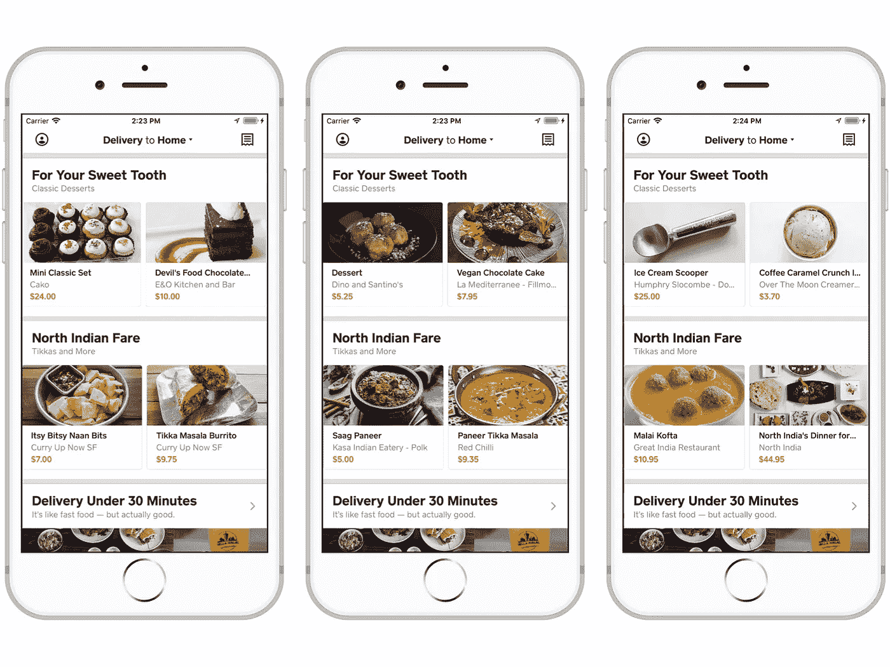

*Recommendation collections for the concepts “For Your Sweet Tooth” and “North Indian Fare”.*

# **总结**

我们认为基于 Word2Vec 的相似性搜索是一种简单而强大的方法，有助于我们扩展到自动标记和菜单项推荐集合。它为我们提供了一条直接的途径来部署这些类型的集合，同时为我们赢得时间来跟进更耗时的方法，如字符串匹配和监督文本分类。从长远来看，我们将开发一种自动验证标记的方法，并与其他矢量化方法进行比较，如 TF-IDF 和 GloVe。我们还想探索嵌入增强了菜单项功能，如价格和照片。

有问题还是讨论？有兴趣在鱼子酱店工作吗？在 cskeels@squareup.com[的](mailto:cskeels@squareup.com)给我写封短信，或者在广场查看[的工作！](https://squareup.com/careers/data)