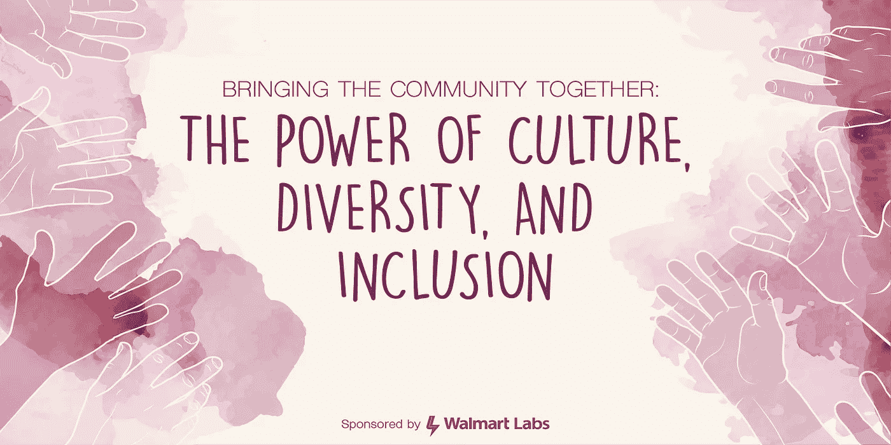
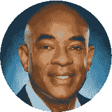

# CD&I:团结社区

> 原文：<https://medium.com/walmartglobaltech/cd-i-brining-the-community-together-ed9cf949db80?source=collection_archive---------7----------------------->

[Click Here to Register Now](https://www.eventbrite.com/e/bringing-the-community-together-the-power-of-culture-diversity-and-inclusion-tickets-56011311340)

# 介绍

沃尔玛对多元化和包容性的承诺超越了我们公司的边界，延伸到我们员工生活和工作的社区。

我很自豪地宣布，位于卡尔斯巴德的沃尔玛实验室将邀请高管团队成员参加一次透明、深入的小组讨论，主题是沃尔玛背后的文化、多样性和包容性。

您将深入了解有助于塑造沃尔玛文化、多元化和包容性计划的挑战和成功——为您提供可以借鉴的见解，并应用于您组织的愿景和战略方向。

# 专门小组成员

# 本·哈桑

SVP |首席文化多样性和包容性官

Ben 和他的团队向首席人事官报告，负责制定推动公司文化的战略和计划，并将多元化和包容性作为该文化的重要元素。

从 2011 年 2 月到 2015 年 7 月，Ben 和他的团队负责领导沃尔玛技术-本顿维尔的所有战略服务。团队职责包括:I/T 战略、创新、沟通。QA、PMO、BA、供应商管理、印度和墨西哥的技术中心、我们当前的 I/T 转型以及管理该部门数十亿美元的预算。

从 2008 年 1 月到 2011 年 1 月，Ben 是沃尔玛全球“人力系统”部门的副总裁。他和他的团队负责支持沃尔玛全球人力资源团队的 IT 系统。该团队还负责可持续发展的 IT 系统、企业通信和内部网。

# 杰·埃文斯

SVP，全球基础设施工程和运营

以结果为导向的 IT 主管，在管理电信、人力资本、游戏、电子商务和零售等多个行业中面向客户的任务关键型生产环境方面拥有丰富的业务和技术经验。在建立和领导团队方面拥有丰富的经验，这些团队负责为企业提供和管理世界一流的高度可用、可扩展且安全的基础架构服务和 24x7 现场运营。Jae 已婚，有两个非常活跃的年轻男孩，让她保持警觉。她在国外的大部分时间都是作为军人家属度过的，尽管她去了一所美国军人家属学校，但她学会了如何说日语和韩语。她喜欢户外活动，曾经喜欢激烈的篮球和排球比赛，但这些天来，除了努力跟上活跃的男孩们，她更像是一名比克拉姆瑜伽士。

# 拉胡尔·乔希

SVP，沃尔玛电子商务客户服务部

Rahul 于 2017 年 4 月被任命为该职位，负责 Walmart.com、Jet.com、Hayneedle 和 Shoes.com 的联络中心、欺诈运营和退货客户体验，运营中心遍布美国和海外。Rahul 还担任 Jet Asian Associate Resource Group 的执行发起人，最近被任命为沃尔玛总裁包容性委员会成员。

在加入沃尔玛之前，Rahul 在花旗工作了 27 年，在消费银行担任过几个大型全球运营职位。最近，他担任驻新加坡的亚洲/EMEA 运营总监，负责支持卡、银行、财富和抵押贷款的所有运营，领导着一支在 17 个国家拥有 15，000 多名员工的团队。在亚洲期间，Rahul 领导了多项客户体验和数字化转型计划，包括在亚洲 10 个国家的呼叫中心推出语音生物识别技术，这是行业首创。从 2010 年到 2014 年，Rahul 担任花旗银行美国消费者和商业银行的首席运营官，在 2010 年之前，Rahul 领导花旗卡北美的持卡人服务职能部门长达 5 年，为全球 14，000 多名员工的客户提供服务和销售。

# 承包商

客户体验工程副总裁

Aanan 加入沃尔玛时，拥有零售和金融领域的大量专业技术知识，以及强大的领导能力。在加入沃尔玛之前，Aanan 在美国运通领导端到端客户体验工程，在那里她倡导转型文化、人才和技术变革。在此之前，她在 PayPal 工作了 11 年，在建立移动商务、核心结账体验以及 PayPal Here 和 PayPal for Marketplaces 等零售产品方面发挥了关键作用。

作为女性科技员工网络的创始人和发起人，Aanan 热衷于多元化和培养优秀人才。她在 BeeHex(一家专注于开拓创新食品自动化技术的公司)等初创公司的董事会任职，并被《硅谷商业杂志》评为 2018 年最具影响力的女性。

# 日程安排

**日期/时间:**
2019 年 3 月 14 日星期四下午 5:30—8:30

**地点:**
加利福尼亚州 92008，卡尔斯巴德 150 号套房，艾辛纳大道 5600 号

**议程:**

*   下午 5:30—6:30:注册
*   下午 6:30—7:10:小组讨论开始
*   晚上 7:10—7:40:问答环节
*   晚上 7:40—8:30:网络/饮料/食物

[Click Here to Register Now](https://www.eventbrite.com/e/bringing-the-community-together-the-power-of-culture-diversity-and-inclusion-tickets-56011311340)