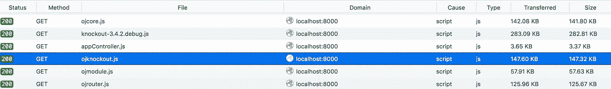
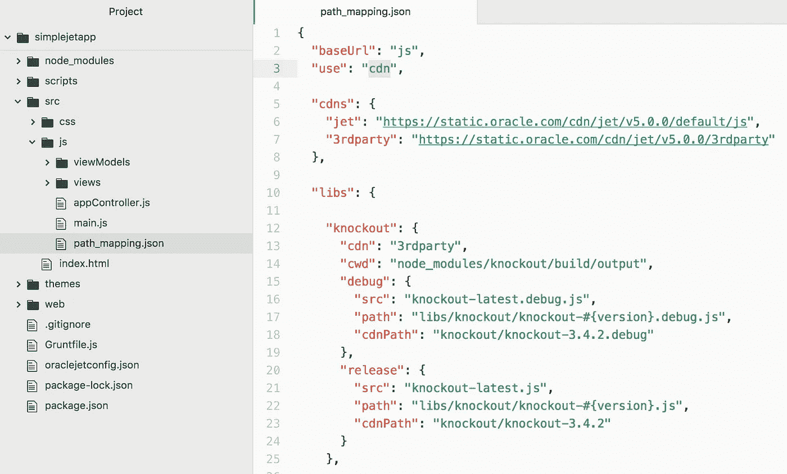
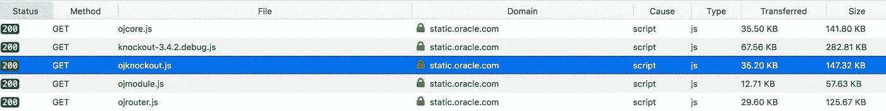
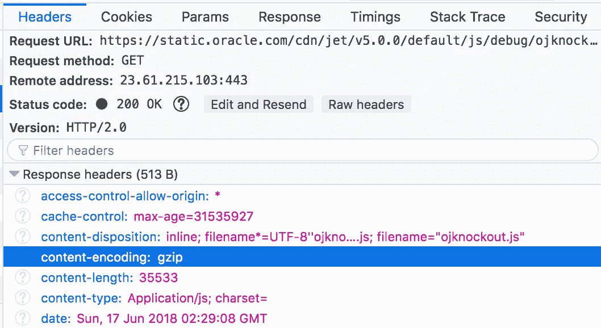

# Oracle JET 中的 CDN 支持

> 原文：<https://medium.com/oracledevs/cdn-support-in-oracle-jet-fb357aefb4c9?source=collection_archive---------0----------------------->

借助 Oracle JET 的最新版本，您的应用可以轻松实现 CDN 支持。默认情况下，JET app 设置为从托管应用程序的同一主机下载所有与 JET toolkit 相关的脚本和静态文件。你可以通过网络监视器很容易地跟踪它，你应该看到这样的文件: *ojknockout.js* 等。从同一主机获取:

将 *path_mapping.json* 中的 *use* 属性从 *local* 更改为 *cdn* ，重新启动 app，即可启用 CDN；

更改后，您应该会看到从*static.oracle.com*主机下载的所有 JET 工具包内容:

好处—您减少了主机上的负载，只从主机上下载特定于应用程序的文件，而 JET toolkit 代码是从外部 Oracle 主机上下载的。在您自己的主机上同样可以实现，但从 Oracle 主机下载的 JET toolkit 内容是开箱即用的压缩内容(另一个好处):

*原载于 2018 年 6 月 17 日*[*andrejusb.blogspot.com*](http://andrejusb.blogspot.com/2018/06/cdn-support-in-oracle-jet.html)*。*