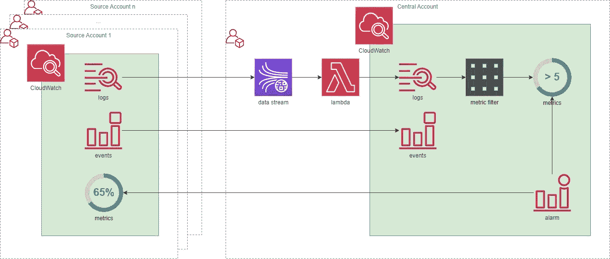

# 来自多个 AWS 帐户的集中日志和警报

> 原文：<https://medium.com/version-1/centralised-logs-and-alarms-from-multiple-aws-accounts-e8ef02750340?source=collection_archive---------2----------------------->

如果您有多个 AWS 帐户，并且它们都由同一个团队管理，集中日志和警报可以提高操作效率。它还可以通过减少需要访问工作负载帐户的人数来提高安全性。

通常情况下，有不同的方法来解决这个问题。AWS 提供了一个[中央日志参考架构](https://aws.amazon.com/solutions/implementations/centralized-logging/)。如果这符合你的要求，这是最好的起点；它是经过深思熟虑的，附带了实现指南、成本估算和源代码。它将来自源帐户的日志流式传输到 Amazon OpenSearch，在那里可以使用 Kibana 浏览这些日志。

这篇文章描述了一种不同的方法，它也允许集中报警。在复杂的环境中，很容易失去对分布在许多帐户中的警报的跟踪。警报的扩散会导致:

*   浪费时间处理假阳性警报，
*   在噪音中丢失的真实事件的延迟解决，以及
*   跨源帐户的不一致警报。

# **解决方案概述**

该解决方案使来自多个源帐户的日志、事件和指标可供单个中心帐户使用。然后这些可以用来触发警报或通过 SNS 或 EventBridge 与第三方系统集成。

*   日志通过 Kinesis 数据流传输，被接收到 CloudWatch 中，并且可以成为中央帐户中指标过滤器的主题
*   使用跨账户交付来推送事件([在 AWS 账户之间发送和接收事件——亚马逊云观察事件](https://docs.aws.amazon.com/AmazonCloudWatch/latest/events/CloudWatchEvents-CrossAccountEventDelivery.html))
*   指标保留在源账户中，但使用跨账户跨区域指标(跨账户跨区域 CloudWatch 控制台-Amazon cloud watch)对中央账户可见。然后，它们可以内置到仪表板中，并触发中央帐户中的警报。

# **日志**

在每个源帐户中，为每个日志组配置一个订阅筛选器。这些选项允许您指定日志的目标，以及控制将哪些日志发送到中心帐户的过滤模式。参见:[建立新的跨账户订阅—亚马逊云观察日志](https://docs.aws.amazon.com/AmazonCloudWatch/latest/logs/Cross-Account-Log_Subscription-New.html)。可以选择过滤掉较低的日志级别以降低成本，例如，跟踪、调试和可能的信息，这取决于如何使用中央存储库。

**注意:每个日志组最多有两个订阅过滤器。**

日志被发送到 Kinesis 数据流，并向前发送到 Lambda 函数。Lambda 上下文包含源日志组和日志流名称，这可以派生出所需的目标流和日志组。如果目标流和组不存在，可以创建它们，并且写入其中的消息和时间戳保持不变。

为了不丢失对日志来自哪个源帐户的跟踪，我们可以用源帐户 ID 预先确定目标日志组的名称，允许在中心帐户中轻松识别日志的来源。

如果中央日志仅用于警报，可以在中央帐户中设置一个较短的保留期，以避免重复数据和产生不必要的成本。

通过构建度量过滤器，可以从日志中间接触发警报。

## **日志成本**

在此解决方案中集中日志的主要成本来自 CloudWatch，其数据接收费用为每 GB 0.57 美元，每天存储费用为每 GB 0.03 美元。对于较大的用例，这可能会很快增加，并且可能会超过其他成本的总和。订阅过滤器不收费。数据流按每分片小时 0.02 美元和每百万 PUT 单位 0.02 美元计费。Lambda 按毫秒计费，总成本可能与数据流在同一数量级。

可以通过在订阅过滤器中选择性地过滤日志来降低成本，例如删除不应该触发警报的信息日志。

【2022 年 6 月欧盟-西方-1 的成本。

# **指标**

指标不会从源帐户移动，而是从中心帐户提供访问。见[跨账号跨地域 CloudWatch 控制台——亚马逊 CloudWatch](https://docs.aws.amazon.com/AmazonCloudWatch/latest/monitoring/Cross-Account-Cross-Region.html) 。

然后，可以根据源帐户的指标触发中央警报。

如果您使用 CloudFormation 部署警报，请注意 CloudFormation 的[指标](https://docs.aws.amazon.com/AWSCloudFormation/latest/UserGuide/aws-properties-cloudwatch-alarm-metric.html)属性不包括帐户信息，但是[指标数据查询](https://docs.aws.amazon.com/AWSCloudFormation/latest/UserGuide/aws-properties-cloudwatch-alarm-metricdataquery.html)允许 AccountId 参数。交叉账户指标相对较新，因此更新指标属性有望出现在 AWS 路线图中。

因为没有移动任何东西，所以没有额外的费用。

# **事件**

可以在账户的事件总线之间发送事件，参见:[AWS 账户之间发送和接收事件—亚马逊 CloudWatch 事件](https://docs.aws.amazon.com/AmazonCloudWatch/latest/events/CloudWatchEvents-CrossAccountEventDelivery.html)。它们不直接触发警报，但如果需要，可以使用 EventBridge 或 SNS 来触发通知或其他操作。

## 活动成本

[AWS 用户指南](https://docs.aws.amazon.com/AmazonCloudWatch/latest/events/CloudWatchEvents-CrossAccountEventDelivery.html)说:

> 从一个帐户发送到另一个帐户的事件作为自定义事件记入发送帐户。收款账户不收费。更多信息请见[亚马逊云手表定价](https://aws.amazon.com/cloudwatch/pricing/)。

定制活动的费用为每百万场活动 1.00 美元。

**关于作者:** Ed Eastwood 是这里版本 1 的 AWS 架构师。