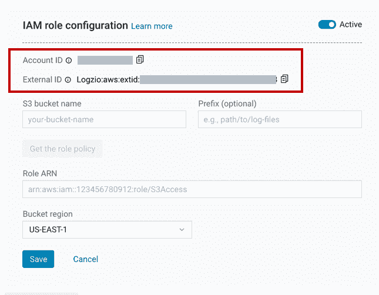

# 集中式日志记录:将雪花日志和审计数据传送到 Logz.io

> 原文：<https://medium.com/globant/centralized-logging-shipping-snowflake-logs-and-audit-data-to-logz-io-b6cdf42d0ce?source=collection_archive---------0----------------------->

在本文中，我们将了解如何为雪花启用集中式日志记录。这个用例的集中式日志记录器将是 Logz.io

那么，我们开始吧。

**本文涵盖的内容:**

1.  关于 Snowflake、Logz.io 等工具的一些背景知识，以及对集中式日志记录的需求
2.  在雪花中启用集中日志记录的问题
3.  提议的解决方案
4.  先决条件
5.  实际实施步骤
6.  结论
7.  一些关于自动化解释过程的额外提示
8.  一些有用链接的参考

**背景:**

**为什么集中式日志记录很重要？**

集中式日志记录提供了两个重要的好处。首先，它将所有日志记录放在一个位置，极大地简化了日志分析、关联任务和调试。其次，它为您的日志数据提供了一个安全的存储区域。

**什么是雪花？**

雪花是一个完全托管的 SaaS(软件即服务)，为数据仓库、数据湖、数据工程、数据科学、数据应用程序开发以及实时/共享数据的安全共享和消费提供单一平台。雪花提供开箱即用的功能，如存储和计算分离、动态可扩展计算、数据共享、数据克隆和第三方工具支持，以满足成长型企业的苛刻需求。

**logz . io 是什么？**

Logz.io 是一个云原生可观测性平台，提供基于云的日志分析服务，该服务基于开源日志分析平台——ELK Stack(elastic search，Logstash，Kibana)。Logz.io 提供的特性包括:警报、用户控制、解析服务、支持、集成和审计跟踪。

**问题:**

雪花没有与 Logz.io 的直接内置集成来导出日志和审计相关数据。

因此，我们必须首先将雪花日志和审计数据导出到某个公共位置(比如 AWS S3 桶)，然后 Logz.io 可以提取数据并将其呈现在 Kibana 仪表板上进行可视化和分析。

**解决方案:**

建议的解决方案如下。


如上图所示，我们将把各种雪花表中的数据上传到一个外部阶段。外部阶段会将数据复制到 AWS S3 存储桶中。

我们还将配置 Logz.io 来监听 AWS S3 存储桶并提取日志。

一旦日志和审计数据在 AWS S3 存储桶中可用，Logz.io 将开始提取它，并可以在 Kibana 仪表板上显示它。

**先决条件:**

1.  创建一个 AWS S3 存储桶，我们将使用它来存储日志
2.  如果你想通过命令运行下面的所有脚本，请安装 SnowSQL(这是一个雪花的命令行界面)。或者您可以在雪花 UI 上运行以下命令/脚本
3.  您将需要 *'* ***帐户管理员'*** 角色来执行以下所有命令

**实施步骤:**

现在让我们一步一步地将日志和审计数据卸载到 AWS S3 存储桶中。

请注意，我们将有选择地从表中检索数据，并将它以基于 json 的格式存储在一个文件中。

默认情况下，外部阶段中卸载的数据为 csv 格式。

Json 格式可读性更强，也更常用，所以我们将以 Json 格式卸载雪花数据。

**1。创建 IAM 角色和 IAM 策略**

请参考下面的链接并创建 IAM 角色和 IAM 策略，雪花将使用它们将数据卸载到 S3 存储桶中。

[https://docs . snow flake . com/en/user-guide/data-load-S3-config-storage-integration . html](https://docs.snowflake.com/en/user-guide/data-load-s3-config-storage-integration.html)

只需遵循上述链接中的步骤 1 和步骤 2。

**2。创建 S3 存储集成**

```
create or replace storage integration s3_integration
  type = external_stage
  storage_provider = s3
  enabled = true
  storage_aws_role_arn = '<PUT_HERE_AWS_ROLE_ARN>’
  storage_allowed_locations = ('<PUT_HERE_AWS_S3_BUCKET_PATH>’);
```

3.**创建一个 JSON 文件格式**

```
create or replace file format my_json_format
  type = json
  COMPRESSION = 'gzip'
  null_if = ('NULL', 'null');
```

**4。创建 S3 舞台**

```
use database ‘<PUT_HERE_DB_NAME>’;
use schema ‘<PUT_HERE_DB_SCHEMA_NAME_TO_USE>’;
create or replace stage my_s3_stage
 storage_integration = s3_integration
 url = ‘<PUT_HERE_AWS_S3_BUCKET_PATH>’
 file_format = my_json_format;
```

**5。执行 unload 命令，将数据从表格推送到 stage，并依次推送到 AWS S3**

```
use database ‘<PUT_HERE_DB_NAME>’;
use WAREHOUSE ‘<PUT_HERE_WAREHOUSE_NAME>’;copy into [@my_s3_stage/login_history](http://twitter.com/my_s3_stage/login_history) from (SELECT OBJECT_CONSTRUCT(‘application’, ‘snowflake’ ,’environment’, ‘<PUT_HERE_ENV_NAME>’, ‘log_type’, ‘login_history’, ‘EVENT_TIMESTAMP’, EVENT_TIMESTAMP, ‘EVENT_TYPE’, EVENT_TYPE, ‘USER_NAME’, USER_NAME, ‘CLIENT_IP’, CLIENT_IP, ‘REPORTED_CLIENT_TYPE’, REPORTED_CLIENT_TYPE, ‘FIRST_AUTHENTICATION_FACTOR’,FIRST_AUTHENTICATION_FACTOR, ‘IS_SUCCESS’, IS_SUCCESS, ‘ERROR_CODE’, ERROR_CODE, ‘ERROR_MESSAGE’, ERROR_MESSAGE) from snowflake.account_usage.Login_history) FILE_FORMAT = (TYPE = JSON) ;copy into [@my_s3_stage/access_history](http://twitter.com/my_s3_stage/access_history) from (SELECT OBJECT_CONSTRUCT(‘application’, ‘snowflake’ ,’environment’, ‘<PUT_HERE_DB_NAME>’, ‘log_type’, ‘access_history’, ‘QUERY_START_TIME’,QUERY_START_TIME, ‘USER_NAME’, USER_NAME, ‘DIRECT_OBJECTS_ACCESSED’,DIRECT_OBJECTS_ACCESSED, ‘BASE_OBJECTS_ACCESSED’, BASE_OBJECTS_ACCESSED, ‘OBJECTS_MODIFIED’, OBJECTS_MODIFIED) from snowflake.account_usage.Access_History ) FILE_FORMAT = (TYPE = JSON);
```

如果您参考上面的脚本，您可以看到我们正在使用' **copy into** 命令从各种表中卸载/提取数据，如 *login_history* 、 *access_history* 、 *query_history* 和 *sessions* 表等。

此外，正如您在脚本中看到的，我们正在使用 **Object_Construct** 有选择地从列中获取数据，并在准备 Json 格式的文件时根据我们指定的名称添加数据。为了更好地理解和查看日志，您可以在将表中的数据卸载为 Json 格式时添加定制数据。例如，在上面的脚本中，我在 Json 中注入了 application、environment 和 log_type 等标签/键。这将帮助我们按照环境和应用程序对日志进行分类。

您可以为所有下面的表重复并编写类似上面的脚本，雪花在这些表中存储日志和审计相关数据。


请注意，所有这些表/视图都存在于 ***雪花. account_usage*** 模式中。

**6。验证 AWS S3 存储桶中的文件**

一旦运行了上面的命令，您应该会看到在您的 S3 存储桶中创建了日志文件。


**7。配置 Logz.io 从 AWS S3 存储桶中提取数据**

*   登录 Logz.io 门户，从左侧菜单导航至日志→发送日志→选择 AWS→选择 S3 桶
*   一旦你这样做了，一个新的页面就会出现
*   单击+添加存储桶，并选择使用角色进行身份验证的选项



*   在文本编辑器中复制并粘贴帐户 ID 和外部 ID
*   填写表单以创建新的连接器
*   输入 S3 存储桶名称，如果需要，还可以输入存储日志的前缀
*   单击获取角色策略。您可以查看角色策略以确认所需的权限。将策略粘贴到文本编辑器中
*   保持这些信息可用，以便在 AWS 中使用

7.1 在 AWS 中创建 IAM 角色:

*   转到 AWS 管理控制台中的 IAM 角色页面
*   单击创建角色。将出现“创建角色向导”


*   单击另一个 AWS 帐户
*   粘贴从 Logz.io 复制的帐户 ID
*   选择需要外部 ID，然后粘贴上述步骤中的外部 ID
*   单击“下一步:权限”继续

7.2 创建策略:

*   在创建角色屏幕中，单击创建策略。“创建策略”页面将加载到一个新选项卡中
*   在 JSON 选项卡中，用从 Logz.io 复制的策略替换默认的 JSON
*   单击查看策略继续
*   为策略指定名称和可选描述，然后单击创建策略
*   记住策略的名称—您将在下一步中需要它
*   关闭选项卡，返回“创建角色”页面

7.3 将策略附加到角色:

*   单击(刷新)，然后在搜索框中键入新策略的名称
*   在过滤列表中找到您的策略，并选中其复选框
*   单击下一步:标签，然后单击下一步:查看以继续查看屏幕

7.4 确定角色:

*   给角色一个名称和可选描述。我们建议以“logzio-”作为名称的开头，这样可以清楚地表明您在 Logz.io 中使用这个角色
*   完成后，单击创建角色

7.5 将 ARN 复制到 Logz.io:

*   在 IAM 角色屏幕中，在搜索框中键入新角色的名称
*   在过滤列表中找到您的角色，然后单击它转到其摘要页面
*   复制角色 ARN(页面顶部)。在 Logz.io 中，将 ARN 粘贴到角色 ARN 字段中，然后单击保存

最后，你应该有所有的细节来填充下面的屏幕


**8。验证日志:**

仅此而已。现在是时候验证日志是否显示在 Logz.io 仪表板中了。

在 Logz.io 中，从左侧菜单导航到日志→Kibana

用“雪花”这个词搜索。您应该会看到如下所示的日志。


**总结**:

在本文中，我们展示了如何为雪花启用和实现一个集中的日志策略。

这将让您鸟瞰您的雪花 SaaS 基础设施，并有助于监控您的雪花，这将进一步有利于做日志分析，审计跟踪，并留意您的日常信贷使用雪花。

**自动化方法**？

如果您想连续地自动发送日志，您可以使用雪花中的“任务”。在任务的帮助下，您可以定期安排日志的卸载/导出。

看起来很简单，对吗？实际上，并不是这样。雪花不支持将差异数据复制到外部阶段。(即每次都会卸载所有数据)

那么，如何才能仍然实现差异数据复制呢？

请关注下一篇文章。

在那之前，祝你编码愉快。

**参考文献:**

*   https://www.snowflake.com/
*   【https://logz.io/ 
*   [https://docs . snow flake . com/en/SQL-reference/account-usage . html](https://docs.snowflake.com/en/sql-reference/account-usage.html)
*   [https://docs.snowflake.com/en/user-guide/snowsql.html](https://docs.snowflake.com/en/user-guide/snowsql.html)