# 使用 Katalon Studio 在 Rest Api 中链接请求

> 原文：<https://medium.easyread.co/chaining-request-in-rest-api-using-katalon-studio-127165d7d711?source=collection_archive---------2----------------------->

在本文中，我将解释 API，以及如何从 API 响应体中检索值，并在使用 Katalon Studio 在自动化测试过程中发送请求时将它用于其他 API 目的。


Photo by [Stephen Leonardi](https://unsplash.com/@stephenleo1982?utm_source=unsplash&utm_medium=referral&utm_content=creditCopyText) on [Unsplash](https://unsplash.com/s/photos/chain?utm_source=unsplash&utm_medium=referral&utm_content=creditCopyText)

什么是 API？
An [**API**](https://www.altexsoft.com/blog/engineering/what-is-api-definition-types-specifications-documentation/) 是一组能够在一个软件产品和另一个软件产品之间进行数据传输的编程代码。它还包含这种数据交换的条款。

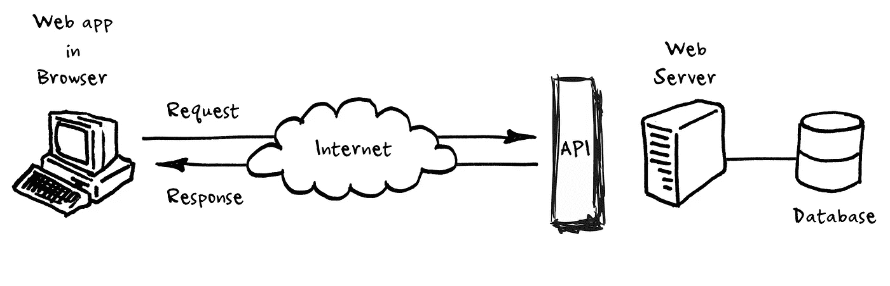

An API is not a database. It is an access point to an app that can access a database, Source: [https://medium.com/@perrysetgo/what-exactly-is-an-api-69f36968a41f](https://medium.com/@perrysetgo/what-exactly-is-an-api-69f36968a41f)

在其开发过程中，开发了几种类型的 API 样式，如下图所示:

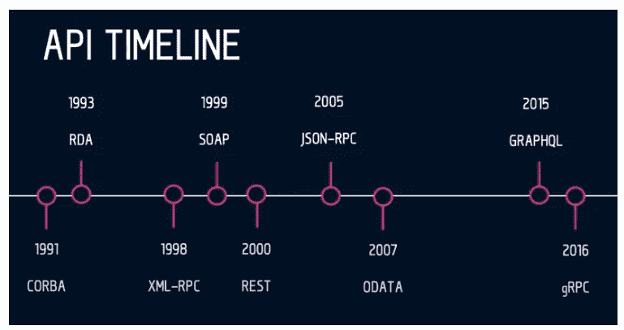

*API styles over time, Source:* [https://www.altexsoft.com/blog/soap-vs-rest-vs-graphql-vs-rpc/](https://www.altexsoft.com/blog/soap-vs-rest-vs-graphql-vs-rpc/)

# 1.远程过程调用(RPC):调用另一个系统上的函数

一个 [RPC](https://techolution.com/types-of-apis/) (远程过程调用)API 是[最古老和最简单的 API 类型](https://cloud.google.com/blog/products/application-development/rest-vs-rpc-what-problems-are-you-trying-to-solve-with-your-apis)。RPC 的目标是让客户端在服务器上执行代码。RPC APIs 的主要好处是它们使开发人员更容易创建涉及多个程序或服务的应用程序。

**远程过程调用**是一种规范，允许在不同的上下文中远程执行一个函数。RPC 扩展了本地过程调用的概念，但是将它放在 HTTP API 的上下文中。

# 2.简单对象访问协议(SOAP):使数据作为服务可用

**SOAP** 是 REST 之前设计的一个协议，并进入了画面。设计 SOAP 背后的主要思想是确保在不同平台和编程语言上构建的程序能够以一种简单的方式交换数据。SOAP 代表简单对象访问协议。

[**SOAP**](https://www.altexsoft.com/blog/engineering/what-is-soap-formats-protocols-message-structure-and-how-soap-is-different-from-rest/#soap-use-cases) 是一种 XML 格式的、高度标准化的 web 通信协议。微软在 XML-RPC 一年后发布的 SOAP 继承了它的很多东西。当 REST 出现时，它们首先被并行使用，但很快 REST 赢得了流行度竞赛。

# 3.表述性状态转移(REST):使数据作为资源可用

REST 是一种自解释的 API 架构风格，由一组架构约束定义，旨在被许多 API 消费者广泛采用。

今天最常见的 API 风格最初是由 Roy Fielding 在 2000 年的博士论文中描述的。REST 使服务器端数据可用，用简单的格式表示，通常是 JSON 和 XML。

**REST** 是专门为处理媒体组件、文件甚至特定硬件设备上的对象而设计的。任何基于 REST 原则定义的 web 服务都可以称为 RestFul web 服务。Restful 服务将使用普通的 HTTP 动词 GET、POST、PUT 和 DELETE 来处理所需的组件。REST 代表代表性状态转移。

# 4.GraphQL:只查询需要的数据

它需要多次调用 REST API 来返回所需的人员。所以 GraphQL 的发明是为了改变游戏规则。

[**GraphQL**](https://www.altexsoft.com/blog/engineering/graphql-core-features-architecture-pros-and-cons/) 是一种描述如何进行精确数据请求的语法。对于有许多复杂实体相互引用的应用程序数据模型来说，实现 GraphQL 是值得的。

以上四个 API 中，这次要讨论的是 REST API。
REST API 示例可在 reqres.in 网站上找到。在这个网站上，我们可以看到有几种类型的请求。

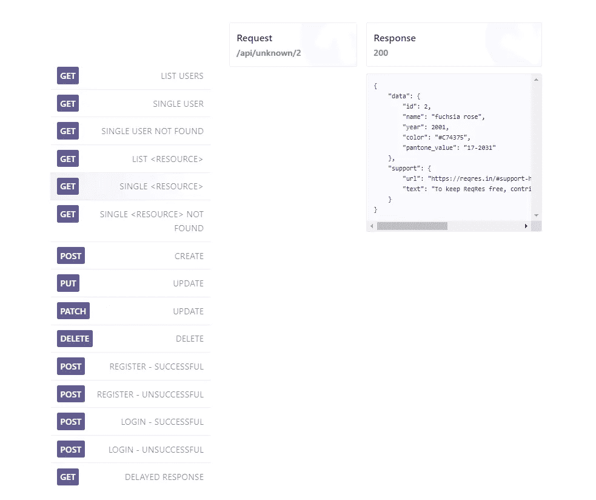

API regres, Source: [https://reqres.in/](https://reqres.in/)

因为我们想要创建链接请求，我们所做的是选择一些我们想要使用的请求，然后将它们移动到我们的自动化测试工具中，这是 Katalon Studio，然后在那里执行它们。

步骤如下:

1.  **从** **网站的** [**需求中选择要使用的需求。**](https://reqres.in/)

在请求列表中，将使用 2 个请求，即 API GET LIST USERS 和 API PUT UPDATE。

*   API 获取用户列表

这个 API 响应将返回用户列表数据。

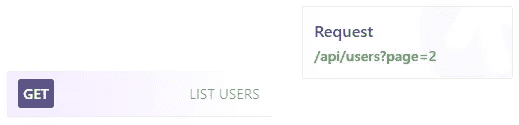

API GET LIST USERS, Source: [https://reqres.in/](https://reqres.in/)

*   API 上传更新

这个 API 响应将返回更新数据的结果


API PUT UPDATE, Source: [https://reqres.in/](https://reqres.in/)

2.**在 Katalon 创建一个新项目**

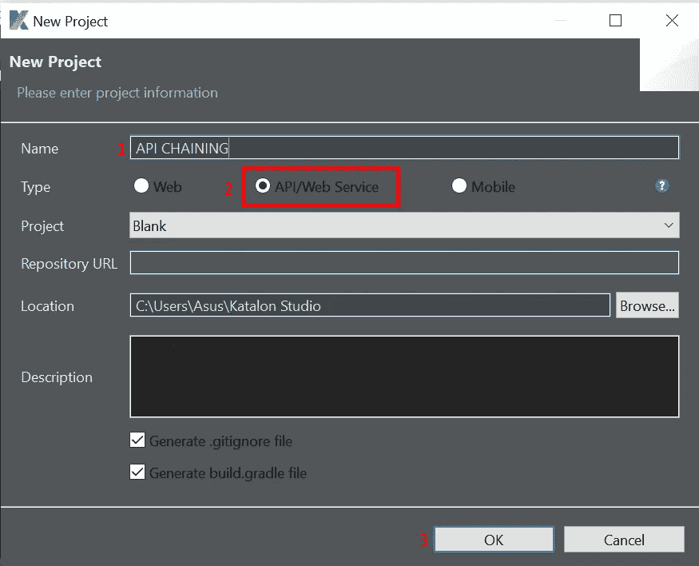

**3。在 Katalon 中为两个 API 创建一个对象存储库 web 服务请求。**

在 Katalon 中，右键单击对象存储库文件夹>单击新建>单击 Web 服务请求

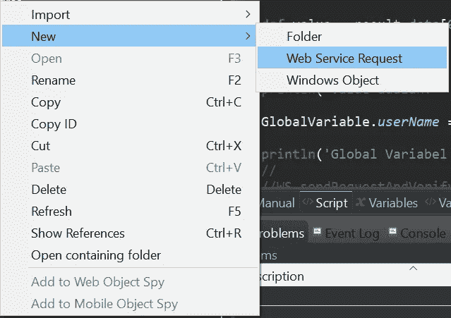

Creating a New Object Repository for a Web Service Request

在下一个屏幕中，在 name 字段中填写 web 服务名称，并在请求类型中选择 RESTful，因为我们将使用 REST API，并输入适当的 API url，然后单击 OK。

*   Web 服务请求 API 获取列表用户

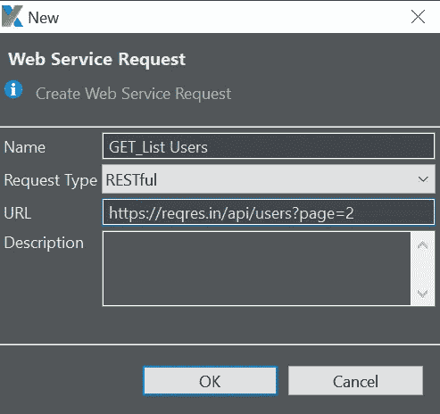

Fill in the name, type and url of the API GET List User Information

*   Web 服务请求 API 更新用户

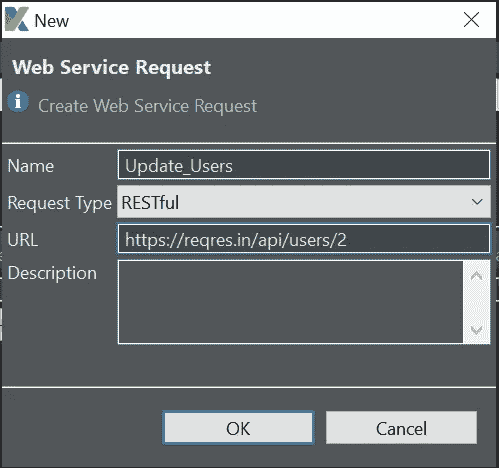

Fill in the name, type and url of the API Update User Information

对于 GET List 用户 API，我们不需要主体请求，但是在 Update 用户 API 中，我们需要用以下 json 填充请求主体:

```
{
    "name": "${userName}",
    "job": "zion resident"
}
```

在上面的主体请求中，name 参数的值取自 userName 变量。在 Variables 选项卡上查看时，userName 变量的值也取自概要文件中的全局变量。


Variables in Object repository Web Service Request

如果我们在 Profiles 部分查看全局变量，全局变量 userName 的值被初始化为一个空字符串。

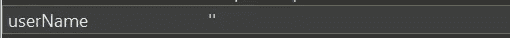

Global Variabel username diinisialisasi sebagai string kosong

# 那么价值从何而来？

好的，这个值将从我们将在 Get List 用户 API 响应中获得的参数值中填充，并且将在我们稍后制作测试用例时进行解释。

**4。将验证添加到响应体 API**

在进行验证之前，希望我们已经知道预期的结果是什么。但是在这种情况下我们假设预期的结果是符合实际的。因此，将根据 API 响应中的值进行验证，并且只对少数参数进行验证。

*   向回应正文 API 获取列表用户添加验证

当发送这个 GET List Users 请求时，将获得一个响应体，如下面的 json 所示:

```
{
  "page":2,
  "per_page":6,
  "total":12,
  "total_pages":2,
  "data":[
    {
      "id":7,
      "email":"[michael.lawson@reqres.in](mailto:michael.lawson@reqres.in)",
      "first_name":"Michael",
      "last_name":"Lawson",
      "avatar":"[https://reqres.in/img/faces/7-image.jpg](https://reqres.in/img/faces/7-image.jpg)"
    },
    {
      "id":8,
      "email":"[lindsay.ferguson@reqres.in](mailto:lindsay.ferguson@reqres.in)",
      "first_name":"Lindsay",
      "last_name":"Ferguson",
      "avatar":"[https://reqres.in/img/faces/8-image.jpg](https://reqres.in/img/faces/8-image.jpg)"
    },
    {
      "id":9,
      "email":"[tobias.funke@reqres.in](mailto:tobias.funke@reqres.in)",
      "first_name":"Tobias",
      "last_name":"Funke",
      "avatar":"[https://reqres.in/img/faces/9-image.jpg](https://reqres.in/img/faces/9-image.jpg)"
    },
    {
      "id":10,
      "email":"[byron.fields@reqres.in](mailto:byron.fields@reqres.in)",
      "first_name":"Byron",
      "last_name":"Fields",
      "avatar":"[https://reqres.in/img/faces/10-image.jpg](https://reqres.in/img/faces/10-image.jpg)"
    },
    {
      "id":11,
      "email":"[george.edwards@reqres.in](mailto:george.edwards@reqres.in)",
      "first_name":"George",
      "last_name":"Edwards",
      "avatar":"[https://reqres.in/img/faces/11-image.jpg](https://reqres.in/img/faces/11-image.jpg)"
    },
    {
      "id":12,
      "email":"[rachel.howell@reqres.in](mailto:rachel.howell@reqres.in)",
      "first_name":"Rachel",
      "last_name":"Howell",
      "avatar":"[https://reqres.in/img/faces/12-image.jpg](https://reqres.in/img/faces/12-image.jpg)"
    }],
  "support":{
    "url":"[https://reqres.in/#support-heading](https://reqres.in/#support-heading)",
    "text":"To keep ReqRes free, contributions towards server costs are appreciated!"
  }
}
```

在对象存储库中的“验证”选项卡上，添加的断言如下:

```
RequestObject request = WSResponseManager.getInstance().getCurrentRequest()ResponseObject response = WSResponseManager.getInstance().getCurrentResponse()WS.verifyResponseStatusCode(response, 200)assertThat(response.getStatusCode()).isEqualTo(200)WS.verifyElementPropertyValue(response, 'data[1].first_name', 'Lindsay')
WS.verifyElementPropertyValue(response, 'data[2].first_name', "Tobias")
WS.verifyElementPropertyValue(response, 'data[2].last_name', "Funke")
```

在上面的脚本片段中，可以看到有 4 项内容得到了验证，包括:

a.状态代码应该是 **200**

b.值键的名字，在数据参数的第一个索引中应该是 Lindsay

c.数据参数的第二个索引中的值键名应该是 Lindsay Tobias

d.值键的姓，在数据参数的第二个索引中应该是 Funke

*   向响应体 API 更新用户
    添加验证当发送该更新用户请求时，将获得如下 json 所示的响应体:

```
{
  "name":"",
  "job":"zion resident",
  "updatedAt":"2021-09-10T02:22:53.421Z"
}
```

在对象存储库中的“验证”选项卡上，添加的断言如下:

```
RequestObject request = WSResponseManager.getInstance().getCurrentRequest()ResponseObject response = WSResponseManager.getInstance().getCurrentResponse()WS.verifyElementPropertyValue(response, 'name', "Michael")WS.verifyResponseStatusCode(response, 200)assertThat(response.getStatusCode()).isEqualTo(200)
```

# **你在上面的代码片段中看到了什么奇怪的地方吗？**

是的，这当然很奇怪，因为响应主体名称是一个空字符串，而在验证选项卡中，验证的名称是 Michael。

# **怎么发生的？**

这是因为 username 参数值取自全局变量 username，该变量当前设置为空。


Global Variabel username is initialized as an empty string

那么，如果我们也从对象存储库中发送请求，那么对象存储库中的验证部分就不会被检查。这就是为什么当我们发送请求时，结果仍然是成功的，因为验证部分没有被检查。

那么我们如何运行它，以便检查验证部分呢？在这种情况下，我们需要一个**测试用例**。

**5。在 Katalon 中创建一个新的测试用例**

在这一步中，将创建一个测试用例，它将发送一个请求并运行它的验证，以检查生成的响应是否与预期的结果一致。

但是在深入之前，您知道什么是测试用例吗？
[**测试用例**](https://www.guru99.com/test-case.html) 是为验证软件应用程序的特定特性或功能而执行的一组动作。测试用例包含测试步骤、测试数据、前置条件、后置条件，是为验证任何需求而开发的特定测试场景。

如何在 Katalon 上制作一个测试用例相当容易。
右击测试用例文件夹>点击新建>点击测试用例

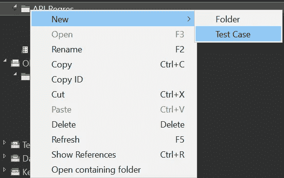

Create a new test case

之后，给你的测试用例命名，然后点击 OK 按钮。

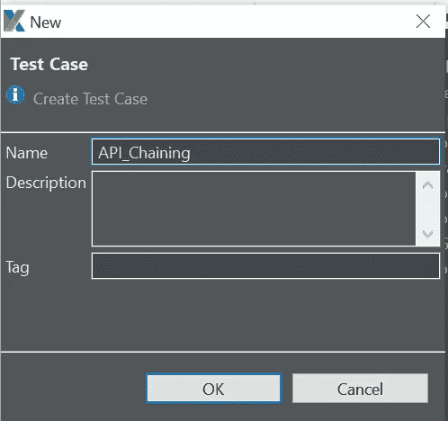

Membuat nama test case

创建测试用例后，单击脚本部分并键入以下代码片段:

```
response1 = WS.sendRequestAndVerify(findTestObject('API Reqres/ListUsers', [('url') : GlobalVariable.url]))def slurper = new groovy.json.JsonSlurper()def result = slurper.parseText(response1.getResponseBodyContent())String apiPostLoanResponse = response1.getResponseText()def value = result.data[0].first_nameGlobalVariable.userName = valueWS.sendRequestAndVerify(findTestObject('API Reqres/UpdateUsers', [('url') : GlobalVariable.url, ('userName') : GlobalVariable.userName]))
```

在上面的代码片段中，可以看到发送的第一个 API 是 GET List 用户 API。之后，响应主体被解析为文本形式，然后基于 json 路径解析 result.data[0]的值。first_name 存储在参数值中。最后，参数 value 的值存储在全局变量 username 中。以便最初为空的全局变量 username 变成根据 result.data[0]中的值的值。名字。

这是 API Update 用户使用的值，显示在代码片段的最后一行，作为在主体请求中发送的用户名的值。因此，我们可以清楚地看到**链式 API** 在这种情况下是如何实现的。

**6。运行测试用例并检查结果**

当我们运行一个测试用例时，我们的希望是测试用例被成功执行，并且验证结果是我们所期望的。下面是测试用例运行后日志查看器的样子:

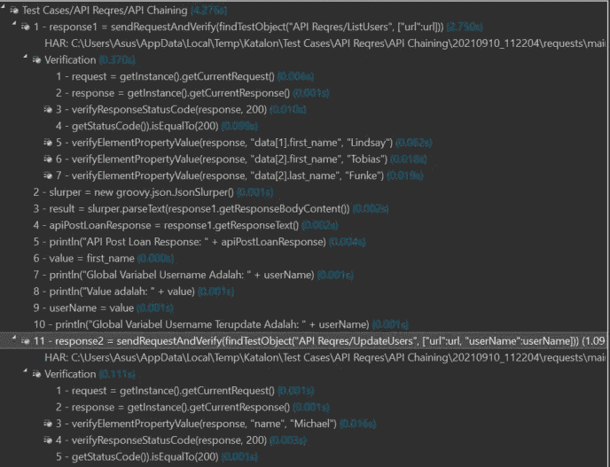

Test Case Log Viewer

在上图中，可以看到每个步骤都被成功执行，以及验证结果。有趣的是，如果我们对对象存储库进行验证，并发送一个带有关键字 Send Request 和 Verify 的请求，那么验证部分将位于一个特殊的部分，如上所示。因此，要检查每个验证的结果，我们只需单击“验证”部分，即可看到如下结果:


Checking the results of verification

所以，在右边也会显示验证的结果:


Result of verification

基于以上验证结果，可以得出结论**链 API 成功**是因为:
***体响应 API GET List User 的值在 json path data[0]中。first_name 已成功保存到全局变量 username 中，API Update 用户将使用该变量作为请求正文中的 username 参数值，并在“验证”选项卡上成功验证，即 Michael。***

## **因此我作了这篇文章。希望对大家有用并保持健康，愿上帝与你同在💙🤍**

> 她饿了。保持愚蠢。永远不要放弃追求新想法、新经历和新冒险的欲望。”
> 
> 史蒂夫·乔布斯

# 参考:

1.  [https://www . altex soft . com/blog/engineering/what-is-API-definition-types-specifications-documentation/](https://www.altexsoft.com/blog/engineering/what-is-api-definition-types-specifications-documentation/)
2.  [https://medium . com/@ perrysetgo/到底什么是 api-69f36968a41f](https://medium.com/@perrysetgo/what-exactly-is-an-api-69f36968a41f)
3.  [https://www.guru99.com/comparison-between-web-services.html](https://www.guru99.com/comparison-between-web-services.html)
4.  [https://techolution.com/types-of-apis/](https://techolution.com/types-of-apis/)
5.  [https://www . altex soft . com/blog/soap-vs-rest-vs-graph QL-vs-RPC/](https://www.altexsoft.com/blog/soap-vs-rest-vs-graphql-vs-rpc/)
6.  [https://www.guru99.com/test-case.html](https://www.guru99.com/test-case.html)
7.  [https://reqres.in/](https://reqres.in/)