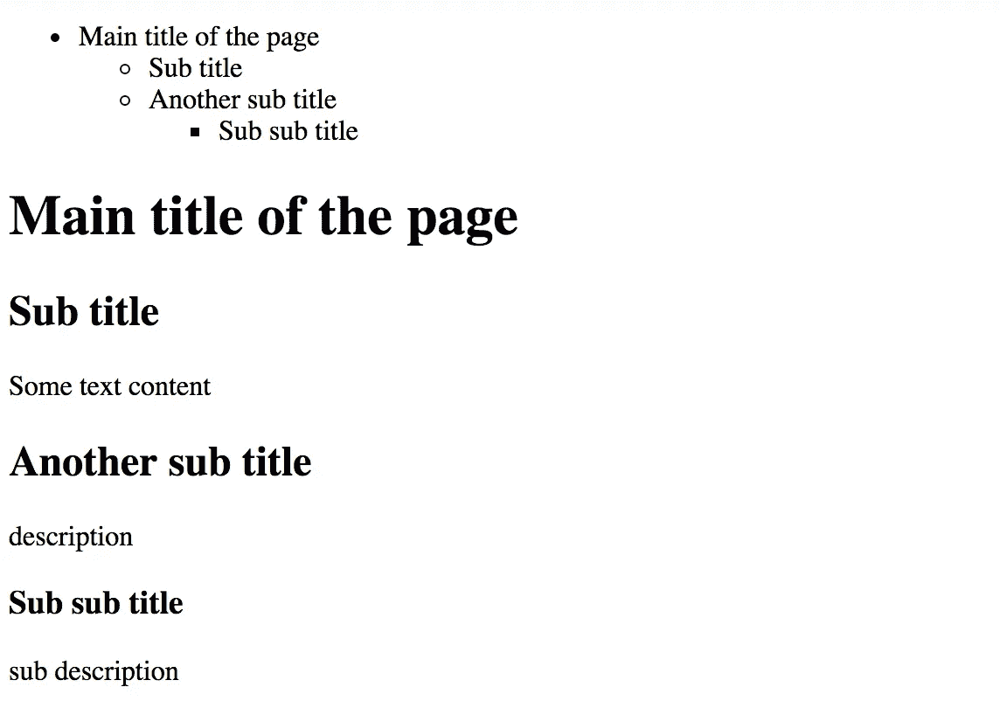
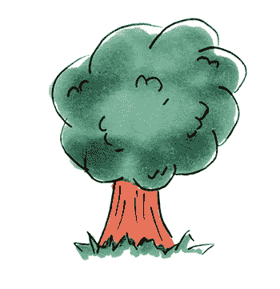
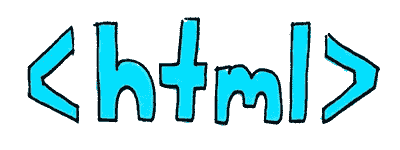
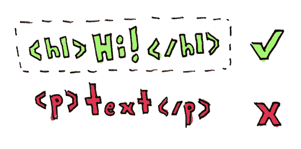
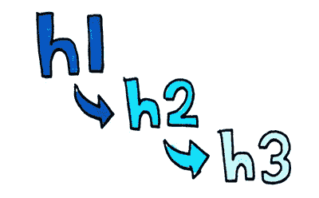
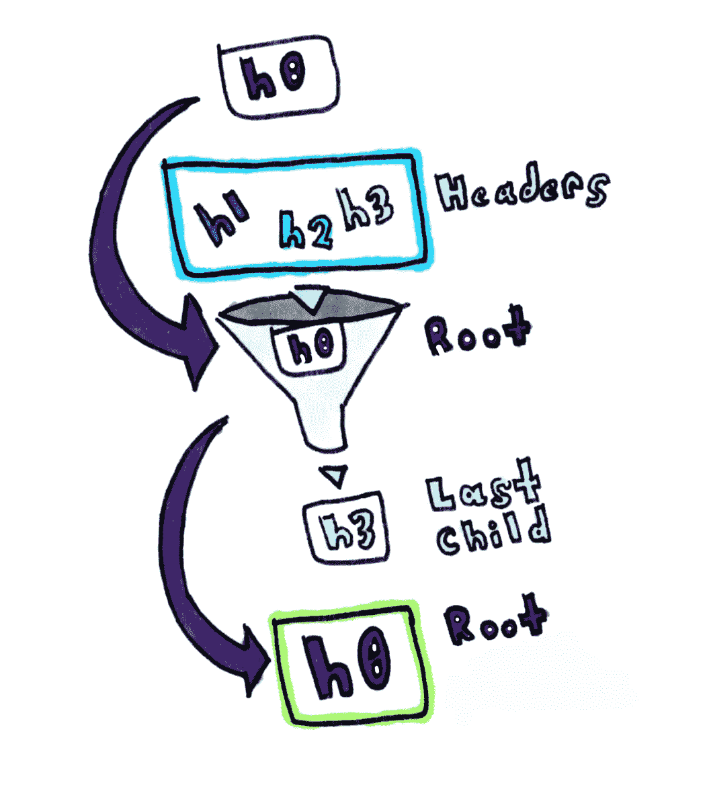
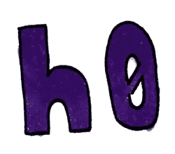
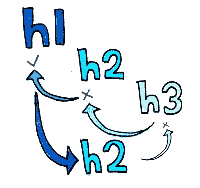
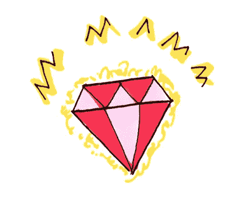

# 挑战—目录生成器

> 原文：<https://medium.com/square-corner-blog/challenge-table-of-contents-generator-c99171fde831?source=collection_archive---------3----------------------->


> 注意，我们已经行动了！如果您想继续了解 Square 的最新技术内容，请访问我们的新家[https://developer.squareup.com/blog](https://developer.squareup.com/blog)

介绍开发者挑战！这是一个新的系列，我们发布了由现实世界应用激发的挑战。

虽然本文后面会给出解决方案，但我们鼓励您先尝试一下这个挑战！我们将在推特 [@SquareDev](https://twitter.com/SquareDev) 上重点介绍我们获得的顶级解决方案。


# 问题是


Questions questions, we’ve got a question.

给定一个具有多个标题的 HTML 页面，我们希望提取标题来制作一个目录:

```
<h1>Main title of the page</h1><h2>Sub title</h2><p>Some text content</p><h2>Another sub title</h2><p>description</p><h3>Sub sub title</h3><p>sub description</p>
```

现在我们最想要的是从这个列表中提取一个目录。现在我们可以从一个无序列表开始:

```
<ul>
  <li>Main title of the page
    <ul>
      <li>Sub title</li>
      <li>Another sub title
        <ul>
          <li>Sub sub title</li>
        </ul>
      </li>
    </ul>
  </li>
</ul>
```

这个，放在我们的内容上面，看起来像这样:



The apex of HTML styling. Beautiful.

因此，给定一个页面，目标是返回一个无序列表，表示它的目录。

# 试试看！

想试试吗？下面是 Ruby 中使用 RSpec 的一些基本规范:

话虽如此，让我们深入探讨解决方案吧！在你尝试之前不要偷看。

# 一个解决方案

这个问题有趣的地方在于，我们试图把一些线性的东西做成树状结构。

请注意，我们的解决方案不会被完美地分解，但会寻求一种可行的技术来解决这个问题。我们将把它作为一个练习留给有抱负的读者。

**树节点**



We can branch out a bit

为此，我们将从树节点的概念开始:

我们希望能够捕捉标题标签的概念，它有潜在的子标题和潜在的父标题。

举一个简单的例子，我们可能会这样:

```
h1 = TreeNode.new('h1', 'Title')
h1.add_child('h2', 'Subtitle')
h1.add_child('h2', 'Another Subtitle')
```

现在你可以自由地添加子标签到一个头节点，还有一个`to_s`和`to_h`方法可以让我们深入了解:

```
puts h1
# [h1] Title
#   [h2] Subtitle
#   [h2] Another Subtitleh1.to_h
{
  "name" => "Title",
  "children" => [
    {"name"=>"Subtitle", "children"=>[]},
    {"name"=>"Another Subtitle", "children"=>[]}
  ]
}
```

我们还可以判断一个特定的标签是否是另一个标签的后代:

```
h1.descendant?('h2') # => true
h1.descendant?('h3') # => true
```

考虑到这一点，如果有人试图添加一个不是后代的孩子，我们可能会引发一个错误，但我们也不会直接使用它。

这里的最后一个东西是一个`to_html`方法，它将赋予我们递归生成 HTML 的能力。如果我们在[html beautiier](https://github.com/threedaymonk/htmlbeautifier)中运行它，它会更容易解析:

```
puts HtmlBeautifier.beautify(h1.to_html)
<li>Title
  <ul>
    <li>Subtitle</li>
    <li>Another Subtitle</li>
  </ul>
</li>
```

但这带来了上面提到的那个`h0`的有趣问题，以及奇怪的缺少外部`<ul>`元素。这是有原因的，我们将在下一部分强调。

这就把我们带到了解决方案的下一部分:提取内容。

**Nokogiri**



Tag! You’re it.

第一步是我们需要从给定的 HTML 中获取 header 标签。为此，我们可以利用 Nokogiri 和`css`选择器:

```
**require 'nokogiri'**Nokogiri('<h1>title</h1>')
  .**css**('h1, h2, h3, h4, h5, h6')# => [#<Nokogiri::XML::Element:0x3fd76d0be044 name="h1" children=[#<Nokogiri::XML::Text:0x3fd76c96944c "title">]>]
```



We only want to grab the header tags, everything else can be ignored

问题是，这对于碎片来说就不那么管用了:

```
Nokogiri('<h1>title</h1><h2>test</h2><h2>test2</h2>')
  .css('h1, h2, h3, h4, h5, h6')# => [#<Nokogiri::XML::Element:0x3fd76c9719a8 name="h1" children=[#<Nokogiri::XML::Text:0x3fd76c970e40 "title">]>]
```

所以我们可以欺骗一下:

```
html = '<h1>title</h1><h2>test</h2><h2>test2</h2>'
Nokogiri("**<html>**#{html}**</html>**")
  .css('h1, h2, h3, h4, h5, h6')# => [#<Nokogiri::XML::Element:0x3fd76dcd40cc name="h1" children=[#<Nokogiri::XML::Text:0x3fd76e40bee4 "title">]>, #<Nokogiri::XML::Element:0x3fd76e40bac0 name="h2" children=[#<Nokogiri::XML::Text:0x3fd76e40b8f4 "test">]>, #<Nokogiri::XML::Element:0x3fd76e40b73c name="h2" children=[#<Nokogiri::XML::Text:0x3fd76e40b570 "test2">]>]
```

这样我们就获得了所有的头，这意味着我们可以进入下一部分:头提取器。

**割台提取器**



Descending the nodes

现在我们有了一种获取头的方法，让我们将它与前面的 TreeNode 结合起来:



Root node goes in, children get added, and we return the root node afterwards

现在这个可能很密集。我们来分解一下！

*根节点*



It’s rooting for you

第一部分定义了一个“根节点”,我们可以用它来捕获任何级别的头。在*和*的情况下，一个页面上有多个`h1`标签，或者根本没有标签，这使得创建一个树变得非常困难。甚至可能会有一个`h3`第一，这使得它更加有趣。

这意味着我们在迭代的时候必须忽略它，但是它在相对深度上给我们提供了很大的灵活性。当然，在顺序上让一个`h3`优先于一个`h1`是不寻常的，但是这是留给读者的一个练习，希望 HTML 作者能这样做。

*Nokogiri CSS*


Oi, no tag backs

我们已经看到了这个，唯一的区别是我们把标题作为可选参数传入，并把它精简到只挖掘到`h3`。

*彻底还原*

这就是它变得有点有趣的地方。

第一个要素是上升:

```
current_tree = current_tree.parent **until** current_tree.descendant?(tag.name)
```



Ascending nodes until we find one which has a higher hierarchy than the tag

我们正在做的是一步一步地回到树上，直到我们找到它的后代。由于根节点是顶层父节点，我们可以确保总有一个顶层可以将任何标签作为后代。

在我们到达我们想要的树之后，我们给它添加一个孩子:

```
current_tree.**add_child**(tag.name, tag.text)
```

如果我们回头看看前面的实现，我们会注意到它返回了子树，这意味着现在这是我们的新树。假设我们有一个`h2`和另一个`h2`，这意味着它上升一次，然后添加到第一个`h2`的父节点。

*回根*


…and then there was a tree! Fancy that!

既然我们已经检查了所有的头，我们只需要返回根节点和所有完整的子节点。

考虑到我们之前的`to_h`方法和`to_s`方法，我们可以试一试！我们来看看 jquery.com:

```
require 'net/http'
html = Net::HTTP.get(URI('https://jquery.com'))puts header_extractor(html)
[h0] ROOT
  [h2] jQuery
    [h3] Lightweight Footprint
    [h3] CSS3 Compliant
    [h3] Cross-Browser
  [h2] What is jQuery?
  [h2] Other Related Projects
    [h3] Resources
  [h2] A Brief Look
    [h3] DOM Traversal and Manipulation
    [h3] Event Handling
    [h3] Ajax
    [h3] Books
```

我们可以看到早期使用多个顶级节点的潜在乐趣。这种类型的问题在处理多个片段时尤其普遍。

# 完整的解决方案



Tu too rooooo! Victory! You got 15 exp. Whimsy leveled up!

这样我们就有了完整的解决方案:

…测试呢？

```
Finished in 0.44593 seconds (files took 0.21331 seconds to load)
5 examples, 0 failures
```

厉害！

# 有解决办法吗？

我们希望看到您的解决方案！请发推文到 [@SquareDev](https://twitter.com/SquareDev) 给我们，我们将在下一轮挑战开始时重点介绍最佳解决方案。

下次见。

*想要更多吗？* [*注册*](https://www.workwithsquare.com/developer-newsletter.html?channel=Online%20Social&sqmethod=Blog) *为你的每月开发者简讯或* [*顺道拜访*](https://squ.re/2Hks3YE)*the Square dev Slack channel 并说声“嗨！”*