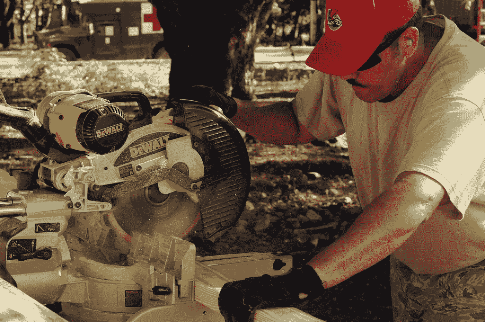
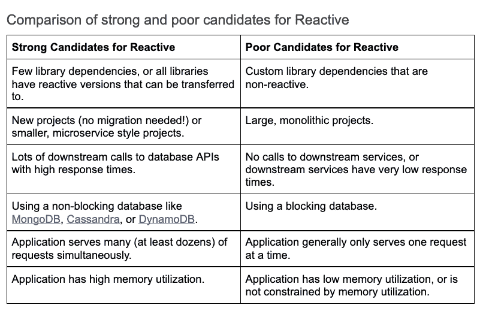
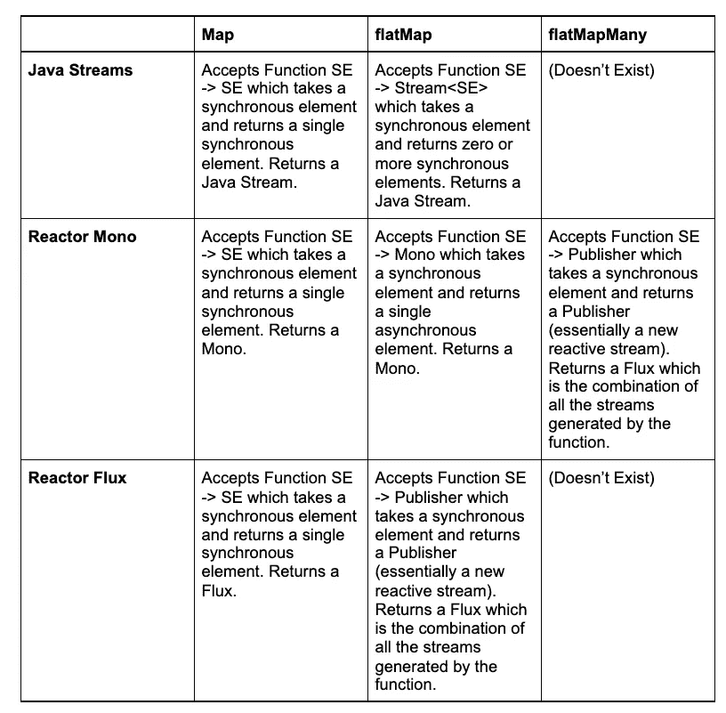
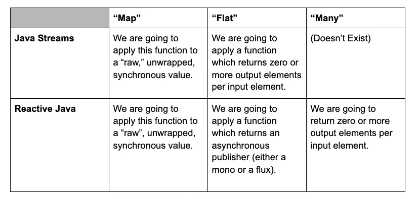
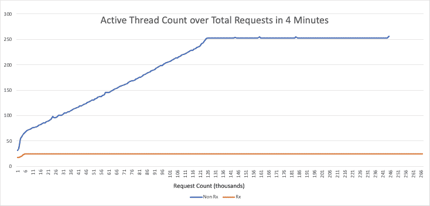

# 将 Java 应用迁移到 Reactive 的挑战和解决方案

> 原文：<https://medium.com/capital-one-tech/challenges-solutions-for-migrating-java-apps-to-reactive-f6df16d19c9c?source=collection_archive---------0----------------------->

## 通过使用反应式 WebFlux 重新实现 Java Spring Boot 应用程序，我学到了什么


我在 Capital One 的团队定期进行创新冲刺(T1)，这是为期两周的时间，我们可以在正常需求之外做一些事情，比如新技术或工具。最近有一些关于[反应流 API](https://www.reactive-streams.org/) 的讨论，认为它是 web 应用中非阻塞 IO 的一个引人注目的策略，我有兴趣深入研究一下。因此，我们和同事 Kristian Langholm 一起，决定通过将我们团队的一个 [Spring Boot](https://spring.io/projects/spring-boot) 应用程序迁移到使用 [WebFlux](https://docs.spring.io/spring-framework/docs/current/reference/html/web-reactive.html) 来研究 Reactive 范式，这是 Reactive for Spring 应用程序的一个实现。对于我们的测试主题，我们决定使用一个小的 API 来处理包含客户交易信息的请求，并返回关于应该允许还是阻止交易的决定。

虽然 Kristian 和我已经对 WebFlux 做了一些研究，阅读了文档和几篇解释如何使用它的文章(我发现[这个](https://dzone.com/articles/spring-webflux-eventloop-vs-thread-per-request-mod)和[这个](https://www.baeldung.com/spring-reactive-guide)特别有帮助)，我们仍然在重新实现我们的应用程序的整个过程中面临着几个挑战。其中一些在本质上更加抽象*(你如何以“反应方式”编写代码？Reactive 是否是这种应用的正确选择？)*还有一些更加专业和具体*(你如何以非阻塞的方式处理错误？Map、flatMap 和 flatmapny 有什么区别？)*。在这个过程结束时，我们已经找到了这些问题的答案，并认为与对使用 Reactive 实现应用程序的过程感兴趣的其他人分享我们的发现可能会有所帮助。

*注意——在本文中，我将使用广义的术语“反应式”来指代未来的反应式流 API，但是您也可以用自己选择的反应式框架来代替它。*

# 挑战 0:如何看待反应式编程和命令式编程

使用 Reactive 的第一个挑战是如何思考代码及其工作方式的思维转变。我喜欢按照*“每个请求一个工人”*和*“每个子任务一个工人”来考虑这个问题*基本上，命令型线程处理整个请求的方式不同，而反应型线程只处理请求的一小部分。

让我们打个比方:假设你拥有一家定制家具厂，并雇佣了一个劳动力来帮助组装家具。当收到请求时，你派出一名工人，向他们提出请求，他们执行所有的任务来按照提供的规格建造家具——收集木材，切割碎片，将它们连接在一起，上漆和染色，最后包装成品以便交付。这大概就是命令式 web 应用程序的工作方式。为每个请求分派一个工作线程，它处理请求的每个部分。如果该过程的任何部分导致一些延迟(例如，等待油漆干燥)，工人在继续之前等待该延迟结束。

在反应式范例中，事情完全不同。假设你有一群工人在休息室被分配任务；这个工作者集合类似于 Reactive 中的执行器线程池(关于执行器线程池和 Reactive 线程模型的更多细节可以在[这篇有用的文章](https://dzone.com/articles/understanding-the-reactive-thread-model-part-1)中找到)。在家具制造的每个阶段，可以要求任何可用的工人来完成任务。一旦工人完成了那部分任务，他们可以回到休息室等待下一个任务。同样，如果任务的一部分需要等待(例如等待油漆变干)，工人也可以回到休息室。一旦油漆干了，其他人(或者可能是同一个工人)会被派去做下一步。反应式家具工厂的这种特殊性质类似于非阻塞 IO。与其让工人浪费时间等待油漆变干，工人可以自由地去做其他事情。该工厂中的工人花费更少的时间等待，更多的时间在实际任务上，同样，在反应式范例中，线程处于空闲状态的时间更少。



Source [Wikipedia](https://commons.wikimedia.org/w/index.php?title=File:Woodworker_using_sliding_mitre_saw.jpg&oldid=522132852). This file is licensed under the [Creative Commons](https://en.wikipedia.org/wiki/en:Creative_Commons) [Attribution 2.0 Generic](https://creativecommons.org/licenses/by/2.0/deed.en) license.

# 挑战 1:我们应该使用反应式吗？

那么，为什么首先要使用反应范式呢？反应式 Java 的主要优势是更有效地利用线程:

*   随着并发请求数量的增加，使用的线程总数减少。
*   线程间切换花费的时间更少。

在这两个优点中，前者在大多数情况下更为重要。在现代系统中，线程间切换的上下文开销越来越小(在几纳秒或十亿分之一秒的规模上)。除非您的 API 具有非常严格的 SLA，否则这可能不是一个大问题。

然而，使用更少的线程的优势是显著的。线程将内存用于上下文，使用较少的线程应该直接对应于更有效的内存使用，这在内存受限的环境中可能是一个问题。由于这个原因，在某些情况下，切换到反应式可以显著减少内存消耗。



Links for Reactive implementations of databases: [MongoDB](http://reactivemongo.org/), [Cassandra](https://docs.spring.io/spring-data/cassandra/docs/current/api/org/springframework/data/cassandra/repository/ReactiveCassandraRepository.html), [DynamoDB](https://www.javacodegeeks.com/2018/12/reactive-spring-webflux-aws-dynamodb.html).

总的来说，切换到反应式可能不会提高速度性能，但是如果您使用异步调用同时处理许多请求，它可能会有利于您的内存性能。

# 挑战 Java Streaming API、Java Futures 和 Reactive 之间有什么异同？

如果你熟悉 [Java 流 API](https://www.baeldung.com/java-8-streams) 或 [Java Futures](https://www.baeldung.com/java-future) ，那么这些知识在反应式编程领域也有类似的概念。我们将首先看一看 Java 流和 Java Future 与 Reactive 之间的相似之处，然后讨论一个特别令人困惑的案例，它突出了一些不同之处。

## Java 流 API

Java 流 API[允许你将函数应用到元素流中。这里有一个简单的例子:](https://www.baeldung.com/java-8-streams)

```
List*<*String*>* uppercaseStringList = 
    Stream.*of(*"alpha", "bravo", "charlie"*)* .map*(*String::toUpperCase*)*.collect*(*Collectors.*toList())*;
```

在这个例子中，我们创建了一个字符串“alpha”、“bravo”和“charlie”的流，对每个字符串应用大写函数，并将它们收集到一个列表中。Reactive 也有一个流的概念，它们非常相似:可以对其应用函数的元素集合。关键的区别在于，Java 流 API 流用于阻塞/同步元素，而反应式 Java 流用于非阻塞/异步元素。

## Java 未来

Java Futures 可以进一步扩展命令流和反应流之间的相似性。考虑这个例子:

```
List results = Stream.*of(*CompletableFuture.*runAsync(()* -> downstreamCall*())*, CompletableFuture.*runAsync(()* -> downstreamCall2*())* .map*(*future -> {
    try *{* return future.get*()*;
    *}* catch *(*Exception e*) {* e.printStackTrace*()*;
   *}* return null;
*})*.collect*(*Collectors.*toList())*;
```

假设我们有多个下游调用(比如对数据库或 API 的调用)，我们希望这些调用同时发生。在这个例子中，我们创建了那些*期货*的流，当下游调用的响应可用时，它将被填充。然后我们在`future.get()`调用中“打开”这些值，并将它们收集到我们想要的实际对象列表中。

将反应流想象成包含未来的 ***Java 流 API 流通常是有帮助的。*** 在其他编程语言中，这些被称为“承诺”本质上，您有一个尚未出现的项目流，一旦它们出现，您就可以对它们执行一些逻辑。

## 与 Java 未来流的类比到此结束…

既然我们已经拼凑出了反应流与未来对象的 Java 流 API 流是如何相似的，那么让我们来看看它们的不同之处。首先，一些好消息。实际上，使用反应式流并对其执行操作比使用未来的 Java 流 API 流要容易得多。我们有许多方便的函数，除了发送延迟错误甚至空的未来值之外，还允许我们“解开”反应流中的未来。所以基本上，有更多的功能*来处理反应流的异步数据，并且接口更简单。*

但是有一点坏消息。Java 流 API 流和反应流有一些相似命名的函数…但是它们做不同的事情。下一节试图澄清这个最令人困惑的例子，关于*映射*、*平面映射*和*平面映射许多*函数。

## 关于地图、平面地图和平面地图的困惑

当我第一次遇到 Webflux flatmap 命令时，我对它可能做的事情有一些期望。事实证明，这些预期是不正确的。

我以前在 Java 流的上下文中使用过 flatMap。在该上下文中，flatmap 接受一个元素流，并返回一个新的元素流，每个源元素有零个或多个元素的映射。例如，如果你有一个整数流，你想返回一个原始整数流和它们乘以 2 的值，你可以这样写:

```
Stream.*of(*1,2,3*)* .flatMap*(*i -> Stream.*of(*i, i*2*))* .collect*(*Collectors.*toList())*;
```

注意，在`flatMap()`函数中，我们返回一个新的流，其中元素和元素的乘积为 2，然后我们收集所有的元素，因此输出列表包含值[1，2，2，4，3，6]。FlatMap 负责将所有创建的流合并成一个新的流。

因此，我期望 WebFlux flatMap 接受一个“承诺流”(单声道)，并返回一个承诺流流(流量)。但这不是它的作用。 **FlatMap 实际上返回一个流，其中每个同步元素都被转换为异步元素。**在上面使用 Java 流的例子中，应用于每个元素的操作只是将它乘以 2，这是同步的。但是假设您有一个元素列表，并且您想要对每个元素应用阻塞操作。例如，您有一个员工 ID，您想调用数据库来获取每个 ID 的员工姓名。那么你可能会这样写:

在这种情况下，我们不是为每个输入元素返回多个输出元素，而是为每个输入元素返回一个异步输出元素。这样，我们就把输入转换成了异步输出。记住这个例子，让我们更深入地研究 Java 流和 Reactive 中 Map、flatMap 和 flatMapMany 之间的区别，然后我们将在 Java 流和 Reactive 流之间所有可用选项的上下文中重新审视这个例子。

## 比较 JavaStreams、Mono 和 Flux 中的 Map、flatMap 和 flatMapMany

在下表中，SE 代表同步元素(与包含异步元素的 Mono 或 Flux 相比)。



请注意，Java Streams API 的 Map 和 flatMap 之间的差异**与反应式 Streams API 的 Map 和 flatMap 之间的差异**不同。这是我最初感到困惑的地方。

## **地图对平面对多——意义取决于上下文**



需要理解的关键是，Java 流的“flatMap”中的“flat”意味着您正在“展平”由函数创建的一堆流。然而,“flatMap”中用于反应流的“flat”意味着您正在将同步元素转换为异步元素。你会注意到，反应式“平面图”中的“平面”与扁平化没有任何关系，依我拙见，这是令人困惑的。

让我们用一个例子来帮助完整地说明在不同的情况下使用哪个 Map 命令。

*   **小写雇员姓名:**对于每个雇员，我们以小写返回雇员姓名。这没有下游/阻塞调用。在这种情况下，假设我们有一个雇员姓名列表，我们应该使用 Java Streams Map 函数将雇员姓名列表转换为小写值。在这种情况下不需要反应！
*   **从雇员 ID 中获取雇员姓名(数据库调用):**对于每个雇员，我们在数据库中查找雇员并获取他们对应的部门 ID。在这种情况下，如果我们有一个雇员，我们将使用 Reactive Streams Mono flatMap，因为我们希望将我们的雇员 id 转换为带有雇员姓名的异步 Mono。如果我们在一个流中有多个雇员 id，我们也将使用 flatMap，输出也将是一个流。
*   **通过员工 ID 获取员工队友的姓名(数据库调用):**对于每个员工，我们在数据库中查找该员工的队友。如果我们在 Mono 中有一个雇员 ID，我们将使用 flatMapMany，因为我们希望得到一个 Flux(队友名字的多个“承诺”)。如果我们有多个不断变化的员工 id，我们将使用 flatMap 来获得队友名字的“承诺”。

# 挑战 3:使用 Reactive 重写我的应用程序的最好方法是什么？

如果您有一个现有的命令式应用程序，那么在 reactive 中重写所有内容可能会令人望而生畏。好消息是，你可以使用一些策略，这样你就可以在你的应用程序中增加反应行为。在迁移我们的应用程序时，我们发现最好的方法是从后到前进行工作——从调用下游 APIs 数据库开始，然后向客户端响应前进。这种方法使我们更容易定义初始 Mono 和 Flux，然后不断重构调用函数以接受 Mono/Flux 响应。

从后到前的重构还允许您增量地转换部分代码以使用 Reactive。例如，如果您有五个对数据库或 API 的下游调用，您可以一次调用一个。如果您将其余的下游调用保留为命令性的，代码仍然会编译并运行良好，只是您不会完全被动。

一旦您准备好部署应用程序，您将希望确认一切都按预期运行。显然，修复单元和组件测试是这个过程的一部分。但是，您还应该考虑安全部署到生产环境的计划。我建议使用一个 [*金丝雀部署*](https://martinfowler.com/bliki/CanaryRelease.html) 或其他一些增量部署策略，以避免在出现错误时产生广泛的影响。对不同部署选项的全面讨论超出了本文的范围，但是生产部署是该过程中的一个关键步骤，并且考虑到重新编写应用程序以使用 Reactive 所需要的更改程度，我强烈建议考虑一下您计划如何去做。

# 挑战 4:错误处理在 Reactive 中是如何工作的？

在传统的命令式应用程序中，使用 try catch 块处理错误，如下所示:

```
try *{* Response response = downstreamApi.execute*(*request*)*;
*}* catch *(*TimeoutException e*)  {
  log*.info*(*"Timeout occurred"*)*;
*}*
```

然而，当使用 Reactive 时，您是在使用异步数据，或者未来数据的“承诺”。错误也不例外(没有双关语)，这些错误也可以异步处理。

考虑使用反应式的相应实现:

```
public Mono*<*Response*>* downstreamAPICall*(*Request request*) {* return webClient
    .post*()* .uri*(*this.downstreamURI*)* .bodyValue*(*request)
    .header*(*"Client-Correlation-Id", "my correlation id"*)* .retrieve*()* .bodyToMono*(*Response`.class*)*;
*}*public Mono*<*ProcessedResponse*>* processResponse*() {* downstreamApiCall*(*request*)*.map*(*response -> *{* //process response
  }*)* }
```

如果对 downstreamAPICall 的调用失败或超时，异常将不会被抛出，直到它到达 processResponse 中的 map 函数。换句话说，异常直到在 map 调用中被“解包”后才会被抛出。

## 错误处理

要处理 Reactive 中的错误，您需要使用 onError*调用之一:

*   **onErrorResume:** 接受一个函数，该函数在出错时返回一个新的无功流(单声道或通量)。您可以调用另一个后备服务器并返回该反应流。
*   **onErrorMap:** 接受返回同步元素的函数；该功能在异常情况下执行。
*   **onErrorReturn:** 接受在异常发生时返回的同步元素。这是出错时的“默认”元素。

举一个例子:

```
public Mono processResponse() {
  downstreamApiCall(request).map(response -> {
   //process response
  })
}

//some other function...
processResponse().onErrorResume(e -> {
   log.error("Call to Downstream API failed: {}", e.toString());
   return Mono.empty();
  });
}
```

在这种情况下，我们简单地记录错误并返回一个`Mono.empty()`，当上游调用者打开单声道流中的项目时，它基本上被跳过。

## 零处理

前面的例子也是我的团队在重写应用程序时遇到的一个常见情况的解决方案。我们有几个调用下游 API 的例子，如果失败，我们会记录异常并返回 null。然后，在调用函数中，我们会有一个过滤掉这些空响应的 if 语句。上面的代码片段使用了`Mono.empty()`而不是 null，允许您通过删除这些检查 null 值的 if 语句来简化代码。

# 收获和影响



*This figure shows a comparison of the number of active threads between the Reactive (Rx) and Non-Reactive (NonRx) implementation of the API as we increase the number of concurrent requests. We found that the Reactive implementation uses far fewer threads, with the caveat that the thread pool size may be providing a hard upper limit in these cases.*

最后，我们成功地将 Spring 应用程序迁移到使用 WebFlux，并想看看这给我们带来了什么好处。为了评估性能，我们对最初的命令式版本和新的反应式版本应用了一些模拟几十个并发用户的性能测试。然后，我们测量了线程数和响应时间。

我们发现两个版本的响应时间基本相同，但是反应式版本的线程数要低得多。Reactive 版本中较低的线程数量符合我们的预期，因为 Reactive 以非阻塞的方式有效地重用了线程。然而，您在内存、运行时或任何其他指标方面观察到的实际好处将高度依赖于您的应用程序、它的负载以及它正在进行的下游调用的数量和类型。

在将一个新的应用程序实现到 Reactive 或者迁移一个现有的应用程序之前，我强烈建议仔细看看您的应用程序是否适合 Reactive 范例。上面挑战 1 部分中的表格可以对此有所帮助。如果您正在迁移现有的应用程序，我也建议您制定一个计划，在它准备好之后如何安全地将您的流量迁移到反应版本，因为如果操作不当，这可能是一个有风险的过程。

考虑到这些因素，我认为反应式编程对于许多应用程序来说有着重要的前景，但是对于所有工具来说，它都是关于学习如何有效地使用它，并确保您使用正确的工具来完成手头的任务。

*披露声明:2021 首创一号。观点是作者个人的观点。除非本帖中另有说明，否则 Capital One 不隶属于所提及的任何公司，也不被这些公司认可。使用或展示的所有商标和其他知识产权是其各自所有者的财产。*

*最初发表于*[*【https://www.capitalone.com】*](https://www.capitalone.com/tech/software-engineering/migrating-java-apps-to-reactive/)*。*