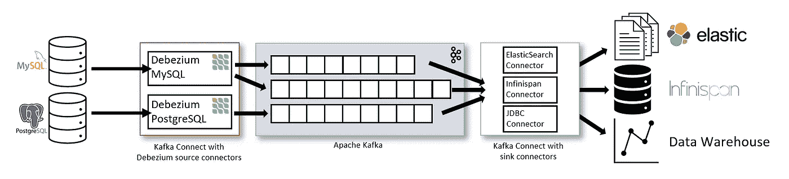

# 用 Debezium 改变数据捕获

> 原文：<https://medium.com/globant/change-data-capture-with-debezium-6eb523d57b1c?source=collection_archive---------0----------------------->

## 理解和实现将更改从关系数据库传播到其他应用程序的简单指南。

Photo by [sigmund](https://unsplash.com/photos/rVRvR9VUIoQ)

有没有觉得有必要将数据库更改传播到任何缓存以保持其健康，或者刷新您正在维护的统计信息以保持其最新，或者传播到您希望数据库更改反映到的任何其他接收器？您实际上是在寻找变更数据捕获。虽然它不是一个新术语，因为数据库专家一直在使用它，但是它在这个数据密集型应用程序的时代变得非常重要，在这个时代，传播或广播数据库更改变得至关重要。

所以正式描述一下:

> *“变更数据捕获(CDC)是一套软件设计模式，用于确定和跟踪已变更的数据，以便可以使用变更的数据采取行动”*
> *—维基百科*

**CDC** 是一个识别数据库中的任何更改并实时同步到其他应用程序的过程，从而减少通过调度程序或批处理迁移数据所花费的时间。它提高了数据一致性，是可靠、低延迟数据同步的有效方法。

## **用例:**

为了理解 CDC，让我们考虑一个用例，其中我们需要将数据库(MySQL)中的任何更改同步到内存缓存(Redis)中。首先，让我们分析其他可能的解决方案，选出最佳方案。

## 可能的解决方案:

## Redis 中的同步并行更新和 MySQL(双重写入)

一种解决方案是在更新 MySQL 的同时，在单独的 io 调用中更新 Redis。它有许多缺点。首先，我们需要考虑可靠性。如果数据事务失败，应该恢复 Redis 操作。第二，如果有多个接收器，网络调用的数量也将线性增加，保持所有系统同步的复杂性也将增加。

## 调度程序(轮询)

另一种选择是运行某种调度程序，定期将数据从 MySQL 同步到 Redis。这是有效但昂贵的解决方案。为了保持数据一致性和更频繁地使缓存失效，调度器的频率应该尽可能高，这将增加成本。如果做不到这一点，将导致数据不一致性激增。

## 数据库触发器

数据库触发器是维护数据完整性的缓慢替代方案。此外，如果编写不正确，它们会导致大量的性能问题。此外，当它们被触发时，我们所能做的是有限制的

在了解了其他可能的解决方案和挑战后，我们现在将了解如何使用 CDC 和 Debezium 来解决这个问题。

介绍(鼓声…)

# Debezium

> Debezium 是一个分布式平台，它将您现有的数据库转换成事件流，因此应用程序可以看到并立即响应数据库中的每个行级更改。
> 
> -Debezium.io

Debezium 是一个开源平台，它使用 Kafka connect 对 DBs 中的变化进行流式处理。

它主要有 4 个主要组成部分

1.  动物园管理员
2.  卡夫卡
3.  卡夫卡连接
4.  DB 连接器

debezium in action! (Source: debezium.io)

## 它实际上是如何工作的？

MySQL 和几乎所有其他数据库都维护一个日志文件列表，主要是为了与从/主数据库同步。对任何给定行的所有更改都记录在这些文件中。这些日志使用通过 Kafka connect 工作的连接器进行流式传输。他们接着坚持卡夫卡的话题。每个主题对应于数据库中的一个表。每个 Kafka connect 服务都与一个数据库实例相关。但是，Kafka connect 服务集群可以部署任意数量的连接器。然后，多个消费者可以通过接收器连接器消费数据。

使用 Kafka connect 服务 Rest API 部署连接器。使用连接器传输的事件信息必须是自给自足的，并且使用者必须有合适的解码器来解序列化事件信息。因为 JSON 数据是冗长的，所以可以使用模式注册中心来维护模式，从而使用像 AVRO 这样的格式高效地传输事件数据。

让我们考虑使用 debezium 的用例解决方案，并遵循以下步骤:

1.  我们将使用 MySQL、Kafka Connect、Zookeeper、Kafka 的示例 docker 图像，并为它们启动容器。
2.  观看启动 Kafka 容器时提到的主题。
3.  为代理和主题创建一个 Kafka 消费者，将事件中收到的数据推送到 Redis。
4.  更新数据库以查看 Redis 中反映的更改。

## 为什么是 Debezium？

1.  它是免费的
2.  它是可扩展的
3.  它具有容错性和可靠性
4.  它很快

## 嵌入式 Debezium:

并不是每个应用程序都需要可伸缩性，因此对于某些应用程序来说，Debezium 的分布式体系结构是一种矫枉过正。因此，这样的系统可以使用嵌入式 Debezium。连接器存在于应用程序空间本身，数据被发送到应用程序本身，而不是发送到 Kafka。

## **结论:**

变更数据捕获是将行级变更从一个数据库同步到多个使用者应用程序的理想方式。此外，Debezium 是一个优秀的分布式平台，它为 CDC 提供了便利，并带来了许多优势。