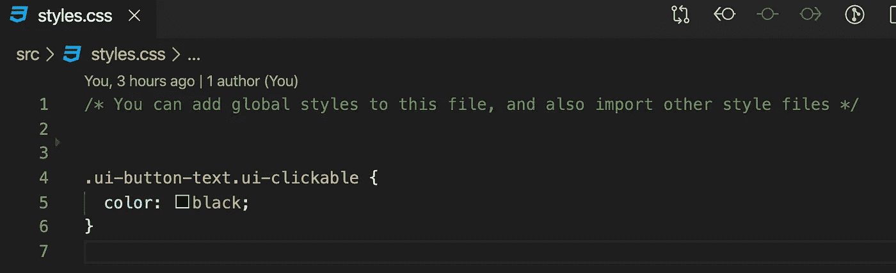
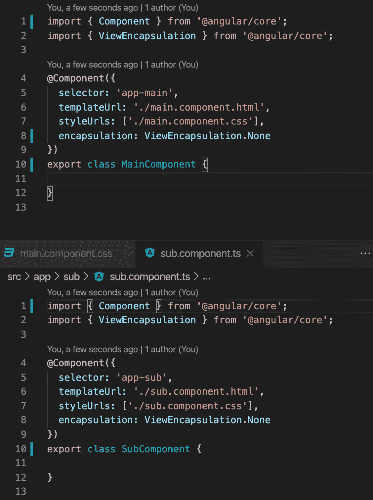

# 更改角度项目中任何控件的样式

> 原文：<https://medium.com/quick-code/change-style-of-any-control-in-angular-project-80d4f864d265?source=collection_archive---------0----------------------->

## 角度指南

## 用户界面控件和样式

几乎每个网页都不一样，都有自己的设计。控件呢？在应用程序中，我们可以使用带有一堆现成控件的库。使用这个库会节省我们很多时间，但是我们需要设置样式。这项任务可能非常棘手。

**灌注**

在我的项目中，我使用了[启动](https://primefaces.org/primeng/#/)控件。在这个例子中，我也将使用它，这是一个如何在你的项目中安装 PrimeNG 的小说明。

npm 安装 primeng -save
npm 安装 primengicon -save
npm 安装 font-awesome -save

打开 angular.json 并在样式部分添加以下内容

"./node _ modules/prime icons/prime icons . CSS "，
"。/node _ modules/primeng/resources/themes/nova-light/theme . CSS "，
"。/node _ modules/primeng/resources/primeng . min . CSS "，

我们还需要安装动画模块

npm 安装@ angular/animations-保存

然后，我们需要将这个动画模块添加到“导入”部分的主模块(AppModule)中

从“@ angular/platform-browser/animations”导入{ browseraniationsmodule }；

也可能需要设置“路由模块”。

**全球风格**

每个 angular 项目都有一个全局样式文件。我们可以在这个文件中设置控件。我们所需要的就是知道正确的类名。

Define control class

Set style to control in style.css

Result

**视图封装**

在我们讨论“ng-deep”之前，让我们先谈谈“视图封装”。

当我们有两个组件并将一个组件放入另一个组件时，这些组件可以有它们自己样式，但是子组件不知道父组件的样式。除了全局样式(styles.css)之外，每个组件样式都最接近任何其他样式。发生这种情况是因为“ViewEncapsulation”设置。

视图封装:

*   **原生:**使用浏览器的原生阴影 DOM。启用浏览器支持之前，请检查浏览器支持。
*   **ShadowDom:** 使用浏览器的原生 Shadow DOM v1 以获得更好的跨浏览器支持，并且是跨浏览器的共享标准。检查影子 DOM v0 到 v1 的区别。
*   **Emulated:** 模仿影子 DOM 的行为来确定组件的 CSS 范围，并添加到头部。
*   **None:** 既不是影子 DOM，也不是自定义实现，比如追加到头的全局 CSS

Angular 使用视图封装。模拟为默认封装。

Components styles and html markup

Result

如果我们想改变这种行为，我们需要改变“视图封装”参数。

ViewEncapsulation.None

sub component see styles in main component

ng-geep

根据文档' ng-deep '已弃用，但它仍然工作。

ng-geep“工作方式”视图封装。‘无’，我们可以看到 out app 的所有风格，需要的时候再替换。

当您需要在一个组件中而不是在所有地方改变一些样式时，使用它是很好的。

ng-deep

Control became red

现在我们知道了如何改变控件的样式。

如果你需要仔细看看项目[，这里有链接。](https://github.com/8Tesla8/ng-deep)

*原载于 2020 年 2 月 2 日*[*【http://tomorrowmeannever.com】*](https://tomorrowmeannever.com/2020/02/02/change-style-of-any-control-in-angular-project/)*。*