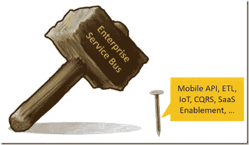
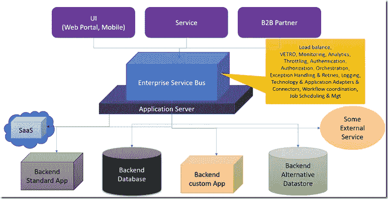
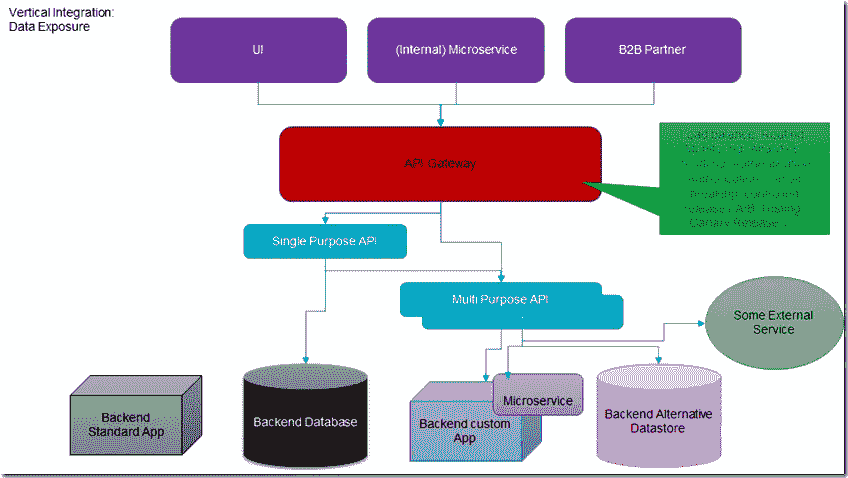
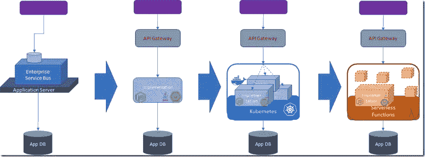
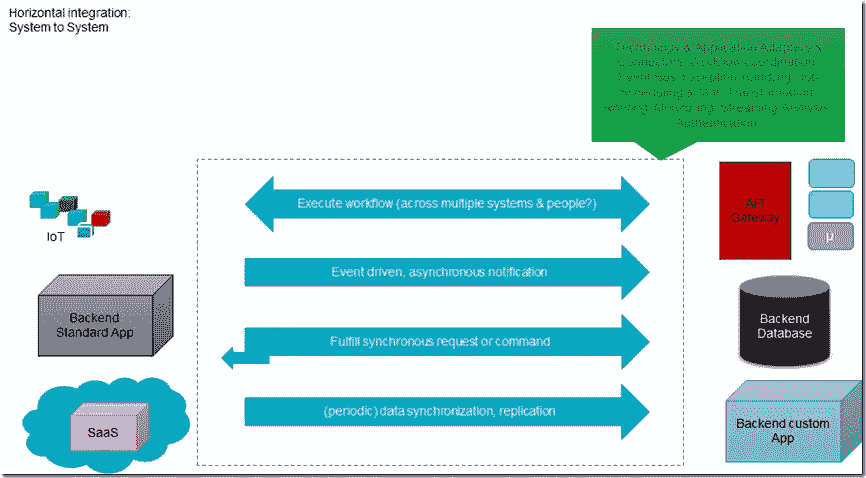

# 改变对集成的看法—从企业服务总线到 API 网关、无服务器和 iPaaS

> 原文：<https://medium.com/oracledevs/changing-views-on-integration-from-enterprise-service-bus-to-api-gateway-serverless-and-ipaas-ae81ae9f2351?source=collection_archive---------0----------------------->

如果你的工具是一把锤子，那么每个问题看起来都像钉子。随着时间的推移，我们中的许多人已经看到了这种狭隘观点占据主导地位的情况。对于我们许多参与整合的人来说，这种情况也发生过。在本文中，我想简要地提请您注意关于集成和实现集成的技术的观点的变化。这些不断变化的观点的重要触发因素包括云、网络规模、新型用户交互、物联网和实时、无服务器，以及企业集成的真实生活体验。

从 21 世纪初我们开始认真进行企业集成时，我们就谈到了许多集成模式——同步和异步、批处理和涓流等等——主要是 ESB 模式。企业服务总线是一个神奇的黑盒子，带有所有连接器，您只需简单地插入其中，就可以轻松实现任何系统与任何其他系统的集成。从这种有点理论化的方法中，我们得到了真正的 ESB 产品——完成连接任何系统的工具。虽然并不总是像理论所说的那样神奇，但我们大多数时候还是让它发挥了作用。通常基于 XML 和基于 SOAP + WS=*的 Web 服务，复杂的产品运行在大型应用服务器上。在我的案例中，主要技术是 Oracle SOA 套件和 Oracle 服务总线；类似的产品可以从 IBM、微软、Tibco、SAP、JBoss、MuleSoft 和其他公司获得。SOA 是我们信奉的架构风格——以解耦为圣杯，以及封装、自治、抽象、无状态、可重用性和标准化服务契约等重要原则。

有了集成平台，几乎任何数据流都是我们可以解决的挑战。通过 ESB 产品快速实现从 A 到 B 的流程的能力吸引我们在该平台上实现许多不同种类的流程。我们的锤子一次又一次地敲打。从“简单的 UI 需要来自后端数据库的一些数据元素”到“文档到达 FTP 端点，并且必须存储在文档管理系统中”——图中两个块之间的任何箭头都变成了 ESB 主题。

通过这种思维和工作方式，我们取得了很大的成就。例如，考虑跨企业的标准化、通用元数据和规范模型，这反过来又是激励我们进入微服务的领域驱动设计的基石。实现系统之间的解耦，以及处理数据流的结构化方式。然而，在许多情况下，ESB 平台变得非常沉重。因为它上面运行着许多不同的服务和流，并且必须处理所有这些服务和流的许多实例。并且因为这些平台在其底层应用服务器上运行的方式。我们在服务及其消费者之间实现的逻辑解耦与物理解耦并不匹配:通常，集成产品必须从一组共享的物理资源中进行所有集成，并且一个集成流中的大量流量会影响其他集成流。此外，管理这些复杂、超重的平台成为一个大问题。从修补和升级平台、推出变更的或新的服务到峰值负载下的扩展、监控、处理错误、实现长期稳定性和达到所需的性能，管理万能集成平台变得非常困难。

# 企业集成的新世界

随着规模的进一步扩大(由于物联网引入的实时和网络规模需求以及应用使用的进一步增长)，更严格的安全要求、更快的变更周期、标准应用(主要是 SaaS)使用的增加以及云的出现，激发了新的架构模式和见解，例如域驱动设计、微服务、CQRS、事件源、“哑管道、智能端点”以及技术进步(例如容器、无服务器、REST、API 技术)，世界已经发生了变化。基于已经证明其价值的经验和概念，并利用新的见解和技术，我们正在朝着处理不同类型数据流的新方法前进。我们可能仍然称它们为集成——但是我们认识到它们是非常不同的，并且应该以非常不同的方式实现。我们放弃了锤子，取而代之的是更多样的工具。

# 垂直整合

我们应该识别的一个重要数据流是我称为*垂直集成*的数据流:消费者和一个或多个后端系统或服务之间的同步交互，如下图所示。

这种数据流往往以高容量执行，因此必须非常可伸缩，必须非常快地完成(不超过 200 毫秒)，并且其实现通常不仅是无状态的，而且相对简单。API 网关几乎是一个轻量级的 ESB 产品——承担负载平衡、路由、监控、分析、节流、认证、授权、断路、受控发布(A/B 测试、Canary 发布)等职责。除了简单的 HTTP 调用之外，它通常不与后端系统进行转换或交互。API 网关调用 API 实现——通常通过 HTTP/REST 和 JSON 有效负载(尽管在许多 UI 情况下 GraphQL 似乎已经准备好接管 REST)。API 的实现仍然可以用传统的服务总线产品来完成，但是这是不太可能的，也是不可取的。使用 NodeJS 或 Java(例如基于 SpringBoot 的)等通用技术可以更容易地实现它，并在一个容器中交付，该容器可以在 Kubernetes 等容器平台上轻松扩展。或者，考虑到无状态的本质和处理高峰的潜在需求，采用 API 的无服务器实现会很有吸引力。

下图说明了“垂直整合流程”的实施过程。

显然，这种发展导致了可伸缩性的提高和运行时平台管理开销的减少。与 ESB 平台上频繁的声明式开发风格相比，开发效率可能会有一些初始损失。这很容易被对自动化 CI 和 CD 的更好的工具支持所抵消，并且还被更广泛的开发者的可用性所补偿，与供应商特定的专有平台产品相比，这些开发者能够并且愿意使用现代的通用技术。

# 横向一体化

许多交互不是同步的，不涉及有紧急请求的消费者，并且可能由系统事件或简单地由时间触发。这些交互通常以异步方式在后台发生。必须观察这些交互，因为它们是在后台执行的。它们成功完成了吗？他们能在目标系统暂时不可用的情况下生存吗？当数量增加时，处理时间是否可以接受？

实现这些交互的关键是使用消息队列或事件总线——一种解耦机制，它提供了跨域、跨系统(版本)、跨位置(云环境和内部环境)、跨技术和跨时间的桥梁。该事件总线还允许跨多个处理器的负载平衡，在下游容量有限的情况下进行节流和断路，并且是治理中的一个关键元素。

通过识别这些横向集成，可以更清楚地看到，诸如 CQRS(命令查询责任分离)、事件源、微服务(交互和编排)以及物联网数据管道、数据仓库和数据湖等模式都在同一数据集成范围内，主要区别在于数据移动的目的和直接触发(可能在数量和时间关键性方面)，但没有任何根本区别。

所有横向整合案例中的主要挑战是:

*   何时:确定执行集成操作的触发器
*   什么:提取所需的数据
*   如何:以潜在消费者可以访问的方式发布数据(位置、通用格式、时间、技术、规模)
*   监视器:处理不愉快的流程

一些用例必须处理大量需要近实时处理的快速数据。这需要特殊的流分析功能，作为来自物联网设备或社交媒体平台等消息的第一个调用端口。

连接器或适配器可以在发现标准应用程序和 SaaS 服务中的事件、提取相关数据以及向目标系统传递事件方面发挥作用。成熟的 iPaaS 产品通过提供带有适配器的可扩展平台、集成流程的执行管理、发现和处理异常的能力以及基于代理的跨云以及云和内部环境之间的桥梁来实现价值。iPaaS 平台将收集分析数据，提供作业调度和管理。它通常会提供声明性的[和专有的]开发工具。

# 结论

重要的是要认识到，一方面，在我们的企业 It 环境中有许多非常相似的数据流，本质上是将数据从一个地方带到另一个地方。将所有这些数据流作为同一个范围的一部分来处理，可以获得很多好处。另一方面，集成光谱上不同层次的数据流也需要不同的方法。公共数据模型、领域驱动的设计以及对解耦、无状态和动态可伸缩性的渴望是相似的，但是实现技术将会不同。我们不应该再使用 ESB 平台这个可以像钉子一样接受任何数据集成挑战的锤子。作为第一步，让我们将支持在线客户端的同步交互从 ESB 中解放出来，比如 Web 门户和移动应用程序。让我们拥抱 API 网关加可伸缩 API 实现——也许首先通过容器，最终使用无服务器实现。让我们采用可扩展、可跨技术访问且分布式的消息队列或事件总线——可靠且跨云和本地。

# 资源

OMESA(开放式现代企业软件架构):[http://omesa.io/](http://omesa.io/):开放式现代企业软件架构(OMESA)项目诞生的目的是将架构最佳实践引入现代架构，同时牢记“新”与“旧”共存。它提供了参考架构和指导原则，帮助任何组织的架构师认识到现代技术和架构可以为业务带来的好处，同时避免创建“微孤岛”或临时解决方案。在 OMESA 网站上，你会发现一些高层次的设计概述和符号风格的建议，这将有助于设计现代集成。

*原载于 2019 年 1 月 23 日*[*technology . amis . nl*](https://technology.amis.nl/2019/01/23/changing-views-on-integration-from-enterprise-service-bus-to-api-gateway-serverless-and-ipaas/)*。*