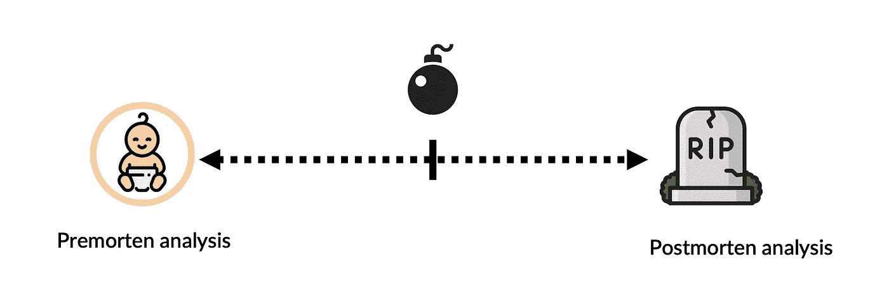
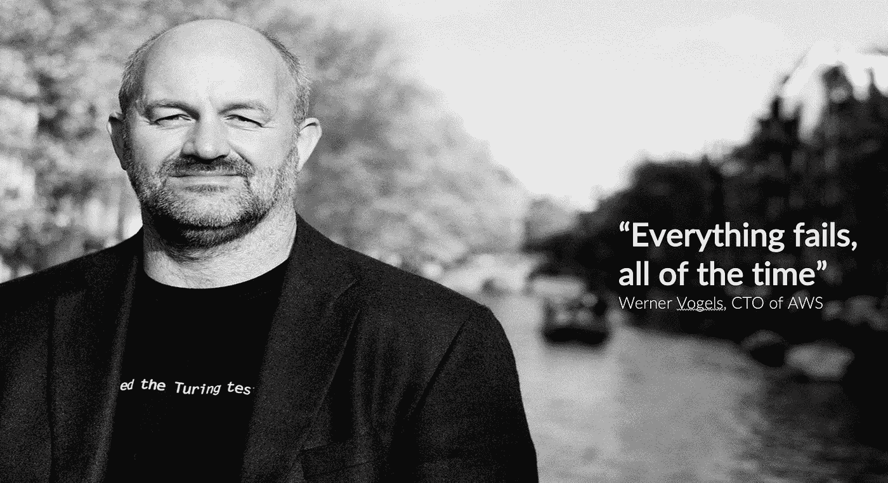
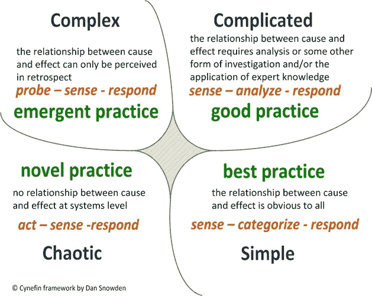
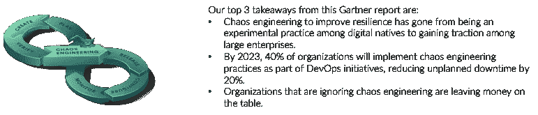
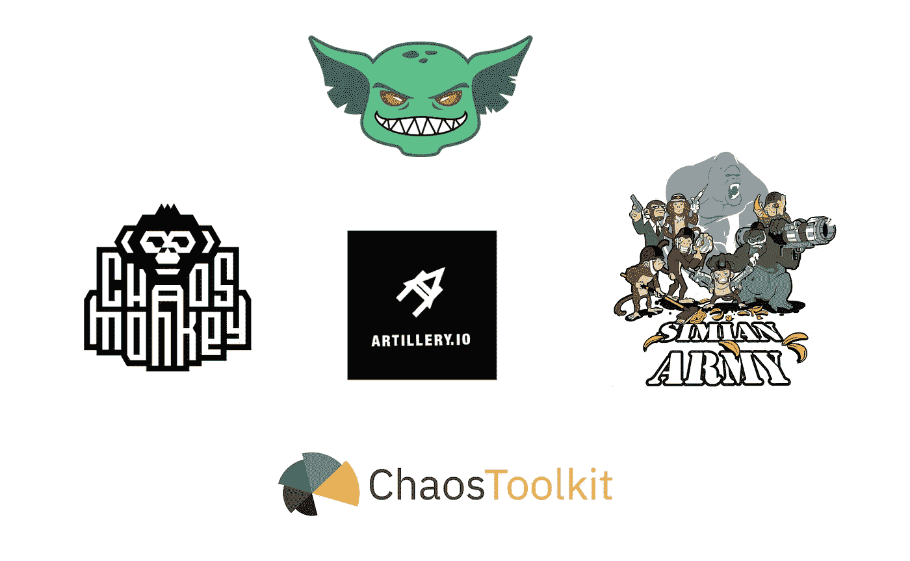
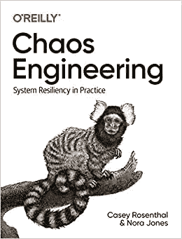
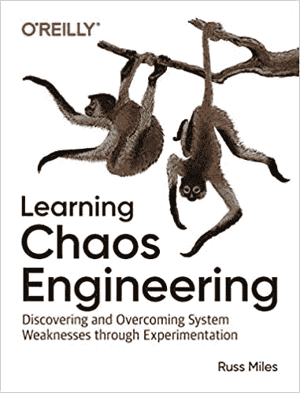

# 混沌工程

> 原文：<https://medium.com/globant/chaos-engineering-ce35d87b38ef?source=collection_archive---------1----------------------->

## **从零到英雄**

## **混沌工程原理**

有时候，最好通过说出什么不是来开始定义什么:

好吧，混沌工程不是关于一只猫在你的数据中心咬你的电源线。

取而代之的大概是这样的:

> 混沌工程是一门在系统上进行实验的学科，目的是建立对系统承受生产中动荡条件能力的信心。

你可以在【https://principlesofchaos.org/?lang=ENcontent[下找到更深入的解释](https://principlesofchaos.org/?lang=ENcontent)

## **实践中的混乱**

开始练习混沌的基本方法是:

为了具体解决大规模分布式系统的不确定性，混沌工程可以被认为是揭示系统弱点的实验的促进。

这些实验遵循四个步骤:

1.  首先将“稳定状态”定义为系统的一些可测量的输出，表示正常的行为。
2.  假设这种稳定状态将在对照组和实验组中持续。
3.  引入反映真实世界事件的变量，如服务器崩溃、硬盘故障、网络连接中断等。
4.  通过在对照组和实验组之间寻找稳定状态的差异来试图推翻假设。
5.  破坏稳定状态越难，我们对系统的行为就越有信心。如果一个弱点被发现，我们现在就有了一个改进的目标，在这个行为在整个系统中表现出来之前。

**为什么要用？**

**投资还是不投资混沌工程？**

作为工程师，我们大多在头脑中构建一些几乎“不可战胜”的东西，但有时自然、物理或其他自然力量会测试我们的架构:

再说一次，这不是关于一只猫，而是…

这是一张众所周知的照片，关于一条大白鲨咬住了谷歌海洋海底光缆，请和我一起思考一下…

“如果遇到只有一个实例运行我们的后端生产应用程序的可用性区域，情况会怎么样”。嗯…这就是为什么你必须开始测试你的架构，或者做一些事前分析，或者开始做一些混沌工程。

永远记住以下几点..来自我们最伟大的声音之一:

## **决策框架**

如果你决定开始做一些实验，下一个大问题是“什么时候我们必须使用混沌工程？”那么，我向你推荐一个非常强大的工具，叫做**“Cynefin-framework”**，它引导你通过识别你的系统的过程:简单-复杂-复杂-混乱

长话短说，如果你有一个大型的分布式系统，处于“复杂-复杂”的区域，你需要开始深入理解在引擎盖和混乱之下是什么，这可能是一个非常好的工具。

我强烈建议看一下丹·斯诺登教授关于这个框架如何工作以及如何使用的视频:[https://www.youtube.com/watch?v=N7oz366X0-8](https://www.youtube.com/watch?v=N7oz366X0-8)

## **世界上**

这个世界正在发生什么:

## **工具集**

最后但同样重要的是，让我们分享一些工具，开始做一些实验:

1.  一个非常工具化的混沌即服务平台
2.  众所周知的混沌猴和猿猴军队(注意你必须使用三角帆)
3.  一个非常好的开始编写混沌实验的工具集
4.  来自 cannon . io，混沌 Lambda 一个非常好的 Lambda，他开始使用我们的 ec2

## 我强烈推荐一些书:

享受跑步的乐趣，从你的混沌实验中学习吧！

帕布罗！