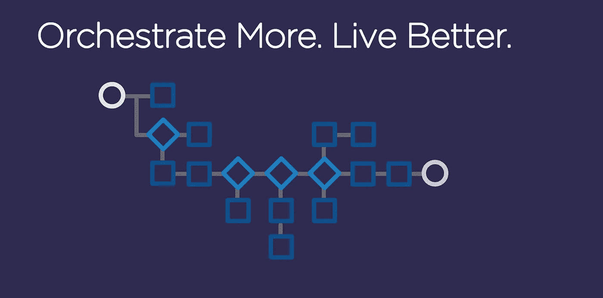

# 混沌工程—使用 Concord/Gremlin

> 原文：<https://medium.com/walmartglobaltech/chaos-engineering-using-concord-gremlin-c922d7dcd629?source=collection_archive---------6----------------------->

> Concord 是一个工作流服务器。编排引擎使用用户创建的场景和插件将不同的系统连接在一起。关于该工具的更多细节可以在 [*这里*](https://concord.walmartlabs.com/overview/index.html) 找到



> G remlin 为您提供了一个框架，通过不断增长的攻击库，安全、可靠、简单地模拟真实的中断。使用混沌工程来提高系统弹性，Gremlin 的“失败即服务”可以在客户遇到问题之前轻松找到您系统中的弱点。关于工具本身的更多细节可以在[这里](https://www.gremlin.com/docs/)找到


Photo credit: Gremlin

Gremlin 的 concord 插件使用户能够通过将 Gremlin 任务添加到他们的 Concord 工作流中来自动进行混沌实验。查看下面最简单易读的 yml *代码*片段，它可以在一系列主机上创建 *cpu* 攻击。

```
- task: gremlin    
  in:      
   action: cpu     
   apiKey: myApiKey #Gremlin Api Key
   cores: 1 #The number of CPU cores to hog
   length: 15 #The length of the attack (seconds)
   targetType: Exact
   targetList: ["client1", "client2"]
```

一个 concord.yml 可以看起来像这样简单

Gremlin 的 Concord 插件支持[*Gremlin app*](https://app.gremlin.com/)*目前*提供的所有攻击类别。所有攻击的详细信息及其用法可以在 [*这里*](https://concord.walmartlabs.com/docs/plugins/gremlin.html) 找到

此外，Concord 还支持**不断增长的插件范围，这些插件可以集成到您的 **CI/CD** 工作流中。其中包括[*git*](https://concord.walmartlabs.com/docs/plugins/git.html)[*jira*](https://concord.walmartlabs.com/docs/plugins/jira.html)[*terra form*](https://concord.walmartlabs.com/docs/plugins/terraform.html)[*Jenkins*](https://concord.walmartlabs.com/docs/plugins/jenkins.html)等插件。关于所有插件用法的详细信息可以在 [*这里*](https://concord.walmartlabs.com/docs/plugins/#plugins) *找到。***