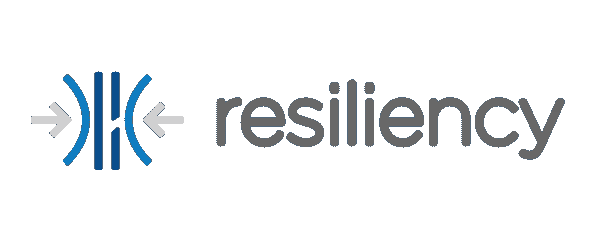
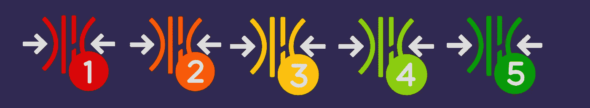
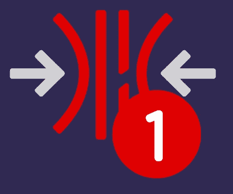
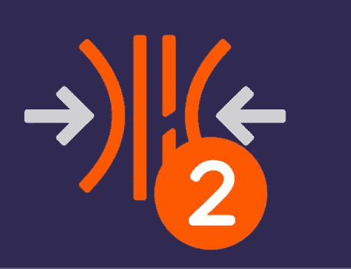
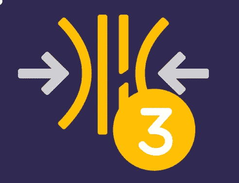
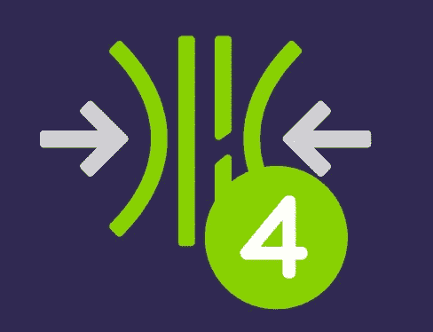
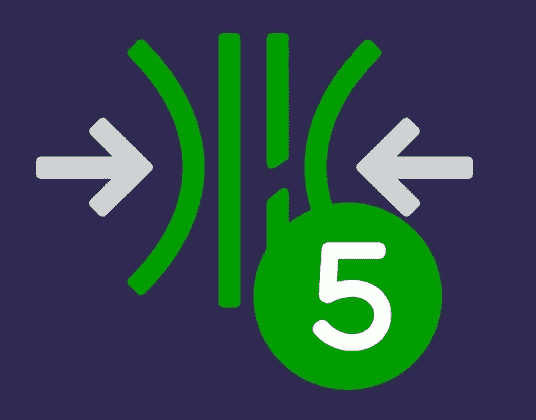
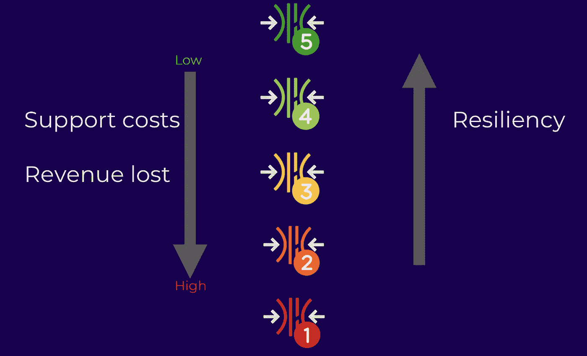

# 绘制通向软件弹性的路径

> 原文：<https://medium.com/walmartglobaltech/charting-a-path-to-software-resiliency-38148d956f4a?source=collection_archive---------3----------------------->

(注意——大部分材料摘自 2018 年 chaos conf[上的一次演讲。幻灯片可用](http://chaosconf.io/)[此处](https://goo.gl/LkaByz)

# 介绍

弹性工程——本文其余部分缩写为 RE(也称为混沌工程)——正在迅速获得技术社区的广泛认可。自从网飞在 2011 年用他们的[猿猴军队](/netflix-techblog/the-netflix-simian-army-16e57fbab116)开始这种做法以来，这种做法一直很流行。但是，随着第一届混沌大会本周在旧金山举行，它已经达到了一个转折点，从业者认为这是任何云原生应用部署的重要一步。RE 的目标是帮助维持一个应用程序生态系统，其中基础架构和依赖关系中的意外故障对用户体验的影响最小。这是通过不断的实验完成的。这个学科的原则在这里被捕获[。](https://principlesofchaos.org/)

沃尔玛的规模非常大。每个技术支柱都有几百个团队，他们使用完全不同的技术栈生产应用程序，部署在多个平台上。当我们在 2017 年开始时，我们意识到要征服这种规模，我们需要一个结构化的计划来执行弹性练习，以确保我们的关键系统具有弹性(承受生产中的动荡条件)。实现弹性的旅程始于三个简单的想法——

*   **客户至上** —如果应用团队向客户和利益相关者承诺的 SLA(服务水平协议)被违反，软件弹性就毫无意义。用户和相关系统的需求是引导我们走向弹性之路的指路明灯。
*   **团队拥有弹性** —我们采用了联合所有权模式，由我们的平台团队(云平台团队的一部分)负责制定政策、技术和实施[游戏日](https://www.gremlin.com/community/tutorials/introduction-to-gamedays/)，而不是由一个团队负责在弹性练习期间检测和暴露漏洞的集中模式。然而，弹性的实际目标完全由单个应用程序团队拥有。
*   **快速失败，经常失败** —在开发生命周期的早期发现失败可以降低修复成本，因此我们鼓励快速失败。通过进行高节奏的弹性实验，我们还可以确保快速检测到任何潜在故障，以确保在实际灾难发生之前进行修复。

当我们授权团队自己开始学习和实施这些想法时，并不缺少挑战。这些挑战中最主要的是缺乏培训和工具。我们制定了一个详细的计划，包括两周一次的技术会谈、任何问题的办公时间、实践训练营和会议，以确保想法不会失去动力，弹性的概念保留其真正的含义。此外，我们制定了一个流程，这是工程团队采用和保持进展的简单方法。这让我们想到了弹性级别的概念。

Resiliency levels

# 先决条件

在确定流程之前，我们需要为所有团队定义一个共同的起点。我们称之为弹性先决条件。每个应用团队都被要求

1.  创建灾难恢复故障转移行动手册
2.  定义关键依赖关系
3.  为关键依赖失败编写剧本
4.  定义非关键依赖关系
5.  定义非关键相关性故障将影响系统的阈值

**关键依赖关系**被定义为这样的依赖关系:没有它们，服务不能以任何形式运行

**非关键依赖** —如果这些不可用，服务可以在降级状态下运行。

该行动手册是一套记录的步骤，将在发生灾难或故障时执行。通过分离给定应用程序的关键和非关键依赖，团队可以更深入地了解他们的系统，这促进了积极的辩论，并鼓励团队系统地运行实验，以便他们可以确定依赖。

一旦团队完成这一步，他们就准备好开始他们的旅程。

# 该过程

**第一步——去心理医生那里做一次检查**

在运行任何弹性练习之前，我们需要确保应用程序部署正确。这意味着检查它们在各自的云中(私有或公共)是否配置正确，它们的实例是否健康，指标是否流入，以及可观察性是否高。

这是通过我们内部编写的一个叫做弹性医生(简称 docRx)的工具来完成的。该工具是应用程序部署的调试工具。对于每个应用程序，它执行以下操作-

*   为整个混合云部署提供一页报告
*   充当调试工具和实施工具
*   执行被动和主动检查

**第二步——开始爬坡**

一旦 docRx 批准团队进行测试，弹性级别就开始攀升。团队在整个过程中控制他们自己的速度。以下是对级别的描述

***第 1 级—手动—获得各方同意和灾难恢复故障转移。***

*   **所有**必备物品存放在一个明确的地方
*   对开发人员、测试人员、运营人员和利益相关者使用的行动手册达成一致
*   验证灾难恢复故障转移行动手册的手动练习

***第 2 级—手动—预生产*** 中的关键依赖故障

*   **一级要求的所有**，加上
*   针对非生产环境中的关键依赖项运行故障测试
*   向团队、风险承担者发布测试结果
*   手动测试是可以接受的

***三级——手动+自动——常规练习***

*   **二级要求的所有**，加上
*   定期运行测试(至少每 4-5 周一次)
*   将结果发布到仪表板，以跟踪随时间变化的弹性
*   在生产环境中至少运行一次弹性练习(故障注入)

***第四级—自动化—生产前全自动化***

*   **三级要求的所有**，加上
*   非生产环境中的自动化弹性测试
*   半自动灾难恢复故障转移脚本(需要最少的人工监督)

***第五级—全自动化***

*   **四级要求的所有**，加上
*   完全集成到 CI/CD 环境中的自动化弹性测试
*   弹性失败会导致构建失败
*   在生产环境中启用自动化弹性测试和灾难恢复故障转移测试

当团队通过这些级别时，可以看到对其应用程序支持成本的影响。此外，我们还发现，每次事故的收入损失显著下降(因为现在只需点击几下鼠标即可恢复)。随着团队从第 1 级提升到第 5 级，我们正在收集这些支持成本降低的数据(根据迄今为止的经验测量，这是显著的)。这种模式已经开始被广泛采用，我们已经看到了全面的成功。

# 迄今取得的成功

●进行弹性测试的团队——50 人以上(或大约 300 名工程师)—沃尔玛的团队对采用弹性模型非常热情，我们希望很快将 30 个团队提升到第 3 级。

●在停机期间积极使用故障转移行动手册—在大规模停机期间，团队已经开始使用故障转移行动手册并取得了巨大成功。它允许产品所有者提高他们工作的可观察性。

●授权团队=不再有孤岛——对我个人来说，最大的成功是打破了团队内部的孤岛。当涉及到弹性所有权时，开发人员和操作工程师之间的界限已经开始模糊。此外，随着我们开发工具的速度越来越快，越来越多的团队可以按照自己的节奏执行自己的测试。

从长远来看，我们面临着严峻的挑战。我们欢迎让我们成长为更快、更精简的科技公司的想法。如果这些努力激起了你的兴趣，并且你希望加入我们的任务，我们希望听到你的消息。

(旁注——如果你想了解更多关于混沌工程或弹性工程这两个名称的争论，这里有两篇博文提供了一个[点](/@jpaulreed/chaos-engineered-or-otherwise-is-not-enough-ad5792309ecf)和一个[对位点](https://www.linkedin.com/pulse/would-chaos-any-othername-casey-rosenthal/)。我们选择术语“弹性”来匹配我们团队的最终目标——构建和维护弹性系统)