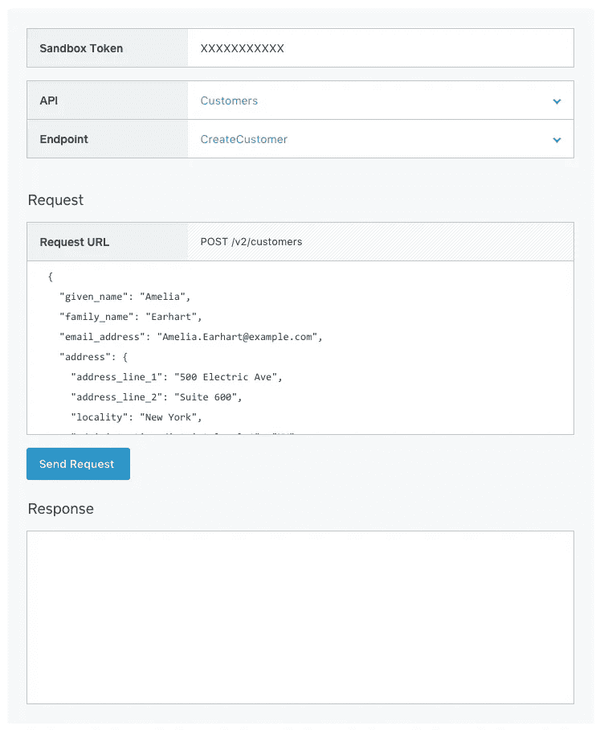

# 查看 Square 开发人员文档的沙盒部分中的新示例

> 原文：<https://medium.com/square-corner-blog/check-out-the-new-example-in-the-sandbox-section-of-squares-developer-docs-1644a5d11e07?source=collection_archive---------0----------------------->

## 我们正在推出一个新的工具来帮助你探索我们的 API，就在文档中。

> 注意，我们已经行动了！如果您想继续了解 Square 的最新技术内容，请访问我们的新家[https://developer.squareup.com/blog](https://developer.squareup.com/blog)

从一个角度来看，构建在 Square API 之上的应用程序只是一系列 API 请求和代码，用于显示、存储或操作返回的数据。将 app 以最简单的形式——作为一个交互式网页，你可以用它来测试你的 API 请求，这不是很有趣吗？[在这里](https://docs.connect.squareup.com/articles/using-sandbox):)

和我们的 API 一样，要使用这个新工具，你需要创建一个 [Square 账户](https://squareup.com/signup?return_to=https%3A%2F%2Fconnect.squareup.com%2Fapps&v=developers)，并在 [Square 开发者门户](https://connect.squareup.com/apps/)中创建一个应用。完成后，您可以复制您的沙盒访问令牌并将其粘贴到工具中的适当位置。在那里，您可以从下拉列表中选择您想要进行的 API 调用，并查看一个示例 JSON 主体(如果请求需要的话)。这使得查看 API 的运行情况变得非常简单，而不必亲自接触代码。

点击⬇️下面的链接试试吧

 [## 方形连接 API 文档

### Connect API v2 提供了一个沙箱，允许您在非生产环境中测试 API 端点。交易…

docs.connect.squareup.com](https://docs.connect.squareup.com/articles/using-sandbox) 

如果您有任何问题、反馈或注意到一些不对劲的地方，请随时在这个帖子上发表评论，或通过 [Twitter](https://twitter.com/SquareDev) 联系我们。