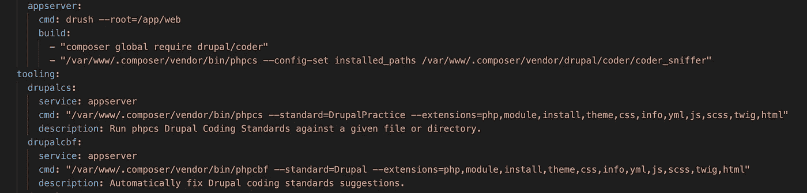
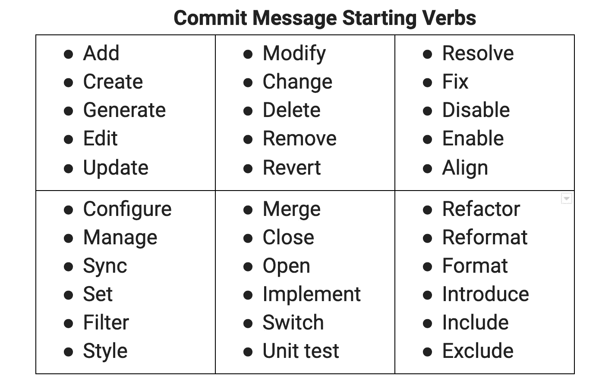

# 在我们提出 PR -Drupal 特定

> 原文：<https://medium.com/globant/checklist-before-we-raise-the-pr-drupal-specific-d087428fe3cd?source=collection_archive---------0----------------------->

同行评审以在整个项目中保持一致的设计和提高代码性能的形式，使开发人员的生活变得更加轻松。

如果我们在[拉式请求](https://www.atlassian.com/git/tutorials/making-a-pull-request)流程中遵循下面的简单步骤/清单，那么这有助于保持变更的便捷性和可搜索性。

1.  遵循 D8/D9 编码标准—特定于注释+注释+空格

使用 *phpcs* 验证标准

*   安装、配置和使用[编码器模块](https://www.drupal.org/project/coder)。

> **用法:***phpcs—standard = Drupal example . module*

*查看文档[如何配置 drupalcs](https://www.drupal.org/node/1419988) 和使用 [PHP 代码嗅探器](https://www.drupal.org/docs/contributed-modules/code-review-module/php-codesniffer-command-line-usage)。*

*如果您使用的是 *lando* 开发工具，在您的 *lando.yml* 文件中添加如图所示的配置代码。*

**

*lando.yml configuration example*

*其中 *drupalcs* 是一个别名，用于验证模块、安装、yml 等文件中的编码标准，而 *drupalcbf* 是一个别名，用于测试代码的格式。*

> ***用法:** `drupalcs modules/custom/my_custom_module`*
> 
> *`drupalcbf modules/custom/my_custom_module`*

*2.同行审查*

*   *在您的本地 repo 中为一个特性或错误修复创建一个分支，根据需求编写一个代码。保持分支名称基于你的功能例如:如果你正在部署一个特性，分支可以被命名为 *feature/JIRA-ID* 或者在一个 bug 的情况下，分支名称可以是 *bugfix/JIRA-ID* 。*
*   *从分叉上的特征分支提升 PR 到主回购上的开发分支。*

*3.提交消息*

*提交消息只不过是对我们的更改的简要概述/描述，而不是我们在代码中更改了什么。我们可以用之前的提交来验证 diff 中的更改，但是了解是什么行为更改了提交消息会很有帮助。*

*   *提交消息必须遵循特定于命令式案例+骆驼案例+字符限制的标准*
*   *指定提交类型，包括 JIRA ID—GBN123–890，其中 gbn 123 可以是项目名称和 890 票证 ID*

*# feature:gbn 123–890—您要添加到特定应用程序中的新功能*

*# fix:gbn 123–890—一个错误修复*

*# style:gbn 123–890—与造型相关的功能和更新*

*# refactor:gbn 123–890—重构代码库的特定部分*

*#测试:gbn 123–890—与测试相关的一切*

*你可以在你的提交信息中使用启动动词，如图所示，来识别你的 PR 是关于什么的*

**

*Commit message could start with a verb*

*   *优秀 Git 提交消息的六条规则*

*#用一个空行将提交的主题与主体分开*

*#将主题行限制在 50 个字符以内*

*#主题行不要以句号结尾*

*#大写主题行*

*#用正文解释 2 Ws 是什么和为什么*

*#将正文字符限制在每行 72 个字符以内，保持信息直截了当、简短明了*

*4.然后养个 PR。*