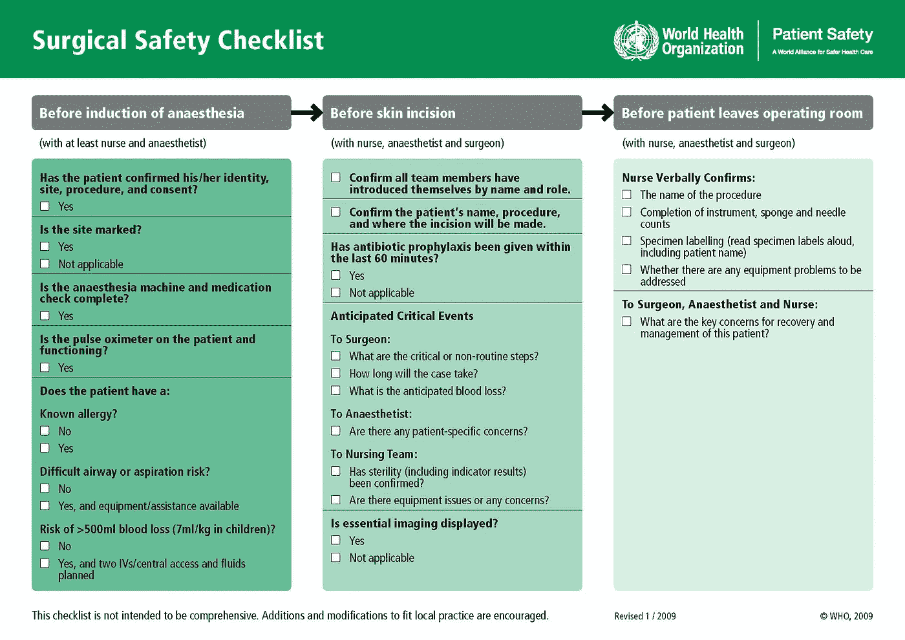
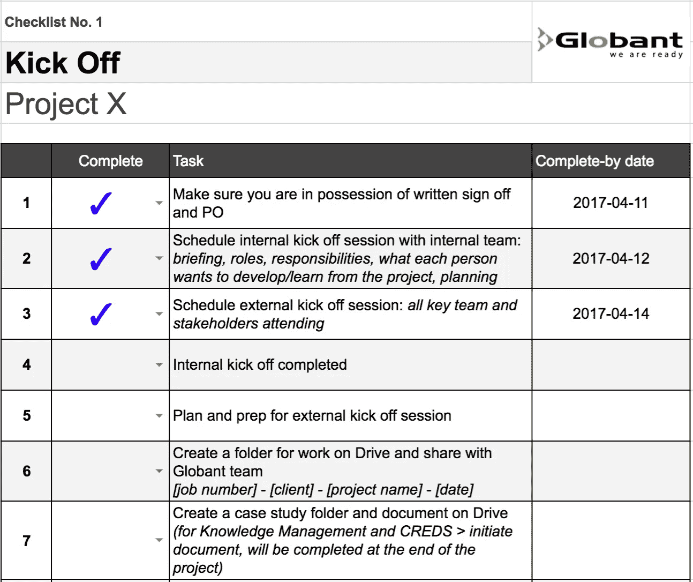
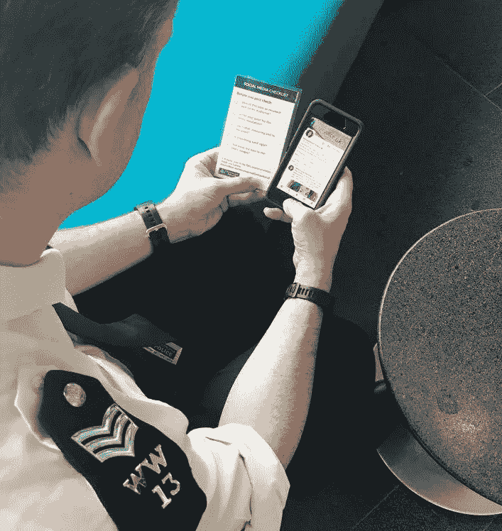

# 在服务设计中使用清单

> 原文：<https://medium.com/globant/checklists-22bf1df541e7?source=collection_archive---------0----------------------->

当我走出一辆皮卡时，施工经理——我当天的向导——递给我一顶安全帽，示意我走向一堆闪闪发光的钢铁，这是巴黎北部一座未完工办公楼的现状。

在瑞典和荷兰，我的四个同事也在不同的建筑工地进行了背景调查，从航空仓库到航海主题的豪华酒店。

在纽约，我的同行与建筑师坐在一起，他们向她介绍了他们的 3D 建模工作流程，以及我们客户的工具如何满足(或不满足)他们的需求。

俄罗斯家装商店的销售代表并不知道，我的两位同事扮演了神秘顾客的角色，分析他们作为顾客购买住宅地板的经历。

Shadowing construction workers across building sites in Europe

所有这些事情都是同时发生的——我不仅是一名探索法国各地建筑工地的当地研究人员，还共同管理着这个跨越 3 个部门和 5 个国家的项目。从逻辑上讲，这意味着白天，我沉浸在施工管理的世界和背景中:

*   在地区和职能上协调不同工作文化的利益相关者
*   管理背景研究中的客户参与
*   了解三个部门的洞察力如何相互影响
*   确保跨部门和区域的标准化研究方法和产出

在设计战略咨询中，像这样的复杂约定并不少见，而且只会增加复杂性，因为更大、更多样化和更专业的公司理解设计驱动型组织的[商业价值](http://www.dmi.org/?page=2015DVIandOTW)并开始将设计流程纳入其工作流程。

**那么，一个团队如何管理微观和宏观而不让事情从缝隙中溜走呢？**

受阿图尔·加万德的 [*清单宣言*](http://atulgawande.com/book/the-checklist-manifesto/) 的启发，我们一直在尝试使用清单。

在马尔科姆·格拉德威尔对加万德的清单宣言的评价中，他将错误的存在分类为“无知的错误(因为我们知道的不够多而犯的错误)和无能的错误(因为我们没有正确利用我们所知道的而犯的错误)。)”Gawande 的清单解决了第二种错误，并且在从航空到风险投资的各种行业都很有效。

该清单确保基本但关键的任务已经完成，在一起工作的人不一定相互了解的情况下，它本身也是一种快速而有效的团队合作练习。

[The WHO surgical safety checklist](http://www.who.int/patientsafety/safesurgery/ss_checklist/en/)

在医疗保健行业，手术团队在第一次切开前几分钟就成立了。[世卫组织手术安全清单](http://www.who.int/patientsafety/safesurgery/checklist/en/)涵盖了常规任务，例如确保患者在手术前已经服用了预防感染的抗生素。通过将完成这些常规但必要的任务归入一个清单，每个人可以将他们所有的精神能量集中在他们的专业技能上。引入核对表也有一个必然的效果——团队成员现在在被一起扔进手术室之前被适当地(如果是简短地)介绍了一下。

那么，这个新流程的影响是什么？世界卫生组织在发达国家和发展中国家的医院试用了该清单，并发现它可以[将术后死亡率降低高达 47%](http://www.nejm.org/doi/full/10.1056/NEJMsa0810119#t=article)。

# **服务设计项目中的检查表**

作为 t 形服务设计顾问，除了代表我们的专业领域，我们都被期望在项目中承担参与管理的责任。除了释放精神带宽，我们计划使用清单来完成其他一些事情:

## 在短跑中嵌入注意事项

制作清单的过程让我们有机会对我们可能不会自然触及的领域进行内置考虑。例如，每个项目启动清单都包括一个关于每个团队成员想从项目中获得什么的问题——是尝试新的研究方法还是做更多的利益相关者管理。进行这种讨论为我们的顾问提供了一个反思个人发展目标的机会，并确保我们考虑如何使项目对每个团队成员更有个人价值。

## 根据流程和突发事件调整人员

与外科手术团队一样，咨询的本质是拥有跨学科的项目团队，这些团队可以快速组建和解散。自从[我们的收购](https://www.globant.com/new/globant-acquires-wae-continue-advancing-creation-digital-journeys)以来，这一点变得更加明显，因为项目团队的潜在组成人员从商业人类学家到区块链开发商都有。清单可用作参考，帮助不熟悉我们流程的团队成员进行调整。

同样，该清单可以服务于一系列调整情况，无论是让新员工加入我们的团队，支持更多初级团队成员领导项目，还是促进对从 RfP 评估到公开展示成功案例的整个项目生命周期的认识。

## 集中我们的资源

我们都有过在糟糕的公司硬盘上寻找文件的经历。在每个清单中，我们都包括每个流程的特定文档，以便任何团队成员都可以快速访问相关资源。例如，我们的招聘清单链接到我们的供应商列表、筛选模板和同意书模板。将这些资源集中起来还可以确保每个人都使用最新版本。

Checklist №1 — The project kickoff

如果你很好奇，请查看我们的[启动和游击研究清单](https://docs.google.com/a/globant.com/spreadsheets/d/1ForfX9Wgs2taA-C2Y3pk5jQyn_gOkjsl_jw4kjudZyc/edit?usp=sharing)的示例模板。在 Globant，我们将所有的清单作为标签存储在一个主谷歌表上，每个人都可以访问。在每个项目开始时，项目负责人会制作一份主表副本，并根据项目进行定制。

A Met police officer using the social media checklist before posting

我们还为客户制作清单。作为推出伦敦警察局[新网站](https://www.met.police.uk/)的一部分，我们培训了 1400 名警察使用社交媒体与当地居民沟通——无论是应对非紧急犯罪、分享行动成果还是宣传当地活动。在每节课结束时，我们都分发了层压清单，可以放入警官的巡逻笔记本中，供外出时参考。

# 将清单整合为流程的一部分

在世界卫生组织的研究取得惊人成功后，研究人员试图在美国和英国的医院中复制同样的过程。然而，他们惊讶地发现清单几乎没有或根本没有影响[。事实上，这些举措之所以失败，是因为它们的实施方式:](http://www.nature.com/news/hospital-checklists-are-meant-to-save-lives-so-why-do-they-often-fail-1.18057#/b5)

> 当研究人员亲自观看较少数量的程序时，他们发现从业者往往无法全神贯注地进行检查，并且只大声朗读三分之二的项目。在略多于 40%的情况下，至少有一名团队成员在检查过程中缺席；10%的情况下，主刀医生会失踪。

通过采访，研究人员了解到，清单没有必要的认同，因为它们通常是作为自上而下的举措引入的，或者被视为对不同的医院环境过于严格。根据这些发现和我们的经验，我们确定了一些实施清单的原则:

*   确保清单的格式与用户的环境相关。作为顾问，我们通常使用笔记本电脑，需要轻松协作，因此我们的清单存储在 Google Drive 上。这与警官的情况完全不同，警官需要清单是可访问的和耐用的。
*   在现有的过程中包括清单，比如团队开球或每日站立，而不是创造一个额外的承诺。
*   招募实践者作为清单拥护者，并给他们自由来调整它们以适应他们团队的需求。

请在下面的评论中告诉我们你的想法，并随时分享你自己的清单。